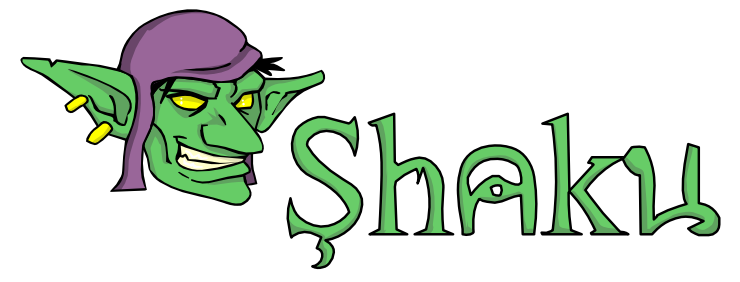
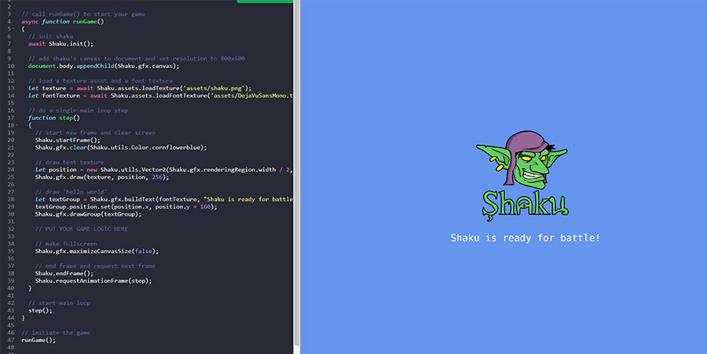
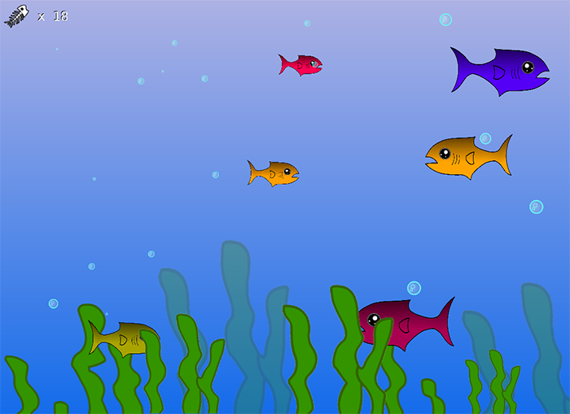
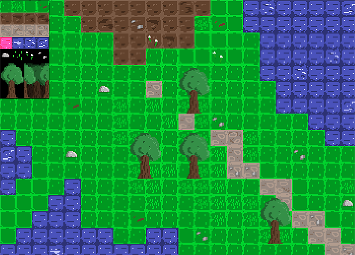
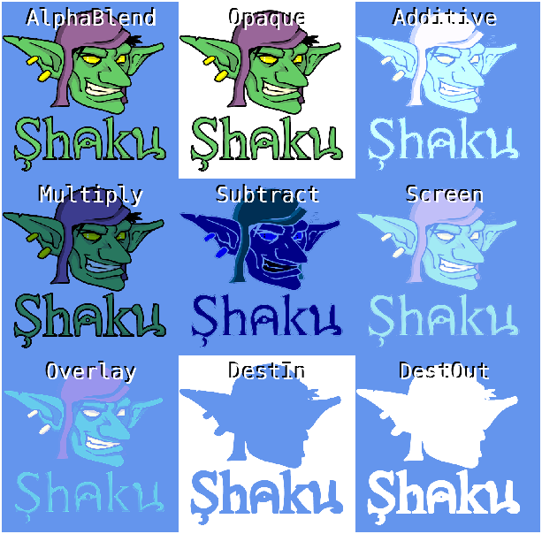
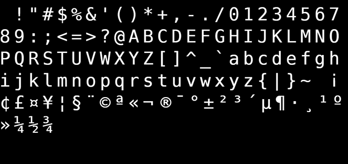
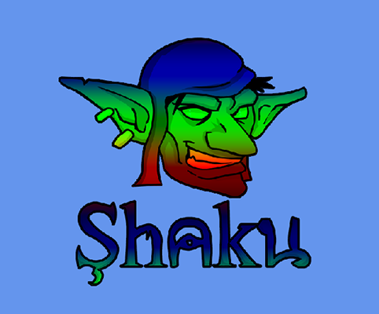
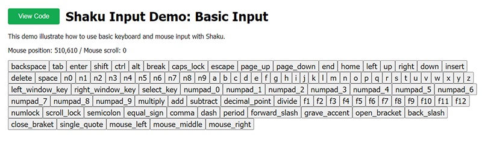
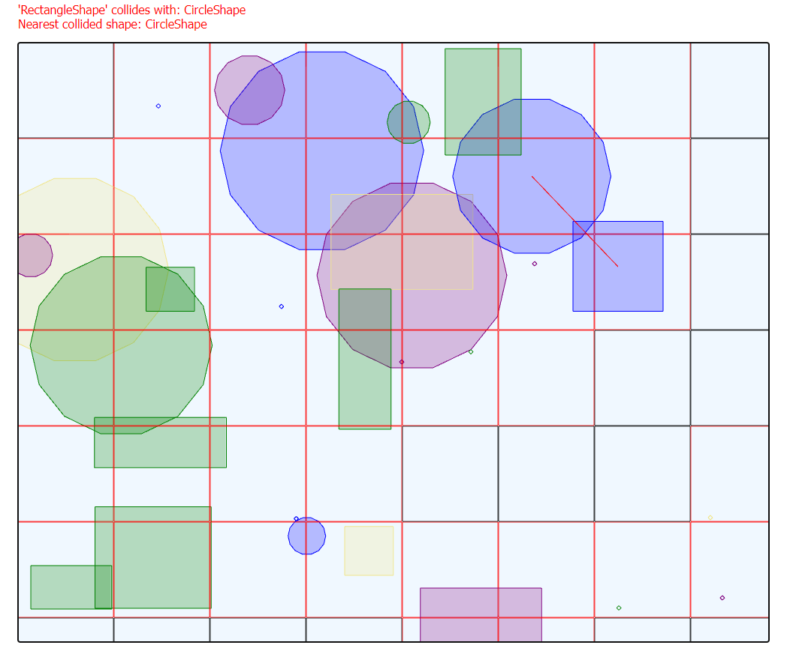

### A simple yet effective web game development framework *that knows its place*!

**If you're looking for a package that implements rendering, sounds, assets and input, while keeping it low level and simple, this is the library for you!** 

- [Online Demos](https://ronenness.github.io/Shaku/demo/index.html)
- [Game Demo Project](https://ronenness.github.io/Shaku-Demo/)
- [Homepage](https://ronenness.github.io/Shaku/)
- [Full API Docs](https://ronenness.github.io/Shaku/docs/index.html)

# Table Of Content

- [About](#about)
  - [Features](#features)
  - [Installation](#installation)
- [Online Demo](#online-demo-projects)
- [Using Shaku](#using-shaku)
  - [Setup](#setup)
  - [graphics](#graphics)
  - [Sounds](#sounds)
  - [Input](#input)
  - [Assets](#assets)
  - [Collision](#collision)
  - [Utils](#utils)
  - [Miscellaneous](#miscellaneous)
- [Advanced Topics](#advanced-topics)
  - [Batching](#batching)
  - [Shaku on NodeJS](#shaku-on-nodejs)
- [Build Shaku](#build-shaku)
- [Changes](#changes)
- [License](#license)

# About

*Shaku* is a pure JavaScript framework for web games development that emphasize **simplicity**, **flexibility** and **freedom**.

Let's take a sneak peek on gamedev with *Shaku*!

```js
// main loop (do update step + request next step)
function step() 
{  
    // start a new frame and clear screen
    Shaku.startFrame();
    Shaku.gfx.clear(Shaku.utils.Color.cornflowerblue);

    // draw a texture at 256,256 with size 100,150
    Shaku.gfx.draw(texture, new Shaku.utils.Vector2(256, 256), new Shaku.utils.Vector2(100, 150));

    // end frame and request next step
    Shaku.endFrame();
    Shaku.requestAnimationFrame(step);
}
```

So, what does *simplicity*, *flexability* and *freedom* in *Shaku* actually means?

### Simplicity

*Shaku* is mostly made of straightforward methods and barely have any setup code or configuration.
It's a lean and mean package with zero dependencies and only minimal necessary abstraction.

### Flexibility

*Shaku* is easy to extend and tweak. The code is well documented and many of the framework components can be replaced or modified.

### Freedom

*Shaku* values your freedom. It will not push any design pattern on your code and will integrate nicely into whatever it is you're making.


## Features

*Shaku* provides the following key features:

* Assets loader fetch textures, sound effects, JSON, and other game resources.
* WebGL-based 2d rendering engine.
* Custom effects, render targets, batching and other graphics essentials.
* Input manager for mouse & keyboard input, plus query changes from last frame.
* Playing sound effects, music, change pitch and mix tracks.
* Basic utility objects such as Vectors, Matrices, Rectangles, GameTime and more.
* Animator helpers to animate any built-in component or numeric value.
* *Tiny lib with no dependencies*! All you need to use *Shaku* is a single minified JS weighting less than 100Kb.

Plus, *Shaku* is written in pure modern JavaScript.

If you want to play with *Shaku* while reading the docs, you can check out the [Sandbox Demo](https://ronenness.github.io/Shaku/demo/sandbox.html). 
See the [demos assets](demo/assets) folder to see which assets you can use for the sandbox (or load from external sources).



## Installation

Using *Shaku* is super easy! 

1. Get either `shaku.js` or `shaku.min.js` from the dist folder and include it in your page.
2. Init *Shaku* and append the canvas to your document (or init *Shaku* on an existing canvas instead).
3. Write your game loop with `Shaku.startFrame()` and `Shaku.endFrame()`.

Note that you can also get *Shaku* via NPM:

```npm install shaku```

### HTML Boilerplate

**The following is a boilerplate HTML with *Shaku*, running an empty main loop:**

```html
<!DOCTYPE html>
<html>
  <head>
    <title>Shaku Example</title>
    <script src="dist/shaku.js"></script>
  </head>
  <body>
      <!-- demo code -->
      <script>
        (async function runGame()
        {
          // init shaku
          await Shaku.init();

          // add shaku's canvas to document and set resolution to 800x600
          document.body.appendChild(Shaku.gfx.canvas);
          Shaku.gfx.setResolution(800, 600, true);

          // TODO: INIT STUFF AND LOAD ASSETS HERE

          // do a single main loop step and request the next step
          function step() 
          {  
            // start a new frame and clear screen
            Shaku.startFrame();
            Shaku.gfx.clear(Shaku.utils.Color.cornflowerblue);

            // TODO: PUT YOUR GAME UPDATES / RENDERING HERE

            // end frame and request next step
            Shaku.endFrame();
            Shaku.requestAnimationFrame(step);
          }

          // start main loop
          step();
        })();
      </script>
  </body>
</html>
```

You can find the above boilerplate HTML [here](html_boilerplate.html).

# Online Demo Projects

Online demo projects can be found [here](https://ronenness.github.io/Shaku/demo/index.html). 
The demos demonstrate basic features and components, and implement 3 basic "games": Snake, Tilemap Editor, and Fishy.



# Using Shaku

*Shaku*'s API mostly consist of five main managers, each solve a different domain of problems in gamedev: *graphics*, *sounds*, *assets*, *collision* and *input*.

In this doc we'll explore these managers and cover the most common use cases.
If you want to dive into the full API, you can check out the [API Docs](docs/index.md), or browse the code instead.


## Setup

Everything in *Shaku* is wrapped under the `Shaku` object. 

Since the initialization process and asset loading is mostly asynchronous operations, its best to wrap everything with an `async` method so that we can use `await`. Then we can setup *Shaku* with something like this:

```js
(async function runGame()
{
    // init shaku
    await Shaku.init();

    // add shaku's canvas to document and set resolution to 800x600
    document.body.appendChild(Shaku.gfx.canvas);
    Shaku.gfx.setResolution(800, 600, true);

    // load assets...

    // start main loop
    function step() 
    {  
        Shaku.startFrame();

        // TODO: PUT YOUR GAME LOGIC HERE

        Shaku.endFrame();
        Shaku.requestAnimationFrame(step);
    }
    step();
})();
```

Let's go over the code above line by line:

* `await Shaku.init()`: Initialize *Shaku*'s components. You must call this before doing anything with *Shaku*.
* `document.body.appendChild(Shaku.gfx.canvas)`: Add the default canvas created by *Shaku* to the document body. You can also use an existing canvas instead, more on that later.
* `Shaku.gfx.setResolution(800, 600, true)`: Set both canvas size and renderer size to 800x600 px.
* `Shaku.startFrame()`: Must be called at the beginning of every game frame.
* `Shaku.endFrame()`: Must be called at the end of every game frame.
* `Shaku.requestAnimationFrame(step)`: Set the next update frame to be called when its time to redraw screen. Basically this is just a wrapper around window.requestAnimationFrame with few fallbacks.

As you can see from the example above, our step() method represent a single iteration in our game main loop. It handles both rendering and updates.

That's pretty much it in terms of setup. Here's a random screenshot to break the wall of text:



## graphics

Let's start exploring the APIs from the graphics manager, accessed by `Shaku.gfx`.

This doc don't cover the entirely of the API, only the main parts of it. To see the full API, check out the [API docs](docs/gfx_gfx.md).

### Draw

To draw a texture on screen:

```js
// load texture (only need to call this once outside the main loop)
let texture = await Shaku.assets.loadTexture('assets/my_texture.png');

// draw texture
let position = new Shaku.utils.Vector2(100, 125);
let size = new Shaku.utils.Vector2(32, 64);
Shaku.gfx.draw(texture, position, size);
```

Now let's draw with some more parameters:

```js
let texture = await Shaku.assets.loadTexture('assets/my_texture.png');
let position = new Shaku.utils.Vector2(100, 125);
let size = new Shaku.utils.Vector2(32, 64);
let sourceRect = new Shaku.utils.Rectangle(32, 0, 32, 64);
let color = Shaku.utils.Color.red;
let blendMode = Shaku.gfx.BlendModes.Additive;
let rotation = Math.PI / 2;
let origin = new Shaku.utils.Vector2(0.5, 1);
let transform = Shaku.gfx.Matrix.translate(10, 10, 50);
Shaku.gfx.draw(texture, position, size, sourceRect, color, blendMode, rotation, origin, transform);
```

* `sourceRect` is the region we want to draw from source texture.
* `color` is an overlay color to apply on the texture. note that if you exceed the 0-1 range, you can amplify existing colors.
* `blendMode` is how to blend the texture with the already existing buffer. More on that later.
* `rotation` will rotate the drawing (in radians).
* `origin` is the point relative to texture size from which the texture will be painted. this affects both positioning and rotation. 0,0 = top left, 1,1 = bottom right.
* `transform` optional transformation matrix. Used internally (for example with groups drawing) but you can also use it by providing a transformation matrix. More on matrices later.

A demo page that draw textures can be found [here](https://ronenness.github.io/Shaku/demo/gfx_draw.html).

#### Z Values

Despite *Shaku* being a 2D library, and despite `position` and `size` being 2D vectors, drawing does support Z values to certain extent.

If you add a `z` value to a position, this value will be passed into the vertex shader as the `z` value of the position. If you add a `z` value to the size param, it will be added to the position's `z` for the bottom-left and bottom-right vertices.

The default effect don't do anything with z-values, but you can implement your own custom effect that use the z values. For example, to pass z values to the effect:

```js
let texture = await Shaku.assets.loadTexture('assets/my_texture.png');
let position = new Shaku.utils.Vector2(100, 125);
position.z = 100; // <-- pass z position to effect
let size = new Shaku.utils.Vector2(32, 64);
size.x = 50; // <-- bottom-left and bottom-right positions will have z value of 100 + 50 = 150
let sourceRect = new Shaku.utils.Rectangle(32, 0, 32, 64);
let color = Shaku.utils.Color.red;
let blendMode = Shaku.gfx.BlendModes.Additive;
let rotation = Math.PI / 2;
let origin = new Shaku.utils.Vector2(0.5, 1);
let transform = Shaku.gfx.Matrix.translate(10, 10, 50);
Shaku.gfx.draw(texture, position, size, sourceRect, color, blendMode, rotation, origin, transform);
```

### Batching

When you draw something it won't always appear on screen immediately, due to batching. Sometimes it will only appear at the end of the frame, which is unnoticable to the user, but may be an issue if you're trying to debug and draw step-by-step.

To flush everything to screen immediately, you can call:

```js
Shaku.gfx.presentBufferedData();
```

### Cover

`cover` draws a texture using a destination rectangle, instead of position, origin and size. 
For example, the following will cover the entire canvas with a texture:

```js
Shaku.gfx.cover(texture, Shaku.gfx.getRenderingRegion());
```

### Draw Rectangles

`fillRect` will draw filled colored rectangles. 
For example the following will draw a red rectangle at position 100,100  and size 50,50.

```js
Shaku.gfx.fillRect(new Shaku.utils.Rectangle(100, 100, 50, 50), Shaku.utils.Color.red);
```

You can also draw a rectangle outlines with outlineRect:

```js
Shaku.gfx.outlineRect(new Shaku.utils.Rectangle(100, 100, 50, 50), Shaku.utils.Color.red);
```

`Shaku` will use whatever effect is currently set to draw the rectangle, with a single white pixel as the texture. 
If you change the default effect, it may affect how rectangles draw as well. More on effects later.

A demo page that draw rectangles can be found [here](https://ronenness.github.io/Shaku/demo/gfx_draw.html).


### Draw Circle

`fillCircle` will draw filled colored circles. 

```js
Shaku.gfx.fillCircle(new Shaku.utils.Circle(new Shaku.utils.Vector2(100, 100), 285), Shaku.utils.Color.red);
```

You can also draw a circle outlines with outlineCircle:

```js
Shaku.gfx.outlineCircle(new Shaku.utils.Circle(new Shaku.utils.Vector2(100, 100), 285), Shaku.utils.Color.red);
```

`Shaku` will use whatever effect is currently set to draw the circle, with a single white pixel as the texture. 
If you change the default effect, it may affect how circles draw as well. More on effects later.

A demo page that draw a circle can be found [here](https://ronenness.github.io/Shaku/demo/gfx_draw.html).


### Draw Lines

`drawLinesStrip` will draw a strip of colored lines. 
For example the following will draw lines from 50,50 to 150,50 and then 150,150 with random colors:

```js
let lines = [new Shaku.utils.Vector2(50,50), new Shaku.utils.Vector2(150,50), new Shaku.utils.Vector2(150,150)];
let colors = [Shaku.utils.Color.random(), Shaku.utils.Color.random(), Shaku.utils.Color.random()];
Shaku.gfx.drawLinesStrip(lines, colors);
```

And `drawLines` will draw a set of lines, not connected as a strip:

```js
let lines = [new Shaku.utils.Vector2(50,50), new Shaku.utils.Vector2(150,50), new Shaku.utils.Vector2(150,150), new Shaku.utils.Vector2(300,150)];
let colors = [Shaku.utils.Color.red, Shaku.utils.Color.red, Shaku.utils.Color.blue, Shaku.utils.Color.blue];
Shaku.gfx.drawLines(lines, colors);
```

Or, if you need just a single line, you can use `drawLine` instead:

```js
Shaku.gfx.drawLine(new Shaku.utils.Vector2(50,50), new Shaku.utils.Vector2(150,50), Shaku.utils.Color.red);
```

`Shaku` will use whatever effect is currently set to draw the lines, with a single white pixel as the texture. 
If you change the default effect, it may affect how lines draw as well. More on effects later.

A demo page that draw lines can be found [here](https://ronenness.github.io/Shaku/demo/gfx_draw_lines.html).

### Blend Modes

Blend Modes are different methods to blend new rendering with the existing buffer / texture we draw on.

The following screenshot demonstrate the different blend modes *Shaku* supports, and how it would look like when using them:



Or, you can watch the live demo [here](https://ronenness.github.io/Shaku/demo/gfx_blend_modes.html).

### Sprites

`Sprites` are entities that store all the parameters required to make a draw call. 

Lets create a sprite and set all its members:

```js
// load texture and create sprite
let texture = await Shaku.assets.loadTexture('assets/my_texture.png');
let sprite = new Shaku.gfx.Sprite(texture);

// set sprite members
sprite.position = new Shaku.utils.Vector2(100, 125);
sprite.size = new Shaku.utils.Vector2(32, 64);
sprite.sourceRect = new Shaku.utils.Rectangle(32, 0, 32, 64);
sprite.color = Shaku.utils.Color.red;
sprite.blendMode = Shaku.gfx.BlendModes.Additive;
sprite.rotation = Math.PI / 2;
sprite.origin = new Shaku.utils.Vector2(0.5, 1);

// draw sprite
Shaku.gfx.drawSprite(sprite);
```

`Sprite` may seem like just a sugarcoat for `draw()` at this point, but next we'll learn about `SpritesGroup` and how we use it for batch rendering.

### Sprites Group

As the name implies, a sprites group is a collection of sprites. Let's see how we use it:

```js
// create group
let group = new Shaku.gfx.SpritesGroup();

// set group position, scale and rotation
group.position.set(100, 100);
group.rotation = Math.PI / 2;
group.scale.set(2, 2);

// add sprites to group
let texture = await Shaku.assets.loadTexture('assets/my_texture.png');
for (let i = 0; i < 3; ++i) {
  let sprite = new Shaku.gfx.Sprite(texture);
  sprite.position = new Shaku.utils.Vector2(i * 100, 0);
  sprite.size = new Shaku.utils.Vector2(50, 50);
  sprite.origin = new Shaku.utils.Vector2(0, 0);
  group.add(sprite);
}

// draw group
Shaku.gfx.drawGroup(group);
```

The advantage of groups is that you can apply matrix-based transformations on all sprites in the group, as if they were a single draw call.

A demo page that draw with sprites group can be found [here](https://ronenness.github.io/Shaku/demo/gfx_sprites_group.html).


### gfx.spriteBatch

This object is used internally to draw batches of sprites. You can access it directly at your own risk:

```js
// `effect` and `transform` are optional.
Shaku.gfx.spriteBatch.begin(effect, transform);
Shaku.gfx.spriteBatch.draw(sprite);
Shaku.gfx.spriteBatch.end();
```

Note that since Shaku batch sprites internally, the `spriteBatch` may already be in use when you try to access it. To be safe, its best to call this every time you're about to access the `spriteBatch` directly:

```js
Shaku.gfx.presentBufferedData();
```

This will make sure everything that was in it is flushed to the screen.


### Draw Text

To draw a text with *Shaku* we need to perform 3 steps:

1. Load a `Font Texture` asset, which is essentially a texture atlas with all the font characters, generated in runtime from a loaded font.
2. Generate a group of sprites to represent the string with the given `Font Texture`.
3. Draw the group.

Sounds like a lot of work, but its actually very simple. Lets take a look:

```js
// load font texture
let fontTexture = await Shaku.assets.loadFontTexture('assets/DejaVuSansMono.ttf', {fontName: 'DejaVuSansMono'});
     
// generate 'hello world!' text (note: you don't have to call this every frame, only when you want to change text)
let text1 = Shaku.gfx.buildText(fontTexture, "Hello World!");

// set text group position and draw it
text1.position.set(40, 40);
Shaku.gfx.drawGroup(text1);
```

When loading the `FontTexture` you can provide additional parameters, to learn more about them check out the [API Docs](docs/assets_font_texture_asset.md).

To demonstrate the concept of `Font Textures` better, here's a saved font texture that was generated via `assets.loadFontTexture()` in the [drawing texts demo](https://ronenness.github.io/Shaku/demo/gfx_draw_text.html):



Note that `buildText` accepts some additional params that were not covered in the example above. 
Lets draw text with all advanced options:

```js
let fontSize = 16;
let color = Shaku.utils.Color.blue;
let alignment = Shaku.gfx.TextAlignment.Left;
let marginFactor = Shaku.utils.Vector2.one;
Shaku.gfx.buildText(fontTexture, "hello world.", fontSize, color, alignment, marginFactor)
```

* `fontSize`: font size for text, or undefined to use the default font texture size.
* `Color`: optional text color.
* `alignment`: how to align text. Options are `Shaku.gfx.TextAlignment.Left`, `Shaku.gfx.TextAlignment.Right` and `Shaku.gfx.TextAlignment.Center`.
* `marginFactor`: optional factor for characters spacing. For example value of 2,1 will make double horizontal spacing. 

A demo page that draw texts can be found [here](https://ronenness.github.io/Shaku/demo/gfx_draw_text.html).

### Render Targets

Render Targets provide a way to draw on textures instead of directly on screen. This technique is super useful for post processing effects, or to implement virtual resolution by drawing on a constat sized texture and then stretch it on screen.

A render target is basically a texture asset, just created in a different way:

```js
let renderTarget = await Shaku.assets.createRenderTarget('_my_render_target', width, height);
```

And now to use it:

```js
// set render target
Shaku.gfx.setRenderTarget(renderTarget);

// draw some stuff here... 
// these renderings will appear on the texture instead of the canvas.

// reset render target so we can continue drawing on screen / canvas
Shaku.gfx.setRenderTarget(null);
```

And now we can use the render target just like we would use any texture:

```js
Shaku.gfx.draw(renderTarget, position, size);
```

A demo page that uses render targets can be found [here](https://ronenness.github.io/Shaku/demo/gfx_render_target.html).

### Cameras

A camera object defines two key properties: 

- Viewport: the region of the canvas we render on. 
- Projection matrix: offset and scale of everything we draw.

By default, *Shaku* will use a camera with no offset, scale of 1,1, and viewport that covers the entire canvas.

Easiest way to set camera's offset is with `setCameraOrthographic()`:

```js
let cameraOffset = Shaku.utils.Vector2.zero;
Shaku.gfx.setCameraOrthographic(cameraOffset);
```

But you can also create a camera object and set it manually. Lets first create a camera:

```js
let camera = Shaku.gfx.createCamera();
```

And now set it and apply to make it the active camera:

```js
// set offset
let cameraOffset = Shaku.utils.Vector2.zero;
camera.orthographicOffset(cameraOffset);

// use this camera
Shaku.gfx.applyCamera(camera);
```

And if you want to reset camera back to default, you can call the following method:

```js
Shaku.gfx.resetCamera();
```


For more details, check out the [Camera object API](docs/gfx_camera.md) docs.

A demo page that uses cameras can be found [here](https://ronenness.github.io/Shaku/demo/miscs_tilemap.html).

### Custom Effects

Custom Effects provide a way to change the shaders *Shaku* uses to draw textures and shapes.

When implementing an effect, you need to do 4 things:

1. Write your *vertex shader code*.
2. Write your *fragment shader code*.
3. Define your shaders Uniforms.
4. Define your shaders Attributes.

Lets write a simple custom effect, and then we'll go over steps and explain them:

```js
// define our custom effect
class CustomEffect extends Shaku.gfx.BasicEffect
{
  /**
   * Override the fragment shader for our custom effect.
   */
  get fragmentCode()
  {
    const fragmentShader = `  
      #ifdef GL_ES
          precision highp float;
      #endif

      uniform sampler2D texture;
      uniform float elapsedTime;

      varying vec2 v_texCoord;
      varying vec4 v_color;

      void main(void) {
          gl_FragColor = texture2D(texture, v_texCoord) * v_color;
          gl_FragColor.r *= sin(v_texCoord.y * 10.0 + elapsedTime) + 0.1;
          gl_FragColor.g *= sin(1.8 + v_texCoord.y * 10.0 + elapsedTime) + 0.1;
          gl_FragColor.b *= sin(3.6 + v_texCoord.y * 10.0 + elapsedTime) + 0.1;
          gl_FragColor.rgb *= gl_FragColor.a;
      }
      `; 
      return fragmentShader;
  }

  /**
   * Override the uniform types dictionary to add our custom uniform type.
   */
  get uniformTypes()
  {
    let ret = super.uniformTypes;
    ret['elapsedTime'] = { type: Shaku.gfx.Effect.UniformTypes.Float };
    return ret;
  }
}
```

Before reading on, can you guess what this effect does?

This effect recieve elapsed time as a uniform (elapsedTime) and animate the texture colors based on the time. 
Since every component gets a different offset from the start, it will create a rainbow-like effect.



A demo page with the above effect can be found [here](https://ronenness.github.io/Shaku/demo/gfx_custom_effects.html).


Now lets explain the code.

1. First, notice we're extending the `Shaku.gfx.BasicEffect` class. This is the default effect *Shaku* uses, and by inheriting from it we can skip implementing the vertex shader and just use the default. It also covers basic attributes we need for it.
2. If you want to create a brand new effect that doesn't use anything from the built-in default effect, extend `Shaku.gfx.Effect` instead.
3. `get fragmentCode()` return the fragment shader code to compile for this effect. If you don't know how to write shaders, please learn that first (not covered in this doc).
4. `get uniformTypes()` return a dictionary with uniforms we want to set in the shaders. Note that we use and extend the base class uniforms so we won't miss out on any functionality from the basic effect.

Now lets see how we use this effect to render:

```js
// create a custom effect instance and set as active
let effect = Shaku.gfx.createEffect(CustomEffect);
Shaku.gfx.useEffect(effect);

// update effect elapsed time
// the setter `effect.uniforms.elapsedTime` exists because we defined this uniform in uniformTypes()
effect.uniforms.elapsedTime(Shaku.gameTime.elapsed);
```

To make *Shaku* revert to using the default built-in effect, you can later call `useEffect` with null:

```js
Shaku.gfx.useEffect(null);
```

#### Default Effect

To learn more about effects, lets view the default built-in effect *Shaku* normally uses:

```js
/**
 * Default basic effect to draw 2d sprites.
 */
class BasicEffect extends Effect
{
    get vertexCode() 
    { 
        return `
attribute vec3 position;
attribute vec2 coord;
attribute vec4 color;

uniform mat4 projection;
uniform mat4 world;

uniform vec2 uvOffset;
uniform vec2 uvScale;

varying vec2 v_texCoord;
varying vec4 v_color;

void main(void) {
    gl_Position = projection * world * vec4(position, 1.0);
    v_texCoord = uvOffset + (coord * uvScale);
    v_color = color;
}
`;
    }

    get fragmentCode()
    { 
        return `  
#ifdef GL_ES
    precision highp float;
#endif

uniform sampler2D texture;

varying vec2 v_texCoord;
varying vec4 v_color;

void main(void) {
    gl_FragColor = texture2D(texture, v_texCoord) * v_color;
    gl_FragColor.rgb *= gl_FragColor.a;
}
`;
    }

    get uniformTypes()
    {
        return {
            "texture": { type: Effect.UniformTypes.Texture, bind: Effect.UniformBinds.MainTexture },
            "projection": { type: Effect.UniformTypes.Matrix, bind: Effect.UniformBinds.Projection },
            "world": { type: Effect.UniformTypes.Matrix, bind: Effect.UniformBinds.World },
            "uvOffset": { type: Effect.UniformTypes.Float2, bind: Effect.UniformBinds.UvOffset },
            "uvScale": { type: Effect.UniformTypes.Float2, bind: Effect.UniformBinds.UvScale },
        };
    }

    get attributeTypes()
    {
        return {
            "position": { size: 3, type: Effect.AttributeTypes.Float, normalize: false, bind: Effect.AttributeBinds.Position },
            "coord": { size: 2, type: Effect.AttributeTypes.Float, normalize: false, bind: Effect.AttributeBinds.TextureCoords },
            "color": { size: 4, type: Effect.AttributeTypes.Float, normalize: false, bind: Effect.AttributeBinds.Colors },
        };
    }
}
```

As you can see we use attributes for vertices data, and uniforms for texture, projection, world matrix, and uv adjustment params.

The UV scale and Offset are used when drawing individual sprites using a static texture coords buffer that has the values of {0,0|1,0|0,1|1,1}. When drawing batches, these uniforms will not be used because we generate the texture coords buffer dynamically.


**Binds**

You may have noticed a new key when defining attributes and uniforms: `bind`.

Binding is a way for us to tell *Shaku* about special attributes and uniforms that we want to use for basic stuff, so that *Shaku* can set their values accordingly. 

For example, we can tell *Shaku* which attribute is used for vertices position in our shader, and *Shaku* will link it to the vertices position buffer automatically.

**We can bind uniforms to the following purposes**:

* *MainTexture*: bind uniform to be used as the main texture.
* *Color*: bind uniform to be used as a main color.
* *Projection*: bind uniform to be used as the projection matrix.
* *World*: bind uniform to be used as the world matrix.
* *UvOffset*: bind uniform to be used as UV offset. You must implement this for individual sprite rendering.
* *UvScale*: bind uniform to be used as UV scale. You must implement this for individual sprite rendering.

**And we can bind attributes to the following purposes**:

* *Position*: bind attribute to be used for vertices position array.
* *TextureCoords*: bind attribute to be used for texture coords array.
* *Colors*: bind attribute to be used for vertices colors array.

### Matrices

Matrices are used to transform sprites vertices while rendering. They are used internally to express rotation, scale, and positioning, but you can also use them yourself with the transformations param.

You can access the Matrix class with `Shaku.gfx.Matrix`. 
To learn more about matrices, check out the [API docs](docs/gfx_matrix.md).


## Sounds

We finally reached our second manager, the sound effects manager, which is accessed by `Shaku.sfx`.

This doc don't cover the entirely of the API, only the main parts of it. To see the full API, check out the [API docs](docs/sfx_sfx.md).


### Play Sound

To play an audio asset:

```js
// load the sound file
let sound = await Shaku.assets.loadSound('assets/my_sound_file.ogg');

// play sound
let volume = 0.85;
let pitch = 1;
Shaku.sfx.play(sound, volume, pitch);
```

### Sound Instances

A sound instance is a way to create a sound object once, and use it multiple times or change its parameters while it plays. Its also much more efficient to reuse instances than multiple `play()` calls (which actually creates a temporary sound instance inside).

To create a sound instance:

```js
// load sound asset and create instance
let sound = await Shaku.assets.loadSound('assets/my_sound_file.ogg');
let soundInstance = Shaku.sfx.createSound(sound);

// start playing sound
soundInstance.play();
```

The sound instance have the following properties:

* *play()*: Start playing the sound.
* *stop()*: Stop playing the sound and reset time to the beginning.
* *pause()*: Stop playing sound but keep current time.
* *loop*: Set if should play in loop or not.
* *volume*: Set volume.
* *currentTime*: Set current time.
* *duration*: Get sound duration.
* *paused*: Is the sound currently paused?
* *playing*: Is the sound currently playing?
* *finished*: Did the sound finish playing?
* *preservesPitch*: Set if to preserve pitch while changing playback rate.
* *playbackRate*: Set playback rate.

A demo page that play sounds can be found [here](https://ronenness.github.io/Shaku/demo/sfx_basic_audio.html).

### Sounds Mixer

Sound Mixer is a utility class to mix and fade sounds. 
It's very useful for music transitioning.

Given the following loaded music assets:

```js
let music1 = await Shaku.assets.loadSound('assets/music1.ogg');
let music2 = await Shaku.assets.loadSound('assets/music2.ogg');
```

The following will create a mixer that transition from music1 to music2, while allowing tracks to overlap (if overlap is false, the mixer will first fade out music1 completely, and only then will begin fading in music2):

```js
let overlap = true;
let mixer = new Shaku.sfx.SoundMixer(Shaku.sfx.createSound(music1), Shaku.sfx.createSound(music2), overlap);
```

The following will create a mixer to fade music in:

```js
let mixer = new Shaku.sfx.SoundMixer(null, Shaku.sfx.createSound(music2), true);
```

And the following will create a mixer to fade music out:

```js
let mixer = new Shaku.sfx.SoundMixer(Shaku.sfx.createSound(music1), null, true);
```

**Now to use the mixer**:

To update the mixer call `updateDelta()` with delta time every frame:

```js
mixer.updateDelta(Shaku.gameTime.delta);
```

Or if you want to set the mixer to a specific point, use `update()`:

```js
let mixProgress = 0.5; // valid range = 0-1
mixer.update(mixProgress);
```

A demo page with sounds mixer can be found [here](https://ronenness.github.io/Shaku/demo/sfx_sound_mixer.html).

## Input

The input manager is responsible to get input from Keyboard, Mouse and basic touch (behaves like mouse).
To access the Input manager we use `Shaku.input`.

This doc don't cover the entirely of the API, only the main parts of it. To see the full API, check out the [API docs](docs/input_input.md).

### Keyboard Input

To get a keyboard key state:

```js
if (Shaku.input.down('left') || Shaku.input.down('a')) { 
  // move player left
}
```

Or you can check when a key was pressed / released:

```js
if (Shaku.input.released('space')) { 
  // space was just released
}

if (Shaku.input.pressed('space')) { 
  // space was just pressed
}
```

### Mouse Input

To get a mouse key state use:

```js
if (Shaku.input.down('mouse_left')) { 
  // mouse left button is down
}
```

And like with keyboard, you can detect pressed / released as well:

```js
if (Shaku.input.released('mouse_left')) { 
  // mouse left button was released now, similar to click event
}
```

#### Mouse Position

To get mouse position use:

```js
let mousePos = Shaku.input.mousePosition;
```

And to get mouse movement from last frame:

```js
let mouseDelta = Shaku.input.mouseDelta;
```

**Wait, mouse position is wrong!**

By default the input manager will attach events to the *entire document*, meaning that mouse position will be relative to the most top-left corner of your page.

If your game canvas does not cover the entire screen, mouse offset will feel wrong because it won't be relative to your canvas top-left corner. You might expect to get 0,0 if you click your canvas most top-left point, but that would only happen if the canvas starts the the page top-left corner.

To solve this, you can tell the input manager to attach events to the gfx canvas (or any other element) and make mouse position relative to it. This will also require the canvas to be focused to recieve input, which is useful when combining interactable HTML elements with your game.

To set the Input manager target to be the main canvas, run the following command *before initializing Shaku*:

```js
Shaku.input.setTargetElement(() => Shaku.gfx.canvas);
```

Note that we use a callback and not `Shaku.gfx.canvas` directly, as `Shaku.gfx.canvas` will be undefined until we call `Shaku.init`, which is when we must call `setTargetElement()`.



A demo page with mouse and keyboard input can be found [here](https://ronenness.github.io/Shaku/demo/input_basic_input.html).

## Assets

The *Assets* manager handle loading game resources and assets, and is accessed by `Shaku.assets`.
We already covered most of it while exploring the other managers, but in this section we will dive into more details about it.

This doc don't cover the entirely of the API, only the main parts of it. To see the full API, check out the [API docs](docs/assets_assets.md).

### Keep In Mind

There are two things to keep in mind while dealing with the assets manager:

#### Assets URL

Every asset have a unique identifier field called `url`. This is how we identify the asset and store it in cache.
If you try to load the same asset twice, in the second call it will return the previous copy from cache, provided the URL is *exactly* the same.

When creating assets from code, you can also provide a `url` if you want to add them to cache and make them accessible anywhere via the assets manager.

#### Promises

Every `load` and `create` method return a promise to resolve when asset is loaded. 
Even if the asset was returned from cache, it will be returned via the promise.

If you want to get existing cached asset, don't use the create / load methods, use the `getCached()` method (shown later).

**Promise.asset**

All returned promises from the assets manager have additional property: `asset`. 
This property allow you to access the asset before its ready, at your own risk. For example, you can do this:

```js
// myTexture may not be loaded yet!
let myTexture = Shaku.assets.loadTexture(url).asset;
```

Instead of this:

```js
let myTexture = await Shaku.assets.loadTexture(url);
```

Or this:

```js
Shaku.assets.loadTexture(url).then((asset) => myTexture = asset);
```

The idea behind the `Promise.asset` property is to make it easier to do parallel loading. For example consider the following usecase:

```js
let assets = {
  tree: Shaku.assets.loadTexture("tree.png").asset,
  rock: Shaku.assets.loadTexture("rock.png").asset,
  house: Shaku.assets.loadTexture("house.png").asset
}
await Shaku.assets.waitForAll();
```

Just keep in mind that using assets before they are ready may cause undefined behavior. You can test asset validity with `asset.valid`.


### Load Sound

To load a sound asset:

```js
let sound = await Shaku.assets.loadSound(url);
```

To learn more about sound assets, check out the [API docs](docs/assets_sound_asset.md).

### Load Texture

To load a texture asset:

```js
let sound = await Shaku.assets.loadTexture(url, params);
```

Params is an *optional* dictionary that accepts the following keys:

* *generateMipMaps (default=false)*: should we generate mipmaps for this texture?

To learn more about texture assets, check out the [API docs](docs/assets_texture_asset.md).

### Create Render Target

To create a render target (texture we can draw on via the graphics manager):

```js
let rt = await Shaku.assets.createRenderTarget(name, width, height)
```

In the above example `name` will be used as `url`, ie to put the loaded render target in cache.

A render target is just a texture asset created via code. To learn more about texture assets, check out the [API docs](docs/assets_texture_asset.md).

### Load Font Texture

To load a font texture asset (texture atlas to draw text using a given font):

```js
let fontTexture = await Shaku.assets.loadFontTexture(url, params);
```

Params is a *mandatory* dictionary that accepts the following keys:

* *fontName*: mandatory font name. on some browsers if the font name does not match the font you actually load via the URL, it will not be loaded properly.
* *missingCharPlaceholder (default='?')*: character to use for missing characters.
* *smoothFont (default=true)*: if true, will set font to smooth mode.
* *fontSize (default=52)*: font size to generate in texture. larget font size will take more memory, but allow for sharper text rendering in larger scales.
* *enforceTexturePowerOfTwo (default=true)*: if true, will force texture size to be power of two.
* *maxTextureWidth (default=1024)*: max texture width.
* *charactersSet (default=FontTextureAsset.defaultCharactersSet)*: which characters to set in the texture.

To learn more about font texture assets, check out the [API docs](docs/assets_texture_asset.md).

### Load Json

To load a json file:

```js
let json = await Shaku.assets.loadJson(url);
console.log(json.data);
```

To learn more about json assets, check out the [API docs](docs/assets_json_asset.md).

#### Create Json

You can also create a json asset dynamically, making it available for others to load:

```js
let json = await Shaku.assets.createJson(url, data);
```

### Load Binary

To load a binary file:

```js
let bin = await Shaku.assets.loadBinary(url);
console.log(bin.data);
```

To learn more about binary assets, check out the [API docs](docs/assets_binary_asset.md).

#### Create Binary

You can also create a binary asset dynamically, making it available for others to load:

```js
let bin = await Shaku.assets.createBinary(url, data);
```

### Get Cached Asset

To get an already loaded asset, you can use:

```js
let asset = Shaku.assets.getCached(url);
```

This method is more convinient and just return the asset immediately, without a promise. 
However, if the asset is not loaded yet, it will return null.

So be sure to only call `getCached()` if you know the asset is loaded.

### Waiting For Assets

There are three main properties we can use to wait / monitor assets loading:

#### Shaku.assets.pendingAssets

Return how many assets are currently waiting to be loaded.


#### Shaku.assets.failedAssets

Return how many assets failed to load.

#### Shaku.assets.waitForAll

Return a promise that will be resolved when all assets are loaded, or rejected if one of them failed. For example, you can load multiple assets in parallel (without await) and then call:

```js
await Shaku.assets.waitForAll();
```

This will make sure all assets are loaded before we proceed.


### Freeing Assets

All loaded assets are stored in local cache. To free a specific asset you can call:

```js
Shaku.assets.free(url);
```

Note that if you have a reference to this asset elsewhere and you try to use it after freeing it, it may not work.

You can also free all loaded assets, by calling `clearCache`:

```js
Shaku.assets.clearCache();
```

## Collision

The *Collision* manager provides basic collision detection functionality, and is accessed by `Shaku.collision`.
The collision manager handles detection, but *not* physics.

This doc don't cover the entirely of the API, only the main parts of it. To see the full API, check out the [API docs](docs/collision_collision.md).

### Collision Shapes

A collision shape is a 2d body you can collide with.
There are currently 3 collision shapes:

* [Point](docs/collision_shapes_point.md).
* [Rectangle](docs/collision_shapes_point.md).
* [Circle](docs/collision_shapes_point.md).
* [Lines](docs/collision_shapes_lines.md).

#### Collision Flags

Every shape has a property called `collisionFlags`. 
This property is a number used as a bitmap for collision filtering. For example, you can define the following:

```js
const CollisionFlags = {
  Walls: 1,
  Lava: 1 << 1,
  Floor: 1 << 2,
  Enemy: 1 << 3,
}
```

Then define a shape with 'walls' collision flags:

```js
shape.collisionFlags = CollisionFlags.Walls;
```

And later if we want to only collide with walls or floor, we can query with the following mask:

```js
const WallsAndFloorMask = CollisionFlags.Walls | CollisionFlags.Floor;
```

### Collision World

`Collision World` is a group of collision shapes you can query, debug render, and more. It represent a level, or scene, where you need to perform collision detection.

Every collision world have an internal grid used for the broad phase detection. Set the grid size proportionately to your collision shape sizes, so that every grid cell would only contain a handful of shapes.

Lets start by creating a collision world:

```js
let gridSize = new Shaku.utils.Vector2(256, 256);
let world = Shaku.collision.createWorld(gridSize);
```

#### Adding Shapes

Now lets add 3 shapes to the world:

```js
// add point to world
let point = new Shaku.collision.PointShape(new Shaku.utils.Vector2(125, 65));
world.addShape(point);

// add rectangle to world
let rect = new Shaku.collision.RectangleShape(new Shaku.utils.Rectangle(45, 75, 100, 50));
world.addShape(rect);

// add circle to world
let circle = new Shaku.collision.CircleShape(new Shaku.utils.Circle(new Shaku.utils.Vector2(300, 315), 150));
world.addShape(circle);
```

#### Picking

To 'pick' shapes based on position, you can use the `pick()` method:

```js
// shapes will be an array with all shapes the mouse was pointing on
let shapes = pick(Shaku.input.mousePosition);
```

Or we can have additional parameters:

```js
let position = Shaku.input.mousePosition;
let radius = 0;
let sortByDistance = false;
let mask = 0xffffff;
let predicate = (shape) => { return true; };
let shapes = pick(position, radius, sortByDistance, mask, predicate)
```

* *radius:* is radius around position to pick shapes from.
* *sortByDistance:* if true, will sort results by distance from position.
* *mask:* optional collision mask, to match against the shapes collision flags.
* *predicate:* optional filter method to run in broad phase. return false to skip shape, true to test it.

#### Collision Tests

If you want to test collision using a specific shape that isn't a point or circle, you can use either `testCollision(sourceShape, sortByDistance, mask, predicate)` to get a single result (faster), or `testCollisionMany(sourceShape, sortByDistance, mask, predicate)` for multiple results.

### Resolver

The resolver is the class responsible to perform the actual collision detection math between pairs of shapes. If you want to create your own custom shapes, you need to register a handler method to handle your new shape against all existing shapes.

You can access the resolver with `Shaku.collision.resolver`. To learn more about it, check out the [API docs](docs/collision_resolver.md).

### Debug Draw

Its often useful to draw the collision world in order to debug issues. To do so, you can use the `debugDraw()` method:

```
world.debugDraw(gridColor, gridHighlitColor, opacity, camera);
```

* *gridColor*: optional grid lines color, for cells that have no collision shapes in them.
* *gridHighlitColor*: optional grid lines color, for cells that have collision shapes in them.
* *opacity*: optional opacity for all shapes and grid.
* *camera*: optional camera to draw the collision world with.



## Utils

Utils is not a manager, but a collection of built-in utility classes you use with *Shaku*. You access them with `Shaku.utils`.

### Vector2

Represent a 2d vector. 
For more info check out the [API docs](docs/utils_vector2.md).

### Rectangle

Represent a 2d rectangle. 
For more info check out the [API docs](docs/utils_rectangle.md).

### Circle

Represent a 2d circle. 
For more info check out the [API docs](docs/utils_circle.md).

### Line

Represent a 2d line. 
For more info check out the [API docs](docs/utils_line.md).

### MathHelper

Contains useful math-related utilities.
For more info check out the [API docs](docs/utils_math_helper.md).

### SeededRandom

Generate semi-random numbers using a seed.
This is useful if you want to generate the same random numbers on different browsers and runs.
For more info check out the [API docs](docs/utils_seeded_random.md).

### Color

Represent a color. 
Color objects store RGBA components as floats (0-1) and *not* bytes (0-255).

The Color class also have all the built-in CSS colors as static getters:

```aliceblue, antiquewhite, aqua, aquamarine, azure, beige, bisque, black, blanchedalmond, blue, blueviolet, brown, burlywood, cadetblue, chartreuse, chocolate, coral, cornflowerblue, cornsilk, crimson, cyan, darkblue, darkcyan, darkgoldenrod, darkgray, darkgreen, darkkhaki, darkmagenta, darkolivegreen, darkorange, darkorchid, darkred, darksalmon, darkseagreen, darkslateblue, darkslategray, darkturquoise, darkviolet, deeppink, deepskyblue, dimgray, dodgerblue, firebrick, floralwhite, forestgreen, fuchsia, gainsboro, ghostwhite, gold, goldenrod, gray, green, greenyellow, honeydew, hotpink, indianred , indigo, ivory, khaki, lavender, lavenderblush, lawngreen, lemonchiffon, lightblue, lightcoral, lightcyan, lightgoldenrodyellow, lightgrey, lightgreen, lightpink, lightsalmon, lightseagreen, lightskyblue, lightslategray, lightsteelblue, lightyellow, lime, limegreen, linen, magenta, maroon, mediumaquamarine, mediumblue, mediumorchid, mediumpurple, mediumseagreen, mediumslateblue, mediumspringgreen, mediumturquoise, mediumvioletred, midnightblue, mintcream, mistyrose, moccasin, navajowhite, navy, oldlace, olive, olivedrab, orange, orangered, orchid, palegoldenrod, palegreen, paleturquoise, palevioletred, papayawhip, peachpuff, peru, pink, plum, powderblue, purple, rebeccapurple, red, rosybrown, royalblue, saddlebrown, salmon, sandybrown, seagreen, seashell, sienna, silver, skyblue, slateblue, slategray, snow, springgreen, steelblue, tan, teal, thistle, tomato, turquoise, violet, wheat, white, whitesmoke, yellow, yellowgreen```

So for example you can get css red with `Shaku.utils.Color.red`. 
Note that these colors are pre-compiled and are not generated at runtime, so they will have the same values on all browsers and platforms, even if some of them decide to implement a different values for the css keyword.

For more info check out the [API docs](docs/utils_color.md).

### Animators

`Animator` is a helper class that you can attach to any object and animate any property over time. You can also make animators update automatically, so you don't need to update them and can just launch and forget about them.

Let's start with a simple animator to create a heartbeat-like pulse effect that runs once:

```js
// create an animator that will grow 'sprite' to x1.5 its size, then shrink back to original size over the course of 0.5 seconds per direction (grow / shrink).
// smoothDamp means the animation won't be linear, it will be faster at the beginning and slower as we reach the end
let heartbeat = (new Shaku.utils.Animator(sprite)).to({'size': sprite.size.mul(1.5)}).repeats(1, true).duration(0.5).smoothDamp(true);

// run the animation once
heartbeat.reset().play();
```

Or another example, animator to fade out a sound instance (you can also use mixers for that):

```js
(new Shaku.utils.Animator(soundInstance)).to({volume: 0}).play();
```

So how `Animator` work?

1. Animators have a set of setter methods that return itself, so you can chain the animator setup as seen above.
2. You can define 'from' values to begin animation from. If not set, it will use whatever value is currently set in the target.
3. You can define 'to' values, which is the values we animate to using lerp or lerp with smooth damp.
4. Every key in 'from' and 'to' can use dot notation, so we can either animate an entire object, for example 'size', or animate just a property, for example 'size.x'.
5. If the property is a number, we'll just lerp it. If an object, the Animator will attempt to use a static `lerp` method. `Vector2`, `Rectangle`, `Circle`, and `Color` all implement a static `lerp` and can be used with animators. If your object does not implement `lerp`, you cannot animate it.
6. You can either update animators manually with `update()` every frame, or call `play()` and have *Shaku* update it automatically every time you call `startFrame()`.

Lets review all the properties we can set in an `Animator` instance:

#### animator.from(values)

Set values to start animation from. 
If an animated property doesn't have a 'from' value set, the animator will pick the value the target object have when animation starts.

Keys can use dots notation for nested objects.

#### animator.to(values)

Set values to animate to. 
We can animate numbers or any class that has a static `lerp()` method.

Keys can use dots notation for nested objects.

#### animator.repeats(enable, reverseAnimation)

Set how many times to repeat the animation:

- enable == false: play animation once per play() call.
- enable == number: repeat animation this number of times per play() call.
- enable == true: repeat animation endlessly after play().

`reverseAnimation` is an optional flag to set. If true, it will play animation in reverse every time we need to repeats, so we will have smooth transition back to starting state.

If for example `reverseAnimation` is true and you repeat an animation that grows a sprite 3 times, on first run it will grow, then shrink, then grow again, then fianlly shrink back to start.

If `reverseAnimation` is not set, every time animation repeats its state will just 'jump' back to the starting values.

#### animator.smoothDamp(enabled)

If true, animation will go faster at the beginning and slower as we reach the animation end.

#### animator.then(callback)

Method to run when animation ends.

#### animator.duration(seconds)

Set animation duration in seconds.

#### animator.reset()

Reset animation back to start.

#### animator.play()

Play animation automatically, so you won't have to call `update()` yourself.

#### animator.update(delta)

Update animation progress with delta time.
This is what you need to call manually when not using `play()`.

### Perlin

Utility to generate perlin noise.

Usage example:

```js
// create perlin with random seed
let seed = Math.random(); // use the same seed to get same results
let perlin = new Shaku.utils.Perlin(seed);

// get value from x,y position
let value = perlin.generateSmooth(x / 25, y / 25, 0.15);
```

For more info check out the [API docs](docs/utils_perlin.md).

### PathFinder

`PathFinder` is a utility to find a valid walking path between two points on a 2d or 3d grid.

To use it you must implement a *grid provider* class that will provide information about your grid to the algorithm, by implementing the `Shaku.utils.PathFinder.IGrid` interface.

This interface have two main methods:

- **isBlocked(_from, _to)**: tell the algorithm if its possible to walk from grid index `_from` to grid index `_to`. `true` = blocked, can't walk this path, `false` = can walk the path.
- **getPrice(index)**: tell the algorithm the price it takes to walk on a given tile. 1 = default price, 0-1 = cheaper, >1 = expensive.

If you know path finding algorithms you know they *typically* get a matrix of booleans (or numbers for costs) as input, and not a grid provider class. However, using the grid provider shtick gives some extra flexability in terms of what you can implement with it:

- Support 3D grid if taking z into consideration.
- Implement slopes and cliffs, or walls that cover just a side of a grid cells and doesn't fill the entire of the tile (for example think about the walls in the first Sims game).

Lets see how to use the `PathFinder`. This module only have one method, `findPath(grid, startPos, targetPos, options)`, which is what we use to calculate a walking path:

- **grid**: Your `IGrid` instance.
- **startPos**: Vector2 you want to travel *from*.
- **targetPos**: Vector2 you want to travel *to*.
- **options**: Optional dictionary with extra flags:
- - maxIterations: limit the numbers of iterations we allow when searching the path (so your game won't get stuck if you accidentally scan a huge level).
- - ignorePrices: if true, will ignore the pricing functionality completely. It may seem redundant as you can just always return `1` from the `IGrid.getPrice()` method, however with this flag you can easily turn prices on and off *per search* while keeping the grid class intact.

Lets see an example on how to use the `PathFinder`:

```js
// a grid provider that simple use a 2d array of numbers to represent tile types.
// tile type 0 = walls / out of bounds.
// other types = walkable.
class GridProvider extends Shaku.utils.PathFinder.IGrid
{
    constructor(grid)
    {
        super();
        this.grid = grid;
    }
    
    // blocking tiles = type 0, or out of bounds.
    isBlocked(_from, _to)
    {
        return !Boolean(this.getType(_to));
    }
 
    // get price: price = tile type
    getPrice(_index)
    {
        return this.getType(_index);
    }
    
    // get type from index.
    // return 0 (block) for out of bounds.
    getType(index)
    {
        if (!this.grid[index.x]) {
            return 0;
        }
        return this.grid[index.x][index.y] || 0;
    }
}

// create grid
let grid = [[1,2,1,1,1,1,1,1,1,1,1,1],
            [1,2,1,1,1,1,1,1,1,1,1,1],
            [1,1,1,0,1,1,1,1,1,1,1,1],
            [1,1,1,0,0,0,1,1,1,1,1,1],
            [1,1,1,1,1,0,1,1,1,1,1,1],
            [1,1,1,2,2,0,1,0,0,0,1,1],
            [1,1,1,2,1,0,1,0,1,1,1,1],
            [1,1,1,1,1,1,1,0,1,1,1,1],
            [1,1,0,1,1,1,1,0,1,2,1,1],
            [1,1,0,1,1,0,0,0,1,2,2,1],
            [1,1,0,1,1,1,1,1,1,2,2,1],
            [1,1,0,1,1,1,1,1,1,1,2,1]];
let gridProvider = new GridProvider(grid);

// find path from top-left to bottom-right
let path = Shaku.utils.PathFinder.findPath(gridProvider, {x:0, y:0}, {x:11, y:11});
```

For more info check out the [API docs](docs/utils_path_finder.md).

## Miscellaneous

The following are some useful miscellaneous you should know about.

### Shaku.gameTime

`Shaku.gameTime` contains the delta time from last frame and total elapsed time since initialization. 
You can use it to factor movement and animations that you want to be constant regardless of FPS count. 

For example, say you want to move an object at the speed of 100 pixels per second, you can use `gameTime` like this:

```js
function step() 
{  
	Shaku.startFrame();

	// gameTime.delta contains the time passed, in seconds, from previous game frame.
	// this means that when all the deltas accumulate to value of 1, it means we passed a second.
	position += Shaku.gameTime.delta * 100;

	Shaku.endFrame();
	Shaku.requestAnimationFrame(step);
}
```

More info can be found in the [API docs](docs/utils_game_time.md).

### Shaku.getFpsCount()

Return the current FPS count. 
Until at least one second have passed, this will always return 0.

### Shaku.getAverageFrameTime()

Sometimes FPS is not enough to measure performance, because FPS is capped to 60. So if you develop on a powerful machine that is always on 60 FPS, you may not know that a tiny change you've made increased the time it takes to actually render a frame from 1ms to 10ms, which may be noticeable on weaker machines that may not reach max FPS. 

To measure how long it takes to perform a single game step on average, you can call `Shaku.getAverageFrameTime()` (results are in milliseconds). 

**Don't try to use Shaku.gameTime.delta to measure performance**, as this value is affected by the FPS cap and will be constant if you run on max FPS, regardless of actual performance.


### Shaku.requestAnimationFrame()

As seen previously, this is just a wrapper around `window.requestAnimationFrame` and used to request the next update call for your main loop.

You don't have to use this, but its cleaner this way.

### Shaku.destroy()

If for some reason you decide to dispose your page from *Shaku*, call this. It should cleanup everything.
You'll still need to remove the canvas manually though.

### Shaku.silent()

Call this before initializing *Shaku* to silent all prints and logs.

### Shaku.version

Return *Shaku*'s current version.


# Advanced Topics

Some extra stuff you should know.

## Batching

Shaku draw all sprites (and rectangle shapes) using sprite batches. But what is it exactly?

One of the slowest things when using GPU for rendering is communication from CPU to GPU, aka 'draw calls'. This basically happens every time you ask the GPU to run the shaders program to draw something. Simply put, a single draw call with 1,000 vertices would be significantly faster than a 100 draw calls with 10 vertices each, despite the same amount of vertices and fragments to calculate.

Sprite batching is an optimization that batch together a bunch of sprites and push them all in a single draw call. With batching we can draw tens of thousands of sprites without taking any FPS hits.

However, batching have some limitations you should be aware about. We can't batch together sprites that use different effect or texture, so batching will have to initiate a draw every time that:

1. The internal buffer gets full.
2. Texture changes.
3. Blend mode changes.
4. Effect or camera changes.
5. Render target changes.
6. You draw a shape (line, circle, rectangle..).

This part is crucial to understand, because it means that if you can sort your draws accordingly, you can optimize your draw calls. This is yet another reason why texture atlases are useful.

### Why Not Instancing?

If you're savvy in computer graphics, you probably heard about *Instancing*, which is a more modern and often faster approach than batching. 

For Shaku I chose batching because it keeps the shaders simple and straightforward, and shaders code remain agnostic to the batching (not the case with instancing). In addition, since we only draw simple quads and not complex geometries, the advantage of instancing is less significant than it would have been had we drawn actual 3d models.

Note that if you really need instances you can probably implement it with a custom effects.

A demo project that demonstrate performance with batching can be found [here](https://ronenness.github.io/Shaku/demo/gfx_performance.html).


## Shaku on NodeJS

*Shaku* is a client-side library, designed to run in browsers. However, it has many useful utilities that you might want to use on server side as well, especially if you want to share code between client and server (for example vectors, collision, math helper..).

To use *Shaku* on *NodeJS* you can require it just like you would require any node module. It will work just the same, only without the `gfx`, `sfx` and `input` managers, that will return null instead.

### Connecting to server logger

You might want to connect *Shaku* to your own server-side logger instead of console. To do so, you can create custom logger drivers and set them before initializing *Shaku*. The example below takes an existing `winston` logger and set it as the *Shaku* logger:

```js
// set shaku logs
// logger == winston logger instance
const shakuLogs = logger.child(...);  // <-- add whatever custom params you need as the ...
class ShakuLogDrivers
{
    trace(header, msg)
    {
        shakuLogs.debug(msg);
    }
    debug(header, msg)
    {
        shakuLogs.debug(msg);
    }
    info(header, msg)
    {
        shakuLogs.info(msg);
    }
    warn(header, msg)
    {
        shakuLogs.warn(msg);
    }
    error(header, msg)
    {
        shakuLogs.error(msg);
    }
}
Shaku.setLogger(new ShakuLogDrivers());
```

Alternatively, if you don't want logs from *Shaku* you can just silent it with `Shaku.silent()`.


# Build Shaku

To build shaku after making changes, run `build.bat` from its containing folder. This will generate `Shaku.js` and `Shaku.min.js` under `dist`.
Note that you must have *browserify* and *uglifyjs* installed globally prior of calling build.

To update the docs, call `build_api_docs.py` (requires Python3).

If you added a new file, please copy and update the header comment from one of the existing files. Then you can execute `update_top_comment.py` to make sure the header is written properly and have auto fields set.

# Changes

List of changes in released versions.

## 1.1.0

- Improved error text on failed JSON / Binary assets.
- Added 'asset' property to loading assets Promise, so you can access them before they are ready.
- Improved some demos.
- Updated `Vector2` add / sub / div / mul to accept two numbers in addition to single number or vector.
- Added sort method + sort-for-batching to sprites group.
- Added a method to get average frame time.
- Added a getter to get draw calls count.
- Added culling to batch rendering.
- Changed `renderingRegion` to return actual region, with `viewport` and `renderTarget` considered (breaking change).

## 1.2.0

- Added collision detection manager.
- Added `outlineRect` to gfx manager.
- Added `fillCircle` to gfx manager.
- Added `outlineCircle` to gfx manager.
- Changed the topLeft, topRight, bottomLeft, bottomRight getters in `Rectangle` to be 'getXXX' methods (breaking change).
- - Why: if its a getter you can do `rect.topLeft.x = ...` which implies you can change it, but you can't. also now its more consistent with getSize() and getCenter().
- Fixed all rotations to go clockwise, to be more industry standard (breaking change).
- Small default-color optimization in gfx manager.
- Added `Invert` Blend Mode.
- Added `Darken` Blend Mode.
- Renamed `drawLines` to `drawLinesStrip` and added real `drawLines` (breaking change).
- Changed few exceptions to error logs to be softer on rendering errors.
- Added `throwErrorOnWarnings()` to allow more strict mode.
- Fixed rectangle-rectangle collision to include touching borders (breaking change).
- Fixed `collideCircle()` bug.
- Added plus / minus key codes.

## 1.3.0

- Fixed collision debug render to accept camera parameter.
- Added method to get actual rendering size without offset.
- Changed gfx `renderingRegion` and `canvasSize` to be methods and not getters, to make it clear they are immutable (breaking change).
- Changed gfx `cover` to accept vector in addition to rectangle.
- Added `pick` method to collision world.
- Added position value for collision result with points.
- Added `flipX` and `flipY` getters / setters to sprite.
- Fixed `orthographicOffset()` bug with viewport offset.
- Fixed sprites group demo (wrong rotation).
- Fixed how viewports work and are applied in general (breaking change).
- Hid the camera `perspective()` method, at least for now (breaking change).
- Fixed collision shapes custom debug color.
- Added `clone()` to sprites.

## 1.3.1

- Refactor and bugfix in the assets manager.
- Added `onReady()` method to assets.
- Fixed bug in collision world `pick()`.
- Fixed debug color after changing collision shape flags.

## 1.3.2

- Added `MathHelper` class.
- Added `SeededRandom` class.
- Improved all util objects `equals` methods to be safer.
- Added `Line` class.
- Added `Lines` collision shape class.
- Added `iterateShapes` to collision world.

## 1.4.0

- Adjustments to allow using (parts of) Shaku in nodejs.
- Fixed typo bug when normalizing vector of 0,0.
- Added `remove()` to collision shape.
- Fixed bug in `removeShape()`.
- Added `radiansDistanceSigned()` and changed `radiansDistance()` to not be signed (breaking change).
- Added `setLogger()` method to replace the log handler.
- Fixed sanity checks in creating render target.
- Fixed reset camera with render target + added auto camera reset when setting render target (breaking change).
- Added support in multiple textures in effects.
- Fixed setting secondary textures filter and wrap modes.

## 1.4.1

- Removed accidental glDisable causing warnings in console.

## 1.4.2

- Added `wrapDegrees()` and `dot()` to `MathHelper`.
- Added a way to change application name in logger.
- Added `setCameraOrthographic()` to make it easier to set cameras.
- Improved lerping on same values.
- Added perlin noise generator.
- Updated demos.
- Added `drawPoints()` and `drawPoint()` methods.

## 1.4.3

- Removed the annoying quantity limitation when drawing shapes.
- Fixed sprites batch culling.
- Added `fillCircles()` method to draw circles with batching.
- Added `fillRects()` method to draw rectangles with batching.
- Slightly optimized collision world movement.
- Added `getBoundingCircle()` to `Rectangle`.
- Added `resize()` to `Rectangle`.
- Improved collision rectangle radius calculation.
- Added collision tilemap shape.

## 1.4.4

- Refactored `gfx` manager to allow direct access to spriteBatch.
- Slightly optimized tilemap collision.

## 1.4.5

- Minor bugfixes.
- Added `ready` promise to assets so you can use `await` on individual assets.
- Changed `fillRects` to allow individual rectangles rotation.
- Added `pathFinder` utility.

## 1.4.6

- Added sprite z position to vertices buffer when drawing, to allow supporting z in shaders.
- Added support in channels count for render targets.
- Added option to set multiple render targets.
- Fixed bug in setting effect flags.
- Added Dithering flag to custom effects.
- Fixed single channel texture format.
- Allowed to pass z value as size when drawing sprites.
- Fixed "mouse" position bug in mobile.

## 1.5.0

**Breaking Changes**

- Removed `transformation` from single sprite drawing.
- Internally made all sprites always draw with batching.
- Removed UvScale and UvOffset params from the basic effect, they are not needed with batching.
- Added offset param to build text.
- Added misc `gfx` utilities.

## 1.5.1

- Added `Vector3` + full support in drawing API to pass Z value to shader (not actual 3d, 2d with z).
- Added API to set vertices directly in batch.
- Added option to provide array of colors instead of a single color, to assign different color per sprite vertex.
- Added some useful functions to vectors.
- Added 'allowDiagonal' flag to pathfind utilitiy.

## 1.5.2 [WIP]

- Reduced texture atlas bleeding with rotation.
- Added `intermediateProcessor` to collision detection.
- Added `skew` property to sprites.

# License

*Shaku* is licensed under the permissive MIT license, so you can use it for any purpose (including commercially) and it should be compatible with most common licenses.
