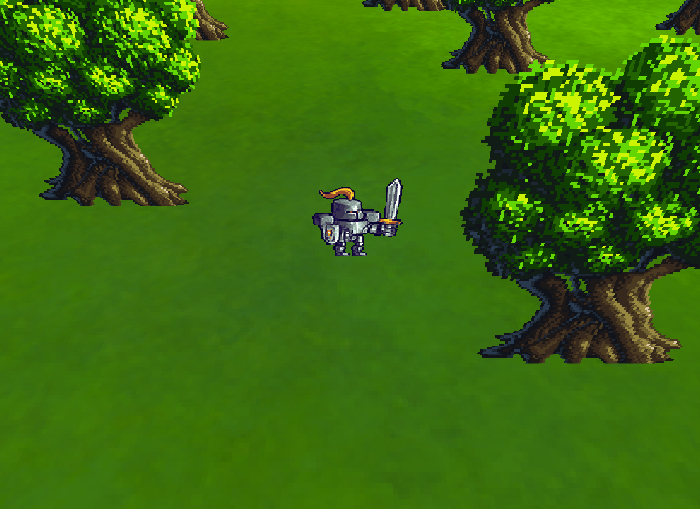
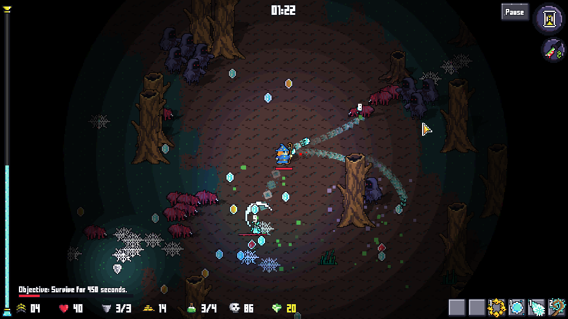

<big> A simple and effective JavaScript game development framework *that knows its place*!</big>

# Shaku

**If you're looking for a package that implements rendering, sounds, assets and input, while keeping it low level and simple, this is the library for you!**

(if you're looking for a game engine with editor like Unity, this library is not what you're looking for)

Demos & docs:

- [Online Demos](https://ronenness.github.io/Shaku/demo/index.html)
- [Homepage](https://ronenness.github.io/Shaku/)
- [Full API Docs](https://ronenness.github.io/Shaku/docs/index.html)

Projects made with *Shaku*:

- [HellEscape](https://store.steampowered.com/app/2135030/HellEscape/)
- [Game Demo Project](https://ronenness.github.io/Shaku-Demo/)
- [GridBender](https://knexator.itch.io/gridbender)
- [Another Clone](https://knexator.itch.io/another-clone)
- [Catalyst](https://knexator.itch.io/catalyst)
- [King of Veggies](https://pinchazumos.itch.io/king-of-veggies)

(Want your game listed above? Contact me at ronenness@gmail.com)

## Table Of Content

- [About](#about)
  - [Features](#features)
  - [Installation](#installation)
- [Online Demo](#online-demo-projects)
- [Using Shaku](#using-shaku)
  - [Setup](#setup)
  - [graphics](#graphics)
  - [Sounds](#sounds)
  - [Input](#input)
  - [Assets](#assets)
  - [Collision](#collision)
  - [Utils](#utils)
  - [Miscellaneous](#miscellaneous)
- [Advanced Topics](#advanced-topics)
  - [Shaku on NodeJS](#shaku-on-nodejs)
- [Build Shaku](#build-shaku)
- [Changes](#changes)
- [License](#license)

## About

*Shaku* is a JavaScript framework for web games development that emphasize **simplicity**, **flexibility** and **freedom**.

It's pretty low level and designed to be used as the foundations for a higher-level game engine, or used directly for game development. Kind of like MonoGame, RayLib or libGDX.

Let's take a quick look at how we make a game main loop with *Shaku*:

```js
// Init code goes here, we'll review it later..

// main loop (do updates, render and request next step)
function step() {
	// start a new frame and clear screen
	Shaku.startFrame();
	Shaku.gfx.clear(Shaku.utils.Color.cornflowerblue);

	// draw a sprite using the spritebatch
	spritesBatch.begin();
	const position = new Shaku.utils.Vector2(400, 300);
	const size = new Shaku.utils.Vector2(100, 100);
	spritesBatch.drawQuad(texture, position, size);
	spritesBatch.end();


	// end frame and request next step
	Shaku.endFrame();
	Shaku.requestAnimationFrame(step);
}
```

## Main Features

*Shaku* provides the following key features:

* Ultra-fast WebGL rendering engine.
* Assets loader to fetch textures, sounds, music, JSON, and other resources.
* Texture Atlas builder to combine textures efficiently at runtime.
* Collision detection.
* Custom effects, text rendering, render targets, batching and other graphics-essentials.
* Input manager for simple touch, mouse, gamepad and keyboard *state-based* input (instead of events).
* Sound effects, music, tracks mixer, pitch and everything you need for sfx.
* Basic utilities such as Vectors, Matrices, 2D Shapes, GameTime and more.
* Advance utilities such as Animators, Path Finder, Perlin generator and other super useful stuff.
* *All packed in a tiny lib with no external dependencies*! A single minified 150Kb JS is all you need to use Shaku.*


If you want to experiment with *Shaku* while reading the docs, you can check out this [Sandbox Demo](https://ronenness.github.io/Shaku/demo/sandbox.html).
See the [demos assets](demo/assets) folder to see which assets you can use for the sandbox (or load assets from external sources).


## Installation

Using *Shaku* is super easy!

1. Get `shaku.js` or `shaku.min.js` from the `dist/` folder and include it in your page (or use npm to get it).
2. Init *Shaku* and append the canvas to your document (or init *Shaku* on an existing canvas).
3. Write a game loop method starting with `Shaku.startFrame()` and ending with `Shaku.endFrame()` and `requestAnimationFrame()` to get next frame.

To get *Shaku* via NPM:

```npm install shaku```

### HTML Boilerplate

The following is a boilerplate HTML with *Shaku* running an empty game main loop:

```html
<!DOCTYPE html>
<html>
	<head>
	<title>Shaku Example</title>
	<script src="dist/shaku.js"></script>
	</head>
	<body>
		<script>
		(async function runGame() {
			// init shaku
			await Shaku.init();

			// add shaku's canvas to document and set resolution to 800x600
			document.body.appendChild(Shaku.gfx.canvas);
			Shaku.gfx.setResolution(800, 600, true);

			// TODO: LOAD ASSETS AND INIT GAME LOGIC HERE

			// do a single main loop step and request next step inside
			function step() {
				// start a new frame and clear screen
				Shaku.startFrame();
				Shaku.gfx.clear(Shaku.utils.Color.cornflowerblue);

				// TODO: PUT YOUR GAME UPDATES AND RENDERING HERE

				// end frame and invoke the next step in 60 FPS rate (or more, depend on machine and browser)
				Shaku.endFrame();
				Shaku.requestAnimationFrame(step);
			}

			// start the main loop
			step();
		})();
		</script>
	</body>
</html>
```

You can find the above HTML file [here](html_boilerplate.html).

## Online Demo Projects

Online demo projects can be found [here](https://ronenness.github.io/Shaku/demo/index.html).
They demonstrate basic to advanced *Shaku* features.


## Using Shaku

*Shaku*'s API mostly consist of five main managers, each solve a different domain of problems in gamedev: *graphics*, *sounds*, *assets*, *collision* and *input*.

In this doc we'll explore these managers and cover the most common use cases with them.
If you want to dive deep into the API, you can check out the [API Docs](docs/index.md), or browse the code.


### Setup

Everything in *Shaku* is located under the `Shaku` object.

Since the initialization process and asset loading is mostly asynchronous operations, its best to wrap the init code in an `async` method and utilize `await` calls to simplify the code. A common *Shaku* initialization code will look something like this:

```js
(async function runGame() {
	// init shaku.
	// for pixel art games its best to set antialias=false before init.
	Shaku.gfx.setContextAttributes({antialias: false});
	await Shaku.init();

	// add shaku's canvas to document and set resolution to 800x600.
	// this will set the canvas and renderer size.
	document.body.appendChild(Shaku.gfx.canvas);
	Shaku.gfx.setResolution(800, 600, true);

	// TODO: add code to load assets and init game logic here.

	// game main loop
	function step() {
		// start frame and clear the screen
		Shaku.startFrame();
		Shaku.gfx.clear(Shaku.utils.Color.cornflowerblue);

		// TODO: add game logic code here

		Shaku.endFrame();
		Shaku.requestAnimationFrame(step);
	}
	step();
})();
```

Let's go over the code above line by line:

* `Shaku.gfx.setContextAttributes({antialias: false})` will disable smooth filtering, and keep everything crispy and pixelated.
* `await Shaku.init()` will initialize all *Shaku*'s managers.
* `document.body.appendChild(Shaku.gfx.canvas)` add the canvas created by *Shaku* to the document body (you can also use an existing canvas instead).
* `Shaku.gfx.setResolution(800, 600, true)` will set both canvas size and renderer size to 800x600 px.
* `Shaku.startFrame()` must be called at the beginning of every game frame.
* `Shaku.gfx.clear(Shaku.utils.Color.cornflowerblue)` will clear the canvas to blue-ish color.
* `Shaku.endFrame()` must be called at the end of every game frame.
* `Shaku.requestAnimationFrame(step)` will request next frame when its time to render screen again, keeping updates() rate at about 60 FPS (or more if the browser and machine allows it).

As you can see from the example above, our step() method represent a single iteration in our game main loop.
It handles both rendering and updates.

Now we can start using *Shaku*'s managers, mostly between the `startFrame()` and `endFrame()` calls.


### Graphics

Let's start exploring the APIs from the graphics manager, accessed by `Shaku.gfx`.

In *Shaku* we use batches to render everything.
These batches collect multiple draw calls and batch them together into a single GPU call.
This way of rendering is essential for performance, but it has some limitations. For example, you can only only batch rendering with the same texture, blend mode, and shaders.

This doc don't cover the entirely of the API, only the main parts of it.
To see the full API, check out the [API docs](docs/gfx_gfx.md).

#### Drawing Textures

To draw textures (also known as 2d sprites) we use a `SpriteBatch` renderer.
This renderer batch together 2d quads and other shapes with textures on them.

Let's see a minimal code example to render a texture on screen:

```js
// this part comes after we init shaku, but still outside the main loop:

// during the init phase, we create a spritebatch and load a texture to draw
const texture = await Shaku.assets.loadTexture('<your texture path here..>');
const spriteBatch = new Shaku.gfx.SpriteBatch();

// this part comes between the Shaku.startFrame() and the Shaku.endFrame() calls:

// draw the texture with the batch
spritesBatch.begin();
const position = new Shaku.utils.Vector2(400, 300);
const size = new Shaku.utils.Vector2(100, 100);
spritesBatch.drawQuad(texture, position, size);
spritesBatch.end();
```

Pretty simple, eh?
Now let's draw with some more parameters:

```js
spritesBatch.begin();
const position = new Shaku.utils.Vector2(100, 125);
const size = new Shaku.utils.Vector2(32, 64);
const sourceRect = new Shaku.utils.Rectangle(32, 0, 32, 64);
const color = Shaku.utils.Color.red;
const rotation = Math.PI / 2;
const origin = new Shaku.utils.Vector2(0.5, 1);
const skew = new Shaku.utils.Vector2(32, 0);
Shaku.gfx.drawQuad(texture, position, size, sourceRect, color, rotation, origin, skew);
spritesBatch.end();
```

When beginning a batch, you can set different blend modes and effects. For example:

```js
spritesBatch.begin(Shaku.gfx.BlendModes.Additive, myCustomEffect);
```

We'll learn more about effects later, don't worry about it for now.

A simple rendering demo can be found [here](https://ronenness.github.io/Shaku/demo/gfx_draw.html).

##### When does a GPU draw call is made?

The `SpriteBatch` will call the GPU to draw everything on three different occasions:

1. When `spritesBatch.end()` is called.
2. When you change the texture.
3. If the batch overflows and can't contain any more drawings.

As you can see number #2 is something we need to watch out for. Texture Atlases are great way to reduce draw calls, and when possible, you should sort your rendering order by textures. We'll learn more about Texture Atlases later.

To learn more about Sprite Batches and see what else you can do with them, its recommended to check out the docs. For example you can control pixel aligning, buffers size, how to handle overflow, etc.


##### Sprites

`Sprites` are entities that store all rendering parameters required to make a draw call.
It's just a more object-based approach to draw stuff.

Lets create a sprite and set some of its fields:

```js
// this part comes after we init shaku, but still outside the main loop:

// load texture and create sprite
const texture = await Shaku.assets.loadTexture('assets/my_texture.png');
const sprite = new Shaku.gfx.Sprite(texture);

// set some fields
sprite.position.set(100, 125);
sprite.size.set(32, 64);
sprite.sourceRectangle = new Shaku.utils.Rectangle(32, 0, 32, 64);
sprite.color = Shaku.utils.Color.red;
sprite.rotation = Math.PI / 2;
sprite.origin.set(0.5, 1);

// this part comes between the Shaku.startFrame() and the Shaku.endFrame() calls:

// draw the sprite in a sprite batch
spritesBatch.begin();
Shaku.gfx.drawSprite(sprite);
spritesBatch.end();
```

##### Sprites Group

As the name implies, a sprites group is a collection of sprites.
Let's see how we use it:

```js
// this part comes after we init shaku, but still outside the main loop:

// create a group
const group = new Shaku.gfx.SpritesGroup();

// set group position, scale and rotation
// these transformations will affect all sprites in group
group.position.set(100, 100);
group.rotation = Math.PI / 2;
group.scale.set(2, 2);

// add some sprites to the group
const texture = await Shaku.assets.loadTexture('assets/my_texture.png');
for (let i = 0; i < 3; ++i) {
	const sprite = new Shaku.gfx.Sprite(texture);
	sprite.position = new Shaku.utils.Vector2(i * 100, 0);
	sprite.size = new Shaku.utils.Vector2(50, 50);
	sprite.origin = new Shaku.utils.Vector2(0, 0);
	group.add(sprite);
}

// this part comes between the Shaku.startFrame() and the Shaku.endFrame() calls:

// draw group
spritesBatch.begin();
Shaku.gfx.drawSpriteGroup(group);
spritesBatch.end();
```

The advantage of groups is that you can apply common transformations on all the sprites in the group around the same origin point. Its also slightly more efficient in some cases.

A demo page that draw with sprites group can be found [here](https://ronenness.github.io/Shaku/demo/gfx_sprites_group.html).


#### Drawing 3D Sprites

*Shaku* provides a simple 3D Sprite Batch renderer.
This is useful for simple 3D stuff like this:



Let's take a look at a basic 3D sprites example:

```js
// this part comes after we init shaku, but still outside the main loop:

// create a 3d sprite and set a default perspective camera.
// check out setPerspectiveCamera() arguments to see more options.
const spritesBatch3d = new Shaku.gfx.SpriteBatch3D();
spritesBatch3d.setPerspectiveCamera();

// this part comes between the Shaku.startFrame() and the Shaku.endFrame() calls:

// begin drawing 3d sprites
spritesBatch3d.begin();

// set view matrix (camera position and where we look at)
spritesBatch3d.setViewLookat(
	new Shaku.utils.Vector3(0, 500, 600),
	new Shaku.utils.Vector3(0, 0, 0)
);

// draw 3d quad from 4 vertices
const v1 = (new Shaku.gfx.Vertex())
	.setPosition(new Shaku.utils.Vector3(-spriteSize.x / 2, 0, 0))
	.setTextureCoords(new Shaku.utils.Vector2(0, 1));
const v2 = (new Shaku.gfx.Vertex())
	.setPosition(new Shaku.utils.Vector3(spriteSize.x / 2, 0, 0))
	.setTextureCoords(new Shaku.utils.Vector2(1, 1));
const v3 = (new Shaku.gfx.Vertex())
	.setPosition(new Shaku.utils.Vector3(-spriteSize.x / 2, spriteSize.y, 0))
	.setTextureCoords(new Shaku.utils.Vector2(0, 0));
const v4 = (new Shaku.gfx.Vertex())
	.setPosition(new Shaku.utils.Vector3(spriteSize.x / 2, spriteSize.y, 0))
	.setTextureCoords(new Shaku.utils.Vector2(1, 0));
spritesBatch3d.drawVertices(texture, [v1, v2, v3, v4]);

// end rendering
spritesBatch3d.end();
```

#### Drawing Shapes

*Shaku* also provides a way to draw some basic 2D shapes:

```js
// this part comes after we init shaku, but still outside the main loop:

// create shapes batch to render 2d shapes
const shapesBatch = new Shaku.gfx.ShapesBatch();

// this part comes between the Shaku.startFrame() and the Shaku.endFrame() calls:

// start drawing shapes
shapesBatch.begin();

// draw a circle in the center of screen with radius of 400. its center is red, its outter parts are blue, and it has 32 segments.
shapesBatch.drawCircle(new Shaku.utils.Circle(Shaku.gfx.getCanvasSize().div(2), 400), Shaku.utils.Color.red, 32, Shaku.utils.Color.blue);

// draw a rectangle at offset 100,100 and size 256,256, with red color, that rotates over time
const rotation = Shaku.gameTime.elapsed;
shapesBatch.drawRectangle(new Shaku.utils.Rectangle(100, 100, 256, 256), Shaku.utils.Color.red, rotation);

// draw everything on screen
shapesBatch.end();
```

Similar to `ShapesBatch`, there's also a `LinesBatch` renderer to draw just the outline of shapes (or a string of lines from vertices).


#### Drawing Text

*Shaku* support rendering text from *Font Texture* (also known as Bitmap Fonts).
These fonts store the glyphs as pixels data, and render the text as sprites.

You don't need to prepare the Font Textures upfront; *Shaku* generates them at runtime from regular TTF fonts.
For example, *Shaku* generated the following font texture for one of the [online demos](https://ronenness.github.io/Shaku/demo/gfx_draw_text.html):


Let's take a look at how we generate a Sprite Font and render some text with it:

```js
// this part comes after we init shaku, but still outside the main loop:

// load font texture
// note: the fontName argument MUST match the font name defined in the ttf file.
const fontTexture = await Shaku.assets.loadFontTexture('assets/DejaVuSansMono.ttf', {fontName: 'DejaVuSansMono'});

// create text sprite batch
const textSpriteBatch = new Shaku.gfx.TextSpriteBatch();

// generate a text group to render in white, aligned to the left, and positioned at 100,100.
const textGroup = Shaku.gfx.buildText(fontTexture, "Hello World!\nThis is second line.", 24, Shaku.utils.Color.white, Shaku.gfx.TextAlignments.Left);
textGroup.position.set(100, 100);

// this part comes between the Shaku.startFrame() and the Shaku.endFrame() calls:

// draw the text
textSpriteBatch.begin();
textSpriteBatch.drawText(textGroup);
textSpriteBatch.end();

// you can also draw the text with outlines:
textSpriteBatch.outlineWeight = 0.75;
textSpriteBatch.outlineColor = Shaku.utils.Color.black;
textSpriteBatch.begin();
textSpriteBatch.drawText(textGroup);
textSpriteBatch.end();
```

When loading the `FontTexture` you can provide additional parameters, to learn more about them check out the [API Docs](docs/assets_font_texture_asset.md).

Note that *Shaku* also support hi-res MSDF Font Textures, but it can't generate them at runtime.
To see how to use MSDF font textures, check out [this demo](https://ronenness.github.io/Shaku/demo/gfx_draw_text_msdf.html).

#### Render Targets

Render Targets provide a way to draw *on textures* instead of directly on screen, and then draw these textures on screen. This technique is useful for post processing effects, or to implement virtual resolution (by drawing on a constant-sized texture and then present it on screen).

For example [the following game](https://store.steampowered.com/app/2135030/HellEscape/) is built with *Shaku*, and uses Render Targets to implement the 2D lightings you see here:



A render target in essence is just a texture asset you can draw on, created like this:

```js
const renderTarget = await Shaku.assets.createRenderTarget('_my_render_target', width, height);
```

Then you can start drawing on it by setting it as the active render target:

```js
// set render target
Shaku.gfx.setRenderTarget(renderTarget);

// draw some stuff here...
// these renderings will appear on the texture instead of the canvas.

// reset render target so we can continue drawing on screen / canvas
Shaku.gfx.setRenderTarget(null);
```

And finally we can use the render target just like we would use any other texture:

```js
spritesBatch.begin();
const position = new Shaku.utils.Vector2(400, 300);
const size = new Shaku.utils.Vector2(100, 100);
spritesBatch.drawQuad(renderTarget, position, size);
spritesBatch.end();
```

A demo that uses render targets can be found [here](https://ronenness.github.io/Shaku/demo/gfx_render_target.html).

#### Cameras

The camera object define two key properties:

- Viewport: the region of the canvas we render on.
- Projection: offset and scale of everything we draw on the canvas.

By default, *Shaku* will use a camera with no offset and scale of x1, and a viewport that covers the entire canvas. In other words, an identity camera that won't affect anything.

To change the default camera:

```js
// create camera object
const camera = Shaku.gfx.createCamera();

// set offset and use the camera (call this before rendering)
camera.orthographicOffset(cameraOffset);
Shaku.gfx.applyCamera(camera);
```

And if later you want to reset camera back to default, you can call the following method:

```js
Shaku.gfx.resetCamera();
```

For more details, check out the [Camera object API](docs/gfx_camera.md) in the docs.

A demo page that uses cameras can be found [here](https://ronenness.github.io/Shaku/demo/miscs_tilemap.html).

#### Texture Atlas

Every time you change the texture, a draw call is made to the GPU. This means that if you render 100 different textures in a row you will suffer 100 GPU draw calls (and 100 textures switching), which is very ineffective in terms of performance.

To solve this issue video games often use a *Texture Atlas*, which is a single large texture containing multiple smaller textures. That way, we can reduce texture switching and draw calls.

Creating a Texture Atlas manually is a tedious work, and as you add more and more textures sometimes you end up with inconvenient 'holes' that makes the atlas less space-efficient. For that reason, *Shaku* has a built-in Atlas builder that helps you generate an efficient Texture Atlas at runtime:

```js
// all source textures URLs
const sourceUrls = [
	'assets/stone_wall.png',
	'assets/grass.png',
	'assets/tree.png',
	...
];

// create a texture atlas named 'my-texture-atlas'.
// you can also limit its dimensions if needed to.
const textureAtlas = await Shaku.assets.createTextureAtlas('my-texture-atlas', sourceUrls);

// then you can use the texture atlas like this:

// extract one of the textures
// textureInAtlas is an object with `texture` and `sourceRectangle`.
const textureInAtlas = textureAtlas.getTexture('assets/stone_wall.png');

// draw the texture at 100,100
const size = textureInAtlas.sourceRectangle.getSize();
spritesBatch.begin();
spritesBatch.drawQuad(textureInAtlas, new Shaku.utils.Vector2(100, 100), size);
spritesBatch.end();
```

Note that a texture atlas is not necessarily a single texture; Since there's a GPU limit for max textures size, the atlas may generate more than one texture. That's why when you call `getTexture()` the object don't return just source rectangle, but a texture asset as well.


#### Effects

Effects provide a way to change the shaders *Shaku* uses to draw textures and shapes.

When implementing an effect, you need to follow four steps:

1. Write or use an existing *vertex shader code*.
2. Write or use an existing *fragment shader code*.
3. Define your shaders Uniforms.
4. Define your shaders Attributes.

And optionally, you can instruct *Shaku* to use custom attributes and uniforms internally, so you won't need to explicitly set them. More on that later.

Lets write a simple custom effect and then review and explain the code:

```js
// define a custom effect
class MyEffect extends Shaku.gfx.SpritesEffect {
	/**
	 * Override the fragment shader for our custom effect.
	 */
	get fragmentCode() {
		const fragmentShader = `
			#ifdef GL_ES
				precision highp float;
			#endif

			uniform sampler2D mainTexture;
			uniform float elapsedTime;

			varying vec2 v_texCoord;
			varying vec4 v_color;

			void main(void) {
				gl_FragColor = texture2D(mainTexture, v_texCoord) * v_color;
				gl_FragColor.r *= sin(v_texCoord.y * 10.0 + elapsedTime) + 0.1;
				gl_FragColor.g *= sin(1.8 + v_texCoord.y * 10.0 + elapsedTime) + 0.1;
				gl_FragColor.b *= sin(3.6 + v_texCoord.y * 10.0 + elapsedTime) + 0.1;
				gl_FragColor.rgb *= gl_FragColor.a;
			}
		`;
		return fragmentShader;
	}

	/**
	 * Override the uniform types dictionary to add our custom uniform type.
	 */
	get uniformTypes() {
		const ret = super.uniformTypes;
		ret['elapsedTime'] = { type: Shaku.gfx.Effect.UniformTypes.Float };
		return ret;
	}
}
```

Before reading on, can you guess what this effect do?

This effect recieve *elapsed time* as a uniform (called 'elapsedTime') with type `flot`, and animate the texture colors based on the current time value. Since every component gets a different offset from the start, it will create a rainbow-like colors effect.


A demo page with the above effect can be found [here](https://ronenness.github.io/Shaku/demo/gfx_custom_effects.html).

Now lets review the code.

1. First, notice we're extending the `Shaku.gfx.SpritesEffect` class. This is the default effect *Shaku* uses for sprites, and by inheriting from it we can skip implementing the vertex shader and just use the default one. It also covers the basic attributes binding for vertices data. If you want to create a brand new effect that doesn't use anything from the built-in sprites effect, extend `Shaku.gfx.Effect` instead.
2. Next we have `get fragmentCode()`, that returns the fragment shader code to compile for this effect. There is also a `get fragmentCode()` getter for the vertex shader code, but as mentioned earlier we relay on the default sprites vertex shader so we don't need to implement it.
4. And finally, `get uniformTypes()` returns a dictionary with uniforms we want to set in the effect. Note that we do `const ret = super.uniformTypes;` to extend the base class uniforms so we won't miss out on any functionality from the basic effect.

Now we can start using this effect with our Sprites Batch:

```js
// create the custom effect
const effect = new MyEffect();

// update effect elapsed time and render with it
// the setter `effect.uniforms.elapsedTime` exists because we defined it in `get uniformTypes()`
effect.uniforms.elapsedTime(Shaku.gameTime.elapsed);
spritesBatch.begin(undefined, effect);
spritesBatch.drawQuad(texture, new Shaku.utils.Vector2(100, 100), 400);
spritesBatch.end();
```

##### Default Effect

To learn more about effects, lets review the [default built-in effect](https://github.com/RonenNess/Shaku/blob/main/src/gfx/effects/sprites.js) *Shaku* normally uses for sprites with vertex color:

```js
// vertex shader code
const vertexShader = `
attribute vec3 position;
attribute vec2 uv;
attribute vec4 color;

uniform mat4 projection;
uniform mat4 world;

varying vec2 v_texCoord;
varying vec4 v_color;

void main(void) {
	gl_Position = projection * world * vec4(position, 1.0);
	gl_PointSize = 1.0;
	v_texCoord = uv;
	v_color = color;
}
`;

// fragment shader code
const fragmentShader = `
#ifdef GL_ES
	precision highp float;
#endif

uniform sampler2D mainTexture;

varying vec2 v_texCoord;
varying vec4 v_color;

void main(void) {
	gl_FragColor = texture2D(mainTexture, v_texCoord) * v_color;
	gl_FragColor.rgb *= gl_FragColor.a;
}
`;

/**
 * Default basic effect to draw 2d sprites.
 */
class SpritesEffect extends Effect
{
	/** @inheritdoc */
	get vertexCode()
	{
		return vertexShader;
	}

	/** @inheritdoc */
	get fragmentCode()
	{
		return fragmentShader;
	}

	/** @inheritdoc */
	get uniformTypes()
	{
		return {
			[Effect.UniformBinds.MainTexture]: { type: Effect.UniformTypes.Texture, bind: Effect.UniformBinds.MainTexture },
			[Effect.UniformBinds.Projection]: { type: Effect.UniformTypes.Matrix, bind: Effect.UniformBinds.Projection },
			[Effect.UniformBinds.World]: { type: Effect.UniformTypes.Matrix, bind: Effect.UniformBinds.World },
			[Effect.UniformBinds.View]: { type: Effect.UniformTypes.Matrix, bind: Effect.UniformBinds.View }
		};
	}

	/** @inheritdoc */
	get attributeTypes()
	{
		return {
			[Effect.AttributeBinds.Position]: { size: 3, type: Effect.AttributeTypes.Float, normalize: false, bind: Effect.AttributeBinds.Position },
			[Effect.AttributeBinds.TextureCoords]: { size: 2, type: Effect.AttributeTypes.Float, normalize: false, bind: Effect.AttributeBinds.TextureCoords },
			[Effect.AttributeBinds.Colors]: { size: 4, type: Effect.AttributeTypes.Float, normalize: false, bind: Effect.AttributeBinds.Colors },
		};
	}
}
```

As you can see above we use *attributes* for vertices data (position, texture coords, and colors), and uniforms for texture and transformation matrices (projection, world, and view).

**Binds**

You may have noticed an additional parameter added to the attributes and uniforms: `bind`.

Binding is a way for us to tell *Shaku* how to handle attributes and uniforms we want to use for basic stuff, like vertices color or texture coords, so that *Shaku* can set these values internally when preparing the batch.

For example, when we added the bind `Effect.AttributeBinds.Position` to the attributes named `[Effect.AttributeBinds.Position]`, we instructed *Shaku* to send the vertices position data into this attribute from our vertex shader, which is called `position`.

If you want to define an effect and call this attribute a different name, for example 'attr_vertexPos', you can just set it like this in your effect:

`attr_vertexPos: { size: 3, type: Effect.AttributeTypes.Float, normalize: false, bind: Effect.AttributeBinds.Position },`

**The following binds are valid for uniform types**:

- *MainTexture*: bind uniform to be used as the main texture.
- *Color*: bind uniform to be used as a main color.
- *Projection*: bind uniform to be used as the projection matrix.
- *World*: bind uniform to be used as the world matrix.
- *View*: bind uniform to be used as the view matrix.
- *UvOffset*: bind uniform to be used as UV offset.
- *UvScale*: bind uniform to be used as UV scale.
- *OutlineWeight*: bind uniform to be used as outline weight.
- *OutlineColor*: bind uniform to be used as outline color.
- *UvNormalizationFactor*: bind uniform to be used as factor to normalize uv values to be 0-1.
- *TextureWidth*: bind uniform to be used as texture width in pixels.
- *TextureHeight*: bind uniform to be used as texture height in pixels.

**And the following binds are valid for attribute types**:

- *Position*: bind attribute to be used for vertices position array.
- *TextureCoords*: bind attribute to be used for texture coords array.
- *Colors*: bind attribute to be used for vertices colors array.

Anything else, you'll just need to set yourself.


#### Matrices

Matrices are used to transform vertices. They can express rotation, scale, translation, and camera view and projection.

You can access the Matrix class with `Shaku.gfx.Matrix`.
Let's take a look at a basic example of using a matrix to move the position of 3d vertices:

```js
// create vertices
const spriteSize = new Shaku.utils.Vector2(spriteTexture.width * 1.5, spriteTexture.height * 1.5);
const v1 = (new Shaku.gfx.Vertex())
	.setPosition(new Shaku.utils.Vector3(-spriteSize.x / 2, 0, 0))
	.setTextureCoords(new Shaku.utils.Vector2(0, 1));
const v2 = (new Shaku.gfx.Vertex())
	.setPosition(new Shaku.utils.Vector3(spriteSize.x / 2, 0, 0))
	.setTextureCoords(new Shaku.utils.Vector2(1, 1));
const v3 = (new Shaku.gfx.Vertex())
	.setPosition(new Shaku.utils.Vector3(-spriteSize.x / 2, spriteSize.y, 0))
	.setTextureCoords(new Shaku.utils.Vector2(0, 0));
const v4 = (new Shaku.gfx.Vertex())
	.setPosition(new Shaku.utils.Vector3(spriteSize.x / 2, spriteSize.y, 0))
	.setTextureCoords(new Shaku.utils.Vector2(1, 0));

// create a translation matrix
const position = new Shaku.utils.Vector3(10, 100, 50);
const matrix = Shaku.gfx.Matrix.translate(position.x, position.y, position.z);

// transform the vertices with the matrix and draw them in a 3d batch
const vertices = [
	Shaku.gfx.Matrix.transformVertex(matrix, v1),
	Shaku.gfx.Matrix.transformVertex(matrix, v2),
	Shaku.gfx.Matrix.transformVertex(matrix, v3),
	Shaku.gfx.Matrix.transformVertex(matrix, v4),
];
spritesBatch3d.begin();
spritesBatch3d.drawVertices(spriteTexture, vertices);
spritesBatch3d.end();
```

To learn more about matrices, check out the [API docs](docs/gfx_matrix.md).


#### Conclusion

In this chapter we learned about the `Gfx` manager and how to use it to create batches and render basic things. What we covered here is just the common use cases, to learn more about what you can draw with *Shaku* check out the [online demos](https://ronenness.github.io/Shaku/demo/index.html) or the [online docs](https://ronenness.github.io/Shaku/docs/index.html).

### Sounds

We finally reached our second manager, the sounds manager, which is accessed by `Shaku.sfx`.

This doc don't cover the entirely of the API, only the main parts of it. To see the full API, check out the [API docs](docs/sfx_sfx.md).


#### Play Sound

To play an audio asset once:

```js
// load the sound file
const sound = await Shaku.assets.loadSound('assets/my_sound_file.ogg');

// play sound
const volume = 0.85;
const pitch = 1;
Shaku.sfx.play(sound, volume, pitch);
```

Note that due to browsers security limitations, you won't be able to play any sound effect until the user interacted with the page with mouse, touch, gamepad, or keyboard. This is not something *Shaku* can solve, as this is by design and enforced by the browsers themselves.

You can, however, preload your sound assets before that.

#### Sound Instances

A sound instance is a way to create a sound object that lives on after it was played, and use it as many times as you like. Its more efficient to reuse instances than to call `play()` multiple times, but its usually an unnecessary optimization as this will rarely be your bottleneck in terms of performance.

To create a sound instance:

```js
// load sound asset and create instance
const sound = await Shaku.assets.loadSound('assets/my_sound_file.ogg');
const soundInstance = Shaku.sfx.createSound(sound);

// play the sound
soundInstance.play();
```

The sound instance have the following properties:

* *play()*: Start playing the sound.
* *stop()*: Stop playing the sound and reset time to the beginning.
* *pause()*: Stop playing sound but keep current time.
* *loop*: Set if should play in loop or not.
* *volume*: Set volume.
* *currentTime*: Set current time.
* *duration*: Get sound duration.
* *paused*: Is the sound currently paused?
* *playing*: Is the sound currently playing?
* *finished*: Did the sound finish playing?
* *preservesPitch*: Set if to preserve pitch while changing playback rate.
* *playbackRate*: Set playback rate.

A demo page that play sounds can be found [here](https://ronenness.github.io/Shaku/demo/sfx_basic_audio.html).

#### Sounds Mixer

Sound Mixer is a utility class to mix and fade sounds.
It's very useful for music transitioning.

For example, the following code will create a mixer that transition from music1 to music2, while allowing tracks to overlap (if overlap is false, the mixer will first fade-out music1 completely, and only then begin fading-in music2):

```js
// load two music tracks
const music1 = await Shaku.assets.loadSound('assets/music1.ogg');
const music2 = await Shaku.assets.loadSound('assets/music2.ogg');

// transition between the tracks
const overlap = true;
const mixer = new Shaku.sfx.SoundMixer(Shaku.sfx.createSound(music1), Shaku.sfx.createSound(music2), overlap);
```

To run the mixer you then need to call the following inside every step of your game main loop:

```js
// Shaku.gameTime.delta is transition speed (delta = time between frames, in seconds)
mixer.updateDelta(Shaku.gameTime.delta);
```

And the following code will create a mixer to fade music in without fading anything out:

```js
const mixer = new Shaku.sfx.SoundMixer(null, Shaku.sfx.createSound(music2), true);
```

Or, we can just fade music out without fading anything in:

```js
const mixer = new Shaku.sfx.SoundMixer(Shaku.sfx.createSound(music1), null, true);
```

If you want to set the mixer to a specific point in time, you can call `update()` with the desired progress from 0.0 to 1.0:

```js
const mixProgress = 0.5; // valid range = 0-1
mixer.update(mixProgress);
```

A demo page with sounds mixer can be found [here](https://ronenness.github.io/Shaku/demo/sfx_sound_mixer.html).


#### Conclusion

In this chapter we learned about the `Sfx` manager and how to use it to play sound effects and music. What we covered here is just the common use cases, to learn more about sound effects with pitch, volume, playback speed and other effects *Shaku* support, check out the [online demos](https://ronenness.github.io/Shaku/demo/index.html) or the [online docs](https://ronenness.github.io/Shaku/docs/index.html).


### Input

The input manager provides an API to query Keyboard, Mouse, Touch and Gamepad input.
To access the Input manager we use `Shaku.input`.

This doc don't cover the entirely of the API, only the main parts of it. To see the full API, check out the [API docs](docs/input_input.md).

#### States Queries

The input manager have five main query method for key states, which can be mouse buttons, touch, keyboard keys, or gamepad buttons. These five methods are the ones you'll use the most:

- **down**: return true if the button / key is currently held down.
- **released**: return true if the button / key was released in this very update frame.
- **pressed**: return true if the button / key was pressed down in this very update frame.
- **doublePressed**: like pressed, but will only trigger after a second quick press.
- **doubleReleased**: like released, but will only trigger after a second quick release.

For example, a double-click with the mouse left button can be detected like this: `Shaku.input.doublePressed('mouse_left')` (or `doubleReleased` if you prefer to only consider double click if used released the key).

In addition, all the methods above also accept an array instead of a single key code, to test if any of them match the condition. For example, the following will check if 'w' or arrow up is down: `Shaku.input.down(['w', 'up_arrow'])`.


A demo page to demonstrate the input manager can be found [here](https://ronenness.github.io/Shaku/demo/input_basic_input.html).

#### Keyboard

All keyboard keys are listed under `Shaku.input.KeyboardKeys`.

To query keyboard keys you can just use their names with any of the main state query methods. For example:

```js
if (Shaku.input.down('left') || Shaku.input.down('a')) {
	// move player left
}
```

In addition there are some useful keyboard-specific getters you can use: `shiftDown`, `ctrlDown`, `altDown`, `anyKeyPressed`, `anyKeyDown`.


#### Mouse

To get a mouse button state use the 'mouse_' prefix, followed by the button key (left, right, middle). For example to check if left mouse button is down:

```js
if (Shaku.input.down('mouse_left')) {
	// mouse left button is down
}
```

##### Mouse Position

To get mouse position use:

```js
// returns a Vector2 instance
const mousePos = Shaku.input.mousePosition;
```

And to get mouse position change from last frame:

```js
// returns a Vector2 instance
const mouseDelta = Shaku.input.mouseDelta;
```

**Wait, mouse position is wrong?**

By default the input manager will attach events to the *entire document*, meaning that mouse position will be relative to the top-left corner of the web page.

If your game canvas does not cover the entire screen, mouse offset will feel wrong because it won't be relative to your canvas top-left corner. You might expect to get 0,0 if you click on the canvas top-left corner, but that would only happen if the canvas starts the the page top-left corner.

To solve this, you can instruct the input manager to attach events to the main canvas (or any other element for that matter). This will also make the input manager only work when the canvas is focused, which is useful when combining *Shaku* with HTML UI.

To set the Input manager target element, run the following command *before initializing Shaku*:

```js
Shaku.input.setTargetElement(() => Shaku.gfx.canvas);
```

Note that we use a callback and not `Shaku.gfx.canvas` directly, as `Shaku.gfx.canvas` will be undefined until we call `Shaku.init`, which is when we must call `setTargetElement()`.


##### Mouse Wheel

You can query mouse wheel delta with `Shaku.input.mouseWheel`, or get just the mouse wheel direction (if the user scrolls up or down) with `Shaku.input.mouseWheelSign` (will be 0 if wheel is not used this frame).

#### Touch

By default, *Shaku* will delegate Touch input to Mouse input, so you can use the same key codes for desktop and mobile. This means that Touch start will generate a mouse click input ('mouse_left' code), and when the user drags touch input across the device, the Touch position will update as the Mouse position.

To disable this behavior, you can set `Shaku.input.delegateTouchInputToMouse` to `false`.

If you choose not to delegate Touch input to Mouse, you can use the following methods to query Touch input:

- `Shaku.input.touchPosition`: Get touch last position.
- `Shaku.input.touching`: True while the user is touching the device screen.
- `Shaku.input.touchStarted`: True if touch input started during this update frame.
- `Shaku.input.touchEnded`: True if touch input ended during this update frame.

You can get `down`, `pressed`, and `released` state for touch input too, similar to how you'd use a keyboard key or mouse button, but with `touch` as the key code:

```js
if (Shaku.input.down('touch')) {
	// user is touching the screen
}

if (Shaku.input.released('touch')) {
	// touch was just released
}

if (Shaku.input.pressed('touch')) {
	// touch was just pressed
}
```


#### Gamepad

You can query Gamepad sticks and buttons with the input manager. Note that gamepads only work after the user press any gamepad button or move the stick. This is due to browsers security limitations.

To query connected gamepad ids use:

```js
// all ids:
console.log("gamepads: ", Shaku.input.gamepadIds());

// by index:
console.log("Gamepad 2 id: ", Shaku.input.gamepadId(2));

// default gamepad (lowest connected index):
console.log("Default gamepad id: ", Shaku.input.gamepadId());
```

And to get a gamepad state object, use:

```js
const gamepad = Shaku.input.gamepad(0); // <-- 0 is the index of the gamepad to get, or leave out this param for default gamepad
```

Every gamepad state object will have the following properties:

- `gamepad.axis1`: Vector2 with axis1 current value.
- `gamepad.axis2`: Vector2 with axis2 current value.
- `gamepad.buttonsCount`: How many buttons this gamepad has.
- `gamepad.button(index)`: Get the state of a button (up / down).
- `gamepad.id`: Gamepad id.
- `gamepad.mapping`: Gamepad mapping type.

If the gamepad has a standard mapping, `gamepad.isMapped` will be set to true, and the following properties will also appear:

- `gamepad.leftStick`: Left stick state (same as axis1).
- `gamepad.rightStick`: Left stick state (same as axis2).
- `gamepad.leftStickPressed`: Is left stick pressed?
- `gamepad.rightStickPressed`: Is right stick pressed?
- `gamepad.leftButtons`: Left side buttons cluster (top, bottom, left, right).
- `gamepad.rightButtons`: Right side buttons cluster (top, bottom, left, right).
- `gamepad.centerButtons`: Center buttons cluster (left, right, center).
- `gamepad.frontButtons`: Front buttons (topLeft, topRight, bottomLeft, bottomRight).


##### Gamepad Key Codes

If `Shaku.input.delegateGamepadInputToKeys` is set to true (default), the Input manager will generate key-like states for all the connected gamepads that have standard mappings.

This means that instead of using the gamepad state object like we demonstrated above, you can query it directly with the main `down()`, `pressed()`, `released()`, `doublePressed()` and `doubleReleased()` methods.

The following keys will work supported for every connected gamepad (where X represent the gamepad index starting from 0):

- `gamepadX_top`: state of arrow keys top key (left buttons).
- `gamepadX_bottom`: state of arrow keys bottom key (left buttons).
- `gamepadX_left`: state of arrow keys left key (left buttons).
- `gamepadX_right`: state of arrow keys right key (left buttons).
- `gamepadX_leftStickUp`: true if left stick points directly up.
- `gamepadX_leftStickDown`: true if left stick points directly down.
- `gamepadX_leftStickLeft`: true if left stick points directly left.
- `gamepadX_leftStickRight`: true if left stick points directly right.
- `gamepadX_rightStickUp`: true if right stick points directly up.
- `gamepadX_rightStickDown`: true if right stick points directly down.
- `gamepadX_rightStickLeft`: true if right stick points directly left.
- `gamepadX_rightStickRight`: true if right stick points directly right.
- `gamepadX_a`: state of A key (from right buttons).
- `gamepadX_b`: state of B key (from right buttons).
- `gamepadX_x`: state of X key (from right buttons).
- `gamepadX_y`: state of Y key (from right buttons).
- `gamepadX_frontTopLeft`: state of the front top-left button.
- `gamepadX_frontTopRight`: state of the front top-right button.
- `gamepadX_frontBottomLeft`: state of the front bottom-left button.
- `gamepadX_frontBottomRight`: state of the front bottom-right button.

For example, the following will trigger when the player either press the arrow up key on the gamepad, or move the left stick all the way up:

```js
if (Shaku.input.pressed(['gamepad0_up', 'gamepad0_leftStickUp'])) {
	alert("Move Up!");
}
```

#### Additional Parameters

The input manager support some additional parameters you can set:

- **preventDefaults**: If true will prevent default input events by calling preventDefault().
- **disableMouseWheelAutomaticScrolling**: If true will disable the special scroll mode that starts in chromium browsers when you click the wheel button not on a link.
- **disableContextMenu**: If true will disable the context menu that opens on right mouse button click.
- **delegateTouchInputToMouse**: If true will treat touch events (touch start / touch end / touch move) as if the user clicked and moved a mouse.
- **delegateGamepadInputToKeys**: If true will generate gamepad key codes so you can query gamepad like you would query a keyboard key.
- **resetOnFocusLoss**: If true, will reset input states when the page or target element loses focus.
- **defaultDoublePressInterval**: The interval in milliseconds to consider two consecutive key presses as a double-press.

#### Conclusion

In this chapter we learned about the `Input` manager and how to use it to get input from keyboard, mouse, touch and gamepad. What we covered here is just the common use cases, to learn more about input methods, check out the [online demos](https://ronenness.github.io/Shaku/demo/index.html) or the [online docs](https://ronenness.github.io/Shaku/docs/index.html).


### Assets

The *Assets* manager handle loading and runtime creation of game assets, and is accessed by `Shaku.assets`.
We already covered most of it while exploring the other managers, but in this section we will focus on the input manager itself.

This doc don't cover the entirely of the API, only the main parts of it. To see the full API, check out the [API docs](docs/assets_assets.md).

#### Assets Loading

There are two things to keep in mind while dealing with the assets manager:

##### Assets URL

Every asset have a unique identifier field called `url`. This is how we identify the asset and store it in cache.
If you try to load the same asset twice, in the second call will just return the copy from the cache, provided the URL is *exactly* the same.

When creating assets dynamically by code, you can also provide a unique `url`, if you want to add the asset to cache and make it accessible anywhere via the assets manager.

##### Promises

Every `load` and `create` method in the assets manager returns a `promise` that is resolved when the asset is loaded.
Even if the asset was returned from cache, it will be returned via a promise.

Note that you can query the cache directly without loading a new asset, by calling the `getCached()` method.

**Promise.asset**

All returned promises from the assets manager have additional property: `asset`.
This property provide access the asset itself before the promise is resolved, at your own risk (since the asset may be invalid). For example, you can fetch a texture *without waiting* like this:

```js
// myTexture may not be loaded yet!
const myTexture = Shaku.assets.loadTexture(url).asset;
```

Instead of loading it with `await`:

```js
const myTexture = await Shaku.assets.loadTexture(url);
```

Or with `then`:

```js
Shaku.assets.loadTexture(url).then((asset) => myTexture = asset);
```

The idea behind the `Promise.asset` property is to make it easier to perform parallel loading.
For example, the following code creates a dictionary of assets, and wait for all to load before proceeding:

```js
const assets = {
	tree: Shaku.assets.loadTexture("tree.png").asset,
	rock: Shaku.assets.loadTexture("rock.png").asset,
	house: Shaku.assets.loadTexture("house.png").asset
}
await Shaku.assets.waitForAll();
```

Just keep in mind that using an asset before its ready may cause undefined behavior and exceptions.
To check if an asset is loaded and valid, you can use `asset.valid`.


#### Load a Sound

To load a sound asset:

```js
const sound = await Shaku.assets.loadSound(url);
```

To learn more about sound assets, check out the [API docs](docs/assets_sound_asset.md).

#### Load a Texture

To load a texture asset:

```js
const sound = await Shaku.assets.loadTexture(url, params);
```

Params is an *optional* dictionary that accepts the following keys:

* **generateMipMaps**: (default=false) if true will generate mipmaps for this texture.

To learn more about texture assets, check out the [API docs](docs/assets_texture_asset.md).

#### Create a Render Target

To create a render target (a texture we can render on):

```js
const rt = await Shaku.assets.createRenderTarget(name, width, height)
```

In the above example `name` will be used as `url`, ie to put the loaded render target in cache.

A render target is just a texture asset created via code. To learn more about texture assets, check out the [API docs](docs/assets_texture_asset.md).

#### Load a Font Texture

To load a font texture asset:

```js
const fontTexture = await Shaku.assets.loadFontTexture(url, params);
```

Params is a *mandatory* dictionary that accepts the following keys:

* *fontName*: mandatory font name. on some browsers if the font name does not match the font you actually load via the URL, it will not be loaded properly.
* *missingCharPlaceholder (default='?')*: character to use for missing characters.
* *smoothFont (default=true)*: if true, will set font to smooth mode.
* *fontSize (default=52)*: font size to generate in texture. larget font size will take more memory, but allow for sharper text rendering in larger scales.
* *enforceTexturePowerOfTwo (default=true)*: if true, will force texture size to be power of two.
* *maxTextureWidth (default=1024)*: max texture width.
* *charactersSet (default=FontTextureAsset.defaultCharactersSet)*: which characters to set in the texture.

To learn more about font texture assets, check out the [API docs](docs/assets_texture_asset.md).

#### Load Json File

To load a json file:

```js
const json = await Shaku.assets.loadJson(url);
console.log(json.data);
```

To learn more about json assets, check out the [API docs](docs/assets_json_asset.md).

##### Create Json File

You can also create a json asset dynamically, and add it to assets cache:

```js
const json = await Shaku.assets.createJson(url, data);
```

#### Load Binary File

To load a binary file:

```js
const bin = await Shaku.assets.loadBinary(url);
console.log(bin.data);
```

To learn more about binary assets, check out the [API docs](docs/assets_binary_asset.md).

##### Create Binary

You can also create a binary asset dynamically, and add it to assets cache:

```js
const bin = await Shaku.assets.createBinary(url, data);
```

#### Create a Texture Atlas

Texture Atlas was already covered when talking about the `Gfx` manager. To load multiple textures and generate an atlas from them, call `createTextureAtlas`:

```js
const textureAtlas = await createTextureAtlas(name, sources, maxWidth, maxHeight, extraMargins)
```

- **name** is just a unique identifier for the atlas asset.
- **sources** is a list of URL to load the textures from.
- **maxWidth** is an optional limit to the atlas textures width.
- **maxHeight** is an optional limit to the atlas textures height.
- **extraMargins** is an optional extra empty pixels to put between textures in the atlas.

#### Get Cached Asset

To get an already-loaded asset from cache, you can use:

```js
const asset = Shaku.assets.getCached(url);
```

This method is more convinient and just return the asset immediately, without a promise.
If the asset is not loaded yet, it will return null.

#### Waiting For Assets

There are three main properties we can use to wait and monitor assets loading progress:

##### Shaku.assets.pendingAssets

Return how many assets are currently waiting to be loaded.

##### Shaku.assets.failedAssets

Return how many assets failed to load.

##### Shaku.assets.waitForAll

Return a promise that will be resolved when all assets are fully loaded, or rejected if one or more failed. You can use it to load multiple assets in parallel (without await) and then call `waitForAll` to wait for all of them to load.

#### Freeing Assets

All loaded assets are stored in local cache. To free a specific asset you can call:

```js
Shaku.assets.free(url);
```

Note that if you have a reference to this asset from before freeing it and you try to use it, an exception will most likely be thrown.

You can also free all loaded assets at once, by calling `clearCache`:

```js
Shaku.assets.clearCache();
```

### Collision

The *Collision* manager provides basic 2D collision detection, and is accessed by `Shaku.collision`.
The collision manager handles only detection, its not a physics engine.

This doc don't cover the entirely of the API, only the main parts of it. To see the full collision manager API, check out the [API docs](docs/collision_collision.md).

#### Collision Shapes

A collision shape is a 2d body we use to test collision.
There are currently five collision shapes *Shaku* supports:

* [Point](docs/collision_shapes_point.md).
* [Rectangle](docs/collision_shapes_point.md).
* [Circle](docs/collision_shapes_point.md).
* [Lines](docs/collision_shapes_lines.md).
* [Tilemap](docs/collision_shapes_tilemap.md).

##### Collision Flags

Every shape has a property called `collisionFlags`.
This property is a number used as a bitmap for collision filtering. For example, you can define the following flags:

```js
const CollisionFlags = {
	Walls: 1,
	Lava: 1 << 1,
	Floor: 1 << 2,
	Enemy: 1 << 3,
}
```

Then define a shape to represent a wall with the 'walls' collision flags:

```js
shape.collisionFlags = CollisionFlags.Walls;
```

And later if we want to only collide with walls or laval, we can use the following collision mask:

```js
const WallsAndLavaMask = CollisionFlags.Walls | CollisionFlags.Lava;
```

#### Collision World

A `Collision World` is a group of collision shapes you can query, debug render, and more. It represent a scene where you need to perform collision detection.

Every collision world have an internal grid used for the broad phase detection. Set the grid size proportionately to your collision shape sizes, so that every grid cell would only contain a handful of shapes.

Lets start by creating a collision world:

```js
const gridSize = new Shaku.utils.Vector2(256, 256);
const world = Shaku.collision.createWorld(gridSize);
```

##### Adding Shapes

Now lets add 3 shapes to the world:

```js
// add point to world
const point = new Shaku.collision.PointShape(new Shaku.utils.Vector2(125, 65));
world.addShape(point);

// add rectangle to world
const rect = new Shaku.collision.RectangleShape(new Shaku.utils.Rectangle(45, 75, 100, 50));
world.addShape(rect);

// add circle to world
const circle = new Shaku.collision.CircleShape(new Shaku.utils.Circle(new Shaku.utils.Vector2(300, 315), 150));
world.addShape(circle);
```

##### Picking

To 'pick' shapes that touch a position, you can use the `pick()` method:

```js
// shapes will be an array with all shapes the mouse was pointing on
const shapes = world.pick(Shaku.input.mousePosition);
```

Or with additional parameters:

```js
const position = Shaku.input.mousePosition;
const radius = 10;
const sortByDistance = false;
const mask = 0xffffff;
const predicate = (shape) => { return true; };
const shapes = world.pick(position, radius, sortByDistance, mask, predicate)
```

- **radius** is radius around the position to pick shapes from.
- **sortByDistance** if true, will sort results by distance from position.
- **mask** optional collision mask, to match against the shapes collision flags.
- **predicate** optional filter method to run in broad phase. Return false to skip a shape, or true to test it.

##### Collision Tests

If you want to test collision using a specific shape that isn't a point or circle, you can either use `testCollision(sourceShape, sortByDistance, mask, predicate)` to get a single result (faster), or `testCollisionMany(sourceShape, sortByDistance, mask, predicate)` for multiple results.

#### Resolver

The resolver is a class responsible to perform the math behind the collision detection of different shapes. If you want to create your own custom shapes, you need to register a handler method in the resolver to handle your new shape against all existing shapes.

You can access the resolver with `Shaku.collision.resolver`.
To learn more about it, check out the [API docs](docs/collision_resolver.md).

#### Debug Draw

Its often useful to draw the collision world when debugging.
To do so, you can use the `debugDraw()` method:

```js
world.debugDraw(gridColor, gridHighlitColor, opacity, camera);
```

* *gridColor*: optional grid lines color, for cells that have no collision shapes in them.
* *gridHighlitColor*: optional grid lines color, for cells that have collision shapes in them.
* *opacity*: optional opacity for all shapes and grid.
* *camera*: optional camera to draw the collision world with.

Note that you can set debug color for individual shapes by calling:

```js
shape.setDebugColor(color);
```


### Utils

Utils is a collection of built-in utility classes and core objects we use with *Shaku*.
You access them with `Shaku.utils`.

In this section we'll only mention the main objects and won't explain most of them. To learn more about them, check out the docs.

#### Vector2

Represent a 2d vector.
For more info check out the [API docs](docs/utils_vector2.md).

#### Vector3

Represent a 3d vector.
For more info check out the [API docs](docs/utils_vector3.md).

#### Rectangle

Represent a 2d rectangle.
For more info check out the [API docs](docs/utils_rectangle.md).

#### Circle

Represent a 2d circle.
For more info check out the [API docs](docs/utils_circle.md).

#### Line

Represent a 2d line.
For more info check out the [API docs](docs/utils_line.md).

#### MathHelper

Contains useful math-related functions that extend the basic JavaScript `Math` object.
For more info check out the [API docs](docs/utils_math_helper.md).

#### SeededRandom

Generate semi-random numbers using a seed.

This is useful when you want to generate the same random numbers on different browsers and runs, based on a constant seed. For example you can use this to implement randomness in your game levels, but a *consistent randomness* that will generate the the same output no matter the browser or when you run it.

For more info check out the [API docs](docs/utils_seeded_random.md).

#### Color

Represent a color value.
The Color object store RGBA components as floats, ranging from 0.0 to 1.0.

For convenience, it also have all the built-in CSS colors as static getters, so you can easily get the following standard color values:

```aliceblue, antiquewhite, aqua, aquamarine, azure, beige, bisque, black, blanchedalmond, blue, blueviolet, brown, burlywood, cadetblue, chartreuse, chocolate, coral, cornflowerblue, cornsilk, crimson, cyan, darkblue, darkcyan, darkgoldenrod, darkgray, darkgreen, darkkhaki, darkmagenta, darkolivegreen, darkorange, darkorchid, darkred, darksalmon, darkseagreen, darkslateblue, darkslategray, darkturquoise, darkviolet, deeppink, deepskyblue, dimgray, dodgerblue, firebrick, floralwhite, forestgreen, fuchsia, gainsboro, ghostwhite, gold, goldenrod, gray, green, greenyellow, honeydew, hotpink, indianred , indigo, ivory, khaki, lavender, lavenderblush, lawngreen, lemonchiffon, lightblue, lightcoral, lightcyan, lightgoldenrodyellow, lightgrey, lightgreen, lightpink, lightsalmon, lightseagreen, lightskyblue, lightslategray, lightsteelblue, lightyellow, lime, limegreen, linen, magenta, maroon, mediumaquamarine, mediumblue, mediumorchid, mediumpurple, mediumseagreen, mediumslateblue, mediumspringgreen, mediumturquoise, mediumvioletred, midnightblue, mintcream, mistyrose, moccasin, navajowhite, navy, oldlace, olive, olivedrab, orange, orangered, orchid, palegoldenrod, palegreen, paleturquoise, palevioletred, papayawhip, peachpuff, peru, pink, plum, powderblue, purple, rebeccapurple, red, rosybrown, royalblue, saddlebrown, salmon, sandybrown, seagreen, seashell, sienna, silver, skyblue, slateblue, slategray, snow, springgreen, steelblue, tan, teal, thistle, tomato, turquoise, violet, wheat, white, whitesmoke, yellow, yellowgreen```

So for example you can get the css red color with `Shaku.utils.Color.red`.
Note that these colors are pre-compiled and are not generated at runtime, so they will have the same values on all browsers and platforms, even if some of them decide to implement different values for the css keyword.

For more info check out the [API docs](docs/utils_color.md).

#### Animators

`Animator`s are objects you can attach to any JavaScript object and animate any property in it over time. Animators can also register themselves to update automatically, so you don't need to update them and can just launch and forget about them.

Note that Animators are not exclusive to *Shaku* objects, they are generic and work on anything.

Let's start with a simple animator to create a heartbeat-like pulse that runs once, then we'll explain the code:

```js
// create an animator that will grow 'sprite' to x1.5 of its size, then shrink it back to original size over the course of 0.5 seconds per direction (grow / shrink).
// smoothDamp means the animation won't be linear, it will be faster at the beginning and slower as we reach the target size
const heartbeat = (new Shaku.utils.Animator(sprite))
				.to({'size': sprite.size.mul(1.5)})
				.reverseBackToStart()
				.duration(0.5)
				.smoothDamp(true);

// run the animation once
heartbeat.play();
```

Lets review the code above:

1. First we create an animator that takes `sprite` as its target (assume its a Sprite object we created earlier).
2. Next we set a target values with `to()`, instructing the animator to change the 'size' property to x1.5 its starting value (Animators know how to handle the Vector2 objects and can lerp their x and y components).
3. Then we instruct the animator to animate back to the starting state with `reverseBackToStart()`, so it will grow and then shrink back to original size. The animator keeps the value of all the properties it animates when the animation begins, so it knows how to reverse back to start. Note that we don't even know the size of the sprite, nor does it matter.
4. Next we set the animation duration in seconds - 0.5 seconds to grow, 0.5 seconds to shrink.
5. And finally we set mode to `smoothDamp()`, meaning animation will not be linear but will start faster and slow down as we approach the target value.

Now lets see another example, an animator to fade out a sound instance (you can also use mixers for that):

```js
(new Shaku.utils.Animator(soundInstance)).to({volume: 0}).play();
```

That's it. *Shaku* will fade out the sound automatically until volume is 0. You can spice it up with disposing the sound instance if you no longer need it once its done:

```js
(new Shaku.utils.Animator(soundInstance)).to({volume: 0}).play()
	.then((sound, animator) => {
		sound.stop();
		sound.dispose();
	});
```

So how `Animator`s actually work?

1. Animators have a set of setter methods that all return itself, so you can chain the animator setup as seen in the examples above.
2. You can define 'from' values to begin the animation from. If not set, it will use whatever value are currently set in the target.
3. You can then define 'to' values, which are the values we want to animate to, using lerp or smooth damp (depends on the mode we set).
4. Every key in 'from' and 'to' support dot notation, so we can either animate an entire object, for example 'size', or animate just a property inside of it, for example 'size.x'.
5. If the property is a number, the animator will just lerp it. If its an object, the Animator will attempt to use a static `lerp` method contained under the class of the object. *Shaku*'s `Vector2`, `Vector3`, `Rectangle`, `Circle`, and `Color` all implement a static `lerp`, and can be used with animators without any extra work.
6. If you want to animate your own objects, you must first implement a static `lerp` method under its class.
7. To run the animation you can either update the animator manually with `update(delta)` every frame, or you can call `play()` and have *Shaku* update it automatically every time you call `startFrame()`.

Lets review all the properties we can set in an `Animator` instance:

##### animator.from(values)

Set values to start animation from.
If an animated property doesn't have a 'from' value set, the animator will pick the value the target object have when animation starts.

Keys can use dots notation for nested objects.

##### animator.to(values)

Set values to animate to.
We can animate numbers or any class that has a static `lerp()` method.

Keys can use dots notation for nested objects.

##### animator.repeats(enable, reverseAnimation)

Set how many times to repeat the animation:

- enable == false: play animation once per play() call.
- enable == number: repeat animation this number of times per play() call.
- enable == true: repeat animation endlessly after play().

`reverseAnimation` is an optional flag to set. If true, it will play animation in reverse every time we need to repeats, so we will have smooth transition back to starting state.

If for example `reverseAnimation` is true and you repeat an animation that grows a sprite 3 times, on first run it will grow, then shrink, then grow again, then fianlly shrink back to start.

If `reverseAnimation` is not set, every time animation repeats its state will just 'jump' back to the starting values.

##### animator.reverseBackToStart()

Will set `repeats(1 true)` so the animator will animate back the starting state once done.

##### animator.smoothDamp(enabled)

If true, animation will go faster at the beginning and slower as we reach the animation end.

##### animator.then(callback)

Method to run when animation ends. Get the target and animator as params.

##### animator.duration(seconds)

Set animation duration in seconds.

##### animator.reset()

Reset animation back to start.

##### animator.play()

Play animation automatically, so you won't have to call `update()` yourself.

##### animator.update(delta)

Update animation progress with delta time.
This is what you need to call manually when not using `play()`.

#### Perlin

A utility to generate perlin noise.

Usage example:

```js
// create perlin with random seed
const seed = Math.random(); // use the same seed to get same results
const perlin = new Shaku.utils.Perlin(seed);

// get value from x,y position
const value = perlin.generateSmooth(x / 25, y / 25, 0.15);
```

For more info check out the [API docs](docs/utils_perlin.md).

#### PathFinder

`PathFinder` is a utility to find a valid walking path between two points on a 2d or 3d grid.

To use it you must implement a *grid provider* class that will provide information about the grid to the algorithm. The grid provider must implement the `Shaku.utils.PathFinder.IGrid` interface.

This interface have two main methods:

- **isBlocked(_from, _to)**: tell the algorithm if its possible to walk between neighbor grid tiles `_from` and `_to` (they will always have distance of 1 tile, could be diagonal). `true` = blocked, can't walk this path, `false` = can walk this path.
- **getPrice(index)**: tell the algorithm the price it takes to walk on a given tile. 1 = default price, <1 = cheaper tiles (algorithm will prefer them), >1 = expensive tiles (algorithm will prefer to avoid them).

Using the grid provider pattern (instead of just a matrix of booleans) gives some extra flexability in terms of what we can do with the path finder:

- Support 3D grid and height differences by taking z into consideration (_from, _to and index can be `Vector3`, depends on what you send the finder).
- Implement thin walls or cliffs you can jump down but not up, which are basically blocks that don't cover the entire size of the tile but only block a specific movement direction.

Once we define our grid provider, we can call `findPath(grid, startPos, targetPos, options)` to calculates the most efficient path from start to end, using the provided grid.

`findPath()` accept the following arguments:

- **grid**: Your `IGrid` provider instance.
- **startPos**: Vector2 or Vector3 you want to travel *from*.
- **targetPos**: Vector2 or Vector3 you want to travel *to*.
- **options**: Optional dictionary with the following flags:
- - maxIterations: limit the numbers of iterations we allow when searching the path.
- - ignorePrices: if true, will ignore the pricing functionality completely.
- - allowDiagonal: if true, will allow diagonal movement..

Lets see an example on using the `PathFinder`:

```js
// a grid provider that simple use a 2d array of numbers to represent tile types.
// tile type 0 = walls / out of bounds.
// other types = walkable.
class GridProvider extends Shaku.utils.PathFinder.IGrid
{
	constructor(grid)
	{
		super();
		this.grid = grid;
	}

	// blocking tiles = type 0, or out of bounds.
	isBlocked(_from, _to)
	{
		return !Boolean(this.getType(_to));
	}

	// get price: price = tile type
	getPrice(_index)
	{
		return this.getType(_index);
	}

	// get type from index.
	// return 0 (block) for out of bounds.
	getType(index)
	{
		if (!this.grid[index.x]) {
			return 0;
		}
		return this.grid[index.x][index.y] || 0;
	}
}

// create grid
const grid = [
	[1,2,1,1,1,1,1,1,1,1,1,1],
	[1,2,1,1,1,1,1,1,1,1,1,1],
	[1,1,1,0,1,1,1,1,1,1,1,1],
	[1,1,1,0,0,0,1,1,1,1,1,1],
	[1,1,1,1,1,0,1,1,1,1,1,1],
	[1,1,1,2,2,0,1,0,0,0,1,1],
	[1,1,1,2,1,0,1,0,1,1,1,1],
	[1,1,1,1,1,1,1,0,1,1,1,1],
	[1,1,0,1,1,1,1,0,1,2,1,1],
	[1,1,0,1,1,0,0,0,1,2,2,1],
	[1,1,0,1,1,1,1,1,1,2,2,1],
	[1,1,0,1,1,1,1,1,1,1,2,1],
];
const gridProvider = new GridProvider(grid);

// find path from top-left to bottom-right
const path = Shaku.utils.PathFinder.findPath(gridProvider, {x:0, y:0}, {x:11, y:11});
```

For more info check out the [API docs](docs/utils_path_finder.md).


#### Storage

`Storage` is a small utility that wraps `localStorage` and provides a slightly more convinient interface with a fallback to `sessionStorage`, and if none of the above is available, in-memory storage.

When storing data with this utility it will also store some metadata (like insert timestamp) and add prefix to keys, so that later we can clear only values created with *Shaku* without touching other storage keys.

Usage example:

```js
// create storage
const storage = new Shaku.utils.Storage();

// did we manage to find an available storage device to use?
// in the case above it will always be true, because we allow fallback to memory. later we'll see when this can be false..
console.log("Got valid storage: " + storage.isValid);

// did we get persistent localStorage? or fallback to session / memory?
console.log("Got persistent storage: " + storage.persistent);

// store string value
storage.setItem('item_key', 'some value to store');

// get string value
const value = storage.getItem('item_key');

// store json value
storage.setJson('json_item_key', {hello: 'world'});

// get json value
const value = storage.getJson('json_item_key');
```

Keep in mind that `Storage` is just an access layer and not a DB instance. This means that two different storage instances with the same adapter will override and access each other keys:

```js
const storage = new Shaku.utils.Storage();
const otherStorage = new Shaku.utils.Storage();

storage.setItem('item_key', 'some value to store');
const value = otherStorage.getItem('item_key'); // value == 'some value to store'
```


##### Storage Adapters

When creating a new storage manager, we can provide a list of adapters to use, and the storage will pick the first adapter available.

A storage adapter is just a small wrapper around a storage type or DB with a unified interface. For example, an adapter for `localStorage` will wrap the built-in `localStorage` object with an interface that the `Storage` utility is familiar with.

By default, if you don't provide an adapters list, `Storage` will try the following adapters in the following order:

1. localStorage (persistent).
2. sessionStorage (not persistent but survive page load).
3. In-memory (not persistent, dies when URL changes. Just a simple dictionary fallback).

If you want only persistent localStorage, you can limit the adapters list:

```js
const persistentStorage = new Shaku.utils.Storage(new Shaku.utils.StorageAdapter.localStorage());
```

But since we removed the reliable memory fallback, you should make sure it didn't fail to load before using it:

```js
if (!storage.isValid) {
	alert("localStorage required!");
}
```

Its true that today all browsers already have `localStorage`, but keep in mind this object may not appear in some conditions (for example iframe with incognito, or if its disabled via settings).

##### Prefix

You can add keys prefix to storage instances. Storages with different prefixes will not affect each other's values:

```js
// create players storage (null is to use default adapters)
const prefix = 'players';
const playersStorage = new Shaku.utils.Storage(null, prefix);

// create npcs storage (null is to use default adapters)
const otherPrefix = 'npcs';
const npcsStorage = new Shaku.utils.Storage(null, otherPrefix);

// we can now use the same keys in both storages, and they won't mix:
playersStorage.setJson('knight', {health: 100});
npcsStorage.setJson('knight', {health: 54});
const playerKnightHealth = playersStorage.getJson('knight').health; // playerKnightHealth == 100
```

##### Base64

The `Storage` manager can encode keys and data as base64. This will make your data slightly less readable in the developers console, and make the date more suitable to transfer between devices and over network. But needless to say, it won't provide any actual layer of security.

To encode keys and value with Base64:

```js
storage.valuesAsBase64 = true;
storage.keysAsBase64 = true;
storage.setJson('some_key', {hello: "world"}); // <-- this data will have key and values as base64.
```

With base64 encoding, an entry like this:

`shaku_storage__some_key` -> `{"data":{"hello":"world"},"timestamp":1658069288877,"src":"Shaku","sver":1}`

Will turn into something like this when viewed in developer console:

`c2hha3Vfc3RvcmFnZV9fc29tZV9rZXk=` -> `eyJkYXRhIjp7ImhlbGxvIjoid29ybGQifSwidGltZXN0YW1wIjoxNjU4MDY5MjEwMDIzLCJzcmMiOiJTaGFrdSIsInN2ZXIiOjF9`

Note that you can't read Base64 values without the Base64 flag set to true and vice versa.

### Miscellaneous

The following are some useful miscellaneous you should also know about.

#### Shaku.gameTime

`Shaku.gameTime` contains the delta time since last frame + the total elapsed time in seconds since *Shaku* initialization.
You can use delta time as factor to make your game animate at the same speed regardless of FPS, and use elapsed for animations progress, or to measure time that passed between two events by only storing the start time.

For example, if you want to move an object at the speed of 100 pixels per second, you can use `gameTime` like this:

```js
function step()
{
	Shaku.startFrame();

	// gameTime.delta contains the time passed, in seconds, from previous game frame.
	// this means that when all the deltas accumulate to value of 1, it means we passed a second.
	position += Shaku.gameTime.delta * 100;

	Shaku.endFrame();
	Shaku.requestAnimationFrame(step);
}
```

Or if you want to make something float up and down, you can use elapsed time:


```js
function step()
{
	Shaku.startFrame();

	// gameTime.elapsed contains the time passed, in seconds, from the initialization.
	// objectPositionY is your object base position that we animate floating animation up and down from
	positionY = objectPositionY + Math.sin(Shaku.gameTime.elapsed) * 30;

	Shaku.endFrame();
	Shaku.requestAnimationFrame(step);
}
```

More info can be found in the [API docs](docs/utils_game_time.md).

#### Shaku.getFpsCount()

Return the current FPS count.
Until the first second have passed, this will return 0.

#### Shaku.getAverageFrameTime()

Sometimes FPS is not enough to measure performance, because FPS is capped to 60. So if you develop on a powerful machine that is always on 60 FPS, you may not know that a tiny change you've made increased the time it takes to actually render a frame from 1ms to 10ms, which may be noticeable on weaker machines that may not reach max FPS.

To measure how long it takes to perform a single game step on average, you can call `Shaku.getAverageFrameTime()` (results are in milliseconds).

**Don't try to use Shaku.gameTime.delta to measure performance**, as this value is affected by the FPS cap and will be constant if you run on max FPS, regardless of actual performance.


#### Shaku.requestAnimationFrame()

As seen previously, this is just a wrapper around `window.requestAnimationFrame` and used to request the next update call for your main loop.

You don't have to use this, but its cleaner this way.

#### Shaku.destroy()

If for some reason you decide to dispose your page from *Shaku*, call this. It should cleanup everything.
You'll still need to remove the canvas manually though.

#### Shaku.silent()

Call this before initializing *Shaku* to silent all prints and logs.

#### Shaku.version

Return *Shaku*'s current version.

# Advanced Topics

### Shaku on NodeJS

*Shaku* is a client-side library, designed to run in browsers. However, it has many useful utilities that you might want to use on server side as well, especially if you want to share code between client and server (vectors, collision, perlin, path find, math helper and more..).

To use *Shaku* on *NodeJS* you can require it just like you would require any node module. It will work just the same, only without the `gfx`, `sfx` and `input` managers, that will return null instead since *Shaku* will detect we run on server side.

#### Connecting to server logger

You might want to connect *Shaku* to your own server-side logger instead of console. To do so, you can create custom logger drivers and set them before initializing *Shaku*. The example below takes an existing `winston` logger and set it as the *Shaku* logger:

```js
// set shaku logs
// logger == winston logger instance
const shakuLogs = logger.child(...); // <-- add whatever custom params you need as the ...
class ShakuLogDrivers
{
	trace(header, msg)
	{
		shakuLogs.debug(msg);
	}
	debug(header, msg)
	{
		shakuLogs.debug(msg);
	}
	info(header, msg)
	{
		shakuLogs.info(msg);
	}
	warn(header, msg)
	{
		shakuLogs.warn(msg);
	}
	error(header, msg)
	{
		shakuLogs.error(msg);
	}
}
Shaku.setLogger(new ShakuLogDrivers());
```

Alternatively, if you don't want logs from *Shaku* you can just silent it with `Shaku.silent()`.


## Build Shaku

### Pre-requisites

- Node.js
- npm

To build shaku after making changes, run `npm run build` from the project folder. This will generate `Shaku.js` and `Shaku.min.js` under `dist`.

To update the docs, call `npm run docs`.

## Changes

List of changes in released versions available in the [changelog](changelog/) folder.

## License

*Shaku* is licensed under the permissive MIT license,
so you can use it for any purpose (including commercially) and it should be compatible with most common licenses.
