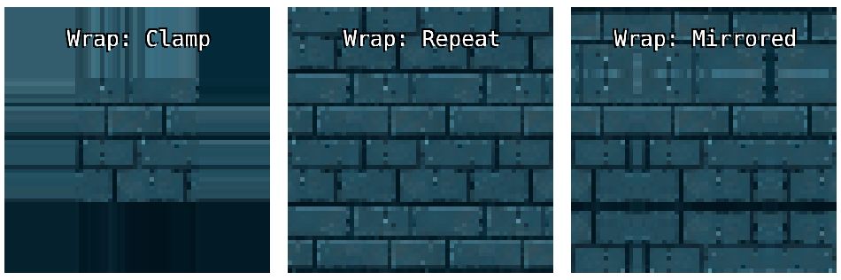
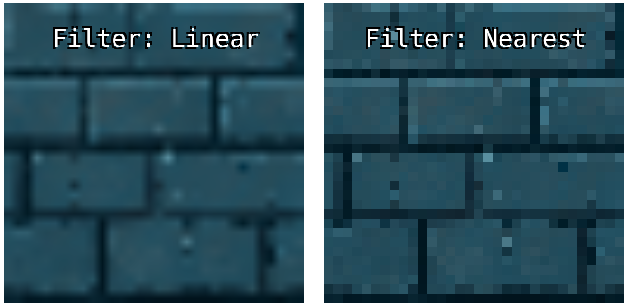

[Back To Table of Content](index.md)

# Gfx

<a name="Gfx"></a>

## Gfx
Gfx is the graphics manager. 
Everything related to rendering and managing your game canvas goes here.

To access the Graphics manager you use `Shaku.gfx`.

**Kind**: global class  

* [Gfx](#Gfx)
    * [new Gfx()](#new_Gfx_new)
    * [.webglVersion](#Gfx+webglVersion) ⇒ <code>Number</code>
    * [.batchSpritesCount](#Gfx+batchSpritesCount) ⇒ <code>Number</code>
    * [.maxLineSegments](#Gfx+maxLineSegments) ⇒ <code>Number</code>
    * [.canvas](#Gfx+canvas) ⇒ <code>HTMLCanvasElement</code>
    * [.Effect](#Gfx+Effect)
    * [.BasicEffect](#Gfx+BasicEffect)
    * [.MsdfFontEffect](#Gfx+MsdfFontEffect)
    * [.Sprite](#Gfx+Sprite)
    * [.SpritesGroup](#Gfx+SpritesGroup)
    * [.Matrix](#Gfx+Matrix)
    * [.Vertex](#Gfx+Vertex)
    * [.TextAlignments](#Gfx+TextAlignments)
    * ~~[.TextAlignment](#Gfx+TextAlignment)~~
    * [.BlendModes](#Gfx+BlendModes)
    * [.TextureWrapModes](#Gfx+TextureWrapModes)
    * [.TextureFilterModes](#Gfx+TextureFilterModes)
    * [.drawCallsCount](#Gfx+drawCallsCount) ⇒ <code>Number</code>
    * [.quadsDrawCount](#Gfx+quadsDrawCount) ⇒ <code>Number</code>
    * [.setContextAttributes(flags)](#Gfx+setContextAttributes)
    * [.setCanvas(element)](#Gfx+setCanvas)
    * [.createCamera(withViewport)](#Gfx+createCamera) ⇒ <code>Camera</code>
    * [.setCameraOrthographic(offset)](#Gfx+setCameraOrthographic) ⇒ <code>Camera</code>
    * [.createEffect(type)](#Gfx+createEffect) ⇒ <code>Effect</code>
    * [.maximizeCanvasSize(limitToParent, allowOddNumbers)](#Gfx+maximizeCanvasSize)
    * [.setRenderTarget(texture, [keepCamera])](#Gfx+setRenderTarget)
    * [.useEffect(effect)](#Gfx+useEffect)
    * [.setResolution(width, height, updateCanvasStyle)](#Gfx+setResolution)
    * [.resetCamera()](#Gfx+resetCamera)
    * [.applyCamera(camera)](#Gfx+applyCamera)
    * [.getRenderingRegion(includeOffset)](#Gfx+getRenderingRegion) ⇒ <code>Rectangle</code>
    * [.getRenderingSize()](#Gfx+getRenderingSize) ⇒ <code>Vector2</code>
    * [.getCanvasSize()](#Gfx+getCanvasSize) ⇒ <code>Vector2</code>
    * [.buildText(fontTexture, text, [fontSize], color, [alignment], [offset], [marginFactor])](#Gfx+buildText) ⇒ <code>SpritesGroup</code>
    * [.drawGroup(group, cullOutOfScreen)](#Gfx+drawGroup)
    * [.drawSprite(sprite)](#Gfx+drawSprite)
    * [.cover(texture, destRect, [sourceRect], color, [blendMode])](#Gfx+cover)
    * [.draw(texture, position, size, sourceRect, color, [blendMode], [rotation], [origin], [skew])](#Gfx+draw)
    * [.drawQuadFromVertices(texture, vertices, [blendMode])](#Gfx+drawQuadFromVertices)
    * [.fillRect(destRect, color, [blend], [rotation])](#Gfx+fillRect)
    * [.fillRects(destRects, colors, [blend], [rotation])](#Gfx+fillRects)
    * [.outlineRect(destRect, color, [blend], [rotation])](#Gfx+outlineRect)
    * [.outlineCircle(circle, color, [blend], [lineAmount])](#Gfx+outlineCircle)
    * [.fillCircle(circle, color, [blend], [lineAmount])](#Gfx+fillCircle)
    * [.fillCircles(circles, colors, [blend], [lineAmount])](#Gfx+fillCircles)
    * [.drawLine(startPoint, endPoint, color, [blendMode])](#Gfx+drawLine)
    * [.drawLinesStrip(points, colors, [blendMode], [looped])](#Gfx+drawLinesStrip)
    * [.drawLines(points, colors, [blendMode])](#Gfx+drawLines)
    * [.drawPoint(point, color, [blendMode])](#Gfx+drawPoint)
    * [.drawPoints(points, colors, [blendMode])](#Gfx+drawPoints)
    * [.centerCanvas()](#Gfx+centerCanvas)
    * [.inScreen(shape)](#Gfx+inScreen) ⇒ <code>Boolean</code>
    * [.centerCamera(position, useCanvasSize)](#Gfx+centerCamera)
    * [.clear([color])](#Gfx+clear)
    * [.clearDepth([value])](#Gfx+clearDepth)
    * [.presentBufferedData()](#Gfx+presentBufferedData)

<a name="new_Gfx_new"></a>

### new Gfx()
Create the manager.

<a name="Gfx+webglVersion"></a>

### gfx.webglVersion ⇒ <code>Number</code>
Get the init WebGL version.

**Kind**: instance property of [<code>Gfx</code>](#Gfx)  
**Returns**: <code>Number</code> - WebGL version number.  
<a name="Gfx+batchSpritesCount"></a>

### gfx.batchSpritesCount ⇒ <code>Number</code>
Get how many sprites we can draw in a single batch.

**Kind**: instance property of [<code>Gfx</code>](#Gfx)  
**Returns**: <code>Number</code> - batch max sprites count.  
<a name="Gfx+maxLineSegments"></a>

### gfx.maxLineSegments ⇒ <code>Number</code>
Maximum number of vertices we allow when drawing lines.

**Kind**: instance property of [<code>Gfx</code>](#Gfx)  
**Returns**: <code>Number</code> - max vertices per lines strip.  
<a name="Gfx+canvas"></a>

### gfx.canvas ⇒ <code>HTMLCanvasElement</code>
Get the canvas element controlled by the gfx manager.
If you didn't provide your own canvas before initialization, you must add this canvas to your document after initializing `Shaku`.

**Kind**: instance property of [<code>Gfx</code>](#Gfx)  
**Returns**: <code>HTMLCanvasElement</code> - Canvas we use for rendering.  
**Example**  
```js
document.body.appendChild(Shaku.gfx.canvas);
```
<a name="Gfx+Effect"></a>

### gfx.Effect
Get the Effect base class, which is required to implement custom effects.

**Kind**: instance property of [<code>Gfx</code>](#Gfx)  
**See**: Effect  
<a name="Gfx+BasicEffect"></a>

### gfx.BasicEffect
Get the default Effect class, which is required to implement custom effects that inherit and reuse parts from the default effect.

**Kind**: instance property of [<code>Gfx</code>](#Gfx)  
**See**: BasicEffect  
<a name="Gfx+MsdfFontEffect"></a>

### gfx.MsdfFontEffect
Get the Effect for rendering fonts with an MSDF texture.

**Kind**: instance property of [<code>Gfx</code>](#Gfx)  
**See**: MsdfFontEffect  
<a name="Gfx+Sprite"></a>

### gfx.Sprite
Get the sprite class.

**Kind**: instance property of [<code>Gfx</code>](#Gfx)  
**See**: Sprite  
<a name="Gfx+SpritesGroup"></a>

### gfx.SpritesGroup
Get the sprites group object.

**Kind**: instance property of [<code>Gfx</code>](#Gfx)  
**See**: SpritesGroup  
<a name="Gfx+Matrix"></a>

### gfx.Matrix
Get the matrix object.

**Kind**: instance property of [<code>Gfx</code>](#Gfx)  
**See**: Matrix  
<a name="Gfx+Vertex"></a>

### gfx.Vertex
Get the vertex object.

**Kind**: instance property of [<code>Gfx</code>](#Gfx)  
**See**: Vertex  
<a name="Gfx+TextAlignments"></a>

### gfx.TextAlignments
Get the text alignments options.
* Left: align text to the left.
* Right: align text to the right.
* Center: align text to center.

**Kind**: instance property of [<code>Gfx</code>](#Gfx)  
**See**: TextAlignments  
<a name="Gfx+TextAlignment"></a>

### ~~gfx.TextAlignment~~
***Deprecated***

Get the text alignments options.
This getter is deprecated, please use `TextAlignments` instead.
* Left: align text to the left.
* Right: align text to the right.
* Center: align text to center.

**Kind**: instance property of [<code>Gfx</code>](#Gfx)  
**See**: TextAlignments  
<a name="Gfx+BlendModes"></a>

### gfx.BlendModes
Get the blend modes enum.
* AlphaBlend
* Opaque
* Additive
* Multiply
* Subtract
* Screen
* Overlay
* Invert
* DestIn
* DestOut


**Kind**: instance property of [<code>Gfx</code>](#Gfx)  
**See**: BlendModes  
<a name="Gfx+TextureWrapModes"></a>

### gfx.TextureWrapModes
Get the wrap modes enum.
* Clamp: when uv position exceed texture boundaries it will be clamped to the nearest border, ie repeat the edge pixels.
* Repeat: when uv position exceed texture boundaries it will wrap back to the other side.
* RepeatMirrored: when uv position exceed texture boundaries it will wrap back to the other side but also mirror the texture.



**Kind**: instance property of [<code>Gfx</code>](#Gfx)  
**See**: TextureWrapModes  
<a name="Gfx+TextureFilterModes"></a>

### gfx.TextureFilterModes
Get texture filter modes.
* Nearest: no filtering, no mipmaps (pixelated).
* Linear: simple filtering, no mipmaps (smooth).
* NearestMipmapNearest: no filtering, sharp switching between mipmaps,
* LinearMipmapNearest: filtering, sharp switching between mipmaps.
* NearestMipmapLinear: no filtering, smooth transition between mipmaps.
* LinearMipmapLinear: filtering, smooth transition between mipmaps.



**Kind**: instance property of [<code>Gfx</code>](#Gfx)  
**See**: TextureFilterModes  
<a name="Gfx+drawCallsCount"></a>

### gfx.drawCallsCount ⇒ <code>Number</code>
Get number of actual WebGL draw calls we performed since the beginning of the frame.

**Kind**: instance property of [<code>Gfx</code>](#Gfx)  
**Returns**: <code>Number</code> - Number of WebGL draw calls this frame.  
<a name="Gfx+quadsDrawCount"></a>

### gfx.quadsDrawCount ⇒ <code>Number</code>
Get number of textured / colored quads we drawn since the beginning of the frame.

**Kind**: instance property of [<code>Gfx</code>](#Gfx)  
**Returns**: <code>Number</code> - Number of quads drawn in this frame..  
<a name="Gfx+setContextAttributes"></a>

### gfx.setContextAttributes(flags)
Set WebGL init flags (passed as additional params to the getContext() call). 
You must call this *before* initializing *Shaku*.

By default, *Shaku* will init WebGL context with the following flags:
- antialias: true.
- alpha: true.
- depth: false.
- premultipliedAlpha: true.
- desynchronized: false.

**Kind**: instance method of [<code>Gfx</code>](#Gfx)  

| Param | Type | Description |
| --- | --- | --- |
| flags | <code>Dictionary</code> | WebGL init flags to set. |

**Example**  
```js
Shaku.gfx.setContextAttributes({ antialias: true, alpha: false });
```
<a name="Gfx+setCanvas"></a>

### gfx.setCanvas(element)
Set the canvas element to initialize on.
You must call this *before* initializing Shaku. Calling this will prevent Shaku from creating its own canvas.

**Kind**: instance method of [<code>Gfx</code>](#Gfx)  

| Param | Type | Description |
| --- | --- | --- |
| element | <code>HTMLCanvasElement</code> | Canvas element to initialize on. |

**Example**  
```js
Shaku.gfx.setCanvas(document.getElementById('my-canvas')); 
```
<a name="Gfx+createCamera"></a>

### gfx.createCamera(withViewport) ⇒ <code>Camera</code>
Create and return a new camera instance.

**Kind**: instance method of [<code>Gfx</code>](#Gfx)  
**Returns**: <code>Camera</code> - New camera object.  

| Param | Type | Description |
| --- | --- | --- |
| withViewport | <code>Boolean</code> | If true, will create camera with viewport value equal to canvas' size. |

<a name="Gfx+setCameraOrthographic"></a>

### gfx.setCameraOrthographic(offset) ⇒ <code>Camera</code>
Set default orthographic camera from offset.

**Kind**: instance method of [<code>Gfx</code>](#Gfx)  
**Returns**: <code>Camera</code> - Camera instance.  

| Param | Type | Description |
| --- | --- | --- |
| offset | <code>Vector2</code> | Camera top-left corner. |

<a name="Gfx+createEffect"></a>

### gfx.createEffect(type) ⇒ <code>Effect</code>
Create and return an effect instance.

**Kind**: instance method of [<code>Gfx</code>](#Gfx)  
**Returns**: <code>Effect</code> - Effect instance.  
**See**: Effect  

| Param | Type | Description |
| --- | --- | --- |
| type | <code>Class</code> | Effect class type. Must inherit from Effect base class. |

<a name="Gfx+maximizeCanvasSize"></a>

### gfx.maximizeCanvasSize(limitToParent, allowOddNumbers)
Set resolution and canvas to the max size of its parent element or screen.
If the canvas is directly under document body, it will take the max size of the page.

**Kind**: instance method of [<code>Gfx</code>](#Gfx)  

| Param | Type | Description |
| --- | --- | --- |
| limitToParent | <code>Boolean</code> | if true, will use parent element size. If false, will stretch on entire document. |
| allowOddNumbers | <code>Boolean</code> | if true, will permit odd numbers, which could lead to small artefacts when drawing pixel art. If false (default) will round to even numbers. |

<a name="Gfx+setRenderTarget"></a>

### gfx.setRenderTarget(texture, [keepCamera])
Set a render target (texture) to render on.

**Kind**: instance method of [<code>Gfx</code>](#Gfx)  

| Param | Type | Description |
| --- | --- | --- |
| texture | <code>TextureAsset</code> \| <code>Array.&lt;TextureAsset&gt;</code> \| <code>null</code> | Render target texture to set as render target, or null to reset and render back on canvas. Can also be array for multiple targets, which will take layouts 0-15 by their order. |
| [keepCamera] | <code>Boolean</code> | If true, will keep current camera settings. If false (default) will reset camera. |

**Example**  
```js
// create render target
let renderTarget = await Shaku.assets.createRenderTarget('_my_render_target', 800, 600);

// use render target
Shaku.gfx.setRenderTarget(renderTarget);
// .. draw some stuff here

// reset render target and present it on screen
// note the negative height - render targets end up with flipped Y axis
Shaku.gfx.setRenderTarget(null);
Shaku.gfx.draw(renderTarget, new Shaku.utils.Vector2(screenX / 2, screenY / 2), new Shaku.utils.Vector2(screenX, -screenY));
```
<a name="Gfx+useEffect"></a>

### gfx.useEffect(effect)
Set effect to use for future draw calls.

**Kind**: instance method of [<code>Gfx</code>](#Gfx)  

| Param | Type | Description |
| --- | --- | --- |
| effect | <code>Effect</code> \| <code>null</code> | Effect to use or null to use the basic builtin effect. |

**Example**  
```js
let effect = Shaku.gfx.createEffect(MyEffectType);
Shaku.gfx.useEffect(effect);
```
<a name="Gfx+setResolution"></a>

### gfx.setResolution(width, height, updateCanvasStyle)
Set resolution and canvas size.

**Kind**: instance method of [<code>Gfx</code>](#Gfx)  

| Param | Type | Description |
| --- | --- | --- |
| width | <code>Number</code> | Resolution width. |
| height | <code>Number</code> | Resolution height. |
| updateCanvasStyle | <code>Boolean</code> | If true, will also update the canvas *css* size in pixels. |

**Example**  
```js
// set resolution and size of 800x600.
Shaku.gfx.setResolution(800, 600, true);
```
<a name="Gfx+resetCamera"></a>

### gfx.resetCamera()
Reset camera properties to default camera.

**Kind**: instance method of [<code>Gfx</code>](#Gfx)  
<a name="Gfx+applyCamera"></a>

### gfx.applyCamera(camera)
Set viewport, projection and other properties from a camera instance.
Changing the camera properties after calling this method will *not* update the renderer, until you call applyCamera again.

**Kind**: instance method of [<code>Gfx</code>](#Gfx)  

| Param | Type | Description |
| --- | --- | --- |
| camera | <code>Camera</code> | Camera to apply. |

<a name="Gfx+getRenderingRegion"></a>

### gfx.getRenderingRegion(includeOffset) ⇒ <code>Rectangle</code>
Get current rendering region.

**Kind**: instance method of [<code>Gfx</code>](#Gfx)  
**Returns**: <code>Rectangle</code> - Rectangle with rendering region.  

| Param | Type | Description |
| --- | --- | --- |
| includeOffset | <code>Boolean</code> | If true (default) will include viewport offset, if exists. |

<a name="Gfx+getRenderingSize"></a>

### gfx.getRenderingSize() ⇒ <code>Vector2</code>
Get current rendering size.
Unlike 'canvasSize', this takes viewport and render target into consideration.

**Kind**: instance method of [<code>Gfx</code>](#Gfx)  
**Returns**: <code>Vector2</code> - rendering size.  
<a name="Gfx+getCanvasSize"></a>

### gfx.getCanvasSize() ⇒ <code>Vector2</code>
Get canvas size as vector.

**Kind**: instance method of [<code>Gfx</code>](#Gfx)  
**Returns**: <code>Vector2</code> - Canvas size.  
<a name="Gfx+buildText"></a>

### gfx.buildText(fontTexture, text, [fontSize], color, [alignment], [offset], [marginFactor]) ⇒ <code>SpritesGroup</code>
Generate a sprites group to render a string using a font texture.
Take the result of this method and use with gfx.drawGroup() to render the text.
This is what you use when you want to draw texts with `Shaku`.
Note: its best to always draw texts with *batching* enabled.

**Kind**: instance method of [<code>Gfx</code>](#Gfx)  
**Returns**: <code>SpritesGroup</code> - Sprites group containing the needed sprites to draw the given text with its properties.  

| Param | Type | Description |
| --- | --- | --- |
| fontTexture | <code>FontTextureAsset</code> | Font texture asset to use. |
| text | <code>String</code> | Text to generate sprites for. |
| [fontSize] | <code>Number</code> | Font size, or undefined to use font texture base size. |
| color | <code>Color</code> \| <code>Array.&lt;Color&gt;&#x3D;</code> | Text sprites color. If array is set, will assign each color to different vertex, starting from top-left. |
| [alignment] | <code>TextAlignment</code> | Text alignment. |
| [offset] | <code>Vector2</code> | Optional starting offset. |
| [marginFactor] | <code>Vector2</code> | Optional factor for characters and line spacing. For example value of 2,1 will make double horizontal spacing. |

**Example**  
```js
// load font texture
let fontTexture = await Shaku.assets.loadFontTexture('assets/DejaVuSansMono.ttf', {fontName: 'DejaVuSansMono'});

// generate 'hello world!' text (note: you don't have to regenerate every frame if text didn't change)
let text1 = Shaku.gfx.buildText(fontTexture, "Hello World!");
text1.position.set(40, 40);

// draw text
Shaku.gfx.drawGroup(text1, true);
```
<a name="Gfx+drawGroup"></a>

### gfx.drawGroup(group, cullOutOfScreen)
Draw a SpritesGroup object. 
A SpritesGroup is a collection of sprites we can draw in bulks with transformations to apply on the entire group.

**Kind**: instance method of [<code>Gfx</code>](#Gfx)  

| Param | Type | Description |
| --- | --- | --- |
| group | <code>SpritesGroup</code> | Sprites group to draw. |
| cullOutOfScreen | <code>Boolean</code> | If true and in batching mode, will cull automatically any quad that is completely out of screen. |

**Example**  
```js
// load texture
let texture = await Shaku.assets.loadTexture('assets/sprite.png');

// create group and set entire group's position and scale
let group = new Shaku.gfx.SpritesGroup();
group.position.set(125, 300);
group.scale.set(2, 2);

// create 5 sprites and add to group
for (let i = 0; i < 5; ++i) {
  let sprite = new Shaku.gfx.Sprite(texture);
  sprite.position.set(100 * i, 150);
  sprite.size.set(50, 50);
  group.add(sprite)
}

// draw the group with automatic culling of invisible sprites
Shaku.gfx.drawGroup(group, true);
```
<a name="Gfx+drawSprite"></a>

### gfx.drawSprite(sprite)
Draw a single sprite object.
Sprites are optional objects that store all the parameters for a `draw()` call. They are also used for batch rendering.

**Kind**: instance method of [<code>Gfx</code>](#Gfx)  

| Param | Type | Description |
| --- | --- | --- |
| sprite | <code>Sprite</code> | Sprite object to draw. |

**Example**  
```js
// load texture and create sprite
let texture = await Shaku.assets.loadTexture('assets/sprite.png');
let sprite = new Shaku.gfx.Sprite(texture);

// set position and size
sprite.position.set(100, 150);
sprite.size.set(50, 50);

// draw sprite
Shaku.gfx.drawSprite(sprite);
```
<a name="Gfx+cover"></a>

### gfx.cover(texture, destRect, [sourceRect], color, [blendMode])
Draw a texture to cover a given destination rectangle.

**Kind**: instance method of [<code>Gfx</code>](#Gfx)  

| Param | Type | Description |
| --- | --- | --- |
| texture | <code>TextureAsset</code> | Texture to draw. |
| destRect | <code>Rectangle</code> \| <code>Vector2</code> | Destination rectangle to draw on. If vector is provided, will draw from 0,0 with vector as size. |
| [sourceRect] | <code>Rectangle</code> | Source rectangle, or undefined to use the entire texture. |
| color | <code>Color</code> \| <code>Array.&lt;Color&gt;</code> \| <code>undefined</code> | Tint color, or undefined to not change color. If array is set, will assign each color to different vertex, starting from top-left. |
| [blendMode] | <code>BlendMode</code> | Blend mode, or undefined to use alpha blend. |

**Example**  
```js
// cover the entire screen with an image
let texture = await Shaku.assets.loadTexture('assets/sprite.png');
Shaku.gfx.cover(texture, Shaku.gfx.getRenderingRegion());
```
**Example**  
```js
// draw with additional params
let sourceRect = new Shaku.utils.Rectangle(0, 0, 64, 64);
let color = Shaku.utils.Color.blue;
let blendMode = Shaku.gfx.BlendModes.Multiply;
let rotation = Math.PI / 4;
let origin = new Shaku.utils.Vector2(0.5, 0.5);
Shaku.gfx.draw(texture, position, size, sourceRect, color, blendMode, rotation, origin);
```
<a name="Gfx+draw"></a>

### gfx.draw(texture, position, size, sourceRect, color, [blendMode], [rotation], [origin], [skew])
Draw a texture.

**Kind**: instance method of [<code>Gfx</code>](#Gfx)  

| Param | Type | Description |
| --- | --- | --- |
| texture | <code>TextureAsset</code> | Texture to draw. |
| position | <code>Vector2</code> \| <code>Vector3</code> | Drawing position (at origin). If vector3 is provided, will pass z value to the shader code position attribute. |
| size | <code>Vector2</code> \| <code>Vector3</code> \| <code>Number</code> | Drawing size. If vector3 is provided, will pass z value to the shader code position attribute for the bottom vertices, as position.z + size.z. |
| sourceRect | <code>Rectangle</code> | Source rectangle, or undefined to use the entire texture. |
| color | <code>Color</code> \| <code>Array.&lt;Color&gt;</code> \| <code>undefined</code> | Tint color, or undefined to not change color. If array is set, will assign each color to different vertex, starting from top-left. |
| [blendMode] | <code>BlendMode</code> | Blend mode, or undefined to use alpha blend. |
| [rotation] | <code>Number</code> | Rotate sprite. |
| [origin] | <code>Vector2</code> | Drawing origin. This will be the point at 'position' and rotation origin. |
| [skew] | <code>Vector2</code> | Skew the drawing corners on X and Y axis, around the origin point. |

**Example**  
```js
// a simple draw with position and size
let texture = await Shaku.assets.loadTexture('assets/sprite.png');
let position = new Shaku.utils.Vector2(100, 100);
let size = new Shaku.utils.Vector2(75, 125); // if width == height, you can pass as a number instead of vector
Shaku.gfx.draw(texture, position, size);
```
**Example**  
```js
// draw with additional params
let sourceRect = new Shaku.utils.Rectangle(0, 0, 64, 64);
let color = Shaku.utils.Color.blue;
let blendMode = Shaku.gfx.BlendModes.Multiply;
let rotation = Math.PI / 4;
let origin = new Shaku.utils.Vector2(0.5, 0.5);
Shaku.gfx.draw(texture, position, size, sourceRect, color, blendMode, rotation, origin);
```
<a name="Gfx+drawQuadFromVertices"></a>

### gfx.drawQuadFromVertices(texture, vertices, [blendMode])
Draw a textured quad from vertices.

**Kind**: instance method of [<code>Gfx</code>](#Gfx)  

| Param | Type | Description |
| --- | --- | --- |
| texture | <code>TextureAsset</code> | Texture to draw. |
| vertices | <code>Array.&lt;Vertex&gt;</code> | Quad vertices to draw (should be: top-left, top-right, bottom-left, bottom-right). |
| [blendMode] | <code>BlendMode</code> | Blend mode to set. |

<a name="Gfx+fillRect"></a>

### gfx.fillRect(destRect, color, [blend], [rotation])
Draw a filled colored rectangle.

**Kind**: instance method of [<code>Gfx</code>](#Gfx)  

| Param | Type | Description |
| --- | --- | --- |
| destRect | <code>Rectangle</code> | Rectangle to fill. |
| color | <code>Color</code> \| <code>Array.&lt;Color&gt;</code> | Rectangle fill color. |
| [blend] | <code>BlendMode</code> | Blend mode. |
| [rotation] | <code>Number</code> | Rotate the rectangle around its center. |

**Example**  
```js
// draw a 50x50 red rectangle at position 100x100, that will rotate over time
Shaku.gfx.fillRect(new Shaku.utils.Rectangle(100, 100, 50, 50), Shaku.utils.Color.red, null, Shaku.gameTime.elapsed);
```
<a name="Gfx+fillRects"></a>

### gfx.fillRects(destRects, colors, [blend], [rotation])
Draw a list of filled colored rectangles as a batch.

**Kind**: instance method of [<code>Gfx</code>](#Gfx)  

| Param | Type | Description |
| --- | --- | --- |
| destRects | <code>Array.&lt;Rectangle&gt;</code> | Rectangles to fill. |
| colors | <code>Array.&lt;Color&gt;</code> \| <code>Color</code> | Rectangles fill color. If array is set, will assign each color to different vertex, starting from top-left. |
| [blend] | <code>BlendMode</code> | Blend mode. |
| [rotation] | <code>Array.&lt;Number&gt;</code> \| <code>Number</code> | Rotate the rectangles around its center. |

**Example**  
```js
// draw a 50x50 red rectangle at position 100x100, that will rotate over time
Shaku.gfx.fillRects([new Shaku.utils.Rectangle(100, 100, 50, 50), new Shaku.utils.Rectangle(150, 150, 25, 25)], Shaku.utils.Color.red, null, Shaku.gameTime.elapsed);
```
<a name="Gfx+outlineRect"></a>

### gfx.outlineRect(destRect, color, [blend], [rotation])
Draw an outline colored rectangle.

**Kind**: instance method of [<code>Gfx</code>](#Gfx)  

| Param | Type | Description |
| --- | --- | --- |
| destRect | <code>Rectangle</code> | Rectangle to draw outline for. |
| color | <code>Color</code> | Rectangle outline color. |
| [blend] | <code>BlendMode</code> | Blend mode. |
| [rotation] | <code>Number</code> | Rotate the rectangle around its center. |

**Example**  
```js
// draw a 50x50 red rectangle at position 100x100, that will rotate over time
Shaku.gfx.outlineRect(new Shaku.utils.Rectangle(100, 100, 50, 50), Shaku.utils.Color.red, null, Shaku.gameTime.elapsed);
```
<a name="Gfx+outlineCircle"></a>

### gfx.outlineCircle(circle, color, [blend], [lineAmount])
Draw an outline colored circle.

**Kind**: instance method of [<code>Gfx</code>](#Gfx)  

| Param | Type | Description |
| --- | --- | --- |
| circle | <code>Circle</code> | Circle to draw. |
| color | <code>Color</code> | Circle outline color. |
| [blend] | <code>BlendMode</code> | Blend mode. |
| [lineAmount] | <code>Number</code> | How many lines to compose the circle from (bigger number = smoother circle). |

**Example**  
```js
// draw a circle at 50x50 with radius of 85
Shaku.gfx.outlineCircle(new Shaku.utils.Circle(new Shaku.utils.Vector2(50, 50), 85), Shaku.utils.Color.red);
```
<a name="Gfx+fillCircle"></a>

### gfx.fillCircle(circle, color, [blend], [lineAmount])
Draw a filled colored circle.

**Kind**: instance method of [<code>Gfx</code>](#Gfx)  

| Param | Type | Description |
| --- | --- | --- |
| circle | <code>Circle</code> | Circle to draw. |
| color | <code>Color</code> | Circle fill color. |
| [blend] | <code>BlendMode</code> | Blend mode. |
| [lineAmount] | <code>Number</code> | How many lines to compose the circle from (bigger number = smoother circle). |

**Example**  
```js
// draw a filled circle at 50x50 with radius of 85
Shaku.gfx.fillCircle(new Shaku.utils.Circle(new Shaku.utils.Vector2(50, 50), 85), Shaku.utils.Color.red);
```
<a name="Gfx+fillCircles"></a>

### gfx.fillCircles(circles, colors, [blend], [lineAmount])
Draw a list of filled colored circles using batches.

**Kind**: instance method of [<code>Gfx</code>](#Gfx)  

| Param | Type | Description |
| --- | --- | --- |
| circles | <code>Array.&lt;Circle&gt;</code> | Circles list to draw. |
| colors | <code>Color</code> \| <code>Array.&lt;Color&gt;</code> | Circles fill color or a single color for all circles. |
| [blend] | <code>BlendMode</code> | Blend mode. |
| [lineAmount] | <code>Number</code> | How many lines to compose the circle from (bigger number = smoother circle). |

**Example**  
```js
// draw a filled circle at 50x50 with radius of 85
Shaku.gfx.fillCircles([new Shaku.utils.Circle(new Shaku.utils.Vector2(50, 50), 85), new Shaku.utils.Circle(new Shaku.utils.Vector2(150, 125), 35)], Shaku.utils.Color.red);
```
<a name="Gfx+drawLine"></a>

### gfx.drawLine(startPoint, endPoint, color, [blendMode])
Draw a single line between two points.

**Kind**: instance method of [<code>Gfx</code>](#Gfx)  

| Param | Type | Description |
| --- | --- | --- |
| startPoint | <code>Vector2</code> | Line start point. |
| endPoint | <code>Vector2</code> | Line end point. |
| color | <code>Color</code> | Line color. |
| [blendMode] | <code>BlendMode</code> | Blend mode to draw lines with (default to Opaque). |

**Example**  
```js
Shaku.gfx.drawLine(new Shaku.utils.Vector2(50,50), new Shaku.utils.Vector2(150,50), Shaku.utils.Color.red);
```
<a name="Gfx+drawLinesStrip"></a>

### gfx.drawLinesStrip(points, colors, [blendMode], [looped])
Draw a strip of lines between an array of points.

**Kind**: instance method of [<code>Gfx</code>](#Gfx)  

| Param | Type | Description |
| --- | --- | --- |
| points | <code>Array.&lt;Vector2&gt;</code> | Points to draw line between. |
| colors | <code>Color</code> \| <code>Array.&lt;Color&gt;</code> | Single lines color if you want one color for all lines, or an array of colors per segment. |
| [blendMode] | <code>BlendMode</code> | Blend mode to draw lines with (default to Opaque). |
| [looped] | <code>Boolean</code> | If true, will also draw a line from last point back to first point. |

**Example**  
```js
let lines = [new Shaku.utils.Vector2(50,50), new Shaku.utils.Vector2(150,50), new Shaku.utils.Vector2(150,150)];
let colors = [Shaku.utils.Color.random(), Shaku.utils.Color.random(), Shaku.utils.Color.random()];
Shaku.gfx.drawLinesStrip(lines, colors);
```
<a name="Gfx+drawLines"></a>

### gfx.drawLines(points, colors, [blendMode])
Draw a list of lines from an array of points.

**Kind**: instance method of [<code>Gfx</code>](#Gfx)  

| Param | Type | Description |
| --- | --- | --- |
| points | <code>Array.&lt;Vector2&gt;</code> | Points to draw line between. |
| colors | <code>Color</code> \| <code>Array.&lt;Color&gt;</code> | Single lines color if you want one color for all lines, or an array of colors per segment. |
| [blendMode] | <code>BlendMode</code> | Blend mode to draw lines with (default to Opaque). |

**Example**  
```js
let lines = [new Shaku.utils.Vector2(50,50), new Shaku.utils.Vector2(150,50), new Shaku.utils.Vector2(150,150)];
let colors = [Shaku.utils.Color.random(), Shaku.utils.Color.random(), Shaku.utils.Color.random()];
Shaku.gfx.drawLines(lines, colors);
```
<a name="Gfx+drawPoint"></a>

### gfx.drawPoint(point, color, [blendMode])
Draw a single point from vector.

**Kind**: instance method of [<code>Gfx</code>](#Gfx)  

| Param | Type | Description |
| --- | --- | --- |
| point | <code>Vector2</code> | Point to draw. |
| color | <code>Color</code> | Point color. |
| [blendMode] | <code>BlendMode</code> | Blend mode to draw point with (default to Opaque). |

**Example**  
```js
Shaku.gfx.drawPoint(new Shaku.utils.Vector2(50,50), Shaku.utils.Color.random());
```
<a name="Gfx+drawPoints"></a>

### gfx.drawPoints(points, colors, [blendMode])
Draw a list of points from an array of vectors.

**Kind**: instance method of [<code>Gfx</code>](#Gfx)  

| Param | Type | Description |
| --- | --- | --- |
| points | <code>Array.&lt;Vector2&gt;</code> | Points to draw. |
| colors | <code>Color</code> \| <code>Array.&lt;Color&gt;</code> | Single color if you want one color for all points, or an array of colors per point. |
| [blendMode] | <code>BlendMode</code> | Blend mode to draw points with (default to Opaque). |

**Example**  
```js
let points = [new Shaku.utils.Vector2(50,50), new Shaku.utils.Vector2(150,50), new Shaku.utils.Vector2(150,150)];
let colors = [Shaku.utils.Color.random(), Shaku.utils.Color.random(), Shaku.utils.Color.random()];
Shaku.gfx.drawPoints(points, colors);
```
<a name="Gfx+centerCanvas"></a>

### gfx.centerCanvas()
Make the renderer canvas centered.

**Kind**: instance method of [<code>Gfx</code>](#Gfx)  
<a name="Gfx+inScreen"></a>

### gfx.inScreen(shape) ⇒ <code>Boolean</code>
Check if a given shape is currently in screen bounds, not taking camera into consideration.

**Kind**: instance method of [<code>Gfx</code>](#Gfx)  
**Returns**: <code>Boolean</code> - True if given shape is in visible region.  

| Param | Type | Description |
| --- | --- | --- |
| shape | <code>Circle</code> \| <code>Vector</code> \| <code>Rectangle</code> \| <code>Line</code> | Shape to check. |

<a name="Gfx+centerCamera"></a>

### gfx.centerCamera(position, useCanvasSize)
Make a given vector the center of the camera.

**Kind**: instance method of [<code>Gfx</code>](#Gfx)  

| Param | Type | Description |
| --- | --- | --- |
| position | <code>Vector2</code> | Camera position. |
| useCanvasSize | <code>Boolean</code> | If true, will always use cancas size when calculating center. If false and render target is set, will use render target's size. |

<a name="Gfx+clear"></a>

### gfx.clear([color])
Clear screen to a given color.

**Kind**: instance method of [<code>Gfx</code>](#Gfx)  

| Param | Type | Description |
| --- | --- | --- |
| [color] | <code>Color</code> | Color to clear screen to, or black if not set. |

**Example**  
```js
Shaku.gfx.clear(Shaku.utils.Color.cornflowerblue);
```
<a name="Gfx+clearDepth"></a>

### gfx.clearDepth([value])
Clear depth buffer.
Only relevant when depth is used.

**Kind**: instance method of [<code>Gfx</code>](#Gfx)  

| Param | Type | Description |
| --- | --- | --- |
| [value] | <code>Number</code> | Value to clear depth buffer to. |

<a name="Gfx+presentBufferedData"></a>

### gfx.presentBufferedData()
Present all currently buffered data.

**Kind**: instance method of [<code>Gfx</code>](#Gfx)  
