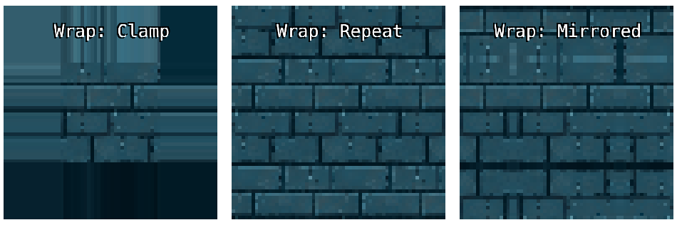

[Back To Table of Content](index.md)

# Shaku

## Classes

<dl>
<dt><a href="#Asset">Asset</a></dt>
<dd><p>A loadable asset base class.
All asset types inherit from this.</p>
</dd>
<dt><a href="#Assets">Assets</a></dt>
<dd><p>Assets manager class.
Used to create, load and cache game assets, which includes textures, audio files, JSON objects, etc.
As a rule of thumb, all methods to load or create assets are async and return a promise.</p>
<p>To access the Assets manager you use <code>Shaku.assets</code>.</p>
</dd>
<dt><a href="#BinaryAsset">BinaryAsset</a></dt>
<dd><p>A loadable binary data asset.
This asset type loads array of bytes from a remote file.</p>
</dd>
<dt><a href="#FontTextureAsset">FontTextureAsset</a></dt>
<dd><p>A font texture asset, dynamically generated from loaded font and canvas.
This asset type creates an atlas of all the font&#39;s characters as textures, so we can later render them as sprites.</p>
</dd>
<dt><a href="#JsonAsset">JsonAsset</a></dt>
<dd><p>A loadable json asset.
This asset type loads JSON from a remote file.</p>
</dd>
<dt><a href="#MsdfFontTextureAsset">MsdfFontTextureAsset</a></dt>
<dd><p>A MSDF font texture asset, from a pregenerated msdf texture atlas (from msdf-bmfont-xml, for example).
This asset uses a signed distance field atlas to render characters as sprites at high res.</p>
</dd>
<dt><a href="#SoundAsset">SoundAsset</a></dt>
<dd><p>A loadable sound asset.
This is the asset type you use to play sounds.</p>
</dd>
<dt><a href="#TextureAsset">TextureAsset</a></dt>
<dd><p>A loadable texture asset.
This asset type loads an image from URL or source, and turn it into a texture.</p>
</dd>
<dt><a href="#TextureAssetBase">TextureAssetBase</a></dt>
<dd><p>Base type for all texture asset types.</p>
</dd>
<dt><a href="#TextureAtlasAsset">TextureAtlasAsset</a></dt>
<dd><p>A texture atlas we can build at runtime to combine together multiple textures.</p>
</dd>
<dt><a href="#TextureInAtlasAsset">TextureInAtlasAsset</a></dt>
<dd><p>A texture that is part of a texture atlas.
Stores a texture that was generated by the texture atlas + the source rectangle in texture for this segment.</p>
</dd>
<dt><a href="#Collision">Collision</a></dt>
<dd><p>Collision is the collision manager. 
It provides basic 2d collision detection functionality.
Note: this is <em>not</em> a physics engine, its only for detection and objects picking.</p>
<p>To access the Collision manager you use <code>Shaku.collision</code>.</p>
</dd>
<dt><a href="#CollisionWorld">CollisionWorld</a></dt>
<dd><p>A collision world is a set of collision shapes that interact with each other.
You can use different collision worlds to represent different levels or different parts of your game world.</p>
</dd>
<dt><a href="#CollisionResolver">CollisionResolver</a></dt>
<dd><p>The collision resolver is responsible to implement collision detection between pair of shapes of same or different types.</p>
</dd>
<dt><a href="#CollisionTestResult">CollisionTestResult</a></dt>
<dd><p>Collision detection result.</p>
</dd>
<dt><a href="#CircleShape">CircleShape</a></dt>
<dd><p>Collision circle class.</p>
</dd>
<dt><a href="#LinesShape">LinesShape</a></dt>
<dd><p>Collision lines class.
This shape is made of one line or more.</p>
</dd>
<dt><a href="#PointShape">PointShape</a></dt>
<dd><p>Collision point class.</p>
</dd>
<dt><a href="#RectangleShape">RectangleShape</a></dt>
<dd><p>Collision rectangle class.</p>
</dd>
<dt><a href="#CollisionShape">CollisionShape</a></dt>
<dd><p>Collision shape base class.</p>
</dd>
<dt><a href="#TilemapShape">TilemapShape</a></dt>
<dd><p>Collision tilemap class.
A collision tilemap shape is a grid of equal-sized cells that can either block or not (+ have collision flags).
Its the most efficient (both memory and CPU) way to implement grid based / tilemap collision.</p>
</dd>
<dt><a href="#Camera">Camera</a></dt>
<dd><p>Implements a Camera object.</p>
</dd>
<dt><a href="#Camera3D">Camera3D</a></dt>
<dd><p>Implements a 3d Camera object.</p>
</dd>
<dt><a href="#DrawBatch">DrawBatch</a></dt>
<dd><p>Base class for a drawing batch, used to draw a collection of sprites or shapes.</p>
</dd>
<dt><a href="#LinesBatch">LinesBatch</a></dt>
<dd><p>Colored lines renderer. 
Responsible to drawing a batch of line segments or strips.</p>
</dd>
<dt><a href="#ShapesBatch">ShapesBatch</a></dt>
<dd><p>Colored shapes renderer. 
Responsible to drawing a batch of basic geometric shapes with as little draw calls as possible.</p>
</dd>
<dt><a href="#SpriteBatch">SpriteBatch</a></dt>
<dd><p>Sprite batch renderer. 
Responsible to drawing a batch of sprites with as little draw calls as possible.</p>
</dd>
<dt><a href="#SpriteBatch3D">SpriteBatch3D</a></dt>
<dd><p>3D Sprites batch renderer. 
Responsible to drawing 3D quads with textures on them.</p>
</dd>
<dt><a href="#SpriteBatchBase">SpriteBatchBase</a></dt>
<dd><p>Base class for sprite-based rendering, ie vertices with textures.</p>
</dd>
<dt><a href="#TextSpriteBatch">TextSpriteBatch</a></dt>
<dd><p>Text sprite batch renderer.
Responsible to drawing a batch of characters sprites.</p>
</dd>
<dt><a href="#Effect">Effect</a></dt>
<dd><p>Effect base class.
An effect = vertex shader + fragment shader + uniforms &amp; attributes + setup code.</p>
</dd>
<dt><a href="#MsdfFontEffect">MsdfFontEffect</a></dt>
<dd><p>Default effect to draw MSDF font textures.</p>
</dd>
<dt><a href="#ShapesEffect">ShapesEffect</a></dt>
<dd><p>Default basic effect to draw 2d shapes.</p>
</dd>
<dt><a href="#SpritesEffect">SpritesEffect</a></dt>
<dd><p>Default basic effect to draw 2d sprites.</p>
</dd>
<dt><a href="#Sprites3dEffect">Sprites3dEffect</a></dt>
<dd><p>Default basic effect to draw 2d sprites.</p>
</dd>
<dt><a href="#SpritesEffectNoVertexColor">SpritesEffectNoVertexColor</a></dt>
<dd><p>Default basic effect to draw 2d sprites without vertex color.</p>
</dd>
<dt><a href="#SpritesWithOutlineEffect">SpritesWithOutlineEffect</a></dt>
<dd><p>Default basic effect to draw 2d sprites with outline.</p>
</dd>
<dt><a href="#Gfx">Gfx</a></dt>
<dd><p>Gfx is the graphics manager. 
Everything related to rendering and managing your game canvas goes here.</p>
<p>To access the Graphics manager you use <code>Shaku.gfx</code>.</p>
</dd>
<dt><a href="#Sprite">Sprite</a></dt>
<dd><p>Sprite class.</p>
</dd>
<dt><a href="#SpritesGroup">SpritesGroup</a></dt>
<dd><p>Sprites group class.
This object is a container to hold sprites collection + parent transformations.
You need SpritesGroup to use batched rendering.</p>
</dd>
<dt><a href="#Vertex">Vertex</a></dt>
<dd><p>A vertex we can push to sprite batch.</p>
</dd>
<dt><a href="#Gamepad">Gamepad</a></dt>
<dd><p>Gamepad data object.
This object represents a snapshot of a gamepad state, it does not update automatically.</p>
</dd>
<dt><a href="#FourButtonsCluster">FourButtonsCluster</a></dt>
<dd><p>Buttons cluster container - 4 buttons.</p>
</dd>
<dt><a href="#ThreeButtonsCluster">ThreeButtonsCluster</a></dt>
<dd><p>Buttons cluster container - 3 buttons.</p>
</dd>
<dt><a href="#FrontButtons">FrontButtons</a></dt>
<dd><p>Front buttons.</p>
</dd>
<dt><a href="#Input">Input</a></dt>
<dd><p>Input manager. 
Used to recieve input from keyboard and mouse.</p>
<p>To access the Input manager use <code>Shaku.input</code>.</p>
</dd>
<dt><a href="#Logger">Logger</a></dt>
<dd><p>A logger manager.
By default writes logs to console.</p>
</dd>
<dt><a href="#IManager">IManager</a></dt>
<dd><p>Interface for any manager.
Manager = manages a domain in Shaku, such as gfx (graphics), sfx (sounds), input, etc.</p>
</dd>
<dt><a href="#Sfx">Sfx</a></dt>
<dd><p>Sfx manager. 
Used to play sound effects and music.</p>
<p>To access the Sfx manager use <code>Shaku.sfx</code>.</p>
</dd>
<dt><a href="#SoundInstance">SoundInstance</a></dt>
<dd><p>A sound effect instance you can play and stop.</p>
</dd>
<dt><a href="#SoundMixer">SoundMixer</a></dt>
<dd><p>A utility class to mix between two sounds.</p>
</dd>
<dt><a href="#Shaku">Shaku</a></dt>
<dd><p>Shaku&#39;s main object.
This object wraps the entire lib namespace, and this is what you use to access all managers and manage your main loop.</p>
</dd>
<dt><a href="#Animator">Animator</a></dt>
<dd><p>Implement an animator object that change values over time using Linear Interpolation.
Usage example:
(new Animator(sprite)).from({&#39;position.x&#39;: 0}).to({&#39;position.x&#39;: 100}).duration(1).play();</p>
</dd>
<dt><a href="#Box">Box</a></dt>
<dd><p>A 3D box shape.</p>
</dd>
<dt><a href="#Circle">Circle</a></dt>
<dd><p>Implement a simple 2d Circle.</p>
</dd>
<dt><a href="#Color">Color</a></dt>
<dd><p>Implement a color.
All color components are expected to be in 0.0 - 1.0 range (and not 0-255).</p>
</dd>
<dt><a href="#Frustum">Frustum</a></dt>
<dd><p>Implement a 3D Frustum shape.</p>
</dd>
<dt><a href="#GameTime">GameTime</a></dt>
<dd><p>Class to hold current game time, both elapse and delta from last frame.</p>
</dd>
<dt><a href="#ItemsSorter">ItemsSorter</a></dt>
<dd><p>Utility class to arrange rectangles in minimal region.</p>
</dd>
<dt><a href="#Line">Line</a></dt>
<dd><p>Implement a simple 2d Line.</p>
</dd>
<dt><a href="#MathHelper">MathHelper</a></dt>
<dd><p>Implement some math utilities functions.</p>
</dd>
<dt><a href="#Matrix">Matrix</a></dt>
<dd><p>Implements a matrix.</p>
</dd>
<dt><a href="#IGrid">IGrid</a></dt>
<dd><p>Interface for a supported grid.</p>
</dd>
<dt><a href="#Node">Node</a></dt>
<dd><p>A path node.</p>
</dd>
<dt><a href="#Perlin">Perlin</a></dt>
<dd><p>Generate 2d perlin noise.
Based on code from noisejs by Stefan Gustavson.
<a href="https://github.com/josephg/noisejs/blob/master/perlin.js">https://github.com/josephg/noisejs/blob/master/perlin.js</a></p>
</dd>
<dt><a href="#Plane">Plane</a></dt>
<dd><p>A plane in 3D space.</p>
</dd>
<dt><a href="#Ray">Ray</a></dt>
<dd><p>A 3D ray.</p>
</dd>
<dt><a href="#Rectangle">Rectangle</a></dt>
<dd><p>Implement a simple 2d Rectangle.</p>
</dd>
<dt><a href="#SeededRandom">SeededRandom</a></dt>
<dd><p>Class to generate random numbers with seed.</p>
</dd>
<dt><a href="#Sphere">Sphere</a></dt>
<dd><p>A 3D sphere.</p>
</dd>
<dt><a href="#Storage">Storage</a></dt>
<dd><p>A thin wrapper layer around storage utility.</p>
</dd>
<dt><a href="#StorageAdapter">StorageAdapter</a></dt>
<dd><p>Storage adapter class that implement access to a storage device.
Used by the Storage utilitiy.</p>
</dd>
<dt><a href="#StorageAdapterMemory">StorageAdapterMemory</a></dt>
<dd><p>Implement simple memory storage adapter.</p>
</dd>
<dt><a href="#StorageAdapterLocalStorage">StorageAdapterLocalStorage</a></dt>
<dd><p>Implement simple localstorage storage adapter.</p>
</dd>
<dt><a href="#StorageAdapterSessionStorage">StorageAdapterSessionStorage</a></dt>
<dd><p>Implement simple sessionStorage storage adapter.</p>
</dd>
<dt><a href="#Transformation">Transformation</a></dt>
<dd><p>Transformations helper class to store 2d position, rotation and scale.
Can also perform transformations inheritance, where we combine local with parent transformations.</p>
</dd>
<dt><a href="#Vector2">Vector2</a></dt>
<dd><p>A simple Vector object for 2d positions.</p>
</dd>
<dt><a href="#Vector3">Vector3</a></dt>
<dd><p>A Vector object for 3d positions.</p>
</dd>
</dl>

## Typedefs

<dl>
<dt><a href="#BlendMode">BlendMode</a> : <code>String</code></dt>
<dd></dd>
<dt><a href="#BuffersUsage">BuffersUsage</a> : <code>String</code></dt>
<dd></dd>
<dt><a href="#UniformType">UniformType</a> : <code>String</code></dt>
<dd></dd>
<dt><a href="#TextAlignment">TextAlignment</a> : <code>String</code></dt>
<dd></dd>
<dt><a href="#TextureFilterMode">TextureFilterMode</a> : <code>String</code></dt>
<dd></dd>
<dt><a href="#TextureWrapMode">TextureWrapMode</a> : <code>String</code></dt>
<dd></dd>
<dt><a href="#MouseButton">MouseButton</a> : <code>Number</code></dt>
<dd></dd>
<dt><a href="#KeyboardKey">KeyboardKey</a> : <code>Number</code></dt>
<dd></dd>
</dl>

<a name="Asset"></a>

## Asset
A loadable asset base class.
All asset types inherit from this.

**Kind**: global class  

* [Asset](#Asset)
    * [new Asset(url)](#new_Asset_new)
    * [.ready](#Asset+ready) ⇒ <code>Boolean</code>
    * [.url](#Asset+url) ⇒ <code>String</code>
    * [.valid](#Asset+valid) ⇒ <code>Boolean</code>
    * [.onReady(callback)](#Asset+onReady)
    * [.waitForReady()](#Asset+waitForReady) ⇒ <code>Promise</code>
    * [.load(params)](#Asset+load) ⇒ <code>Promise</code>
    * [.create(source, params)](#Asset+create) ⇒ <code>Promise</code>
    * [.destroy()](#Asset+destroy)

<a name="new_Asset_new"></a>

### new Asset(url)
Create the new asset.


| Param | Type | Description |
| --- | --- | --- |
| url | <code>String</code> | Asset URL / identifier. |

<a name="Asset+ready"></a>

### asset.ready ⇒ <code>Boolean</code>
Get if this asset is ready, ie loaded or created.

**Kind**: instance property of [<code>Asset</code>](#Asset)  
**Returns**: <code>Boolean</code> - True if asset finished loading / creating. This doesn't mean its necessarily valid, only that its done loading.  
<a name="Asset+url"></a>

### asset.url ⇒ <code>String</code>
Get asset's URL.

**Kind**: instance property of [<code>Asset</code>](#Asset)  
**Returns**: <code>String</code> - Asset URL.  
<a name="Asset+valid"></a>

### asset.valid ⇒ <code>Boolean</code>
Get if this asset is loaded and valid.

**Kind**: instance property of [<code>Asset</code>](#Asset)  
**Returns**: <code>Boolean</code> - True if asset is loaded and valid, false otherwise.  
<a name="Asset+onReady"></a>

### asset.onReady(callback)
Register a method to be called when asset is ready.
If asset is already in ready state, will invoke immediately.

**Kind**: instance method of [<code>Asset</code>](#Asset)  

| Param | Type | Description |
| --- | --- | --- |
| callback | <code>function</code> | Callback to invoke when asset is ready. |

<a name="Asset+waitForReady"></a>

### asset.waitForReady() ⇒ <code>Promise</code>
Return a promise to resolve when ready.

**Kind**: instance method of [<code>Asset</code>](#Asset)  
**Returns**: <code>Promise</code> - Promise to resolve when ready.  
<a name="Asset+load"></a>

### asset.load(params) ⇒ <code>Promise</code>
Load the asset from it's URL.

**Kind**: instance method of [<code>Asset</code>](#Asset)  
**Returns**: <code>Promise</code> - Promise to resolve when fully loaded.  

| Param | Type | Description |
| --- | --- | --- |
| params | <code>\*</code> | Optional additional params. |

<a name="Asset+create"></a>

### asset.create(source, params) ⇒ <code>Promise</code>
Create the asset from data source.

**Kind**: instance method of [<code>Asset</code>](#Asset)  
**Returns**: <code>Promise</code> - Promise to resolve when asset is ready.  

| Param | Type | Description |
| --- | --- | --- |
| source | <code>\*</code> | Data to create asset from. |
| params | <code>\*</code> | Optional additional params. |

<a name="Asset+destroy"></a>

### asset.destroy()
Destroy the asset, freeing any allocated resources in the process.

**Kind**: instance method of [<code>Asset</code>](#Asset)  
<a name="Assets"></a>

## Assets
Assets manager class.
Used to create, load and cache game assets, which includes textures, audio files, JSON objects, etc.
As a rule of thumb, all methods to load or create assets are async and return a promise.

To access the Assets manager you use `Shaku.assets`.

**Kind**: global class  

* [Assets](#Assets)
    * [new Assets()](#new_Assets_new)
    * [.root](#Assets+root)
    * [.suffix](#Assets+suffix)
    * [.pendingAssets](#Assets+pendingAssets) ⇒ <code>Array.&lt;string&gt;</code>
    * [.failedAssets](#Assets+failedAssets) ⇒ <code>Array.&lt;string&gt;</code>
    * [.waitForAll()](#Assets+waitForAll) ⇒ <code>Promise</code>
    * [.getCached(url)](#Assets+getCached) ⇒ [<code>Asset</code>](#Asset)
    * [.loadSound(url)](#Assets+loadSound) ⇒ [<code>Promise.&lt;SoundAsset&gt;</code>](#SoundAsset)
    * [.loadTexture(url, [params])](#Assets+loadTexture) ⇒ [<code>Promise.&lt;TextureAsset&gt;</code>](#TextureAsset)
    * [.createRenderTarget(name, width, height, [channels])](#Assets+createRenderTarget) ⇒ [<code>Promise.&lt;TextureAsset&gt;</code>](#TextureAsset)
    * [.createTextureAtlas(name, sources, [maxWidth], [maxHeight], [extraMargins])](#Assets+createTextureAtlas) ⇒ <code>Promise.&lt;TextureAtlas&gt;</code>
    * [.loadFontTexture(url, params)](#Assets+loadFontTexture) ⇒ [<code>Promise.&lt;FontTextureAsset&gt;</code>](#FontTextureAsset)
    * [.loadMsdfFontTexture(url, [params])](#Assets+loadMsdfFontTexture) ⇒ [<code>Promise.&lt;MsdfFontTextureAsset&gt;</code>](#MsdfFontTextureAsset)
    * [.loadJson(url)](#Assets+loadJson) ⇒ [<code>Promise.&lt;JsonAsset&gt;</code>](#JsonAsset)
    * [.createJson(name, data)](#Assets+createJson) ⇒ [<code>Promise.&lt;JsonAsset&gt;</code>](#JsonAsset)
    * [.loadBinary(url)](#Assets+loadBinary) ⇒ [<code>Promise.&lt;BinaryAsset&gt;</code>](#BinaryAsset)
    * [.createBinary(name, data)](#Assets+createBinary) ⇒ [<code>Promise.&lt;BinaryAsset&gt;</code>](#BinaryAsset)
    * [.free(url)](#Assets+free)
    * [.clearCache()](#Assets+clearCache)

<a name="new_Assets_new"></a>

### new Assets()
Create the manager.

<a name="Assets+root"></a>

### assets.root
Optional URL root to prepend to all loaded assets URLs.
For example, if all your assets are under '/static/assets/', you can set this url as root and omit it when loading assets later.

**Kind**: instance property of [<code>Assets</code>](#Assets)  
<a name="Assets+suffix"></a>

### assets.suffix
Optional suffix to add to all loaded assets URLs.
You can use this for anti-cache mechanism if you want to reload all assets. For example, you can set this value to "'?dt=' + Date.now()".

**Kind**: instance property of [<code>Assets</code>](#Assets)  
<a name="Assets+pendingAssets"></a>

### assets.pendingAssets ⇒ <code>Array.&lt;string&gt;</code>
Get list of assets waiting to be loaded.
This list will be reset if you call clearCache().

**Kind**: instance property of [<code>Assets</code>](#Assets)  
**Returns**: <code>Array.&lt;string&gt;</code> - URLs of assets waiting to be loaded.  
<a name="Assets+failedAssets"></a>

### assets.failedAssets ⇒ <code>Array.&lt;string&gt;</code>
Get list of assets that failed to load.
This list will be reset if you call clearCache().

**Kind**: instance property of [<code>Assets</code>](#Assets)  
**Returns**: <code>Array.&lt;string&gt;</code> - URLs of assets that had error loading.  
<a name="Assets+waitForAll"></a>

### assets.waitForAll() ⇒ <code>Promise</code>
Return a promise that will be resolved only when all pending assets are loaded.
If an asset fails, will reject.

**Kind**: instance method of [<code>Assets</code>](#Assets)  
**Returns**: <code>Promise</code> - Promise to resolve when all assets are loaded, or reject if there are failed assets.  
**Example**  
```js
await Shaku.assets.waitForAll();
console.log("All assets are loaded!");
```
<a name="Assets+getCached"></a>

### assets.getCached(url) ⇒ [<code>Asset</code>](#Asset)
Get asset directly from cache, synchronous and without a Promise.

**Kind**: instance method of [<code>Assets</code>](#Assets)  
**Returns**: [<code>Asset</code>](#Asset) - Asset or null if not loaded.  

| Param | Type | Description |
| --- | --- | --- |
| url | <code>String</code> | Asset URL or name. |

<a name="Assets+loadSound"></a>

### assets.loadSound(url) ⇒ [<code>Promise.&lt;SoundAsset&gt;</code>](#SoundAsset)
Load a sound asset. If already loaded, will use cache.

**Kind**: instance method of [<code>Assets</code>](#Assets)  
**Returns**: [<code>Promise.&lt;SoundAsset&gt;</code>](#SoundAsset) - promise to resolve with asset instance, when loaded. You can access the loading asset with `.asset` on the promise.  

| Param | Type | Description |
| --- | --- | --- |
| url | <code>String</code> | Asset URL. |

**Example**  
```js
let sound = await Shaku.assets.loadSound("assets/my_sound.ogg");
```
<a name="Assets+loadTexture"></a>

### assets.loadTexture(url, [params]) ⇒ [<code>Promise.&lt;TextureAsset&gt;</code>](#TextureAsset)
Load a texture asset. If already loaded, will use cache.

**Kind**: instance method of [<code>Assets</code>](#Assets)  
**Returns**: [<code>Promise.&lt;TextureAsset&gt;</code>](#TextureAsset) - promise to resolve with asset instance, when loaded. You can access the loading asset with `.asset` on the promise.  

| Param | Type | Description |
| --- | --- | --- |
| url | <code>String</code> | Asset URL. |
| [params] | <code>\*</code> | Optional params dictionary. See TextureAsset.load() for more details. |

**Example**  
```js
let texture = await Shaku.assets.loadTexture("assets/my_texture.png", {generateMipMaps: false});
```
<a name="Assets+createRenderTarget"></a>

### assets.createRenderTarget(name, width, height, [channels]) ⇒ [<code>Promise.&lt;TextureAsset&gt;</code>](#TextureAsset)
Create a render target texture asset. If already loaded, will use cache.

**Kind**: instance method of [<code>Assets</code>](#Assets)  
**Returns**: [<code>Promise.&lt;TextureAsset&gt;</code>](#TextureAsset) - promise to resolve with asset instance, when loaded. You can access the loading asset with `.asset` on the promise.  

| Param | Type | Description |
| --- | --- | --- |
| name | <code>String</code> \| <code>null</code> | Asset name (matched to URLs when using cache). If null, will not add to cache. |
| width | <code>Number</code> | Texture width. |
| height | <code>Number</code> | Texture height. |
| [channels] | <code>Number</code> | Texture channels count. Defaults to 4 (RGBA). |

**Example**  
```js
let width = 512;
let height = 512;
let renderTarget = await Shaku.assets.createRenderTarget("optional_render_target_asset_id", width, height);
```
<a name="Assets+createTextureAtlas"></a>

### assets.createTextureAtlas(name, sources, [maxWidth], [maxHeight], [extraMargins]) ⇒ <code>Promise.&lt;TextureAtlas&gt;</code>
Create a texture atlas asset.

**Kind**: instance method of [<code>Assets</code>](#Assets)  
**Returns**: <code>Promise.&lt;TextureAtlas&gt;</code> - Promise to resolve with asset instance, when loaded. You can access the loading asset with `.asset` on the promise.  

| Param | Type | Description |
| --- | --- | --- |
| name | <code>String</code> \| <code>null</code> | Asset name (matched to URLs when using cache). If null, will not add to cache. |
| sources | <code>Array.&lt;String&gt;</code> | List of URLs to load textures from. |
| [maxWidth] | <code>Number</code> | Optional atlas textures max width. |
| [maxHeight] | <code>Number</code> | Optional atlas textures max height. |
| [extraMargins] | [<code>Vector2</code>](#Vector2) | Optional extra empty pixels to add between textures in atlas. |

<a name="Assets+loadFontTexture"></a>

### assets.loadFontTexture(url, params) ⇒ [<code>Promise.&lt;FontTextureAsset&gt;</code>](#FontTextureAsset)
Load a font texture asset. If already loaded, will use cache.

**Kind**: instance method of [<code>Assets</code>](#Assets)  
**Returns**: [<code>Promise.&lt;FontTextureAsset&gt;</code>](#FontTextureAsset) - promise to resolve with asset instance, when loaded. You can access the loading asset with `.asset` on the promise.  

| Param | Type | Description |
| --- | --- | --- |
| url | <code>String</code> | Asset URL. |
| params | <code>\*</code> | Optional params dictionary. See FontTextureAsset.load() for more details. |

**Example**  
```js
let fontTexture = await Shaku.assets.loadFontTexture('assets/DejaVuSansMono.ttf', {fontName: 'DejaVuSansMono'});
```
<a name="Assets+loadMsdfFontTexture"></a>

### assets.loadMsdfFontTexture(url, [params]) ⇒ [<code>Promise.&lt;MsdfFontTextureAsset&gt;</code>](#MsdfFontTextureAsset)
Load a MSDF font texture asset. If already loaded, will use cache.

**Kind**: instance method of [<code>Assets</code>](#Assets)  
**Returns**: [<code>Promise.&lt;MsdfFontTextureAsset&gt;</code>](#MsdfFontTextureAsset) - promise to resolve with asset instance, when loaded. You can access the loading asset with `.asset` on the promise.  

| Param | Type | Description |
| --- | --- | --- |
| url | <code>String</code> | Asset URL. |
| [params] | <code>\*</code> | Optional params dictionary. See MsdfFontTextureAsset.load() for more details. |

**Example**  
```js
let fontTexture = await Shaku.assets.loadMsdfFontTexture('DejaVuSansMono.font', {jsonUrl: 'assets/DejaVuSansMono.json', textureUrl: 'assets/DejaVuSansMono.png'});
```
<a name="Assets+loadJson"></a>

### assets.loadJson(url) ⇒ [<code>Promise.&lt;JsonAsset&gt;</code>](#JsonAsset)
Load a json asset. If already loaded, will use cache.

**Kind**: instance method of [<code>Assets</code>](#Assets)  
**Returns**: [<code>Promise.&lt;JsonAsset&gt;</code>](#JsonAsset) - promise to resolve with asset instance, when loaded. You can access the loading asset with `.asset` on the promise.  

| Param | Type | Description |
| --- | --- | --- |
| url | <code>String</code> | Asset URL. |

**Example**  
```js
let jsonData = await Shaku.assets.loadJson('assets/my_json_data.json');
console.log(jsonData.data);
```
<a name="Assets+createJson"></a>

### assets.createJson(name, data) ⇒ [<code>Promise.&lt;JsonAsset&gt;</code>](#JsonAsset)
Create a new json asset. If already exist, will reject promise.

**Kind**: instance method of [<code>Assets</code>](#Assets)  
**Returns**: [<code>Promise.&lt;JsonAsset&gt;</code>](#JsonAsset) - promise to resolve with asset instance, when ready. You can access the loading asset with `.asset` on the promise.  

| Param | Type | Description |
| --- | --- | --- |
| name | <code>String</code> | Asset name (matched to URLs when using cache). If null, will not add to cache. |
| data | <code>Object</code> \| <code>String</code> | Optional starting data. |

**Example**  
```js
let jsonData = await Shaku.assets.createJson('optional_json_data_id', {"foo": "bar"});
// you can now load this asset from anywhere in your code using 'optional_json_data_id' as url
```
<a name="Assets+loadBinary"></a>

### assets.loadBinary(url) ⇒ [<code>Promise.&lt;BinaryAsset&gt;</code>](#BinaryAsset)
Load a binary data asset. If already loaded, will use cache.

**Kind**: instance method of [<code>Assets</code>](#Assets)  
**Returns**: [<code>Promise.&lt;BinaryAsset&gt;</code>](#BinaryAsset) - promise to resolve with asset instance, when loaded. You can access the loading asset with `.asset` on the promise.  

| Param | Type | Description |
| --- | --- | --- |
| url | <code>String</code> | Asset URL. |

**Example**  
```js
let binData = await Shaku.assets.loadBinary('assets/my_bin_data.dat');
console.log(binData.data);
```
<a name="Assets+createBinary"></a>

### assets.createBinary(name, data) ⇒ [<code>Promise.&lt;BinaryAsset&gt;</code>](#BinaryAsset)
Create a new binary asset. If already exist, will reject promise.

**Kind**: instance method of [<code>Assets</code>](#Assets)  
**Returns**: [<code>Promise.&lt;BinaryAsset&gt;</code>](#BinaryAsset) - promise to resolve with asset instance, when ready. You can access the loading asset with `.asset` on the promise.  

| Param | Type | Description |
| --- | --- | --- |
| name | <code>String</code> | Asset name (matched to URLs when using cache). If null, will not add to cache. |
| data | <code>Array.&lt;Number&gt;</code> \| <code>Uint8Array</code> | Binary data to set. |

**Example**  
```js
let binData = await Shaku.assets.createBinary('optional_bin_data_id', [1,2,3,4]);
// you can now load this asset from anywhere in your code using 'optional_bin_data_id' as url
```
<a name="Assets+free"></a>

### assets.free(url)
Destroy and free asset from cache.

**Kind**: instance method of [<code>Assets</code>](#Assets)  

| Param | Type | Description |
| --- | --- | --- |
| url | <code>String</code> | Asset URL to free. |

**Example**  
```js
Shaku.assets.free("my_asset_url");
```
<a name="Assets+clearCache"></a>

### assets.clearCache()
Free all loaded assets from cache.

**Kind**: instance method of [<code>Assets</code>](#Assets)  
**Example**  
```js
Shaku.assets.clearCache();
```
<a name="BinaryAsset"></a>

## BinaryAsset
A loadable binary data asset.
This asset type loads array of bytes from a remote file.

**Kind**: global class  

* [BinaryAsset](#BinaryAsset)
    * [.valid](#BinaryAsset+valid)
    * [.data](#BinaryAsset+data) ⇒ <code>Uint8Array</code>
    * [.load()](#BinaryAsset+load) ⇒ <code>Promise</code>
    * [.create(source)](#BinaryAsset+create) ⇒ <code>Promise</code>
    * [.destroy()](#BinaryAsset+destroy)
    * [.string()](#BinaryAsset+string) ⇒ <code>String</code>

<a name="BinaryAsset+valid"></a>

### binaryAsset.valid
**Kind**: instance property of [<code>BinaryAsset</code>](#BinaryAsset)  
<a name="BinaryAsset+data"></a>

### binaryAsset.data ⇒ <code>Uint8Array</code>
Get binary data.

**Kind**: instance property of [<code>BinaryAsset</code>](#BinaryAsset)  
**Returns**: <code>Uint8Array</code> - Data as bytes array.  
<a name="BinaryAsset+load"></a>

### binaryAsset.load() ⇒ <code>Promise</code>
Load the binary data from the asset URL.

**Kind**: instance method of [<code>BinaryAsset</code>](#BinaryAsset)  
**Returns**: <code>Promise</code> - Promise to resolve when fully loaded.  
<a name="BinaryAsset+create"></a>

### binaryAsset.create(source) ⇒ <code>Promise</code>
Create the binary data asset from array or Uint8Array.

**Kind**: instance method of [<code>BinaryAsset</code>](#BinaryAsset)  
**Returns**: <code>Promise</code> - Promise to resolve when asset is ready.  

| Param | Type | Description |
| --- | --- | --- |
| source | <code>Array.&lt;Number&gt;</code> \| <code>Uint8Array</code> | Data to create asset from. |

<a name="BinaryAsset+destroy"></a>

### binaryAsset.destroy()
**Kind**: instance method of [<code>BinaryAsset</code>](#BinaryAsset)  
<a name="BinaryAsset+string"></a>

### binaryAsset.string() ⇒ <code>String</code>
Convert and return data as string.

**Kind**: instance method of [<code>BinaryAsset</code>](#BinaryAsset)  
**Returns**: <code>String</code> - Data converted to string.  
<a name="FontTextureAsset"></a>

## FontTextureAsset
A font texture asset, dynamically generated from loaded font and canvas.
This asset type creates an atlas of all the font's characters as textures, so we can later render them as sprites.

**Kind**: global class  

* [FontTextureAsset](#FontTextureAsset)
    * [.lineHeight](#FontTextureAsset+lineHeight)
    * [.fontName](#FontTextureAsset+fontName)
    * [.fontSize](#FontTextureAsset+fontSize)
    * [.placeholderCharacter](#FontTextureAsset+placeholderCharacter)
    * [.texture](#FontTextureAsset+texture)
    * [.width](#FontTextureAsset+width) ⇒ <code>Number</code>
    * [.height](#FontTextureAsset+height) ⇒ <code>Number</code>
    * [.valid](#FontTextureAsset+valid)
    * [.load(params)](#FontTextureAsset+load) ⇒ <code>Promise</code>
    * [.getSize()](#FontTextureAsset+getSize) ⇒ [<code>Vector2</code>](#Vector2)
    * [.getSourceRect(character)](#FontTextureAsset+getSourceRect) ⇒ [<code>Rectangle</code>](#Rectangle)
    * [.getPositionOffset(character)](#FontTextureAsset+getPositionOffset) ⇒ [<code>Vector2</code>](#Vector2)
    * [.getXAdvance(character)](#FontTextureAsset+getXAdvance) ⇒ <code>Number</code>
    * [.destroy()](#FontTextureAsset+destroy)

<a name="FontTextureAsset+lineHeight"></a>

### fontTextureAsset.lineHeight
Get line height.

**Kind**: instance property of [<code>FontTextureAsset</code>](#FontTextureAsset)  
<a name="FontTextureAsset+fontName"></a>

### fontTextureAsset.fontName
Get font name.

**Kind**: instance property of [<code>FontTextureAsset</code>](#FontTextureAsset)  
<a name="FontTextureAsset+fontSize"></a>

### fontTextureAsset.fontSize
Get font size.

**Kind**: instance property of [<code>FontTextureAsset</code>](#FontTextureAsset)  
<a name="FontTextureAsset+placeholderCharacter"></a>

### fontTextureAsset.placeholderCharacter
Get placeholder character.

**Kind**: instance property of [<code>FontTextureAsset</code>](#FontTextureAsset)  
<a name="FontTextureAsset+texture"></a>

### fontTextureAsset.texture
Get the texture.

**Kind**: instance property of [<code>FontTextureAsset</code>](#FontTextureAsset)  
<a name="FontTextureAsset+width"></a>

### fontTextureAsset.width ⇒ <code>Number</code>
Get texture width.

**Kind**: instance property of [<code>FontTextureAsset</code>](#FontTextureAsset)  
**Returns**: <code>Number</code> - Texture width.  
<a name="FontTextureAsset+height"></a>

### fontTextureAsset.height ⇒ <code>Number</code>
Get texture height.

**Kind**: instance property of [<code>FontTextureAsset</code>](#FontTextureAsset)  
**Returns**: <code>Number</code> - Texture height.  
<a name="FontTextureAsset+valid"></a>

### fontTextureAsset.valid
**Kind**: instance property of [<code>FontTextureAsset</code>](#FontTextureAsset)  
<a name="FontTextureAsset+load"></a>

### fontTextureAsset.load(params) ⇒ <code>Promise</code>
Generate the font texture from a font found in given URL.

**Kind**: instance method of [<code>FontTextureAsset</code>](#FontTextureAsset)  
**Returns**: <code>Promise</code> - Promise to resolve when fully loaded.  

| Param | Type | Description |
| --- | --- | --- |
| params | <code>\*</code> | Additional params. Possible values are:                      - fontName: mandatory font name. on some browsers if the font name does not match the font you actually load via the URL, it will not be loaded properly.                      - missingCharPlaceholder (default='?'): character to use for missing characters.                      - smoothFont (default=true): if true, will set font to smooth mode.                      - fontSize (default=52): font size in texture. larget font size will take more memory, but allow for sharper text rendering in larger scales.                      - enforceTexturePowerOfTwo (default=true): if true, will force texture size to be power of two.                      - maxTextureWidth (default=1024): max texture width.                      - charactersSet (default=FontTextureAsset.defaultCharactersSet): which characters to set in the texture.                      - extraPadding (default=0,0): Optional extra padding to add around characters in texture.                      - sourceRectOffsetAdjustment (default=0,0): Optional extra offset in characters source rectangles. Use this for fonts that are too low / height and bleed into other characters source rectangles. |

<a name="FontTextureAsset+getSize"></a>

### fontTextureAsset.getSize() ⇒ [<code>Vector2</code>](#Vector2)
Get texture size as a vector.

**Kind**: instance method of [<code>FontTextureAsset</code>](#FontTextureAsset)  
**Returns**: [<code>Vector2</code>](#Vector2) - Texture size.  
<a name="FontTextureAsset+getSourceRect"></a>

### fontTextureAsset.getSourceRect(character) ⇒ [<code>Rectangle</code>](#Rectangle)
Get the source rectangle for a given character in texture.

**Kind**: instance method of [<code>FontTextureAsset</code>](#FontTextureAsset)  
**Returns**: [<code>Rectangle</code>](#Rectangle) - Source rectangle for character.  

| Param | Type | Description |
| --- | --- | --- |
| character | <code>Character</code> | Character to get source rect for. |

<a name="FontTextureAsset+getPositionOffset"></a>

### fontTextureAsset.getPositionOffset(character) ⇒ [<code>Vector2</code>](#Vector2)
When drawing the character, get the offset to add to the cursor.

**Kind**: instance method of [<code>FontTextureAsset</code>](#FontTextureAsset)  
**Returns**: [<code>Vector2</code>](#Vector2) - Offset to add to the cursor before drawing the character.  

| Param | Type | Description |
| --- | --- | --- |
| character | <code>Character</code> | Character to get the offset for. |

<a name="FontTextureAsset+getXAdvance"></a>

### fontTextureAsset.getXAdvance(character) ⇒ <code>Number</code>
Get how much to advance the cursor when drawing this character.

**Kind**: instance method of [<code>FontTextureAsset</code>](#FontTextureAsset)  
**Returns**: <code>Number</code> - Distance to move the cursor after drawing the character.  

| Param | Type | Description |
| --- | --- | --- |
| character | <code>Character</code> | Character to get the advance for. |

<a name="FontTextureAsset+destroy"></a>

### fontTextureAsset.destroy()
**Kind**: instance method of [<code>FontTextureAsset</code>](#FontTextureAsset)  
<a name="JsonAsset"></a>

## JsonAsset
A loadable json asset.
This asset type loads JSON from a remote file.

**Kind**: global class  

* [JsonAsset](#JsonAsset)
    * [.data](#JsonAsset+data) ⇒ <code>\*</code>
    * [.valid](#JsonAsset+valid)
    * [.load()](#JsonAsset+load) ⇒ <code>Promise</code>
    * [.create(source)](#JsonAsset+create) ⇒ <code>Promise</code>
    * [.destroy()](#JsonAsset+destroy)

<a name="JsonAsset+data"></a>

### jsonAsset.data ⇒ <code>\*</code>
Get json data.

**Kind**: instance property of [<code>JsonAsset</code>](#JsonAsset)  
**Returns**: <code>\*</code> - Data as dictionary.  
<a name="JsonAsset+valid"></a>

### jsonAsset.valid
**Kind**: instance property of [<code>JsonAsset</code>](#JsonAsset)  
<a name="JsonAsset+load"></a>

### jsonAsset.load() ⇒ <code>Promise</code>
Load the JSON data from the asset URL.

**Kind**: instance method of [<code>JsonAsset</code>](#JsonAsset)  
**Returns**: <code>Promise</code> - Promise to resolve when fully loaded.  
<a name="JsonAsset+create"></a>

### jsonAsset.create(source) ⇒ <code>Promise</code>
Create the JSON data asset from object or string.

**Kind**: instance method of [<code>JsonAsset</code>](#JsonAsset)  
**Returns**: <code>Promise</code> - Promise to resolve when asset is ready.  

| Param | Type | Description |
| --- | --- | --- |
| source | <code>Object</code> \| <code>String</code> | Data to create asset from. |

<a name="JsonAsset+destroy"></a>

### jsonAsset.destroy()
**Kind**: instance method of [<code>JsonAsset</code>](#JsonAsset)  
<a name="MsdfFontTextureAsset"></a>

## MsdfFontTextureAsset
A MSDF font texture asset, from a pregenerated msdf texture atlas (from msdf-bmfont-xml, for example).
This asset uses a signed distance field atlas to render characters as sprites at high res.

**Kind**: global class  

* [MsdfFontTextureAsset](#MsdfFontTextureAsset)
    * [.width](#MsdfFontTextureAsset+width) ⇒ <code>Number</code>
    * [.height](#MsdfFontTextureAsset+height) ⇒ <code>Number</code>
    * [.load(params)](#MsdfFontTextureAsset+load) ⇒ <code>Promise</code>
    * [.getSize()](#MsdfFontTextureAsset+getSize) ⇒ [<code>Vector2</code>](#Vector2)
    * [.getPositionOffset()](#MsdfFontTextureAsset+getPositionOffset)
    * [.getXAdvance()](#MsdfFontTextureAsset+getXAdvance)
    * [.destroy()](#MsdfFontTextureAsset+destroy)

<a name="MsdfFontTextureAsset+width"></a>

### msdfFontTextureAsset.width ⇒ <code>Number</code>
Get texture width.

**Kind**: instance property of [<code>MsdfFontTextureAsset</code>](#MsdfFontTextureAsset)  
**Returns**: <code>Number</code> - Texture width.  
<a name="MsdfFontTextureAsset+height"></a>

### msdfFontTextureAsset.height ⇒ <code>Number</code>
Get texture height.

**Kind**: instance property of [<code>MsdfFontTextureAsset</code>](#MsdfFontTextureAsset)  
**Returns**: <code>Number</code> - Texture height.  
<a name="MsdfFontTextureAsset+load"></a>

### msdfFontTextureAsset.load(params) ⇒ <code>Promise</code>
Generate the font metadata and texture from the given URL.

**Kind**: instance method of [<code>MsdfFontTextureAsset</code>](#MsdfFontTextureAsset)  
**Returns**: <code>Promise</code> - Promise to resolve when fully loaded.  

| Param | Type | Description |
| --- | --- | --- |
| params | <code>\*</code> | Additional params. Possible values are:                      - jsonUrl: mandatory url for the font's json metadata (generated via msdf-bmfont-xml, for example)                      - textureUrl: mandatory url for the font's texture atlas (generated via msdf-bmfont-xml, for example)                      - missingCharPlaceholder (default='?'): character to use for missing characters. |

<a name="MsdfFontTextureAsset+getSize"></a>

### msdfFontTextureAsset.getSize() ⇒ [<code>Vector2</code>](#Vector2)
Get texture size as a vector.

**Kind**: instance method of [<code>MsdfFontTextureAsset</code>](#MsdfFontTextureAsset)  
**Returns**: [<code>Vector2</code>](#Vector2) - Texture size.  
<a name="MsdfFontTextureAsset+getPositionOffset"></a>

### msdfFontTextureAsset.getPositionOffset()
**Kind**: instance method of [<code>MsdfFontTextureAsset</code>](#MsdfFontTextureAsset)  
<a name="MsdfFontTextureAsset+getXAdvance"></a>

### msdfFontTextureAsset.getXAdvance()
**Kind**: instance method of [<code>MsdfFontTextureAsset</code>](#MsdfFontTextureAsset)  
<a name="MsdfFontTextureAsset+destroy"></a>

### msdfFontTextureAsset.destroy()
**Kind**: instance method of [<code>MsdfFontTextureAsset</code>](#MsdfFontTextureAsset)  
<a name="SoundAsset"></a>

## SoundAsset
A loadable sound asset.
This is the asset type you use to play sounds.

**Kind**: global class  

* [SoundAsset](#SoundAsset)
    * [.valid](#SoundAsset+valid)
    * [.load()](#SoundAsset+load) ⇒ <code>Promise</code>
    * [.destroy()](#SoundAsset+destroy)

<a name="SoundAsset+valid"></a>

### soundAsset.valid
**Kind**: instance property of [<code>SoundAsset</code>](#SoundAsset)  
<a name="SoundAsset+load"></a>

### soundAsset.load() ⇒ <code>Promise</code>
Load the sound asset from its URL.
Note that loading sounds isn't actually necessary to play sounds, this method merely pre-load the asset (so first time we play
the sound would be immediate and not delayed) and validate the data is valid.

**Kind**: instance method of [<code>SoundAsset</code>](#SoundAsset)  
**Returns**: <code>Promise</code> - Promise to resolve when fully loaded.  
<a name="SoundAsset+destroy"></a>

### soundAsset.destroy()
**Kind**: instance method of [<code>SoundAsset</code>](#SoundAsset)  
<a name="TextureAsset"></a>

## TextureAsset
A loadable texture asset.
This asset type loads an image from URL or source, and turn it into a texture.

**Kind**: global class  

* [TextureAsset](#TextureAsset)
    * [.image](#TextureAsset+image)
    * [.width](#TextureAsset+width)
    * [.height](#TextureAsset+height)
    * [._glTexture](#TextureAsset+_glTexture)
    * [.valid](#TextureAsset+valid)
    * [.load(params)](#TextureAsset+load) ⇒ <code>Promise</code>
    * [.createRenderTarget(width, height, channels)](#TextureAsset+createRenderTarget)
    * [.fromImage(image, params)](#TextureAsset+fromImage)
    * [.create(source, params)](#TextureAsset+create) ⇒ <code>Promise</code>
    * [.getPixel(x, y)](#TextureAsset+getPixel) ⇒ [<code>Color</code>](#Color)
    * [.getPixelsData([x], [y], [width], [height])](#TextureAsset+getPixelsData) ⇒ <code>Array.&lt;Array.&lt;Color&gt;&gt;</code>
    * [.destroy()](#TextureAsset+destroy)

<a name="TextureAsset+image"></a>

### textureAsset.image
**Kind**: instance property of [<code>TextureAsset</code>](#TextureAsset)  
<a name="TextureAsset+width"></a>

### textureAsset.width
**Kind**: instance property of [<code>TextureAsset</code>](#TextureAsset)  
<a name="TextureAsset+height"></a>

### textureAsset.height
**Kind**: instance property of [<code>TextureAsset</code>](#TextureAsset)  
<a name="TextureAsset+_glTexture"></a>

### textureAsset.\_glTexture
**Kind**: instance property of [<code>TextureAsset</code>](#TextureAsset)  
<a name="TextureAsset+valid"></a>

### textureAsset.valid
**Kind**: instance property of [<code>TextureAsset</code>](#TextureAsset)  
<a name="TextureAsset+load"></a>

### textureAsset.load(params) ⇒ <code>Promise</code>
Load the texture from it's image URL.

**Kind**: instance method of [<code>TextureAsset</code>](#TextureAsset)  
**Returns**: <code>Promise</code> - Promise to resolve when fully loaded.  

| Param | Type | Description |
| --- | --- | --- |
| params | <code>\*</code> | Optional additional params. Possible values are:                      - generateMipMaps (default=false): if true, will generate mipmaps for this texture.                      - crossOrigin (default=undefined): if set, will set the crossOrigin property with this value.                      - flipY (default=false): if true, will flip texture on Y axis.                      - premultiplyAlpha (default=false): if true, will load texture with premultiply alpha flag set. |

<a name="TextureAsset+createRenderTarget"></a>

### textureAsset.createRenderTarget(width, height, channels)
Create this texture as an empty render target.

**Kind**: instance method of [<code>TextureAsset</code>](#TextureAsset)  

| Param | Type | Description |
| --- | --- | --- |
| width | <code>Number</code> | Texture width. |
| height | <code>Number</code> | Texture height. |
| channels | <code>Number</code> | Texture channels count. Defaults to 4 (RGBA). |

<a name="TextureAsset+fromImage"></a>

### textureAsset.fromImage(image, params)
Create texture from loaded image instance.

**Kind**: instance method of [<code>TextureAsset</code>](#TextureAsset)  
**See**: TextureAsset.load for params.  

| Param | Type | Description |
| --- | --- | --- |
| image | <code>Image</code> | Image to create texture from. Image must be loaded! |
| params | <code>\*</code> | Optional additional params. See load() for details. |

<a name="TextureAsset+create"></a>

### textureAsset.create(source, params) ⇒ <code>Promise</code>
Create the texture from an image.

**Kind**: instance method of [<code>TextureAsset</code>](#TextureAsset)  
**Returns**: <code>Promise</code> - Promise to resolve when asset is ready.  
**See**: TextureAsset.load for params.  

| Param | Type | Description |
| --- | --- | --- |
| source | <code>Image</code> \| <code>String</code> | Image or Image source URL to create texture from. |
| params | <code>\*</code> | Optional additional params. See load() for details. |

<a name="TextureAsset+getPixel"></a>

### textureAsset.getPixel(x, y) ⇒ [<code>Color</code>](#Color)
Get pixel color from image.
Note: this method is quite slow, if you need to perform multiple queries consider using `getPixelsData()` once to get all pixels data instead.

**Kind**: instance method of [<code>TextureAsset</code>](#TextureAsset)  
**Returns**: [<code>Color</code>](#Color) - Pixel color.  

| Param | Type | Description |
| --- | --- | --- |
| x | <code>Number</code> | Pixel X value. |
| y | <code>Number</code> | Pixel Y value. |

<a name="TextureAsset+getPixelsData"></a>

### textureAsset.getPixelsData([x], [y], [width], [height]) ⇒ <code>Array.&lt;Array.&lt;Color&gt;&gt;</code>
Get a 2D array with pixel colors.

**Kind**: instance method of [<code>TextureAsset</code>](#TextureAsset)  
**Returns**: <code>Array.&lt;Array.&lt;Color&gt;&gt;</code> - A 2D array with all texture pixel colors.  

| Param | Type | Description |
| --- | --- | --- |
| [x] | <code>Number</code> | Offset X in texture to get. Defaults to 0. |
| [y] | <code>Number</code> | Offset Y in texture to get. Defaults to 0. |
| [width] | <code>Number</code> | How many pixels to get on X axis. Defaults to texture width - x. |
| [height] | <code>Number</code> | How many pixels to get on Y axis. Defaults to texture height - y. |

<a name="TextureAsset+destroy"></a>

### textureAsset.destroy()
**Kind**: instance method of [<code>TextureAsset</code>](#TextureAsset)  
<a name="TextureAssetBase"></a>

## TextureAssetBase
Base type for all texture asset types.

**Kind**: global class  

* [TextureAssetBase](#TextureAssetBase)
    * [.filter](#TextureAssetBase+filter)
    * [.filter](#TextureAssetBase+filter)
    * [.wrapMode](#TextureAssetBase+wrapMode)
    * [.wrapMode](#TextureAssetBase+wrapMode)
    * [.image](#TextureAssetBase+image) ⇒ <code>Image</code>
    * [.width](#TextureAssetBase+width) ⇒ <code>Number</code>
    * [.height](#TextureAssetBase+height) ⇒ <code>Number</code>
    * [._glTexture](#TextureAssetBase+_glTexture)
    * [.getSize()](#TextureAssetBase+getSize) ⇒ [<code>Vector2</code>](#Vector2)

<a name="TextureAssetBase+filter"></a>

### textureAssetBase.filter
Get texture magnifying filter, or null to use default.

**Kind**: instance property of [<code>TextureAssetBase</code>](#TextureAssetBase)  
**See**: Shaku.gfx.TextureFilterModes  
<a name="TextureAssetBase+filter"></a>

### textureAssetBase.filter
Set texture magnifying filter.

**Kind**: instance property of [<code>TextureAssetBase</code>](#TextureAssetBase)  
**See**: Shaku.gfx.TextureFilterModes  

| Param | Type | Description |
| --- | --- | --- |
| value | [<code>TextureFilterMode</code>](#TextureFilterMode) | Filter mode to use or null to use default. |

<a name="TextureAssetBase+wrapMode"></a>

### textureAssetBase.wrapMode
Get texture wrapping mode, or null to use default.

**Kind**: instance property of [<code>TextureAssetBase</code>](#TextureAssetBase)  
**See**: Shaku.gfx.TextureWrapModes  
<a name="TextureAssetBase+wrapMode"></a>

### textureAssetBase.wrapMode
Set texture wrapping mode.

**Kind**: instance property of [<code>TextureAssetBase</code>](#TextureAssetBase)  
**See**: Shaku.gfx.TextureWrapModes  

| Param | Type | Description |
| --- | --- | --- |
| value | [<code>TextureWrapMode</code>](#TextureWrapMode) | Wrapping mode to use or null to use default. |

<a name="TextureAssetBase+image"></a>

### textureAssetBase.image ⇒ <code>Image</code>
Get raw image.

**Kind**: instance property of [<code>TextureAssetBase</code>](#TextureAssetBase)  
**Returns**: <code>Image</code> - Image instance.  
<a name="TextureAssetBase+width"></a>

### textureAssetBase.width ⇒ <code>Number</code>
Get texture width.

**Kind**: instance property of [<code>TextureAssetBase</code>](#TextureAssetBase)  
**Returns**: <code>Number</code> - Texture width.  
<a name="TextureAssetBase+height"></a>

### textureAssetBase.height ⇒ <code>Number</code>
Get texture height.

**Kind**: instance property of [<code>TextureAssetBase</code>](#TextureAssetBase)  
**Returns**: <code>Number</code> - Texture height.  
<a name="TextureAssetBase+_glTexture"></a>

### textureAssetBase.\_glTexture
Get texture instance for WebGL.

**Kind**: instance property of [<code>TextureAssetBase</code>](#TextureAssetBase)  
<a name="TextureAssetBase+getSize"></a>

### textureAssetBase.getSize() ⇒ [<code>Vector2</code>](#Vector2)
Get texture size as a vector.

**Kind**: instance method of [<code>TextureAssetBase</code>](#TextureAssetBase)  
**Returns**: [<code>Vector2</code>](#Vector2) - Texture size.  
<a name="TextureAtlasAsset"></a>

## TextureAtlasAsset
A texture atlas we can build at runtime to combine together multiple textures.

**Kind**: global class  

* [TextureAtlasAsset](#TextureAtlasAsset)
    * [.textures](#TextureAtlasAsset+textures) ⇒ [<code>Array.&lt;TextureAsset&gt;</code>](#TextureAsset)
    * [.valid](#TextureAtlasAsset+valid)
    * [.getTexture(url)](#TextureAtlasAsset+getTexture) ⇒ [<code>TextureInAtlasAsset</code>](#TextureInAtlasAsset)
    * [.destroy()](#TextureAtlasAsset+destroy)

<a name="TextureAtlasAsset+textures"></a>

### textureAtlasAsset.textures ⇒ [<code>Array.&lt;TextureAsset&gt;</code>](#TextureAsset)
Get a list with all textures in atlas.

**Kind**: instance property of [<code>TextureAtlasAsset</code>](#TextureAtlasAsset)  
**Returns**: [<code>Array.&lt;TextureAsset&gt;</code>](#TextureAsset) - Textures in atlas.  
<a name="TextureAtlasAsset+valid"></a>

### textureAtlasAsset.valid
**Kind**: instance property of [<code>TextureAtlasAsset</code>](#TextureAtlasAsset)  
<a name="TextureAtlasAsset+getTexture"></a>

### textureAtlasAsset.getTexture(url) ⇒ [<code>TextureInAtlasAsset</code>](#TextureInAtlasAsset)
Get texture asset and source rectangle for a desired image URL.

**Kind**: instance method of [<code>TextureAtlasAsset</code>](#TextureAtlasAsset)  
**Returns**: [<code>TextureInAtlasAsset</code>](#TextureInAtlasAsset) - Texture in atlas asset, or null if not found.  

| Param | Type | Description |
| --- | --- | --- |
| url | <code>String</code> | URL to fetch texture and source from. Can be full URL, relative URL, or absolute URL starting from /. |

<a name="TextureAtlasAsset+destroy"></a>

### textureAtlasAsset.destroy()
**Kind**: instance method of [<code>TextureAtlasAsset</code>](#TextureAtlasAsset)  
<a name="TextureInAtlasAsset"></a>

## TextureInAtlasAsset
A texture that is part of a texture atlas.
Stores a texture that was generated by the texture atlas + the source rectangle in texture for this segment.

**Kind**: global class  

* [TextureInAtlasAsset](#TextureInAtlasAsset)
    * [.sourceRectangle](#TextureInAtlasAsset+sourceRectangle) ⇒ [<code>Rectangle</code>](#Rectangle)
    * [.sourceRectangleNormalized](#TextureInAtlasAsset+sourceRectangleNormalized) ⇒ [<code>Rectangle</code>](#Rectangle)
    * [.texture](#TextureInAtlasAsset+texture) ⇒ [<code>TextureAsset</code>](#TextureAsset)
    * [.atlas](#TextureInAtlasAsset+atlas) ⇒ [<code>TextureAtlasAsset</code>](#TextureAtlasAsset)
    * [.image](#TextureInAtlasAsset+image)
    * [.width](#TextureInAtlasAsset+width)
    * [.height](#TextureInAtlasAsset+height)
    * [._glTexture](#TextureInAtlasAsset+_glTexture)
    * [.valid](#TextureInAtlasAsset+valid)
    * [.destroy()](#TextureInAtlasAsset+destroy)

<a name="TextureInAtlasAsset+sourceRectangle"></a>

### textureInAtlasAsset.sourceRectangle ⇒ [<code>Rectangle</code>](#Rectangle)
Return the source rectangle in texture atlas.

**Kind**: instance property of [<code>TextureInAtlasAsset</code>](#TextureInAtlasAsset)  
**Returns**: [<code>Rectangle</code>](#Rectangle) - Source rectangle.  
<a name="TextureInAtlasAsset+sourceRectangleNormalized"></a>

### textureInAtlasAsset.sourceRectangleNormalized ⇒ [<code>Rectangle</code>](#Rectangle)
Return the source rectangle in texture atlas, in normalized 0.0-1.0 values.

**Kind**: instance property of [<code>TextureInAtlasAsset</code>](#TextureInAtlasAsset)  
**Returns**: [<code>Rectangle</code>](#Rectangle) - Source rectangle.  
<a name="TextureInAtlasAsset+texture"></a>

### textureInAtlasAsset.texture ⇒ [<code>TextureAsset</code>](#TextureAsset)
Return the texture asset of this atlas texture.

**Kind**: instance property of [<code>TextureInAtlasAsset</code>](#TextureInAtlasAsset)  
**Returns**: [<code>TextureAsset</code>](#TextureAsset) - Texture asset.  
<a name="TextureInAtlasAsset+atlas"></a>

### textureInAtlasAsset.atlas ⇒ [<code>TextureAtlasAsset</code>](#TextureAtlasAsset)
Return the texture atlas class.

**Kind**: instance property of [<code>TextureInAtlasAsset</code>](#TextureInAtlasAsset)  
**Returns**: [<code>TextureAtlasAsset</code>](#TextureAtlasAsset) - Parent atlas.  
<a name="TextureInAtlasAsset+image"></a>

### textureInAtlasAsset.image
**Kind**: instance property of [<code>TextureInAtlasAsset</code>](#TextureInAtlasAsset)  
<a name="TextureInAtlasAsset+width"></a>

### textureInAtlasAsset.width
**Kind**: instance property of [<code>TextureInAtlasAsset</code>](#TextureInAtlasAsset)  
<a name="TextureInAtlasAsset+height"></a>

### textureInAtlasAsset.height
**Kind**: instance property of [<code>TextureInAtlasAsset</code>](#TextureInAtlasAsset)  
<a name="TextureInAtlasAsset+_glTexture"></a>

### textureInAtlasAsset.\_glTexture
**Kind**: instance property of [<code>TextureInAtlasAsset</code>](#TextureInAtlasAsset)  
<a name="TextureInAtlasAsset+valid"></a>

### textureInAtlasAsset.valid
**Kind**: instance property of [<code>TextureInAtlasAsset</code>](#TextureInAtlasAsset)  
<a name="TextureInAtlasAsset+destroy"></a>

### textureInAtlasAsset.destroy()
**Kind**: instance method of [<code>TextureInAtlasAsset</code>](#TextureInAtlasAsset)  
<a name="Collision"></a>

## Collision
Collision is the collision manager. 
It provides basic 2d collision detection functionality.
Note: this is *not* a physics engine, its only for detection and objects picking.

To access the Collision manager you use `Shaku.collision`.

**Kind**: global class  

* [Collision](#Collision)
    * [new Collision()](#new_Collision_new)
    * [.resolver](#Collision+resolver)
    * [.RectangleShape](#Collision+RectangleShape)
    * [.PointShape](#Collision+PointShape)
    * [.CircleShape](#Collision+CircleShape)
    * [.LinesShape](#Collision+LinesShape)
    * [.TilemapShape](#Collision+TilemapShape)
    * [.createWorld(gridCellSize)](#Collision+createWorld) ⇒ [<code>CollisionWorld</code>](#CollisionWorld)

<a name="new_Collision_new"></a>

### new Collision()
Create the manager.

<a name="Collision+resolver"></a>

### collision.resolver
The collision resolver we use to detect collision between different shapes. 
You can use this object directly without creating a collision world, if you just need to test collision between shapes.

**Kind**: instance property of [<code>Collision</code>](#Collision)  
<a name="Collision+RectangleShape"></a>

### collision.RectangleShape
Get the collision reactanle shape class.

**Kind**: instance property of [<code>Collision</code>](#Collision)  
<a name="Collision+PointShape"></a>

### collision.PointShape
Get the collision point shape class.

**Kind**: instance property of [<code>Collision</code>](#Collision)  
<a name="Collision+CircleShape"></a>

### collision.CircleShape
Get the collision circle shape class.

**Kind**: instance property of [<code>Collision</code>](#Collision)  
<a name="Collision+LinesShape"></a>

### collision.LinesShape
Get the collision lines shape class.

**Kind**: instance property of [<code>Collision</code>](#Collision)  
<a name="Collision+TilemapShape"></a>

### collision.TilemapShape
Get the tilemap collision shape class.

**Kind**: instance property of [<code>Collision</code>](#Collision)  
<a name="Collision+createWorld"></a>

### collision.createWorld(gridCellSize) ⇒ [<code>CollisionWorld</code>](#CollisionWorld)
Create a new collision world object.

**Kind**: instance method of [<code>Collision</code>](#Collision)  
**Returns**: [<code>CollisionWorld</code>](#CollisionWorld) - Newly created collision world.  

| Param | Type | Description |
| --- | --- | --- |
| gridCellSize | <code>Number</code> \| [<code>Vector2</code>](#Vector2) | Collision world grid cell size. |

<a name="CollisionWorld"></a>

## CollisionWorld
A collision world is a set of collision shapes that interact with each other.
You can use different collision worlds to represent different levels or different parts of your game world.

**Kind**: global class  

* [CollisionWorld](#CollisionWorld)
    * [new CollisionWorld(resolver, gridCellSize)](#new_CollisionWorld_new)
    * [.resolver](#CollisionWorld+resolver)
    * [.stats](#CollisionWorld+stats) ⇒ <code>\*</code>
    * [.resetStats()](#CollisionWorld+resetStats)
    * [.iterateShapes(callback)](#CollisionWorld+iterateShapes)
    * [.addShape(shape)](#CollisionWorld+addShape)
    * [.removeShape(shape)](#CollisionWorld+removeShape)
    * [.testCollision(sourceShape, sortByDistance, mask, predicate)](#CollisionWorld+testCollision) ⇒ [<code>CollisionTestResult</code>](#CollisionTestResult)
    * [.testCollisionMany(sourceShape, sortByDistance, mask, predicate, intermediateProcessor)](#CollisionWorld+testCollisionMany) ⇒ [<code>Array.&lt;CollisionTestResult&gt;</code>](#CollisionTestResult)
    * [.pick(position, radius, sortByDistance, mask, predicate)](#CollisionWorld+pick) ⇒ [<code>Array.&lt;CollisionShape&gt;</code>](#CollisionShape)
    * [.setDebugDrawBatch(batch)](#CollisionWorld+setDebugDrawBatch)
    * [.getOrCreateDebugDrawBatch()](#CollisionWorld+getOrCreateDebugDrawBatch) ⇒ [<code>ShapesBatch</code>](#ShapesBatch)
    * [.debugDraw(gridColor, gridHighlitColor, opacity, camera)](#CollisionWorld+debugDraw)

<a name="new_CollisionWorld_new"></a>

### new CollisionWorld(resolver, gridCellSize)
Create the collision world.


| Param | Type | Description |
| --- | --- | --- |
| resolver | [<code>CollisionResolver</code>](#CollisionResolver) | Collision resolver to use for this world. |
| gridCellSize | <code>Number</code> \| [<code>Vector2</code>](#Vector2) | For optimize collision testing, the collision world is divided into a collision grid. This param determine the grid cell size. |

<a name="CollisionWorld+resolver"></a>

### collisionWorld.resolver
Collision resolver used in this collision world.
By default, will inherit the collision manager default resolver.

**Kind**: instance property of [<code>CollisionWorld</code>](#CollisionWorld)  
<a name="CollisionWorld+stats"></a>

### collisionWorld.stats ⇒ <code>\*</code>
Get current stats.

**Kind**: instance property of [<code>CollisionWorld</code>](#CollisionWorld)  
**Returns**: <code>\*</code> - Dictionary with the following stats:
 updatedShapes: number of times we updated or added new shapes.
 addedShapes: number of new shapes added.
 deletedGridCells: grid cells that got deleted after they were empty.
 createdGridCell: new grid cells created.
 broadPhaseShapesChecksPrePredicate: how many shapes were tested in a broadphase check, before the predicate method was called.
 broadPhaseShapesChecksPostPredicate: how many shapes were tested in a broadphase check, after the predicate method was called.
 broadPhaseCalls: how many broadphase calls were made
 collisionChecks: how many shape-vs-shape collision checks were actually made.
 collisionMatches: how many collision checks were positive.  
<a name="CollisionWorld+resetStats"></a>

### collisionWorld.resetStats()
Reset stats.

**Kind**: instance method of [<code>CollisionWorld</code>](#CollisionWorld)  
<a name="CollisionWorld+iterateShapes"></a>

### collisionWorld.iterateShapes(callback)
Iterate all shapes in world.

**Kind**: instance method of [<code>CollisionWorld</code>](#CollisionWorld)  

| Param | Type | Description |
| --- | --- | --- |
| callback | <code>function</code> | Callback to invoke on all shapes. Return false to break iteration. |

<a name="CollisionWorld+addShape"></a>

### collisionWorld.addShape(shape)
Add a collision shape to this world.

**Kind**: instance method of [<code>CollisionWorld</code>](#CollisionWorld)  

| Param | Type | Description |
| --- | --- | --- |
| shape | [<code>CollisionShape</code>](#CollisionShape) | Shape to add. |

<a name="CollisionWorld+removeShape"></a>

### collisionWorld.removeShape(shape)
Remove a collision shape from this world.

**Kind**: instance method of [<code>CollisionWorld</code>](#CollisionWorld)  

| Param | Type | Description |
| --- | --- | --- |
| shape | [<code>CollisionShape</code>](#CollisionShape) | Shape to remove. |

<a name="CollisionWorld+testCollision"></a>

### collisionWorld.testCollision(sourceShape, sortByDistance, mask, predicate) ⇒ [<code>CollisionTestResult</code>](#CollisionTestResult)
Test collision with shapes in world, and return just the first result found.

**Kind**: instance method of [<code>CollisionWorld</code>](#CollisionWorld)  
**Returns**: [<code>CollisionTestResult</code>](#CollisionTestResult) - A collision test result, or null if not found.  

| Param | Type | Description |
| --- | --- | --- |
| sourceShape | [<code>CollisionShape</code>](#CollisionShape) | Source shape to check collision for. If shape is in world, it will not collide with itself. |
| sortByDistance | <code>Boolean</code> | If true will return the nearest collision found (based on center of shapes). |
| mask | <code>Number</code> | Optional mask of bits to match against shapes collisionFlags. Will only return shapes that have at least one common bit. |
| predicate | <code>function</code> | Optional filter to run on any shape we're about to test collision with. If the predicate returns false, we will skip this shape. |

<a name="CollisionWorld+testCollisionMany"></a>

### collisionWorld.testCollisionMany(sourceShape, sortByDistance, mask, predicate, intermediateProcessor) ⇒ [<code>Array.&lt;CollisionTestResult&gt;</code>](#CollisionTestResult)
Test collision with shapes in world, and return all results found.

**Kind**: instance method of [<code>CollisionWorld</code>](#CollisionWorld)  
**Returns**: [<code>Array.&lt;CollisionTestResult&gt;</code>](#CollisionTestResult) - An array of collision test results, or empty array if none found.  

| Param | Type | Description |
| --- | --- | --- |
| sourceShape | [<code>CollisionShape</code>](#CollisionShape) | Source shape to check collision for. If shape is in world, it will not collide with itself. |
| sortByDistance | <code>Boolean</code> | If true will sort results by distance. |
| mask | <code>Number</code> | Optional mask of bits to match against shapes collisionFlags. Will only return shapes that have at least one common bit. |
| predicate | <code>function</code> | Optional filter to run on any shape we're about to test collision with. If the predicate returns false, we will skip this shape. |
| intermediateProcessor | <code>function</code> | Optional method to run after each positive result with the collision result as param. Return false to stop and return results. |

<a name="CollisionWorld+pick"></a>

### collisionWorld.pick(position, radius, sortByDistance, mask, predicate) ⇒ [<code>Array.&lt;CollisionShape&gt;</code>](#CollisionShape)
Return array of shapes that touch a given position, with optional radius.

**Kind**: instance method of [<code>CollisionWorld</code>](#CollisionWorld)  
**Returns**: [<code>Array.&lt;CollisionShape&gt;</code>](#CollisionShape) - Array with collision shapes we picked.  

| Param | Type | Description |
| --- | --- | --- |
| position | <code>\*</code> | Position to pick. |
| radius | <code>\*</code> | Optional picking radius to use a circle instead of a point. |
| sortByDistance | <code>\*</code> | If true, will sort results by distance from point. |
| mask | <code>\*</code> | Collision mask to filter by. |
| predicate | <code>\*</code> | Optional predicate method to filter by. |

**Example**  
```js
let shapes = world.pick(Shaku.input.mousePosition);
```
<a name="CollisionWorld+setDebugDrawBatch"></a>

### collisionWorld.setDebugDrawBatch(batch)
Set the shapes batch to use for debug-drawing this collision world.

**Kind**: instance method of [<code>CollisionWorld</code>](#CollisionWorld)  

| Param | Type | Description |
| --- | --- | --- |
| batch | [<code>ShapesBatch</code>](#ShapesBatch) | Batch to use for debug draw. |

<a name="CollisionWorld+getOrCreateDebugDrawBatch"></a>

### collisionWorld.getOrCreateDebugDrawBatch() ⇒ [<code>ShapesBatch</code>](#ShapesBatch)
Return the currently set debug draw batch, or create a new one if needed.

**Kind**: instance method of [<code>CollisionWorld</code>](#CollisionWorld)  
**Returns**: [<code>ShapesBatch</code>](#ShapesBatch) - Shapes batch instance used to debug-draw collision world.  
<a name="CollisionWorld+debugDraw"></a>

### collisionWorld.debugDraw(gridColor, gridHighlitColor, opacity, camera)
Debug-draw the current collision world.

**Kind**: instance method of [<code>CollisionWorld</code>](#CollisionWorld)  

| Param | Type | Description |
| --- | --- | --- |
| gridColor | [<code>Color</code>](#Color) | Optional grid color (default to black). |
| gridHighlitColor | [<code>Color</code>](#Color) | Optional grid color for cells with shapes in them (default to red). |
| opacity | <code>Number</code> | Optional opacity factor (default to 0.5). |
| camera | [<code>Camera</code>](#Camera) | Optional camera for offset and viewport. |

<a name="CollisionResolver"></a>

## CollisionResolver
The collision resolver is responsible to implement collision detection between pair of shapes of same or different types.

**Kind**: global class  

* [CollisionResolver](#CollisionResolver)
    * [new CollisionResolver()](#new_CollisionResolver_new)
    * [.setHandler(firstShapeId, secondShapeId, handler)](#CollisionResolver+setHandler)
    * [.test(first, second)](#CollisionResolver+test) ⇒ [<code>CollisionTestResult</code>](#CollisionTestResult)
    * [.testWithHandler(first, second, handler)](#CollisionResolver+testWithHandler) ⇒ [<code>CollisionTestResult</code>](#CollisionTestResult)
    * [.getHandlers()](#CollisionResolver+getHandlers)

<a name="new_CollisionResolver_new"></a>

### new CollisionResolver()
Create the resolver.

<a name="CollisionResolver+setHandler"></a>

### collisionResolver.setHandler(firstShapeId, secondShapeId, handler)
Set the method used to test collision between two shapes.
Note: you don't need to register the same handler twice for reverse order, its done automatically inside.

**Kind**: instance method of [<code>CollisionResolver</code>](#CollisionResolver)  

| Param | Type | Description |
| --- | --- | --- |
| firstShapeId | <code>String</code> | The shape identifier the handler recieves as first argument. |
| secondShapeId | <code>String</code> | The shape identifier the handler recieves as second argument. |
| handler | <code>function</code> | Method to test collision between the shapes. Return false if don't collide, return either Vector2 with collision position or 'true' for collision. |

<a name="CollisionResolver+test"></a>

### collisionResolver.test(first, second) ⇒ [<code>CollisionTestResult</code>](#CollisionTestResult)
Check a collision between two shapes.

**Kind**: instance method of [<code>CollisionResolver</code>](#CollisionResolver)  
**Returns**: [<code>CollisionTestResult</code>](#CollisionTestResult) - collision detection result or null if they don't collide.  

| Param | Type | Description |
| --- | --- | --- |
| first | [<code>CollisionShape</code>](#CollisionShape) | First collision shape to test. |
| second | [<code>CollisionShape</code>](#CollisionShape) | Second collision shape to test. |

<a name="CollisionResolver+testWithHandler"></a>

### collisionResolver.testWithHandler(first, second, handler) ⇒ [<code>CollisionTestResult</code>](#CollisionTestResult)
Check a collision between two shapes.

**Kind**: instance method of [<code>CollisionResolver</code>](#CollisionResolver)  
**Returns**: [<code>CollisionTestResult</code>](#CollisionTestResult) - collision detection result or null if they don't collide.  

| Param | Type | Description |
| --- | --- | --- |
| first | [<code>CollisionShape</code>](#CollisionShape) | First collision shape to test. |
| second | [<code>CollisionShape</code>](#CollisionShape) | Second collision shape to test. |
| handler | <code>function</code> | Method to test collision between the shapes. |

<a name="CollisionResolver+getHandlers"></a>

### collisionResolver.getHandlers()
Get handlers dictionary for a given shape.

**Kind**: instance method of [<code>CollisionResolver</code>](#CollisionResolver)  
<a name="CollisionTestResult"></a>

## CollisionTestResult
Collision detection result.

**Kind**: global class  

* [CollisionTestResult](#CollisionTestResult)
    * [new CollisionTestResult(position, first, second)](#new_CollisionTestResult_new)
    * [.position](#CollisionTestResult+position) : [<code>Vector2</code>](#Vector2)
    * [.first](#CollisionTestResult+first) : [<code>CollisionShape</code>](#CollisionShape)
    * [.second](#CollisionTestResult+second) : [<code>CollisionShape</code>](#CollisionShape)

<a name="new_CollisionTestResult_new"></a>

### new CollisionTestResult(position, first, second)
Create the collision result.


| Param | Type | Description |
| --- | --- | --- |
| position | [<code>Vector2</code>](#Vector2) | Optional collision position. |
| first | [<code>CollisionShape</code>](#CollisionShape) | First shape in the collision check. |
| second | [<code>CollisionShape</code>](#CollisionShape) | Second shape in the collision check. |

<a name="CollisionTestResult+position"></a>

### collisionTestResult.position : [<code>Vector2</code>](#Vector2)
Collision position, only relevant when there's a single touching point.
For shapes with multiple touching points, this will be null.

**Kind**: instance property of [<code>CollisionTestResult</code>](#CollisionTestResult)  
<a name="CollisionTestResult+first"></a>

### collisionTestResult.first : [<code>CollisionShape</code>](#CollisionShape)
First collided shape.

**Kind**: instance property of [<code>CollisionTestResult</code>](#CollisionTestResult)  
<a name="CollisionTestResult+second"></a>

### collisionTestResult.second : [<code>CollisionShape</code>](#CollisionShape)
Second collided shape.

**Kind**: instance property of [<code>CollisionTestResult</code>](#CollisionTestResult)  
<a name="CircleShape"></a>

## CircleShape
Collision circle class.

**Kind**: global class  

* [CircleShape](#CircleShape)
    * [new CircleShape(circle)](#new_CircleShape_new)
    * [.shapeId](#CircleShape+shapeId)
    * [.setShape(circle)](#CircleShape+setShape)
    * [._getRadius()](#CircleShape+_getRadius)
    * [.getCenter()](#CircleShape+getCenter)
    * [._getBoundingBox()](#CircleShape+_getBoundingBox)
    * [.debugDraw()](#CircleShape+debugDraw)

<a name="new_CircleShape_new"></a>

### new CircleShape(circle)
Create the collision shape.


| Param | Type | Description |
| --- | --- | --- |
| circle | [<code>Circle</code>](#Circle) | the circle shape. |

<a name="CircleShape+shapeId"></a>

### circleShape.shapeId
**Kind**: instance property of [<code>CircleShape</code>](#CircleShape)  
<a name="CircleShape+setShape"></a>

### circleShape.setShape(circle)
Set this collision shape from circle.

**Kind**: instance method of [<code>CircleShape</code>](#CircleShape)  

| Param | Type | Description |
| --- | --- | --- |
| circle | [<code>Circle</code>](#Circle) | Circle shape. |

<a name="CircleShape+_getRadius"></a>

### circleShape.\_getRadius()
**Kind**: instance method of [<code>CircleShape</code>](#CircleShape)  
<a name="CircleShape+getCenter"></a>

### circleShape.getCenter()
**Kind**: instance method of [<code>CircleShape</code>](#CircleShape)  
<a name="CircleShape+_getBoundingBox"></a>

### circleShape.\_getBoundingBox()
**Kind**: instance method of [<code>CircleShape</code>](#CircleShape)  
<a name="CircleShape+debugDraw"></a>

### circleShape.debugDraw()
**Kind**: instance method of [<code>CircleShape</code>](#CircleShape)  
<a name="LinesShape"></a>

## LinesShape
Collision lines class.
This shape is made of one line or more.

**Kind**: global class  

* [LinesShape](#LinesShape)
    * [new LinesShape(lines)](#new_LinesShape_new)
    * [.shapeId](#LinesShape+shapeId)
    * [.addLines(lines)](#LinesShape+addLines)
    * [.setLines(lines)](#LinesShape+setLines)
    * [._getRadius()](#LinesShape+_getRadius)
    * [.getCenter()](#LinesShape+getCenter)
    * [._getBoundingBox()](#LinesShape+_getBoundingBox)
    * [.debugDraw()](#LinesShape+debugDraw)

<a name="new_LinesShape_new"></a>

### new LinesShape(lines)
Create the collision shape.


| Param | Type | Description |
| --- | --- | --- |
| lines | [<code>Array.&lt;Line&gt;</code>](#Line) \| [<code>Line</code>](#Line) | Starting line / lines. |

<a name="LinesShape+shapeId"></a>

### linesShape.shapeId
**Kind**: instance property of [<code>LinesShape</code>](#LinesShape)  
<a name="LinesShape+addLines"></a>

### linesShape.addLines(lines)
Add line or lines to this collision shape.

**Kind**: instance method of [<code>LinesShape</code>](#LinesShape)  

| Param | Type | Description |
| --- | --- | --- |
| lines | [<code>Array.&lt;Line&gt;</code>](#Line) \| [<code>Line</code>](#Line) | Line / lines to add. |

<a name="LinesShape+setLines"></a>

### linesShape.setLines(lines)
Set this shape from line or lines array.

**Kind**: instance method of [<code>LinesShape</code>](#LinesShape)  

| Param | Type | Description |
| --- | --- | --- |
| lines | [<code>Array.&lt;Line&gt;</code>](#Line) \| [<code>Line</code>](#Line) | Line / lines to set. |

<a name="LinesShape+_getRadius"></a>

### linesShape.\_getRadius()
**Kind**: instance method of [<code>LinesShape</code>](#LinesShape)  
<a name="LinesShape+getCenter"></a>

### linesShape.getCenter()
**Kind**: instance method of [<code>LinesShape</code>](#LinesShape)  
<a name="LinesShape+_getBoundingBox"></a>

### linesShape.\_getBoundingBox()
**Kind**: instance method of [<code>LinesShape</code>](#LinesShape)  
<a name="LinesShape+debugDraw"></a>

### linesShape.debugDraw()
**Kind**: instance method of [<code>LinesShape</code>](#LinesShape)  
<a name="PointShape"></a>

## PointShape
Collision point class.

**Kind**: global class  

* [PointShape](#PointShape)
    * [new PointShape(position)](#new_PointShape_new)
    * [.shapeId](#PointShape+shapeId)
    * [.setPosition(position)](#PointShape+setPosition)
    * [.getPosition()](#PointShape+getPosition) ⇒ [<code>Vector2</code>](#Vector2)
    * [.getCenter()](#PointShape+getCenter)
    * [._getRadius()](#PointShape+_getRadius)
    * [._getBoundingBox()](#PointShape+_getBoundingBox)
    * [.debugDraw(opacity)](#PointShape+debugDraw)

<a name="new_PointShape_new"></a>

### new PointShape(position)
Create the collision shape.


| Param | Type | Description |
| --- | --- | --- |
| position | [<code>Vector2</code>](#Vector2) | Point position. |

<a name="PointShape+shapeId"></a>

### pointShape.shapeId
**Kind**: instance property of [<code>PointShape</code>](#PointShape)  
<a name="PointShape+setPosition"></a>

### pointShape.setPosition(position)
Set this collision shape from vector2.

**Kind**: instance method of [<code>PointShape</code>](#PointShape)  

| Param | Type | Description |
| --- | --- | --- |
| position | [<code>Vector2</code>](#Vector2) | Point position. |

<a name="PointShape+getPosition"></a>

### pointShape.getPosition() ⇒ [<code>Vector2</code>](#Vector2)
Get point position.

**Kind**: instance method of [<code>PointShape</code>](#PointShape)  
**Returns**: [<code>Vector2</code>](#Vector2) - Point position.  
<a name="PointShape+getCenter"></a>

### pointShape.getCenter()
**Kind**: instance method of [<code>PointShape</code>](#PointShape)  
<a name="PointShape+_getRadius"></a>

### pointShape.\_getRadius()
**Kind**: instance method of [<code>PointShape</code>](#PointShape)  
<a name="PointShape+_getBoundingBox"></a>

### pointShape.\_getBoundingBox()
**Kind**: instance method of [<code>PointShape</code>](#PointShape)  
<a name="PointShape+debugDraw"></a>

### pointShape.debugDraw(opacity)
Debug draw this shape.

**Kind**: instance method of [<code>PointShape</code>](#PointShape)  

| Param | Type | Description |
| --- | --- | --- |
| opacity | <code>Number</code> | Shape opacity factor. |

<a name="RectangleShape"></a>

## RectangleShape
Collision rectangle class.

**Kind**: global class  

* [RectangleShape](#RectangleShape)
    * [new RectangleShape(rectangle)](#new_RectangleShape_new)
    * [.shapeId](#RectangleShape+shapeId)
    * [.setShape(rectangle)](#RectangleShape+setShape)
    * [._getRadius()](#RectangleShape+_getRadius)
    * [._getBoundingBox()](#RectangleShape+_getBoundingBox)
    * [.getCenter()](#RectangleShape+getCenter)
    * [.debugDraw()](#RectangleShape+debugDraw)

<a name="new_RectangleShape_new"></a>

### new RectangleShape(rectangle)
Create the collision shape.


| Param | Type | Description |
| --- | --- | --- |
| rectangle | [<code>Rectangle</code>](#Rectangle) | the rectangle shape. |

<a name="RectangleShape+shapeId"></a>

### rectangleShape.shapeId
**Kind**: instance property of [<code>RectangleShape</code>](#RectangleShape)  
<a name="RectangleShape+setShape"></a>

### rectangleShape.setShape(rectangle)
Set this collision shape from rectangle.

**Kind**: instance method of [<code>RectangleShape</code>](#RectangleShape)  

| Param | Type | Description |
| --- | --- | --- |
| rectangle | [<code>Rectangle</code>](#Rectangle) | Rectangle shape. |

<a name="RectangleShape+_getRadius"></a>

### rectangleShape.\_getRadius()
**Kind**: instance method of [<code>RectangleShape</code>](#RectangleShape)  
<a name="RectangleShape+_getBoundingBox"></a>

### rectangleShape.\_getBoundingBox()
**Kind**: instance method of [<code>RectangleShape</code>](#RectangleShape)  
<a name="RectangleShape+getCenter"></a>

### rectangleShape.getCenter()
**Kind**: instance method of [<code>RectangleShape</code>](#RectangleShape)  
<a name="RectangleShape+debugDraw"></a>

### rectangleShape.debugDraw()
**Kind**: instance method of [<code>RectangleShape</code>](#RectangleShape)  
<a name="CollisionShape"></a>

## CollisionShape
Collision shape base class.

**Kind**: global class  

* [CollisionShape](#CollisionShape)
    * [new CollisionShape()](#new_CollisionShape_new)
    * [.shapeId](#CollisionShape+shapeId) ⇒ <code>String</code>
    * [.collisionFlags](#CollisionShape+collisionFlags)
    * [.collisionFlags](#CollisionShape+collisionFlags)
    * [.setDebugColor(color)](#CollisionShape+setDebugColor)
    * [.debugDraw(opacity, shapesBatch)](#CollisionShape+debugDraw)
    * [.getCenter()](#CollisionShape+getCenter) ⇒ [<code>Vector2</code>](#Vector2)
    * [.remove()](#CollisionShape+remove)

<a name="new_CollisionShape_new"></a>

### new CollisionShape()
Create the collision shape.

<a name="CollisionShape+shapeId"></a>

### collisionShape.shapeId ⇒ <code>String</code>
Get the collision shape's unique identifier.

**Kind**: instance property of [<code>CollisionShape</code>](#CollisionShape)  
**Returns**: <code>String</code> - Shape's unique identifier  
<a name="CollisionShape+collisionFlags"></a>

### collisionShape.collisionFlags
Get collision flags (matched against collision mask when checking collision).

**Kind**: instance property of [<code>CollisionShape</code>](#CollisionShape)  
<a name="CollisionShape+collisionFlags"></a>

### collisionShape.collisionFlags
Set collision flags (matched against collision mask when checking collision).

**Kind**: instance property of [<code>CollisionShape</code>](#CollisionShape)  
<a name="CollisionShape+setDebugColor"></a>

### collisionShape.setDebugColor(color)
Set the debug color to use to draw this shape.

**Kind**: instance method of [<code>CollisionShape</code>](#CollisionShape)  

| Param | Type | Description |
| --- | --- | --- |
| color | [<code>Color</code>](#Color) | Color to set or null to use default. |

<a name="CollisionShape+debugDraw"></a>

### collisionShape.debugDraw(opacity, shapesBatch)
Debug draw this shape.

**Kind**: instance method of [<code>CollisionShape</code>](#CollisionShape)  

| Param | Type | Description |
| --- | --- | --- |
| opacity | <code>Number</code> | Shape opacity factor. |
| shapesBatch | [<code>ShapesBatch</code>](#ShapesBatch) | Optional shapes batch to use to debug draw the shape. By default will use the collision world. |

<a name="CollisionShape+getCenter"></a>

### collisionShape.getCenter() ⇒ [<code>Vector2</code>](#Vector2)
Get shape center position.

**Kind**: instance method of [<code>CollisionShape</code>](#CollisionShape)  
**Returns**: [<code>Vector2</code>](#Vector2) - Center position.  
<a name="CollisionShape+remove"></a>

### collisionShape.remove()
Remove self from parent world object.

**Kind**: instance method of [<code>CollisionShape</code>](#CollisionShape)  
<a name="TilemapShape"></a>

## TilemapShape
Collision tilemap class.
A collision tilemap shape is a grid of equal-sized cells that can either block or not (+ have collision flags).
Its the most efficient (both memory and CPU) way to implement grid based / tilemap collision.

**Kind**: global class  

* [TilemapShape](#TilemapShape)
    * [new TilemapShape(offset, gridSize, tileSize, borderThickness)](#new_TilemapShape_new)
    * [.shapeId](#TilemapShape+shapeId)
    * [.setTile(index, haveCollision, collisionFlags)](#TilemapShape+setTile)
    * [.getTileAt(position)](#TilemapShape+getTileAt) ⇒ [<code>RectangleShape</code>](#RectangleShape)
    * [.iterateTilesAtRegion(region, callback)](#TilemapShape+iterateTilesAtRegion)
    * [.getTilesAtRegion(region)](#TilemapShape+getTilesAtRegion) ⇒ [<code>Array.&lt;RectangleShape&gt;</code>](#RectangleShape)
    * [._getRadius()](#TilemapShape+_getRadius)
    * [._getBoundingBox()](#TilemapShape+_getBoundingBox)
    * [.getCenter()](#TilemapShape+getCenter)
    * [.debugDraw()](#TilemapShape+debugDraw)

<a name="new_TilemapShape_new"></a>

### new TilemapShape(offset, gridSize, tileSize, borderThickness)
Create the collision tilemap.


| Param | Type | Description |
| --- | --- | --- |
| offset | [<code>Vector2</code>](#Vector2) | Tilemap top-left corner. |
| gridSize | [<code>Vector2</code>](#Vector2) | Number of tiles on X and Y axis. |
| tileSize | [<code>Vector2</code>](#Vector2) | The size of a single tile. |
| borderThickness | <code>Number</code> | Set a border collider with this thickness. |

<a name="TilemapShape+shapeId"></a>

### tilemapShape.shapeId
**Kind**: instance property of [<code>TilemapShape</code>](#TilemapShape)  
<a name="TilemapShape+setTile"></a>

### tilemapShape.setTile(index, haveCollision, collisionFlags)
Set the state of a tile.

**Kind**: instance method of [<code>TilemapShape</code>](#TilemapShape)  

| Param | Type | Description |
| --- | --- | --- |
| index | [<code>Vector2</code>](#Vector2) | Tile index. |
| haveCollision | <code>Boolean</code> | Does this tile have collision? |
| collisionFlags | <code>Number</code> | Optional collision flag to set for this tile. |

<a name="TilemapShape+getTileAt"></a>

### tilemapShape.getTileAt(position) ⇒ [<code>RectangleShape</code>](#RectangleShape)
Get the collision shape of a tile at a given position.

**Kind**: instance method of [<code>TilemapShape</code>](#TilemapShape)  
**Returns**: [<code>RectangleShape</code>](#RectangleShape) - Collision shape at this position, or null if not set.  

| Param | Type | Description |
| --- | --- | --- |
| position | [<code>Vector2</code>](#Vector2) | Position to get tile at. |

<a name="TilemapShape+iterateTilesAtRegion"></a>

### tilemapShape.iterateTilesAtRegion(region, callback)
Iterate all tiles in given region, represented by a rectangle.

**Kind**: instance method of [<code>TilemapShape</code>](#TilemapShape)  

| Param | Type | Description |
| --- | --- | --- |
| region | [<code>Rectangle</code>](#Rectangle) | Rectangle to get tiles for. |
| callback | <code>function</code> | Method to invoke for every tile. Return false to break iteration. |

<a name="TilemapShape+getTilesAtRegion"></a>

### tilemapShape.getTilesAtRegion(region) ⇒ [<code>Array.&lt;RectangleShape&gt;</code>](#RectangleShape)
Get all tiles in given region, represented by a rectangle.

**Kind**: instance method of [<code>TilemapShape</code>](#TilemapShape)  
**Returns**: [<code>Array.&lt;RectangleShape&gt;</code>](#RectangleShape) - Array with rectangle shapes or empty if none found.  

| Param | Type | Description |
| --- | --- | --- |
| region | [<code>Rectangle</code>](#Rectangle) | Rectangle to get tiles for. |

<a name="TilemapShape+_getRadius"></a>

### tilemapShape.\_getRadius()
**Kind**: instance method of [<code>TilemapShape</code>](#TilemapShape)  
<a name="TilemapShape+_getBoundingBox"></a>

### tilemapShape.\_getBoundingBox()
**Kind**: instance method of [<code>TilemapShape</code>](#TilemapShape)  
<a name="TilemapShape+getCenter"></a>

### tilemapShape.getCenter()
**Kind**: instance method of [<code>TilemapShape</code>](#TilemapShape)  
<a name="TilemapShape+debugDraw"></a>

### tilemapShape.debugDraw()
**Kind**: instance method of [<code>TilemapShape</code>](#TilemapShape)  
<a name="Camera"></a>

## Camera
Implements a Camera object.

**Kind**: global class  

* [Camera](#Camera)
    * [new Camera(gfx)](#new_Camera_new)
    * [.viewport](#Camera+viewport) ⇒ [<code>Rectangle</code>](#Rectangle)
    * [.viewport](#Camera+viewport)
    * [.getRegion()](#Camera+getRegion) ⇒ [<code>Rectangle</code>](#Rectangle)
    * [.orthographicOffset(offset, ignoreViewportSize, near, far)](#Camera+orthographicOffset)
    * [.orthographic(region, near, far)](#Camera+orthographic)

<a name="new_Camera_new"></a>

### new Camera(gfx)
Create the camera.


| Param | Type | Description |
| --- | --- | --- |
| gfx | [<code>Gfx</code>](#Gfx) | The gfx manager instance. |

<a name="Camera+viewport"></a>

### camera.viewport ⇒ [<code>Rectangle</code>](#Rectangle)
Get camera's viewport (drawing region to set when using this camera).

**Kind**: instance property of [<code>Camera</code>](#Camera)  
**Returns**: [<code>Rectangle</code>](#Rectangle) - Camera's viewport as rectangle.  
<a name="Camera+viewport"></a>

### camera.viewport
Set camera's viewport.

**Kind**: instance property of [<code>Camera</code>](#Camera)  

| Param | Type | Description |
| --- | --- | --- |
| viewport | [<code>Rectangle</code>](#Rectangle) | New viewport to set or null to not use any viewport when using this camera. |

<a name="Camera+getRegion"></a>

### camera.getRegion() ⇒ [<code>Rectangle</code>](#Rectangle)
Get the region this camera covers.

**Kind**: instance method of [<code>Camera</code>](#Camera)  
**Returns**: [<code>Rectangle</code>](#Rectangle) - region this camera covers.  
<a name="Camera+orthographicOffset"></a>

### camera.orthographicOffset(offset, ignoreViewportSize, near, far)
Make this camera an orthographic camera with offset.

**Kind**: instance method of [<code>Camera</code>](#Camera)  

| Param | Type | Description |
| --- | --- | --- |
| offset | [<code>Vector2</code>](#Vector2) | Camera offset (top-left corner). |
| ignoreViewportSize | <code>Boolean</code> | If true, will take the entire canvas size for calculation and ignore the viewport size, if set. |
| near | <code>Number</code> | Near clipping plane. |
| far | <code>Number</code> | Far clipping plane. |

<a name="Camera+orthographic"></a>

### camera.orthographic(region, near, far)
Make this camera an orthographic camera.

**Kind**: instance method of [<code>Camera</code>](#Camera)  

| Param | Type | Description |
| --- | --- | --- |
| region | [<code>Rectangle</code>](#Rectangle) | Camera left, top, bottom and right. If not set, will take entire canvas. |
| near | <code>Number</code> | Near clipping plane. |
| far | <code>Number</code> | Far clipping plane. |

<a name="Camera3D"></a>

## Camera3D
Implements a 3d Camera object.

**Kind**: global class  

* [Camera3D](#Camera3D)
    * [new Camera3D(gfx)](#new_Camera3D_new)
    * [.projection](#Camera3D+projection)
    * [.view](#Camera3D+view)
    * [.calcVisibleFrustum()](#Camera3D+calcVisibleFrustum) ⇒ [<code>Frustum</code>](#Frustum)
    * [.setViewLookat([eyePosition], [lookAt])](#Camera3D+setViewLookat)
    * [.getDirection()](#Camera3D+getDirection) ⇒ [<code>Vector3</code>](#Vector3)
    * [.getViewProjection()](#Camera3D+getViewProjection) ⇒ [<code>Matrix</code>](#Matrix)
    * [.getProjectionView()](#Camera3D+getProjectionView) ⇒ [<code>Matrix</code>](#Matrix)
    * [.perspective(fieldOfView, aspectRatio, near, far)](#Camera3D+perspective)
    * [.unproject(point, zDistance)](#Camera3D+unproject) ⇒ [<code>Vector3</code>](#Vector3)

<a name="new_Camera3D_new"></a>

### new Camera3D(gfx)
Create the camera.


| Param | Type | Description |
| --- | --- | --- |
| gfx | [<code>Gfx</code>](#Gfx) | The gfx manager instance. |

<a name="Camera3D+projection"></a>

### camera3D.projection
Camera projection matrix.
You can set it manually, or use 'orthographicOffset' / 'orthographic' / 'perspective' helper functions.

**Kind**: instance property of [<code>Camera3D</code>](#Camera3D)  
<a name="Camera3D+view"></a>

### camera3D.view
Camera view matrix.
You can set it manually, or use 'setViewLookat' helper function.

**Kind**: instance property of [<code>Camera3D</code>](#Camera3D)  
<a name="Camera3D+calcVisibleFrustum"></a>

### camera3D.calcVisibleFrustum() ⇒ [<code>Frustum</code>](#Frustum)
Calc and return the currently-visible view frustum, based on active camera.

**Kind**: instance method of [<code>Camera3D</code>](#Camera3D)  
**Returns**: [<code>Frustum</code>](#Frustum) - Visible frustum.  
<a name="Camera3D+setViewLookat"></a>

### camera3D.setViewLookat([eyePosition], [lookAt])
Set camera view matrix from source position and lookat.

**Kind**: instance method of [<code>Camera3D</code>](#Camera3D)  

| Param | Type | Description |
| --- | --- | --- |
| [eyePosition] | [<code>Vector3</code>](#Vector3) | Camera source position. |
| [lookAt] | [<code>Vector3</code>](#Vector3) | Camera look-at target. |

<a name="Camera3D+getDirection"></a>

### camera3D.getDirection() ⇒ [<code>Vector3</code>](#Vector3)
Get 3d direction vector of this camera.

**Kind**: instance method of [<code>Camera3D</code>](#Camera3D)  
**Returns**: [<code>Vector3</code>](#Vector3) - 3D direction vector.  
<a name="Camera3D+getViewProjection"></a>

### camera3D.getViewProjection() ⇒ [<code>Matrix</code>](#Matrix)
Get view projection matrix.

**Kind**: instance method of [<code>Camera3D</code>](#Camera3D)  
**Returns**: [<code>Matrix</code>](#Matrix) - View-projection matrix.  
<a name="Camera3D+getProjectionView"></a>

### camera3D.getProjectionView() ⇒ [<code>Matrix</code>](#Matrix)
Get projection view matrix.

**Kind**: instance method of [<code>Camera3D</code>](#Camera3D)  
**Returns**: [<code>Matrix</code>](#Matrix) - Projection-view matrix.  
<a name="Camera3D+perspective"></a>

### camera3D.perspective(fieldOfView, aspectRatio, near, far)
Make this camera a perspective camera.

**Kind**: instance method of [<code>Camera3D</code>](#Camera3D)  

| Param | Type | Description |
| --- | --- | --- |
| fieldOfView | <code>\*</code> | Field of view angle in radians. |
| aspectRatio | <code>\*</code> | Aspect ratio. |
| near | <code>\*</code> | Near clipping plane. |
| far | <code>\*</code> | Far clipping plane. |

<a name="Camera3D+unproject"></a>

### camera3D.unproject(point, zDistance) ⇒ [<code>Vector3</code>](#Vector3)
Unproject a 2d vector into 3D space.
You can use this method to get the 3D direction the user points on with the mouse.

**Kind**: instance method of [<code>Camera3D</code>](#Camera3D)  
**Returns**: [<code>Vector3</code>](#Vector3) - Unprojected point in 3D space.  

| Param | Type | Default | Description |
| --- | --- | --- | --- |
| point | [<code>Vector2</code>](#Vector2) |  | Vector to unproject. |
| zDistance | <code>Number</code> | <code>0</code> | Distance from camera to locate the 3D point at (0 = near plane, 1 = far plane). |

<a name="DrawBatch"></a>

## DrawBatch
Base class for a drawing batch, used to draw a collection of sprites or shapes.

**Kind**: global class  

* [DrawBatch](#DrawBatch)
    * [new DrawBatch()](#new_DrawBatch_new)
    * [.defaultEffect](#DrawBatch+defaultEffect) ⇒ [<code>Effect</code>](#Effect)
    * [.BuffersUsage](#DrawBatch+BuffersUsage)
    * [.isDestroyed](#DrawBatch+isDestroyed) ⇒ <code>Boolean</code>
    * [.isDrawing](#DrawBatch+isDrawing) ⇒ <code>Boolean</code>
    * [.isStatic](#DrawBatch+isStatic) ⇒ <code>Boolean</code>
    * [.defaultBlendMode](#DrawBatch+defaultBlendMode)
    * [.makeStatic()](#DrawBatch+makeStatic)
    * [.destroy()](#DrawBatch+destroy)
    * [.setBuffersUsage(usage)](#DrawBatch+setBuffersUsage)
    * [.begin([blendMode], [effect], [transform], [overrideEffectFlags])](#DrawBatch+begin)
    * [.endWithoutDraw()](#DrawBatch+endWithoutDraw)
    * [.end()](#DrawBatch+end)
    * [.present()](#DrawBatch+present)
    * [.clear()](#DrawBatch+clear)

<a name="new_DrawBatch_new"></a>

### new DrawBatch()
Create the draw batch.

<a name="DrawBatch+defaultEffect"></a>

### drawBatch.defaultEffect ⇒ [<code>Effect</code>](#Effect)
Get the default effect to use for this drawing batch type.

**Kind**: instance property of [<code>DrawBatch</code>](#DrawBatch)  
**Returns**: [<code>Effect</code>](#Effect) - Default effect to use for this drawing batch.  
<a name="DrawBatch+BuffersUsage"></a>

### drawBatch.BuffersUsage
Get the BuffersUsage enum.

**Kind**: instance property of [<code>DrawBatch</code>](#DrawBatch)  
**See**: BuffersUsage  
<a name="DrawBatch+isDestroyed"></a>

### drawBatch.isDestroyed ⇒ <code>Boolean</code>
Return if the batch was destroyed.

**Kind**: instance property of [<code>DrawBatch</code>](#DrawBatch)  
**Returns**: <code>Boolean</code> - True if batch was destoryed.  
<a name="DrawBatch+isDrawing"></a>

### drawBatch.isDrawing ⇒ <code>Boolean</code>
Return if the batch is currently drawing.

**Kind**: instance property of [<code>DrawBatch</code>](#DrawBatch)  
**Returns**: <code>Boolean</code> - If the batch began drawing.  
<a name="DrawBatch+isStatic"></a>

### drawBatch.isStatic ⇒ <code>Boolean</code>
Return if this batch was turned static.

**Kind**: instance property of [<code>DrawBatch</code>](#DrawBatch)  
**Returns**: <code>Boolean</code> - True if its a static batch you can no longer change.  
<a name="DrawBatch+defaultBlendMode"></a>

### drawBatch.defaultBlendMode
Get the default blend mode to use for this drawing batch.

**Kind**: instance property of [<code>DrawBatch</code>](#DrawBatch)  
<a name="DrawBatch+makeStatic"></a>

### drawBatch.makeStatic()
Make the batch buffers static.
This means you won't be able to change the drawings in this batch once end() is called, but you'll be able to redraw
the batch with different effects and transformations without copying any data, and much faster.
This also free up some internal arrays, thus reducing the memory used for this batch.
Note: must be called after 'begin()' and right before the 'end()' call.

**Kind**: instance method of [<code>DrawBatch</code>](#DrawBatch)  
<a name="DrawBatch+destroy"></a>

### drawBatch.destroy()
Destroy the batch and free any resources assigned to it.

**Kind**: instance method of [<code>DrawBatch</code>](#DrawBatch)  
<a name="DrawBatch+setBuffersUsage"></a>

### drawBatch.setBuffersUsage(usage)
Set the way we mark the buffers we pass to the GPU based on expected behavior.
Use StreamDraw if you want to set buffers once, and use them in GPU few times.
Use DynamicDraw if you want to set buffers many times, and use them in GPU many times.
Use StaticDraw if you want to set buffers once, and use them in GPU many times.

**Kind**: instance method of [<code>DrawBatch</code>](#DrawBatch)  

| Param | Type | Description |
| --- | --- | --- |
| usage | [<code>BuffersUsage</code>](#BuffersUsage) | Buffers usage. |

<a name="DrawBatch+begin"></a>

### drawBatch.begin([blendMode], [effect], [transform], [overrideEffectFlags])
Start drawing this batch.
You must call this before doing any draw calls.

**Kind**: instance method of [<code>DrawBatch</code>](#DrawBatch)  

| Param | Type | Description |
| --- | --- | --- |
| [blendMode] | <code>BlendModes</code> | Blend mode to draw this batch in. |
| [effect] | [<code>Effect</code>](#Effect) | Effect to use. If not defined will use this batch type default effect. |
| [transform] | [<code>Matrix</code>](#Matrix) | Optional transformations to apply on all sprites. |
| [overrideEffectFlags] | <code>\*</code> | Optional flags to override effect's defaults. Possible keys: {enableDepthTest, enableFaceCulling, enableStencilTest, enableDithering}. |

<a name="DrawBatch+endWithoutDraw"></a>

### drawBatch.endWithoutDraw()
Finish drawing without presenting on screen.

**Kind**: instance method of [<code>DrawBatch</code>](#DrawBatch)  
<a name="DrawBatch+end"></a>

### drawBatch.end()
End drawing and present whatever left in buffers on screen.

**Kind**: instance method of [<code>DrawBatch</code>](#DrawBatch)  
<a name="DrawBatch+present"></a>

### drawBatch.present()
Draw whatever is currently in buffers without ending the draw batch.

**Kind**: instance method of [<code>DrawBatch</code>](#DrawBatch)  
<a name="DrawBatch+clear"></a>

### drawBatch.clear()
Clear this buffer from any drawings in it.
Called internally if 'preserveBuffers' is not true.

**Kind**: instance method of [<code>DrawBatch</code>](#DrawBatch)  
<a name="LinesBatch"></a>

## LinesBatch
Colored lines renderer. 
Responsible to drawing a batch of line segments or strips.

**Kind**: global class  

* [LinesBatch](#LinesBatch)
    * [new LinesBatch([lineSegmentsCount])](#new_LinesBatch_new)
    * [.isDestroyed](#LinesBatch+isDestroyed)
    * [.defaultEffect](#LinesBatch+defaultEffect)
    * [.linesInBatch](#LinesBatch+linesInBatch) ⇒ <code>Number</code>
    * [.maxLinesCount](#LinesBatch+maxLinesCount) ⇒ <code>Number</code>
    * [.isFull](#LinesBatch+isFull) ⇒ <code>Boolean</code>
    * [.clear()](#LinesBatch+clear)
    * [.destroy()](#LinesBatch+destroy)
    * [.drawVertices(vertices)](#LinesBatch+drawVertices)
    * [.drawQuad(position, size, color, [rotation], [origin], [skew])](#LinesBatch+drawQuad)
    * [.drawRectangle(destRect, [sourceRect], color, [rotation], [origin])](#LinesBatch+drawRectangle)
    * [.drawCircle(circle, color, [segmentsCount], ratio, [rotation])](#LinesBatch+drawCircle)

<a name="new_LinesBatch_new"></a>

### new LinesBatch([lineSegmentsCount])
Create the sprites batch.


| Param | Type | Description |
| --- | --- | --- |
| [lineSegmentsCount] | <code>Number</code> | Internal buffers size, in line segments count (line segment = 3 vertices). Bigger value = faster rendering but more RAM. |

<a name="LinesBatch+isDestroyed"></a>

### linesBatch.isDestroyed
**Kind**: instance property of [<code>LinesBatch</code>](#LinesBatch)  
<a name="LinesBatch+defaultEffect"></a>

### linesBatch.defaultEffect
**Kind**: instance property of [<code>LinesBatch</code>](#LinesBatch)  
<a name="LinesBatch+linesInBatch"></a>

### linesBatch.linesInBatch ⇒ <code>Number</code>
Get how many line segments are currently in batch.

**Kind**: instance property of [<code>LinesBatch</code>](#LinesBatch)  
**Returns**: <code>Number</code> - Line segments in batch count.  
<a name="LinesBatch+maxLinesCount"></a>

### linesBatch.maxLinesCount ⇒ <code>Number</code>
Get how many line segments this batch can contain.

**Kind**: instance property of [<code>LinesBatch</code>](#LinesBatch)  
**Returns**: <code>Number</code> - Max line segments count.  
<a name="LinesBatch+isFull"></a>

### linesBatch.isFull ⇒ <code>Boolean</code>
Check if this batch is full.

**Kind**: instance property of [<code>LinesBatch</code>](#LinesBatch)  
**Returns**: <code>Boolean</code> - True if batch is full.  
<a name="LinesBatch+clear"></a>

### linesBatch.clear()
**Kind**: instance method of [<code>LinesBatch</code>](#LinesBatch)  
<a name="LinesBatch+destroy"></a>

### linesBatch.destroy()
**Kind**: instance method of [<code>LinesBatch</code>](#LinesBatch)  
<a name="LinesBatch+drawVertices"></a>

### linesBatch.drawVertices(vertices)
Push vertices to drawing batch.

**Kind**: instance method of [<code>LinesBatch</code>](#LinesBatch)  

| Param | Type | Description |
| --- | --- | --- |
| vertices | [<code>Array.&lt;Vertex&gt;</code>](#Vertex) | Vertices to push. Vertices count must be dividable by 3 to keep the batch consistent of polygons. |

<a name="LinesBatch+drawQuad"></a>

### linesBatch.drawQuad(position, size, color, [rotation], [origin], [skew])
Add a rectangle to draw.

**Kind**: instance method of [<code>LinesBatch</code>](#LinesBatch)  

| Param | Type | Description |
| --- | --- | --- |
| position | [<code>Vector2</code>](#Vector2) \| [<code>Vector3</code>](#Vector3) | Drawing position (at origin). If vector3 is provided, will pass z value to the shader code position attribute. |
| size | [<code>Vector2</code>](#Vector2) \| [<code>Vector3</code>](#Vector3) \| <code>Number</code> | Drawing size. If vector3 is provided, will pass z value to the shader code position attribute for the bottom vertices, as position.z + size.z. |
| color | [<code>Color</code>](#Color) \| [<code>Array.&lt;Color&gt;</code>](#Color) \| <code>undefined</code> | Rectangle color, or undefined to not change color. If array is set, will assign each color to different vertex, starting from top-left. |
| [rotation] | <code>Number</code> | Rotate rectangle. |
| [origin] | [<code>Vector2</code>](#Vector2) | Drawing origin. This will be the point at 'position' and rotation origin. |
| [skew] | [<code>Vector2</code>](#Vector2) | Skew the drawing corners on X and Y axis, around the origin point. |

<a name="LinesBatch+drawRectangle"></a>

### linesBatch.drawRectangle(destRect, [sourceRect], color, [rotation], [origin])
Add a rectangle that covers a given destination rectangle.

**Kind**: instance method of [<code>LinesBatch</code>](#LinesBatch)  

| Param | Type | Description |
| --- | --- | --- |
| destRect | [<code>Rectangle</code>](#Rectangle) \| [<code>Vector2</code>](#Vector2) | Destination rectangle to draw on. If vector is provided, will draw from 0,0 with vector as size. |
| [sourceRect] | [<code>Rectangle</code>](#Rectangle) | Source rectangle, or undefined to use the entire texture. |
| color | [<code>Color</code>](#Color) \| [<code>Array.&lt;Color&gt;</code>](#Color) \| <code>undefined</code> | Rectangle color, or undefined to not change color. If array is set, will assign each color to different vertex, starting from top-left. |
| [rotation] | <code>Number</code> | Rotate rectangle. |
| [origin] | [<code>Vector2</code>](#Vector2) | Drawing origin. This will be the point at 'position' and rotation origin. |

<a name="LinesBatch+drawCircle"></a>

### linesBatch.drawCircle(circle, color, [segmentsCount], ratio, [rotation])
Draw a colored circle.

**Kind**: instance method of [<code>LinesBatch</code>](#LinesBatch)  

| Param | Type | Description |
| --- | --- | --- |
| circle | [<code>Circle</code>](#Circle) | Circle to draw. |
| color | [<code>Color</code>](#Color) | Circle fill color. |
| [segmentsCount] | <code>Number</code> | How many segments to build the circle from (more segments = smoother circle). |
| ratio | <code>Number</code> \| [<code>Vector2</code>](#Vector2) | If procided, will scale the circle on X and Y axis to turn it into an oval. If a number is provided, will use this number to scale Y axis. |
| [rotation] | <code>Number</code> | If provided will rotate the oval / circle. |

<a name="ShapesBatch"></a>

## ShapesBatch
Colored shapes renderer. 
Responsible to drawing a batch of basic geometric shapes with as little draw calls as possible.

**Kind**: global class  

* [ShapesBatch](#ShapesBatch)
    * [new ShapesBatch([batchPolygonsCount])](#new_ShapesBatch_new)
    * [.onOverflow](#ShapesBatch+onOverflow) : <code>function</code>
    * [.snapPixels](#ShapesBatch+snapPixels) : <code>Boolean</code>
    * [.linesStrip](#ShapesBatch+linesStrip) : <code>Boolean</code>
    * [.onOverflow](#ShapesBatch+onOverflow) : <code>function</code>
    * [.snapPixels](#ShapesBatch+snapPixels) : <code>Boolean</code>
    * [.isDestroyed](#ShapesBatch+isDestroyed)
    * [.defaultEffect](#ShapesBatch+defaultEffect)
    * [.polygonsInBatch](#ShapesBatch+polygonsInBatch) ⇒ <code>Number</code>
    * [.maxPolygonsCount](#ShapesBatch+maxPolygonsCount) ⇒ <code>Number</code>
    * [.isFull](#ShapesBatch+isFull) ⇒ <code>Boolean</code>
    * [.clear()](#ShapesBatch+clear)
    * [.destroy()](#ShapesBatch+destroy)
    * [.drawLine(fromPoint, toPoint, color, [width])](#ShapesBatch+drawLine)
    * [.drawVertices(vertices)](#ShapesBatch+drawVertices)
    * [.drawQuad(position, size, color, [rotation], [origin], [skew])](#ShapesBatch+drawQuad)
    * [.addPoint(position, color)](#ShapesBatch+addPoint)
    * [.drawRectangle(destRect, color, [rotation], [origin])](#ShapesBatch+drawRectangle)
    * [.drawCircle(circle, color, [segmentsCount], [outsideColor], ratio, [rotation])](#ShapesBatch+drawCircle)

<a name="new_ShapesBatch_new"></a>

### new ShapesBatch([batchPolygonsCount])
Create the sprites batch.


| Param | Type | Description |
| --- | --- | --- |
| [batchPolygonsCount] | <code>Number</code> | Internal buffers size, in polygons count (polygon = 3 vertices). Bigger value = faster rendering but more RAM. |

<a name="ShapesBatch+onOverflow"></a>

### shapesBatch.onOverflow : <code>function</code>
Optional method to trigger when shapes batch overflows and can't contain any more polygons.

**Kind**: instance property of [<code>ShapesBatch</code>](#ShapesBatch)  
<a name="ShapesBatch+snapPixels"></a>

### shapesBatch.snapPixels : <code>Boolean</code>
If true, will floor vertices positions before pushing them to batch.

**Kind**: instance property of [<code>ShapesBatch</code>](#ShapesBatch)  
<a name="ShapesBatch+linesStrip"></a>

### shapesBatch.linesStrip : <code>Boolean</code>
If true, will draw lines as a single lines strip.

**Kind**: instance property of [<code>ShapesBatch</code>](#ShapesBatch)  
<a name="ShapesBatch+onOverflow"></a>

### shapesBatch.onOverflow : <code>function</code>
Optional method to trigger when shapes batch overflows and can't contain any more polygons.

**Kind**: instance property of [<code>ShapesBatch</code>](#ShapesBatch)  
<a name="ShapesBatch+snapPixels"></a>

### shapesBatch.snapPixels : <code>Boolean</code>
If true, will floor vertices positions before pushing them to batch.

**Kind**: instance property of [<code>ShapesBatch</code>](#ShapesBatch)  
<a name="ShapesBatch+isDestroyed"></a>

### shapesBatch.isDestroyed
**Kind**: instance property of [<code>ShapesBatch</code>](#ShapesBatch)  
<a name="ShapesBatch+defaultEffect"></a>

### shapesBatch.defaultEffect
**Kind**: instance property of [<code>ShapesBatch</code>](#ShapesBatch)  
<a name="ShapesBatch+polygonsInBatch"></a>

### shapesBatch.polygonsInBatch ⇒ <code>Number</code>
Get how many polygons are currently in batch.

**Kind**: instance property of [<code>ShapesBatch</code>](#ShapesBatch)  
**Returns**: <code>Number</code> - Polygons in batch count.  
<a name="ShapesBatch+maxPolygonsCount"></a>

### shapesBatch.maxPolygonsCount ⇒ <code>Number</code>
Get how many polygons this sprite batch can contain.

**Kind**: instance property of [<code>ShapesBatch</code>](#ShapesBatch)  
**Returns**: <code>Number</code> - Max polygons count.  
<a name="ShapesBatch+isFull"></a>

### shapesBatch.isFull ⇒ <code>Boolean</code>
Check if this batch is full.

**Kind**: instance property of [<code>ShapesBatch</code>](#ShapesBatch)  
**Returns**: <code>Boolean</code> - True if batch is full.  
<a name="ShapesBatch+clear"></a>

### shapesBatch.clear()
**Kind**: instance method of [<code>ShapesBatch</code>](#ShapesBatch)  
<a name="ShapesBatch+destroy"></a>

### shapesBatch.destroy()
**Kind**: instance method of [<code>ShapesBatch</code>](#ShapesBatch)  
<a name="ShapesBatch+drawLine"></a>

### shapesBatch.drawLine(fromPoint, toPoint, color, [width])
Draw a line between two points.
This method actually uses a rectangle internally, which is less efficient than using a proper LinesBatch, but have the advantage of supporting width.

**Kind**: instance method of [<code>ShapesBatch</code>](#ShapesBatch)  

| Param | Type | Description |
| --- | --- | --- |
| fromPoint | [<code>Vector2</code>](#Vector2) | Starting position. |
| toPoint | [<code>Vector2</code>](#Vector2) | Ending position. |
| color | [<code>Color</code>](#Color) | Line color. |
| [width] | <code>Number</code> | Line width. |

<a name="ShapesBatch+drawVertices"></a>

### shapesBatch.drawVertices(vertices)
Push vertices to drawing batch.

**Kind**: instance method of [<code>ShapesBatch</code>](#ShapesBatch)  

| Param | Type | Description |
| --- | --- | --- |
| vertices | [<code>Array.&lt;Vertex&gt;</code>](#Vertex) | Vertices to push. Vertices count must be dividable by 3 to keep the batch consistent of polygons. |

<a name="ShapesBatch+drawQuad"></a>

### shapesBatch.drawQuad(position, size, color, [rotation], [origin], [skew])
Add a rectangle to draw.

**Kind**: instance method of [<code>ShapesBatch</code>](#ShapesBatch)  

| Param | Type | Description |
| --- | --- | --- |
| position | [<code>Vector2</code>](#Vector2) \| [<code>Vector3</code>](#Vector3) | Drawing position (at origin). If vector3 is provided, will pass z value to the shader code position attribute. |
| size | [<code>Vector2</code>](#Vector2) \| [<code>Vector3</code>](#Vector3) \| <code>Number</code> | Drawing size. If vector3 is provided, will pass z value to the shader code position attribute for the bottom vertices, as position.z + size.z. |
| color | [<code>Color</code>](#Color) \| [<code>Array.&lt;Color&gt;</code>](#Color) \| <code>undefined</code> | Rectangle color, or undefined to not change color. If array is set, will assign each color to different vertex, starting from top-left. |
| [rotation] | <code>Number</code> | Rotate rectangle. |
| [origin] | [<code>Vector2</code>](#Vector2) | Drawing origin. This will be the point at 'position' and rotation origin. |
| [skew] | [<code>Vector2</code>](#Vector2) | Skew the drawing corners on X and Y axis, around the origin point. |

<a name="ShapesBatch+addPoint"></a>

### shapesBatch.addPoint(position, color)
Adds a 1x1 point.

**Kind**: instance method of [<code>ShapesBatch</code>](#ShapesBatch)  

| Param | Type | Description |
| --- | --- | --- |
| position | [<code>Vector2</code>](#Vector2) \| [<code>Vector3</code>](#Vector3) | Point position. |
| color | [<code>Color</code>](#Color) | Point color. |

<a name="ShapesBatch+drawRectangle"></a>

### shapesBatch.drawRectangle(destRect, color, [rotation], [origin])
Add a rectangle that covers a given destination rectangle.

**Kind**: instance method of [<code>ShapesBatch</code>](#ShapesBatch)  

| Param | Type | Description |
| --- | --- | --- |
| destRect | [<code>Rectangle</code>](#Rectangle) \| [<code>Vector2</code>](#Vector2) | Destination rectangle to draw on. If vector is provided, will draw from 0,0 with vector as size. |
| color | [<code>Color</code>](#Color) \| [<code>Array.&lt;Color&gt;</code>](#Color) \| <code>undefined</code> | Rectangle color, or undefined to not change color. If array is set, will assign each color to different vertex, starting from top-left. |
| [rotation] | <code>Number</code> | Rotate rectangle. |
| [origin] | [<code>Vector2</code>](#Vector2) | Drawing origin. This will be the point at 'position' and rotation origin. |

<a name="ShapesBatch+drawCircle"></a>

### shapesBatch.drawCircle(circle, color, [segmentsCount], [outsideColor], ratio, [rotation])
Draw a colored circle.

**Kind**: instance method of [<code>ShapesBatch</code>](#ShapesBatch)  

| Param | Type | Description |
| --- | --- | --- |
| circle | [<code>Circle</code>](#Circle) | Circle to draw. |
| color | [<code>Color</code>](#Color) | Circle fill color. |
| [segmentsCount] | <code>Number</code> | How many segments to build the circle from (more segments = smoother circle). |
| [outsideColor] | [<code>Color</code>](#Color) | If provided, will create a gradient-colored circle and this value will be the outter side color. |
| ratio | <code>Number</code> \| [<code>Vector2</code>](#Vector2) | If procided, will scale the circle on X and Y axis to turn it into an oval. If a number is provided, will use this number to scale Y axis. |
| [rotation] | <code>Number</code> | If provided will rotate the oval / circle. |

<a name="SpriteBatch"></a>

## SpriteBatch
Sprite batch renderer. 
Responsible to drawing a batch of sprites with as little draw calls as possible.

**Kind**: global class  

* [SpriteBatch](#SpriteBatch)
    * [new SpriteBatch([batchSpritesCount], [enableVertexColor], [enableNormals])](#new_SpriteBatch_new)
    * [.defaultEffect](#SpriteBatch+defaultEffect)
    * [.onOverflow](#SpriteBatch+onOverflow) : <code>function</code>
    * [.beforeDraw](#SpriteBatch+beforeDraw) : <code>function</code>
    * [.snapPixels](#SpriteBatch+snapPixels) : <code>Boolean</code>
    * [.cullOutOfScreen](#SpriteBatch+cullOutOfScreen) : <code>Boolean</code>
    * [.drawVertices(texture, vertices)](#SpriteBatch+drawVertices)
    * [.drawQuad(texture, position, size, sourceRectangle, color, [rotation], [origin], [skew])](#SpriteBatch+drawQuad)
    * [.drawSpriteGroup(group, [cullOutOfScreen])](#SpriteBatch+drawSpriteGroup)
    * [.drawRectangle(texture, destRect, [sourceRect], color, [origin])](#SpriteBatch+drawRectangle)

<a name="new_SpriteBatch_new"></a>

### new SpriteBatch([batchSpritesCount], [enableVertexColor], [enableNormals])
Create the sprites batch.


| Param | Type | Description |
| --- | --- | --- |
| [batchSpritesCount] | <code>Number</code> | Internal buffers size, in sprites count (sprite = 4 vertices). Bigger value = faster rendering but more RAM. |
| [enableVertexColor] | <code>Boolean</code> | If true (default) will support vertex color. |
| [enableNormals] | <code>Boolean</code> | If true (not default) will support vertex normals. |

<a name="SpriteBatch+defaultEffect"></a>

### spriteBatch.defaultEffect
**Kind**: instance property of [<code>SpriteBatch</code>](#SpriteBatch)  
<a name="SpriteBatch+onOverflow"></a>

### spriteBatch.onOverflow : <code>function</code>
Optional method to trigger when sprite batch overflows and can't contain any more quads.

**Kind**: instance property of [<code>SpriteBatch</code>](#SpriteBatch)  
<a name="SpriteBatch+beforeDraw"></a>

### spriteBatch.beforeDraw : <code>function</code>
Optional method to trigger right before drawing this batch.
Receive params: effect, texture.

**Kind**: instance property of [<code>SpriteBatch</code>](#SpriteBatch)  
<a name="SpriteBatch+snapPixels"></a>

### spriteBatch.snapPixels : <code>Boolean</code>
If true, will floor vertices positions before pushing them to batch.

**Kind**: instance property of [<code>SpriteBatch</code>](#SpriteBatch)  
<a name="SpriteBatch+cullOutOfScreen"></a>

### spriteBatch.cullOutOfScreen : <code>Boolean</code>
If true, will cull quads that are not visible in screen when adding them by default.
Note: will cull based on screen region during the time of adding sprite, not the time of actually rendering it.

**Kind**: instance property of [<code>SpriteBatch</code>](#SpriteBatch)  
<a name="SpriteBatch+drawVertices"></a>

### spriteBatch.drawVertices(texture, vertices)
Push vertices to drawing batch.

**Kind**: instance method of [<code>SpriteBatch</code>](#SpriteBatch)  

| Param | Type | Description |
| --- | --- | --- |
| texture | [<code>TextureAssetBase</code>](#TextureAssetBase) | Texture to draw. |
| vertices | [<code>Array.&lt;Vertex&gt;</code>](#Vertex) | Vertices to push. Vertices count must be dividable by 4 to keep the batch consistent of quads. |

<a name="SpriteBatch+drawQuad"></a>

### spriteBatch.drawQuad(texture, position, size, sourceRectangle, color, [rotation], [origin], [skew])
Add a quad to draw.

**Kind**: instance method of [<code>SpriteBatch</code>](#SpriteBatch)  

| Param | Type | Description |
| --- | --- | --- |
| texture | [<code>TextureAssetBase</code>](#TextureAssetBase) | Texture to draw. |
| position | [<code>Vector2</code>](#Vector2) \| [<code>Vector3</code>](#Vector3) | Drawing position (at origin). If vector3 is provided, will pass z value to the shader code position attribute. |
| size | [<code>Vector2</code>](#Vector2) \| [<code>Vector3</code>](#Vector3) \| <code>Number</code> | Drawing size. If vector3 is provided, will pass z value to the shader code position attribute for the bottom vertices, as position.z + size.z. |
| sourceRectangle | [<code>Rectangle</code>](#Rectangle) | Source rectangle, or undefined to use the entire texture. |
| color | [<code>Color</code>](#Color) \| [<code>Array.&lt;Color&gt;</code>](#Color) \| <code>undefined</code> | Tint color, or undefined to not change color. If array is set, will assign each color to different vertex, starting from top-left. |
| [rotation] | <code>Number</code> | Rotate sprite. |
| [origin] | [<code>Vector2</code>](#Vector2) | Drawing origin. This will be the point at 'position' and rotation origin. |
| [skew] | [<code>Vector2</code>](#Vector2) | Skew the drawing corners on X and Y axis, around the origin point. |

<a name="SpriteBatch+drawSpriteGroup"></a>

### spriteBatch.drawSpriteGroup(group, [cullOutOfScreen])
Add sprites group to this batch.

**Kind**: instance method of [<code>SpriteBatch</code>](#SpriteBatch)  

| Param | Type | Description |
| --- | --- | --- |
| group | [<code>SpritesGroup</code>](#SpritesGroup) | Sprite group to draw. |
| [cullOutOfScreen] | <code>Boolean</code> | If true, will cull sprites that are not visible in currently set rendering region. |

<a name="SpriteBatch+drawRectangle"></a>

### spriteBatch.drawRectangle(texture, destRect, [sourceRect], color, [origin])
Add a quad that covers a given destination rectangle.

**Kind**: instance method of [<code>SpriteBatch</code>](#SpriteBatch)  

| Param | Type | Description |
| --- | --- | --- |
| texture | [<code>TextureAssetBase</code>](#TextureAssetBase) | Texture to draw. |
| destRect | [<code>Rectangle</code>](#Rectangle) \| [<code>Vector2</code>](#Vector2) | Destination rectangle to draw on. If vector is provided, will draw from 0,0 with vector as size. |
| [sourceRect] | [<code>Rectangle</code>](#Rectangle) | Source rectangle, or undefined to use the entire texture. |
| color | [<code>Color</code>](#Color) \| [<code>Array.&lt;Color&gt;</code>](#Color) \| <code>undefined</code> | Tint color, or undefined to not change color. If array is set, will assign each color to different vertex, starting from top-left. |
| [origin] | [<code>Vector2</code>](#Vector2) | Drawing origin. This will be the point at 'position' and rotation origin. |

<a name="SpriteBatch3D"></a>

## SpriteBatch3D
3D Sprites batch renderer. 
Responsible to drawing 3D quads with textures on them.

**Kind**: global class  

* [SpriteBatch3D](#SpriteBatch3D)
    * [new SpriteBatch3D([batchSpritesCount], [enableNormals])](#new_SpriteBatch3D_new)
    * [.camera](#SpriteBatch3D+camera) ⇒ [<code>Camera</code>](#Camera)
    * [.supportVertexColor](#SpriteBatch3D+supportVertexColor)
    * [.defaultEffect](#SpriteBatch3D+defaultEffect)
    * [.setPerspectiveCamera([fieldOfView], [aspectRatio], [zNear], [zFar])](#SpriteBatch3D+setPerspectiveCamera)
    * [.setCamera(camera)](#SpriteBatch3D+setCamera)

<a name="new_SpriteBatch3D_new"></a>

### new SpriteBatch3D([batchSpritesCount], [enableNormals])
Create the 3d sprites batch.


| Param | Type | Description |
| --- | --- | --- |
| [batchSpritesCount] | <code>Number</code> | Internal buffers size, in sprites count (sprite = 4 vertices). Bigger value = faster rendering but more RAM. |
| [enableNormals] | <code>Boolean</code> | If true (not default) will support vertex normals. |

<a name="SpriteBatch3D+camera"></a>

### spriteBatch3D.camera ⇒ [<code>Camera</code>](#Camera)
Get camera instance.

**Kind**: instance property of [<code>SpriteBatch3D</code>](#SpriteBatch3D)  
**Returns**: [<code>Camera</code>](#Camera) - Camera instance.  
<a name="SpriteBatch3D+supportVertexColor"></a>

### spriteBatch3D.supportVertexColor
**Kind**: instance property of [<code>SpriteBatch3D</code>](#SpriteBatch3D)  
<a name="SpriteBatch3D+defaultEffect"></a>

### spriteBatch3D.defaultEffect
**Kind**: instance property of [<code>SpriteBatch3D</code>](#SpriteBatch3D)  
<a name="SpriteBatch3D+setPerspectiveCamera"></a>

### spriteBatch3D.setPerspectiveCamera([fieldOfView], [aspectRatio], [zNear], [zFar])
Set perspective camera.

**Kind**: instance method of [<code>SpriteBatch3D</code>](#SpriteBatch3D)  

| Param | Type | Description |
| --- | --- | --- |
| [fieldOfView] | <code>Number</code> | Camera field of view. |
| [aspectRatio] | <code>Number</code> | Camera aspect ratio |
| [zNear] | <code>Number</code> | Z near plane. |
| [zFar] | <code>Number</code> | Z far plane. |

<a name="SpriteBatch3D+setCamera"></a>

### spriteBatch3D.setCamera(camera)
Set the camera for this batch.

**Kind**: instance method of [<code>SpriteBatch3D</code>](#SpriteBatch3D)  

| Param | Type | Description |
| --- | --- | --- |
| camera | [<code>Camera</code>](#Camera) | Camera object to apply when drawing, or null if you want to set the camera manually. |

<a name="SpriteBatchBase"></a>

## SpriteBatchBase
Base class for sprite-based rendering, ie vertices with textures.

**Kind**: global class  

* [SpriteBatchBase](#SpriteBatchBase)
    * [new SpriteBatchBase([batchSpritesCount], [enableVertexColor], [enableNormals])](#new_SpriteBatchBase_new)
    * [.isDestroyed](#SpriteBatchBase+isDestroyed)
    * [.supportVertexColor](#SpriteBatchBase+supportVertexColor) ⇒ <code>Boolean</code>
    * [.defaultEffect](#SpriteBatchBase+defaultEffect)
    * [.quadsInBatch](#SpriteBatchBase+quadsInBatch) ⇒ <code>Number</code>
    * [.maxQuadsCount](#SpriteBatchBase+maxQuadsCount) ⇒ <code>Number</code>
    * [.isFull](#SpriteBatchBase+isFull) ⇒ <code>Boolean</code>
    * [.destroy()](#SpriteBatchBase+destroy)
    * [.clear()](#SpriteBatchBase+clear)
    * [.drawSprite(sprites, [transform], [cullOutOfScreen])](#SpriteBatchBase+drawSprite)

<a name="new_SpriteBatchBase_new"></a>

### new SpriteBatchBase([batchSpritesCount], [enableVertexColor], [enableNormals])
Create the sprites batch.


| Param | Type | Description |
| --- | --- | --- |
| [batchSpritesCount] | <code>Number</code> | Internal buffers size, in sprites count (sprite = 4 vertices). Bigger value = faster rendering but more RAM. |
| [enableVertexColor] | <code>Boolean</code> | If true (default) will support vertex color. |
| [enableNormals] | <code>Boolean</code> | If true (not default) will support vertex normals. |

<a name="SpriteBatchBase+isDestroyed"></a>

### spriteBatchBase.isDestroyed
**Kind**: instance property of [<code>SpriteBatchBase</code>](#SpriteBatchBase)  
<a name="SpriteBatchBase+supportVertexColor"></a>

### spriteBatchBase.supportVertexColor ⇒ <code>Boolean</code>
Get if this sprite batch support vertex color.

**Kind**: instance property of [<code>SpriteBatchBase</code>](#SpriteBatchBase)  
**Returns**: <code>Boolean</code> - True if support vertex color.  
<a name="SpriteBatchBase+defaultEffect"></a>

### spriteBatchBase.defaultEffect
**Kind**: instance property of [<code>SpriteBatchBase</code>](#SpriteBatchBase)  
<a name="SpriteBatchBase+quadsInBatch"></a>

### spriteBatchBase.quadsInBatch ⇒ <code>Number</code>
Get how many quads are currently in batch.

**Kind**: instance property of [<code>SpriteBatchBase</code>](#SpriteBatchBase)  
**Returns**: <code>Number</code> - Quads in batch count.  
<a name="SpriteBatchBase+maxQuadsCount"></a>

### spriteBatchBase.maxQuadsCount ⇒ <code>Number</code>
Get how many quads this sprite batch can contain.

**Kind**: instance property of [<code>SpriteBatchBase</code>](#SpriteBatchBase)  
**Returns**: <code>Number</code> - Max quads count.  
<a name="SpriteBatchBase+isFull"></a>

### spriteBatchBase.isFull ⇒ <code>Boolean</code>
Check if this batch is full.

**Kind**: instance property of [<code>SpriteBatchBase</code>](#SpriteBatchBase)  
**Returns**: <code>Boolean</code> - True if batch is full.  
<a name="SpriteBatchBase+destroy"></a>

### spriteBatchBase.destroy()
**Kind**: instance method of [<code>SpriteBatchBase</code>](#SpriteBatchBase)  
<a name="SpriteBatchBase+clear"></a>

### spriteBatchBase.clear()
**Kind**: instance method of [<code>SpriteBatchBase</code>](#SpriteBatchBase)  
<a name="SpriteBatchBase+drawSprite"></a>

### spriteBatchBase.drawSprite(sprites, [transform], [cullOutOfScreen])
Add sprite or sprites to batch.

**Kind**: instance method of [<code>SpriteBatchBase</code>](#SpriteBatchBase)  

| Param | Type | Description |
| --- | --- | --- |
| sprites | [<code>Sprite</code>](#Sprite) \| [<code>Array.&lt;Sprite&gt;</code>](#Sprite) | Sprite or multiple sprites to draw. |
| [transform] | [<code>Matrix</code>](#Matrix) | Optional transformations to apply on sprite vertices. Won't apply on static sprites. |
| [cullOutOfScreen] | <code>Boolean</code> | If true, will cull sprites that are not visible in currently set rendering region. |

<a name="TextSpriteBatch"></a>

## TextSpriteBatch
Text sprite batch renderer.
Responsible to drawing a batch of characters sprites.

**Kind**: global class  

* [TextSpriteBatch](#TextSpriteBatch)
    * [new TextSpriteBatch([batchSpritesCount])](#new_TextSpriteBatch_new)
    * [.msdfFont](#TextSpriteBatch+msdfFont) : <code>Boolean</code>
    * [.outlineWeight](#TextSpriteBatch+outlineWeight) : <code>Number</code>
    * [.outlineColor](#TextSpriteBatch+outlineColor) : [<code>Color</code>](#Color)
    * [.defaultEffect](#TextSpriteBatch+defaultEffect)
    * [.drawText(textGroup, cullOutOfScreen)](#TextSpriteBatch+drawText)

<a name="new_TextSpriteBatch_new"></a>

### new TextSpriteBatch([batchSpritesCount])
Create the text sprites batch.


| Param | Type | Description |
| --- | --- | --- |
| [batchSpritesCount] | <code>Number</code> | Internal buffers size, in sprites count (sprite = 4 vertices). Bigger value = faster rendering but more RAM. |

<a name="TextSpriteBatch+msdfFont"></a>

### textSpriteBatch.msdfFont : <code>Boolean</code>
If true, will render as Msdf Fonts.

**Kind**: instance property of [<code>TextSpriteBatch</code>](#TextSpriteBatch)  
<a name="TextSpriteBatch+outlineWeight"></a>

### textSpriteBatch.outlineWeight : <code>Number</code>
If bigger than 0, will draw outline.
Currently not supported with msdf fonts.
Must be set before begin() is called.

**Kind**: instance property of [<code>TextSpriteBatch</code>](#TextSpriteBatch)  
<a name="TextSpriteBatch+outlineColor"></a>

### textSpriteBatch.outlineColor : [<code>Color</code>](#Color)
Outline color, when outlineWeight is set.
Must be set before begin() is called.

**Kind**: instance property of [<code>TextSpriteBatch</code>](#TextSpriteBatch)  
<a name="TextSpriteBatch+defaultEffect"></a>

### textSpriteBatch.defaultEffect
**Kind**: instance property of [<code>TextSpriteBatch</code>](#TextSpriteBatch)  
<a name="TextSpriteBatch+drawText"></a>

### textSpriteBatch.drawText(textGroup, cullOutOfScreen)
Add text sprites group to batch.

**Kind**: instance method of [<code>TextSpriteBatch</code>](#TextSpriteBatch)  

| Param | Type | Description |
| --- | --- | --- |
| textGroup | [<code>SpritesGroup</code>](#SpritesGroup) | Text sprite group to draw. |
| cullOutOfScreen | <code>Boolean</code> | If true, will cull out sprites that are not visible in screen. |

<a name="Effect"></a>

## Effect
Effect base class.
An effect = vertex shader + fragment shader + uniforms & attributes + setup code.

**Kind**: global class  

* [Effect](#Effect)
    * [new Effect()](#new_Effect_new)
    * _instance_
        * [.uniformTypes](#Effect+uniformTypes) ⇒ <code>\*</code>
        * [.attributeTypes](#Effect+attributeTypes) ⇒ <code>\*</code>
        * [.vertexCode](#Effect+vertexCode) ⇒ <code>String</code>
        * [.fragmentCode](#Effect+fragmentCode) ⇒ <code>String</code>
        * [.enableDepthTest](#Effect+enableDepthTest)
        * [.enableFaceCulling](#Effect+enableFaceCulling)
        * [.depthFunc](#Effect+depthFunc)
        * [.enableStencilTest](#Effect+enableStencilTest)
        * [.enableDithering](#Effect+enableDithering)
        * [.polygonOffset](#Effect+polygonOffset) ⇒ <code>Boolean</code> \| <code>\*</code>
        * [.hasVertexColor](#Effect+hasVertexColor) ⇒ <code>Boolean</code>
        * [.setAsActive(overrideFlags)](#Effect+setAsActive)
        * [.getBoundUniform(bindKey)](#Effect+getBoundUniform) ⇒
        * [.setTexture(texture)](#Effect+setTexture) ⇒ <code>Boolean</code>
        * [.setColor(color)](#Effect+setColor)
        * [.setProjectionMatrix(matrix)](#Effect+setProjectionMatrix)
        * [.setWorldMatrix(matrix)](#Effect+setWorldMatrix)
        * [.setViewMatrix(matrix)](#Effect+setViewMatrix)
        * [.setOutline(weight, color)](#Effect+setOutline)
        * [.setUvNormalizationFactor(factor)](#Effect+setUvNormalizationFactor)
        * [.setPositionsAttribute(buffer, forceSetBuffer)](#Effect+setPositionsAttribute)
        * [.setTextureCoordsAttribute(buffer, forceSetBuffer)](#Effect+setTextureCoordsAttribute)
        * [.setColorsAttribute(buffer, forceSetBuffer)](#Effect+setColorsAttribute)
        * [.setNormalsAttribute(buffer, forceSetBuffer)](#Effect+setNormalsAttribute)
    * _static_
        * [.DepthFuncs](#Effect.DepthFuncs) ⇒ <code>\*</code>

<a name="new_Effect_new"></a>

### new Effect()
Create the effect.

<a name="Effect+uniformTypes"></a>

### effect.uniformTypes ⇒ <code>\*</code>
Get a dictionary with all shaders uniforms.
Key = uniform name, as appears in shader code.
Value = {
             type: UniformTypes to represent uniform type,
             bind: Optional bind to one of the built-in uniforms. See Effect.UniformBinds for details.
        }

**Kind**: instance property of [<code>Effect</code>](#Effect)  
**Returns**: <code>\*</code> - Dictionary with uniforms descriptions.  
<a name="Effect+attributeTypes"></a>

### effect.attributeTypes ⇒ <code>\*</code>
Get a dictionary with all shader attributes.
Key = attribute name, as appears in shader code.
Value = {
            size: size of every value in this attribute.
            type: attribute type. See Effect.AttributeTypes for details.
            normalize: if true, will normalize values.
            stride: optional stride. 
            offset: optional offset.
            bind: Optional bind to one of the built-in attributes. See Effect.AttributeBinds for details.
        }

**Kind**: instance property of [<code>Effect</code>](#Effect)  
**Returns**: <code>\*</code> - Dictionary with attributes descriptions.  
<a name="Effect+vertexCode"></a>

### effect.vertexCode ⇒ <code>String</code>
Get this effect's vertex shader code, as string.

**Kind**: instance property of [<code>Effect</code>](#Effect)  
**Returns**: <code>String</code> - Vertex shader code.  
<a name="Effect+fragmentCode"></a>

### effect.fragmentCode ⇒ <code>String</code>
Get this effect's fragment shader code, as string.

**Kind**: instance property of [<code>Effect</code>](#Effect)  
**Returns**: <code>String</code> - Fragment shader code.  
<a name="Effect+enableDepthTest"></a>

### effect.enableDepthTest
Should this effect enable depth test?

**Kind**: instance property of [<code>Effect</code>](#Effect)  
<a name="Effect+enableFaceCulling"></a>

### effect.enableFaceCulling
Should this effect enable face culling?

**Kind**: instance property of [<code>Effect</code>](#Effect)  
<a name="Effect+depthFunc"></a>

### effect.depthFunc
Get depth func to use when rendering using this effect.
Use 'DepthFuncs' to get options.

**Kind**: instance property of [<code>Effect</code>](#Effect)  
<a name="Effect+enableStencilTest"></a>

### effect.enableStencilTest
Should this effect enable stencil test?

**Kind**: instance property of [<code>Effect</code>](#Effect)  
<a name="Effect+enableDithering"></a>

### effect.enableDithering
Should this effect enable dithering?

**Kind**: instance property of [<code>Effect</code>](#Effect)  
<a name="Effect+polygonOffset"></a>

### effect.polygonOffset ⇒ <code>Boolean</code> \| <code>\*</code>
Get polygon offset factor, to apply on depth value before checking.

**Kind**: instance property of [<code>Effect</code>](#Effect)  
**Returns**: <code>Boolean</code> \| <code>\*</code> - Return false to disable polygon offset, or {factor, unit} to apply polygon offset.  
<a name="Effect+hasVertexColor"></a>

### effect.hasVertexColor ⇒ <code>Boolean</code>
Return if this effect have colors attribute on vertices.

**Kind**: instance property of [<code>Effect</code>](#Effect)  
**Returns**: <code>Boolean</code> - True if got vertices color attribute.  
<a name="Effect+setAsActive"></a>

### effect.setAsActive(overrideFlags)
Make this effect active.

**Kind**: instance method of [<code>Effect</code>](#Effect)  

| Param | Type | Description |
| --- | --- | --- |
| overrideFlags | <code>\*</code> | Optional flags to override in effect.  May include the following: enableDepthTest, enableFaceCulling, enableStencilTest, enableDithering. |

<a name="Effect+getBoundUniform"></a>

### effect.getBoundUniform(bindKey) ⇒
Get a uniform method from a bind key.

**Kind**: instance method of [<code>Effect</code>](#Effect)  
**Returns**: Uniform set method, or null if not set.  

| Param | Type | Description |
| --- | --- | --- |
| bindKey | <code>UniformBinds</code> | Uniform bind key. |

<a name="Effect+setTexture"></a>

### effect.setTexture(texture) ⇒ <code>Boolean</code>
Set the main texture.
Note: this will only work for effects that utilize the 'MainTexture' uniform.

**Kind**: instance method of [<code>Effect</code>](#Effect)  
**Returns**: <code>Boolean</code> - True if texture was changed, false if there was no need to change the texture.  

| Param | Type | Description |
| --- | --- | --- |
| texture | [<code>TextureAssetBase</code>](#TextureAssetBase) | Texture to set. |

<a name="Effect+setColor"></a>

### effect.setColor(color)
Set the main tint color.
Note: this will only work for effects that utilize the 'Color' uniform.

**Kind**: instance method of [<code>Effect</code>](#Effect)  

| Param | Type | Description |
| --- | --- | --- |
| color | [<code>Color</code>](#Color) | Color to set. |

<a name="Effect+setProjectionMatrix"></a>

### effect.setProjectionMatrix(matrix)
Set the projection matrix uniform.
Note: this will only work for effects that utilize the 'Projection' uniform.

**Kind**: instance method of [<code>Effect</code>](#Effect)  

| Param | Type | Description |
| --- | --- | --- |
| matrix | [<code>Matrix</code>](#Matrix) | Matrix to set. |

<a name="Effect+setWorldMatrix"></a>

### effect.setWorldMatrix(matrix)
Set the world matrix uniform.
Note: this will only work for effects that utilize the 'World' uniform.

**Kind**: instance method of [<code>Effect</code>](#Effect)  

| Param | Type | Description |
| --- | --- | --- |
| matrix | [<code>Matrix</code>](#Matrix) | Matrix to set. |

<a name="Effect+setViewMatrix"></a>

### effect.setViewMatrix(matrix)
Set the view matrix uniform.
Note: this will only work for effects that utilize the 'View' uniform.

**Kind**: instance method of [<code>Effect</code>](#Effect)  

| Param | Type | Description |
| --- | --- | --- |
| matrix | [<code>Matrix</code>](#Matrix) | Matrix to set. |

<a name="Effect+setOutline"></a>

### effect.setOutline(weight, color)
Set outline params.
Note: this will only work for effects that utilize the 'OutlineWeight' and 'OutlineColor' uniforms.

**Kind**: instance method of [<code>Effect</code>](#Effect)  

| Param | Type | Description |
| --- | --- | --- |
| weight | <code>Number</code> | Outline weight, range from 0.0 to 1.0. |
| color | [<code>Color</code>](#Color) | Outline color. |

<a name="Effect+setUvNormalizationFactor"></a>

### effect.setUvNormalizationFactor(factor)
Set a factor to normalize UV values to be 0-1.
Note: this will only work for effects that utilize the 'UvNormalizationFactor' uniform.

**Kind**: instance method of [<code>Effect</code>](#Effect)  

| Param | Type | Description |
| --- | --- | --- |
| factor | [<code>Vector2</code>](#Vector2) | Normalize UVs factor. |

<a name="Effect+setPositionsAttribute"></a>

### effect.setPositionsAttribute(buffer, forceSetBuffer)
Set the vertices position buffer.
Only works if there's an attribute type bound to 'Position'.

**Kind**: instance method of [<code>Effect</code>](#Effect)  

| Param | Type | Description |
| --- | --- | --- |
| buffer | <code>WebGLBuffer</code> | Vertices position buffer. |
| forceSetBuffer | <code>Boolean</code> | If true, will always set buffer even if buffer is currently set. |

<a name="Effect+setTextureCoordsAttribute"></a>

### effect.setTextureCoordsAttribute(buffer, forceSetBuffer)
Set the vertices texture coords buffer.
Only works if there's an attribute type bound to 'TextureCoords'.

**Kind**: instance method of [<code>Effect</code>](#Effect)  

| Param | Type | Description |
| --- | --- | --- |
| buffer | <code>WebGLBuffer</code> | Vertices texture coords buffer. |
| forceSetBuffer | <code>Boolean</code> | If true, will always set buffer even if buffer is currently set. |

<a name="Effect+setColorsAttribute"></a>

### effect.setColorsAttribute(buffer, forceSetBuffer)
Set the vertices colors buffer.
Only works if there's an attribute type bound to 'Colors'.

**Kind**: instance method of [<code>Effect</code>](#Effect)  

| Param | Type | Description |
| --- | --- | --- |
| buffer | <code>WebGLBuffer</code> | Vertices colors buffer. |
| forceSetBuffer | <code>Boolean</code> | If true, will always set buffer even if buffer is currently set. |

<a name="Effect+setNormalsAttribute"></a>

### effect.setNormalsAttribute(buffer, forceSetBuffer)
Set the vertices normals buffer.
Only works if there's an attribute type bound to 'Normals'.

**Kind**: instance method of [<code>Effect</code>](#Effect)  

| Param | Type | Description |
| --- | --- | --- |
| buffer | <code>WebGLBuffer</code> | Vertices normals buffer. |
| forceSetBuffer | <code>Boolean</code> | If true, will always set buffer even if buffer is currently set. |

<a name="Effect.DepthFuncs"></a>

### Effect.DepthFuncs ⇒ <code>\*</code>
Get all supported depth funcs we can set.

**Kind**: static property of [<code>Effect</code>](#Effect)  
**Returns**: <code>\*</code> - Depth func options: {Never, Less, Equal, LessEqual, Greater, GreaterEqual, Always, NotEqual}.  
<a name="MsdfFontEffect"></a>

## MsdfFontEffect
Default effect to draw MSDF font textures.

**Kind**: global class  

* [MsdfFontEffect](#MsdfFontEffect)
    * [.vertexCode](#MsdfFontEffect+vertexCode)
    * [.fragmentCode](#MsdfFontEffect+fragmentCode)
    * [.uniformTypes](#MsdfFontEffect+uniformTypes)
    * [.attributeTypes](#MsdfFontEffect+attributeTypes)

<a name="MsdfFontEffect+vertexCode"></a>

### msdfFontEffect.vertexCode
**Kind**: instance property of [<code>MsdfFontEffect</code>](#MsdfFontEffect)  
<a name="MsdfFontEffect+fragmentCode"></a>

### msdfFontEffect.fragmentCode
**Kind**: instance property of [<code>MsdfFontEffect</code>](#MsdfFontEffect)  
<a name="MsdfFontEffect+uniformTypes"></a>

### msdfFontEffect.uniformTypes
**Kind**: instance property of [<code>MsdfFontEffect</code>](#MsdfFontEffect)  
<a name="MsdfFontEffect+attributeTypes"></a>

### msdfFontEffect.attributeTypes
**Kind**: instance property of [<code>MsdfFontEffect</code>](#MsdfFontEffect)  
<a name="ShapesEffect"></a>

## ShapesEffect
Default basic effect to draw 2d shapes.

**Kind**: global class  

* [ShapesEffect](#ShapesEffect)
    * [.vertexCode](#ShapesEffect+vertexCode)
    * [.fragmentCode](#ShapesEffect+fragmentCode)
    * [.uniformTypes](#ShapesEffect+uniformTypes)
    * [.attributeTypes](#ShapesEffect+attributeTypes)

<a name="ShapesEffect+vertexCode"></a>

### shapesEffect.vertexCode
**Kind**: instance property of [<code>ShapesEffect</code>](#ShapesEffect)  
<a name="ShapesEffect+fragmentCode"></a>

### shapesEffect.fragmentCode
**Kind**: instance property of [<code>ShapesEffect</code>](#ShapesEffect)  
<a name="ShapesEffect+uniformTypes"></a>

### shapesEffect.uniformTypes
**Kind**: instance property of [<code>ShapesEffect</code>](#ShapesEffect)  
<a name="ShapesEffect+attributeTypes"></a>

### shapesEffect.attributeTypes
**Kind**: instance property of [<code>ShapesEffect</code>](#ShapesEffect)  
<a name="SpritesEffect"></a>

## SpritesEffect
Default basic effect to draw 2d sprites.

**Kind**: global class  

* [SpritesEffect](#SpritesEffect)
    * [.vertexCode](#SpritesEffect+vertexCode)
    * [.fragmentCode](#SpritesEffect+fragmentCode)
    * [.uniformTypes](#SpritesEffect+uniformTypes)
    * [.attributeTypes](#SpritesEffect+attributeTypes)

<a name="SpritesEffect+vertexCode"></a>

### spritesEffect.vertexCode
**Kind**: instance property of [<code>SpritesEffect</code>](#SpritesEffect)  
<a name="SpritesEffect+fragmentCode"></a>

### spritesEffect.fragmentCode
**Kind**: instance property of [<code>SpritesEffect</code>](#SpritesEffect)  
<a name="SpritesEffect+uniformTypes"></a>

### spritesEffect.uniformTypes
**Kind**: instance property of [<code>SpritesEffect</code>](#SpritesEffect)  
<a name="SpritesEffect+attributeTypes"></a>

### spritesEffect.attributeTypes
**Kind**: instance property of [<code>SpritesEffect</code>](#SpritesEffect)  
<a name="Sprites3dEffect"></a>

## Sprites3dEffect
Default basic effect to draw 2d sprites.

**Kind**: global class  

* [Sprites3dEffect](#Sprites3dEffect)
    * [.enableDepthTest](#Sprites3dEffect+enableDepthTest)
    * [.enableFaceCulling](#Sprites3dEffect+enableFaceCulling)
    * [.vertexCode](#Sprites3dEffect+vertexCode)
    * [.fragmentCode](#Sprites3dEffect+fragmentCode)

<a name="Sprites3dEffect+enableDepthTest"></a>

### sprites3dEffect.enableDepthTest
**Kind**: instance property of [<code>Sprites3dEffect</code>](#Sprites3dEffect)  
<a name="Sprites3dEffect+enableFaceCulling"></a>

### sprites3dEffect.enableFaceCulling
**Kind**: instance property of [<code>Sprites3dEffect</code>](#Sprites3dEffect)  
<a name="Sprites3dEffect+vertexCode"></a>

### sprites3dEffect.vertexCode
**Kind**: instance property of [<code>Sprites3dEffect</code>](#Sprites3dEffect)  
<a name="Sprites3dEffect+fragmentCode"></a>

### sprites3dEffect.fragmentCode
**Kind**: instance property of [<code>Sprites3dEffect</code>](#Sprites3dEffect)  
<a name="SpritesEffectNoVertexColor"></a>

## SpritesEffectNoVertexColor
Default basic effect to draw 2d sprites without vertex color.

**Kind**: global class  

* [SpritesEffectNoVertexColor](#SpritesEffectNoVertexColor)
    * [.vertexCode](#SpritesEffectNoVertexColor+vertexCode)
    * [.fragmentCode](#SpritesEffectNoVertexColor+fragmentCode)
    * [.uniformTypes](#SpritesEffectNoVertexColor+uniformTypes)
    * [.attributeTypes](#SpritesEffectNoVertexColor+attributeTypes)

<a name="SpritesEffectNoVertexColor+vertexCode"></a>

### spritesEffectNoVertexColor.vertexCode
**Kind**: instance property of [<code>SpritesEffectNoVertexColor</code>](#SpritesEffectNoVertexColor)  
<a name="SpritesEffectNoVertexColor+fragmentCode"></a>

### spritesEffectNoVertexColor.fragmentCode
**Kind**: instance property of [<code>SpritesEffectNoVertexColor</code>](#SpritesEffectNoVertexColor)  
<a name="SpritesEffectNoVertexColor+uniformTypes"></a>

### spritesEffectNoVertexColor.uniformTypes
**Kind**: instance property of [<code>SpritesEffectNoVertexColor</code>](#SpritesEffectNoVertexColor)  
<a name="SpritesEffectNoVertexColor+attributeTypes"></a>

### spritesEffectNoVertexColor.attributeTypes
**Kind**: instance property of [<code>SpritesEffectNoVertexColor</code>](#SpritesEffectNoVertexColor)  
<a name="SpritesWithOutlineEffect"></a>

## SpritesWithOutlineEffect
Default basic effect to draw 2d sprites with outline.

**Kind**: global class  

* [SpritesWithOutlineEffect](#SpritesWithOutlineEffect)
    * [.vertexCode](#SpritesWithOutlineEffect+vertexCode)
    * [.fragmentCode](#SpritesWithOutlineEffect+fragmentCode)
    * [.uniformTypes](#SpritesWithOutlineEffect+uniformTypes)
    * [.attributeTypes](#SpritesWithOutlineEffect+attributeTypes)

<a name="SpritesWithOutlineEffect+vertexCode"></a>

### spritesWithOutlineEffect.vertexCode
**Kind**: instance property of [<code>SpritesWithOutlineEffect</code>](#SpritesWithOutlineEffect)  
<a name="SpritesWithOutlineEffect+fragmentCode"></a>

### spritesWithOutlineEffect.fragmentCode
**Kind**: instance property of [<code>SpritesWithOutlineEffect</code>](#SpritesWithOutlineEffect)  
<a name="SpritesWithOutlineEffect+uniformTypes"></a>

### spritesWithOutlineEffect.uniformTypes
**Kind**: instance property of [<code>SpritesWithOutlineEffect</code>](#SpritesWithOutlineEffect)  
<a name="SpritesWithOutlineEffect+attributeTypes"></a>

### spritesWithOutlineEffect.attributeTypes
**Kind**: instance property of [<code>SpritesWithOutlineEffect</code>](#SpritesWithOutlineEffect)  
<a name="Gfx"></a>

## Gfx
Gfx is the graphics manager. 
Everything related to rendering and managing your game canvas goes here.

To access the Graphics manager you use `Shaku.gfx`.

**Kind**: global class  

* [Gfx](#Gfx)
    * [new Gfx()](#new_Gfx_new)
    * [.builtinEffects](#Gfx+builtinEffects) : <code>Dictionary</code>
    * [.defaultTextureFilter](#Gfx+defaultTextureFilter) : <code>TextureFilterModes</code>
    * [.TextureWrapModes](#Gfx+TextureWrapModes) : <code>TextureWrapModes</code>
    * [.whiteTexture](#Gfx+whiteTexture) : [<code>TextureAsset</code>](#TextureAsset)
    * [.webglVersion](#Gfx+webglVersion) ⇒ <code>Number</code>
    * [.maxLineSegments](#Gfx+maxLineSegments) ⇒ <code>Number</code>
    * [.canvas](#Gfx+canvas) ⇒ <code>HTMLCanvasElement</code>
    * [.DrawBatch](#Gfx+DrawBatch)
    * [.SpriteBatch](#Gfx+SpriteBatch)
    * [.SpriteBatch3D](#Gfx+SpriteBatch3D)
    * [.TextSpriteBatch](#Gfx+TextSpriteBatch)
    * [.ShapesBatch](#Gfx+ShapesBatch)
    * [.LinesBatch](#Gfx+LinesBatch)
    * [.Effect](#Gfx+Effect)
    * [.SpritesEffect](#Gfx+SpritesEffect)
    * [.SpritesEffectNoVertexColor](#Gfx+SpritesEffectNoVertexColor)
    * [.ShapesEffect](#Gfx+ShapesEffect)
    * [.Sprites3dEffect](#Gfx+Sprites3dEffect)
    * [.MsdfFontEffect](#Gfx+MsdfFontEffect)
    * [.Sprite](#Gfx+Sprite)
    * [.SpritesGroup](#Gfx+SpritesGroup)
    * [.Matrix](#Gfx+Matrix)
    * [.Vertex](#Gfx+Vertex)
    * [.TextAlignments](#Gfx+TextAlignments)
    * [.BlendModes](#Gfx+BlendModes)
    * [.TextureWrapModes](#Gfx+TextureWrapModes)
    * [.TextureFilterModes](#Gfx+TextureFilterModes)
    * [.drawCallsCount](#Gfx+drawCallsCount) ⇒ <code>Number</code>
    * [.quadsDrawCount](#Gfx+quadsDrawCount) ⇒ <code>Number</code>
    * [.shapePolygonsDrawCount](#Gfx+shapePolygonsDrawCount) ⇒ <code>Number</code>
    * [.setContextAttributes(flags)](#Gfx+setContextAttributes)
    * [.setCanvas(element)](#Gfx+setCanvas)
    * [.createCamera(withViewport)](#Gfx+createCamera) ⇒ [<code>Camera</code>](#Camera)
    * [.createCamera3D(withViewport)](#Gfx+createCamera3D) ⇒ [<code>Camera3D</code>](#Camera3D)
    * [.setCameraOrthographic(offset)](#Gfx+setCameraOrthographic) ⇒ [<code>Camera</code>](#Camera)
    * [.maximizeCanvasSize([limitToParent], [allowOddNumbers])](#Gfx+maximizeCanvasSize)
    * [.setRenderTarget(texture, [keepCamera])](#Gfx+setRenderTarget)
    * [.setResolution(width, height, updateCanvasStyle)](#Gfx+setResolution)
    * [.resetCamera()](#Gfx+resetCamera)
    * [.applyCamera(camera)](#Gfx+applyCamera)
    * [.getRenderingRegion(includeOffset)](#Gfx+getRenderingRegion) ⇒ [<code>Rectangle</code>](#Rectangle)
    * [.getRenderingSize()](#Gfx+getRenderingSize) ⇒ [<code>Vector2</code>](#Vector2)
    * [.getCanvasSize()](#Gfx+getCanvasSize) ⇒ [<code>Vector2</code>](#Vector2)
    * [.buildText(fontTexture, text, [fontSize], color, [alignment], [offset], [marginFactor])](#Gfx+buildText) ⇒ [<code>SpritesGroup</code>](#SpritesGroup)
    * [.centerCanvas()](#Gfx+centerCanvas)
    * [.inScreen(shape)](#Gfx+inScreen) ⇒ <code>Boolean</code>
    * [.centerCamera(position, useCanvasSize)](#Gfx+centerCamera)
    * [.clear([color])](#Gfx+clear)
    * [.clearDepth([value])](#Gfx+clearDepth)

<a name="new_Gfx_new"></a>

### new Gfx()
Create the manager.

<a name="Gfx+builtinEffects"></a>

### gfx.builtinEffects : <code>Dictionary</code>
A dictionary containing all built-in effect instances.

**Kind**: instance property of [<code>Gfx</code>](#Gfx)  
<a name="Gfx+defaultTextureFilter"></a>

### gfx.defaultTextureFilter : <code>TextureFilterModes</code>
Default texture filter to use when no texture filter is set.

**Kind**: instance property of [<code>Gfx</code>](#Gfx)  
<a name="Gfx+TextureWrapModes"></a>

### gfx.TextureWrapModes : <code>TextureWrapModes</code>
Default wrap modes to use when no wrap mode is set.

**Kind**: instance property of [<code>Gfx</code>](#Gfx)  
<a name="Gfx+whiteTexture"></a>

### gfx.whiteTexture : [<code>TextureAsset</code>](#TextureAsset)
A 1x1 white texture.

**Kind**: instance property of [<code>Gfx</code>](#Gfx)  
<a name="Gfx+webglVersion"></a>

### gfx.webglVersion ⇒ <code>Number</code>
Get the init WebGL version.

**Kind**: instance property of [<code>Gfx</code>](#Gfx)  
**Returns**: <code>Number</code> - WebGL version number.  
<a name="Gfx+maxLineSegments"></a>

### gfx.maxLineSegments ⇒ <code>Number</code>
Maximum number of vertices we allow when drawing lines.

**Kind**: instance property of [<code>Gfx</code>](#Gfx)  
**Returns**: <code>Number</code> - max vertices per lines strip.  
<a name="Gfx+canvas"></a>

### gfx.canvas ⇒ <code>HTMLCanvasElement</code>
Get the canvas element controlled by the gfx manager.
If you didn't provide your own canvas before initialization, you must add this canvas to your document after initializing `Shaku`.

**Kind**: instance property of [<code>Gfx</code>](#Gfx)  
**Returns**: <code>HTMLCanvasElement</code> - Canvas we use for rendering.  
**Example**  
```js
document.body.appendChild(Shaku.gfx.canvas);
```
<a name="Gfx+DrawBatch"></a>

### gfx.DrawBatch
Get the draw batch base class.

**Kind**: instance property of [<code>Gfx</code>](#Gfx)  
**See**: DrawBatch  
<a name="Gfx+SpriteBatch"></a>

### gfx.SpriteBatch
Get the sprites batch class.

**Kind**: instance property of [<code>Gfx</code>](#Gfx)  
**See**: SpriteBatch  
<a name="Gfx+SpriteBatch3D"></a>

### gfx.SpriteBatch3D
Get the 3d sprites batch class.

**Kind**: instance property of [<code>Gfx</code>](#Gfx)  
**See**: SpriteBatch3D  
<a name="Gfx+TextSpriteBatch"></a>

### gfx.TextSpriteBatch
Get the text sprites batch class.

**Kind**: instance property of [<code>Gfx</code>](#Gfx)  
**See**: TextSpriteBatch  
<a name="Gfx+ShapesBatch"></a>

### gfx.ShapesBatch
Get the shapes batch class.

**Kind**: instance property of [<code>Gfx</code>](#Gfx)  
**See**: ShapesBatch  
<a name="Gfx+LinesBatch"></a>

### gfx.LinesBatch
Get the lines batch class.

**Kind**: instance property of [<code>Gfx</code>](#Gfx)  
**See**: LinesBatch  
<a name="Gfx+Effect"></a>

### gfx.Effect
Get the Effect base class, which is required to implement custom effects.

**Kind**: instance property of [<code>Gfx</code>](#Gfx)  
**See**: Effect  
<a name="Gfx+SpritesEffect"></a>

### gfx.SpritesEffect
Get the default sprites effect class.

**Kind**: instance property of [<code>Gfx</code>](#Gfx)  
**See**: SpritesEffect  
<a name="Gfx+SpritesEffectNoVertexColor"></a>

### gfx.SpritesEffectNoVertexColor
Get the default sprites effect class that is used when vertex colors is disabled.

**Kind**: instance property of [<code>Gfx</code>](#Gfx)  
**See**: SpritesEffectNoVertexColor  
<a name="Gfx+ShapesEffect"></a>

### gfx.ShapesEffect
Get the default shapes effect class that is used to draw 2d shapes.

**Kind**: instance property of [<code>Gfx</code>](#Gfx)  
**See**: ShapesEffect  
<a name="Gfx+Sprites3dEffect"></a>

### gfx.Sprites3dEffect
Get the default 3d sprites effect class that is used to draw 3d textured quads.

**Kind**: instance property of [<code>Gfx</code>](#Gfx)  
**See**: Sprites3dEffect  
<a name="Gfx+MsdfFontEffect"></a>

### gfx.MsdfFontEffect
Get the Effect for rendering fonts with an MSDF texture.

**Kind**: instance property of [<code>Gfx</code>](#Gfx)  
**See**: MsdfFontEffect  
<a name="Gfx+Sprite"></a>

### gfx.Sprite
Get the sprite class.

**Kind**: instance property of [<code>Gfx</code>](#Gfx)  
**See**: Sprite  
<a name="Gfx+SpritesGroup"></a>

### gfx.SpritesGroup
Get the sprites group object.

**Kind**: instance property of [<code>Gfx</code>](#Gfx)  
**See**: SpritesGroup  
<a name="Gfx+Matrix"></a>

### gfx.Matrix
Get the matrix object.

**Kind**: instance property of [<code>Gfx</code>](#Gfx)  
**See**: Matrix  
<a name="Gfx+Vertex"></a>

### gfx.Vertex
Get the vertex object.

**Kind**: instance property of [<code>Gfx</code>](#Gfx)  
**See**: Vertex  
<a name="Gfx+TextAlignments"></a>

### gfx.TextAlignments
Get the text alignments options.
* Left: align text to the left.
* Right: align text to the right.
* Center: align text to center.

**Kind**: instance property of [<code>Gfx</code>](#Gfx)  
**See**: TextAlignments  
<a name="Gfx+BlendModes"></a>

### gfx.BlendModes
Get the blend modes enum.
* AlphaBlend
* Opaque
* Additive
* Multiply
* Subtract
* Screen
* Overlay
* Invert
* DestIn
* DestOut


**Kind**: instance property of [<code>Gfx</code>](#Gfx)  
**See**: BlendModes  
<a name="Gfx+TextureWrapModes"></a>

### gfx.TextureWrapModes
Get the wrap modes enum.
* Clamp: when uv position exceed texture boundaries it will be clamped to the nearest border, ie repeat the edge pixels.
* Repeat: when uv position exceed texture boundaries it will wrap back to the other side.
* RepeatMirrored: when uv position exceed texture boundaries it will wrap back to the other side but also mirror the texture.



**Kind**: instance property of [<code>Gfx</code>](#Gfx)  
**See**: TextureWrapModes  
<a name="Gfx+TextureFilterModes"></a>

### gfx.TextureFilterModes
Get texture filter modes.
* Nearest: no filtering, no mipmaps (pixelated).
* Linear: simple filtering, no mipmaps (smooth).
* NearestMipmapNearest: no filtering, sharp switching between mipmaps,
* LinearMipmapNearest: filtering, sharp switching between mipmaps.
* NearestMipmapLinear: no filtering, smooth transition between mipmaps.
* LinearMipmapLinear: filtering, smooth transition between mipmaps.


**Kind**: instance property of [<code>Gfx</code>](#Gfx)  
**See**: TextureFilterModes  
<a name="Gfx+drawCallsCount"></a>

### gfx.drawCallsCount ⇒ <code>Number</code>
Get number of actual WebGL draw calls we performed since the beginning of the frame.

**Kind**: instance property of [<code>Gfx</code>](#Gfx)  
**Returns**: <code>Number</code> - Number of WebGL draw calls this frame.  
<a name="Gfx+quadsDrawCount"></a>

### gfx.quadsDrawCount ⇒ <code>Number</code>
Get number of textured / colored quads we drawn since the beginning of the frame.

**Kind**: instance property of [<code>Gfx</code>](#Gfx)  
**Returns**: <code>Number</code> - Number of quads drawn in this frame.  
<a name="Gfx+shapePolygonsDrawCount"></a>

### gfx.shapePolygonsDrawCount ⇒ <code>Number</code>
Get number of shape polygons we drawn since the beginning of the frame.

**Kind**: instance property of [<code>Gfx</code>](#Gfx)  
**Returns**: <code>Number</code> - Number of shape polygons drawn in this frame.  
<a name="Gfx+setContextAttributes"></a>

### gfx.setContextAttributes(flags)
Set WebGL init flags (passed as additional params to the getContext() call). 
You must call this *before* initializing *Shaku*.

By default, *Shaku* will init WebGL context with the following flags:
- antialias: true.
- alpha: true.
- depth: false.
- premultipliedAlpha: true.
- desynchronized: false.

**Kind**: instance method of [<code>Gfx</code>](#Gfx)  

| Param | Type | Description |
| --- | --- | --- |
| flags | <code>Dictionary</code> | WebGL init flags to set. |

**Example**  
```js
Shaku.gfx.setContextAttributes({ antialias: true, alpha: false });
```
<a name="Gfx+setCanvas"></a>

### gfx.setCanvas(element)
Set the canvas element to initialize on.
You must call this *before* initializing Shaku. Calling this will prevent Shaku from creating its own canvas.

**Kind**: instance method of [<code>Gfx</code>](#Gfx)  

| Param | Type | Description |
| --- | --- | --- |
| element | <code>HTMLCanvasElement</code> | Canvas element to initialize on. |

**Example**  
```js
Shaku.gfx.setCanvas(document.getElementById('my-canvas')); 
```
<a name="Gfx+createCamera"></a>

### gfx.createCamera(withViewport) ⇒ [<code>Camera</code>](#Camera)
Create and return a new camera instance.

**Kind**: instance method of [<code>Gfx</code>](#Gfx)  
**Returns**: [<code>Camera</code>](#Camera) - New camera object.  

| Param | Type | Description |
| --- | --- | --- |
| withViewport | <code>Boolean</code> | If true, will create camera with viewport value equal to canvas' size. |

<a name="Gfx+createCamera3D"></a>

### gfx.createCamera3D(withViewport) ⇒ [<code>Camera3D</code>](#Camera3D)
Create and return a new 3D camera instance.

**Kind**: instance method of [<code>Gfx</code>](#Gfx)  
**Returns**: [<code>Camera3D</code>](#Camera3D) - New camera object.  

| Param | Type | Description |
| --- | --- | --- |
| withViewport | <code>Boolean</code> | If true, will create camera with viewport value equal to canvas' size. |

<a name="Gfx+setCameraOrthographic"></a>

### gfx.setCameraOrthographic(offset) ⇒ [<code>Camera</code>](#Camera)
Set default orthographic camera from offset.

**Kind**: instance method of [<code>Gfx</code>](#Gfx)  
**Returns**: [<code>Camera</code>](#Camera) - Camera instance.  

| Param | Type | Description |
| --- | --- | --- |
| offset | [<code>Vector2</code>](#Vector2) | Camera top-left corner. |

<a name="Gfx+maximizeCanvasSize"></a>

### gfx.maximizeCanvasSize([limitToParent], [allowOddNumbers])
Set resolution and canvas to the max size of its parent element or screen.
If the canvas is directly under document body, it will take the max size of the page.

**Kind**: instance method of [<code>Gfx</code>](#Gfx)  

| Param | Type | Description |
| --- | --- | --- |
| [limitToParent] | <code>Boolean</code> | if true, will use parent element size. If false, will stretch on entire document. |
| [allowOddNumbers] | <code>Boolean</code> | if true, will permit odd numbers, which could lead to small artefacts when drawing pixel art. If false (default) will round to even numbers. |

<a name="Gfx+setRenderTarget"></a>

### gfx.setRenderTarget(texture, [keepCamera])
Set a render target (texture) to render on.

**Kind**: instance method of [<code>Gfx</code>](#Gfx)  

| Param | Type | Description |
| --- | --- | --- |
| texture | [<code>TextureAsset</code>](#TextureAsset) \| [<code>Array.&lt;TextureAsset&gt;</code>](#TextureAsset) \| <code>null</code> | Render target texture to set as render target, or null to reset and render back on canvas. Can also be array for multiple targets, which will take layouts 0-15 by their order. |
| [keepCamera] | <code>Boolean</code> | If true, will keep current camera settings. If false (default) will reset camera. |

**Example**  
```js
// create render target
let renderTarget = await Shaku.assets.createRenderTarget('_my_render_target', 800, 600);

// use render target
Shaku.gfx.setRenderTarget(renderTarget);
// .. draw some stuff here

// reset render target and present it on screen
// note the negative height - render targets end up with flipped Y axis
Shaku.gfx.setRenderTarget(null);
Shaku.gfx.draw(renderTarget, new Shaku.utils.Vector2(screenX / 2, screenY / 2), new Shaku.utils.Vector2(screenX, -screenY));
```
<a name="Gfx+setResolution"></a>

### gfx.setResolution(width, height, updateCanvasStyle)
Set resolution and canvas size.

**Kind**: instance method of [<code>Gfx</code>](#Gfx)  

| Param | Type | Description |
| --- | --- | --- |
| width | <code>Number</code> | Resolution width. |
| height | <code>Number</code> | Resolution height. |
| updateCanvasStyle | <code>Boolean</code> | If true, will also update the canvas *css* size in pixels. |

**Example**  
```js
// set resolution and size of 800x600.
Shaku.gfx.setResolution(800, 600, true);
```
<a name="Gfx+resetCamera"></a>

### gfx.resetCamera()
Reset camera properties to default camera.

**Kind**: instance method of [<code>Gfx</code>](#Gfx)  
<a name="Gfx+applyCamera"></a>

### gfx.applyCamera(camera)
Set viewport, projection and other properties from a camera instance.
Changing the camera properties after calling this method will *not* update the renderer, until you call applyCamera again.

**Kind**: instance method of [<code>Gfx</code>](#Gfx)  

| Param | Type | Description |
| --- | --- | --- |
| camera | [<code>Camera</code>](#Camera) | Camera to apply. |

<a name="Gfx+getRenderingRegion"></a>

### gfx.getRenderingRegion(includeOffset) ⇒ [<code>Rectangle</code>](#Rectangle)
Get current rendering region.

**Kind**: instance method of [<code>Gfx</code>](#Gfx)  
**Returns**: [<code>Rectangle</code>](#Rectangle) - Rectangle with rendering region.  

| Param | Type | Description |
| --- | --- | --- |
| includeOffset | <code>Boolean</code> | If true (default) will include viewport offset, if exists. |

<a name="Gfx+getRenderingSize"></a>

### gfx.getRenderingSize() ⇒ [<code>Vector2</code>](#Vector2)
Get current rendering size.
Unlike 'canvasSize', this takes viewport and render target into consideration.

**Kind**: instance method of [<code>Gfx</code>](#Gfx)  
**Returns**: [<code>Vector2</code>](#Vector2) - rendering size.  
<a name="Gfx+getCanvasSize"></a>

### gfx.getCanvasSize() ⇒ [<code>Vector2</code>](#Vector2)
Get canvas size as vector.

**Kind**: instance method of [<code>Gfx</code>](#Gfx)  
**Returns**: [<code>Vector2</code>](#Vector2) - Canvas size.  
<a name="Gfx+buildText"></a>

### gfx.buildText(fontTexture, text, [fontSize], color, [alignment], [offset], [marginFactor]) ⇒ [<code>SpritesGroup</code>](#SpritesGroup)
Generate a sprites group to render a string using a font texture.
Take the result of this method and use with gfx.drawGroup() to render the text.
This is what you use when you want to draw texts with `Shaku`.
Note: its best to always draw texts with *batching* enabled.

**Kind**: instance method of [<code>Gfx</code>](#Gfx)  
**Returns**: [<code>SpritesGroup</code>](#SpritesGroup) - Sprites group containing the needed sprites to draw the given text with its properties.  

| Param | Type | Description |
| --- | --- | --- |
| fontTexture | [<code>FontTextureAsset</code>](#FontTextureAsset) | Font texture asset to use. |
| text | <code>String</code> | Text to generate sprites for. |
| [fontSize] | <code>Number</code> | Font size, or undefined to use font texture base size. |
| color | [<code>Color</code>](#Color) \| [<code>Array.&lt;Color&gt;&#x3D;</code>](#Color) | Text sprites color. If array is set, will assign each color to different vertex, starting from top-left. |
| [alignment] | [<code>TextAlignment</code>](#TextAlignment) | Text alignment. |
| [offset] | [<code>Vector2</code>](#Vector2) | Optional starting offset. |
| [marginFactor] | [<code>Vector2</code>](#Vector2) | Optional factor for characters and line spacing. For example value of 2,1 will make double horizontal spacing. |

**Example**  
```js
// load font texture
let fontTexture = await Shaku.assets.loadFontTexture('assets/DejaVuSansMono.ttf', {fontName: 'DejaVuSansMono'});

// generate 'hello world!' text (note: you don't have to regenerate every frame if text didn't change)
let text1 = Shaku.gfx.buildText(fontTexture, "Hello World!");
text1.position.set(40, 40);

// draw text
Shaku.gfx.drawGroup(text1, true);
```
<a name="Gfx+centerCanvas"></a>

### gfx.centerCanvas()
Make the renderer canvas centered.

**Kind**: instance method of [<code>Gfx</code>](#Gfx)  
<a name="Gfx+inScreen"></a>

### gfx.inScreen(shape) ⇒ <code>Boolean</code>
Check if a given shape is currently in screen bounds, not taking camera into consideration.

**Kind**: instance method of [<code>Gfx</code>](#Gfx)  
**Returns**: <code>Boolean</code> - True if given shape is in visible region.  

| Param | Type | Description |
| --- | --- | --- |
| shape | [<code>Circle</code>](#Circle) \| <code>Vector</code> \| [<code>Rectangle</code>](#Rectangle) \| [<code>Line</code>](#Line) | Shape to check. |

<a name="Gfx+centerCamera"></a>

### gfx.centerCamera(position, useCanvasSize)
Make a given vector the center of the camera.

**Kind**: instance method of [<code>Gfx</code>](#Gfx)  

| Param | Type | Description |
| --- | --- | --- |
| position | [<code>Vector2</code>](#Vector2) | Camera position. |
| useCanvasSize | <code>Boolean</code> | If true, will always use cancas size when calculating center. If false and render target is set, will use render target's size. |

<a name="Gfx+clear"></a>

### gfx.clear([color])
Clear screen to a given color.

**Kind**: instance method of [<code>Gfx</code>](#Gfx)  

| Param | Type | Description |
| --- | --- | --- |
| [color] | [<code>Color</code>](#Color) | Color to clear screen to, or black if not set. |

**Example**  
```js
Shaku.gfx.clear(Shaku.utils.Color.cornflowerblue);
```
<a name="Gfx+clearDepth"></a>

### gfx.clearDepth([value])
Clear depth buffer.
Only relevant when depth is used.

**Kind**: instance method of [<code>Gfx</code>](#Gfx)  

| Param | Type | Description |
| --- | --- | --- |
| [value] | <code>Number</code> | Value to clear depth buffer to. |

<a name="Sprite"></a>

## Sprite
Sprite class.

**Kind**: global class  

* [Sprite](#Sprite)
    * [new Sprite(texture, [sourceRectangle])](#new_Sprite_new)
    * _instance_
        * [.texture](#Sprite+texture) : [<code>TextureAssetBase</code>](#TextureAssetBase)
        * [.position](#Sprite+position) : [<code>Vector2</code>](#Vector2) \| [<code>Vector3</code>](#Vector3)
        * [.size](#Sprite+size) : [<code>Vector2</code>](#Vector2) \| [<code>Vector3</code>](#Vector3)
        * [.sourceRectangle](#Sprite+sourceRectangle) : [<code>Rectangle</code>](#Rectangle)
        * [.rotation](#Sprite+rotation) : <code>Number</code>
        * [.origin](#Sprite+origin) : [<code>Vector2</code>](#Vector2)
        * [.skew](#Sprite+skew) : [<code>Vector2</code>](#Vector2)
        * [.color](#Sprite+color) : [<code>Color</code>](#Color) \| [<code>Array.&lt;Color&gt;</code>](#Color)
        * [.flipX](#Sprite+flipX) ⇒ <code>Boolean</code>
        * [.flipX](#Sprite+flipX)
        * [.flipY](#Sprite+flipY) ⇒ <code>Boolean</code>
        * [.flipY](#Sprite+flipY)
        * [.setToSourceRectangleSize()](#Sprite+setToSourceRectangleSize) ⇒ [<code>Sprite</code>](#Sprite)
        * [.setToTextureSize()](#Sprite+setToTextureSize) ⇒ [<code>Sprite</code>](#Sprite)
        * [.setSourceFromSpritesheet(texture, index, spritesCount, [margin], [setSize])](#Sprite+setSourceFromSpritesheet)
        * [.clone()](#Sprite+clone) ⇒ [<code>Sprite</code>](#Sprite)
    * _static_
        * [.build(texture, position, size, sourceRectangle, color, [rotation], [origin], [skew])](#Sprite.build) ⇒ [<code>Sprite</code>](#Sprite)

<a name="new_Sprite_new"></a>

### new Sprite(texture, [sourceRectangle])
Create the sprite object.


| Param | Type | Description |
| --- | --- | --- |
| texture | [<code>TextureAssetBase</code>](#TextureAssetBase) | Sprite texture. |
| [sourceRectangle] | [<code>Rectangle</code>](#Rectangle) | Optional source rectangle. |

<a name="Sprite+texture"></a>

### sprite.texture : [<code>TextureAssetBase</code>](#TextureAssetBase)
Sprite's texture.

**Kind**: instance property of [<code>Sprite</code>](#Sprite)  
<a name="Sprite+position"></a>

### sprite.position : [<code>Vector2</code>](#Vector2) \| [<code>Vector3</code>](#Vector3)
Sprite position.
If Vector3 is provided, the z value will be passed to vertices position in shader code.

**Kind**: instance property of [<code>Sprite</code>](#Sprite)  
<a name="Sprite+size"></a>

### sprite.size : [<code>Vector2</code>](#Vector2) \| [<code>Vector3</code>](#Vector3)
Sprite size.
If Vector3 is provided, the z value will be passed to the bottom vertices position in shader code, as position.z + size.z.

**Kind**: instance property of [<code>Sprite</code>](#Sprite)  
<a name="Sprite+sourceRectangle"></a>

### sprite.sourceRectangle : [<code>Rectangle</code>](#Rectangle)
Sprite source rectangle in texture.
Null will take entire texture.

**Kind**: instance property of [<code>Sprite</code>](#Sprite)  
<a name="Sprite+rotation"></a>

### sprite.rotation : <code>Number</code>
Sprite rotation in radians.

**Kind**: instance property of [<code>Sprite</code>](#Sprite)  
<a name="Sprite+origin"></a>

### sprite.origin : [<code>Vector2</code>](#Vector2)
Sprite origin point.

**Kind**: instance property of [<code>Sprite</code>](#Sprite)  
<a name="Sprite+skew"></a>

### sprite.skew : [<code>Vector2</code>](#Vector2)
Skew the sprite corners on X and Y axis, around the origin point.

**Kind**: instance property of [<code>Sprite</code>](#Sprite)  
<a name="Sprite+color"></a>

### sprite.color : [<code>Color</code>](#Color) \| [<code>Array.&lt;Color&gt;</code>](#Color)
Sprite color.
If array is set, will assign each color to different vertex, starting from top-left.

**Kind**: instance property of [<code>Sprite</code>](#Sprite)  
<a name="Sprite+flipX"></a>

### sprite.flipX ⇒ <code>Boolean</code>
Check if this sprite is flipped around X axis.
This is just a sugarcoat that returns if size.x < 0.

**Kind**: instance property of [<code>Sprite</code>](#Sprite)  
**Returns**: <code>Boolean</code> - If sprite is flipped on X axis.  
<a name="Sprite+flipX"></a>

### sprite.flipX
Flip sprite around X axis.
This is just a sugarcoat that set size.x to negative or positive value, without changing its scale.

**Kind**: instance property of [<code>Sprite</code>](#Sprite)  

| Param | Type | Description |
| --- | --- | --- |
| flip | <code>Boolean</code> | Should we flip the sprite around X axis. If undefined, will take the negative of flipX current value, ie will toggle flipping. |

<a name="Sprite+flipY"></a>

### sprite.flipY ⇒ <code>Boolean</code>
Check if this sprite is flipped around y axis.
This is just a sugarcoat that returns if size.y < 0.

**Kind**: instance property of [<code>Sprite</code>](#Sprite)  
**Returns**: <code>Boolean</code> - If sprite is flipped on Y axis.  
<a name="Sprite+flipY"></a>

### sprite.flipY
Flip sprite around Y axis.
This is just a sugarcoat that set size.y to negative or positive value, without changing its scale.

**Kind**: instance property of [<code>Sprite</code>](#Sprite)  

| Param | Type | Description |
| --- | --- | --- |
| flip | <code>Boolean</code> | Should we flip the sprite around Y axis. If undefined, will take the negative of flipY current value, ie will toggle flipping. |

<a name="Sprite+setToSourceRectangleSize"></a>

### sprite.setToSourceRectangleSize() ⇒ [<code>Sprite</code>](#Sprite)
Set size to source rectangle size.

**Kind**: instance method of [<code>Sprite</code>](#Sprite)  
**Returns**: [<code>Sprite</code>](#Sprite) - this.  
<a name="Sprite+setToTextureSize"></a>

### sprite.setToTextureSize() ⇒ [<code>Sprite</code>](#Sprite)
Set size to texture size.

**Kind**: instance method of [<code>Sprite</code>](#Sprite)  
**Returns**: [<code>Sprite</code>](#Sprite) - this.  
<a name="Sprite+setSourceFromSpritesheet"></a>

### sprite.setSourceFromSpritesheet(texture, index, spritesCount, [margin], [setSize])
Set the source Rectangle automatically from spritesheet.
This method get sprite index in sheet and how many sprites there are in total, and calculate the desired
offset and size in source Rectangle based on it + source image size.

**Kind**: instance method of [<code>Sprite</code>](#Sprite)  

| Param | Type | Description |
| --- | --- | --- |
| texture | [<code>TextureAssetBase</code>](#TextureAssetBase) | Texture to set source rectangle from. |
| index | [<code>Vector2</code>](#Vector2) | Sprite index in spritesheet. |
| spritesCount | [<code>Vector2</code>](#Vector2) | How many sprites there are in spritesheet in total. |
| [margin] | <code>Number</code> | How many pixels to trim from the tile (default is 0). |
| [setSize] | <code>Boolean</code> | If true will also set width and height based on source rectangle (default is true). |

<a name="Sprite+clone"></a>

### sprite.clone() ⇒ [<code>Sprite</code>](#Sprite)
Clone this sprite.

**Kind**: instance method of [<code>Sprite</code>](#Sprite)  
**Returns**: [<code>Sprite</code>](#Sprite) - cloned sprite.  
<a name="Sprite.build"></a>

### Sprite.build(texture, position, size, sourceRectangle, color, [rotation], [origin], [skew]) ⇒ [<code>Sprite</code>](#Sprite)
Build a sprite from params.

**Kind**: static method of [<code>Sprite</code>](#Sprite)  
**Returns**: [<code>Sprite</code>](#Sprite) - New sprite instance.  

| Param | Type | Description |
| --- | --- | --- |
| texture | [<code>TextureAssetBase</code>](#TextureAssetBase) | Sprite texture. |
| position | [<code>Vector2</code>](#Vector2) \| [<code>Vector3</code>](#Vector3) | Drawing position (at origin). If vector3 is provided, will pass z value to the shader code position attribute. |
| size | [<code>Vector2</code>](#Vector2) \| [<code>Vector3</code>](#Vector3) \| <code>Number</code> | Drawing size. If vector3 is provided, will pass z value to the shader code position attribute for the bottom vertices, as position.z + size.z. |
| sourceRectangle | [<code>Rectangle</code>](#Rectangle) | Source rectangle, or undefined to use the entire texture. |
| color | [<code>Color</code>](#Color) \| [<code>Array.&lt;Color&gt;</code>](#Color) \| <code>undefined</code> | Tint color, or undefined to not change color. If array is set, will assign each color to different vertex, starting from top-left. |
| [rotation] | <code>Number</code> | Rotate sprite. |
| [origin] | [<code>Vector2</code>](#Vector2) | Drawing origin. This will be the point at 'position' and rotation origin. |
| [skew] | [<code>Vector2</code>](#Vector2) | Skew the drawing corners on X and Y axis, around the origin point. |

<a name="SpritesGroup"></a>

## SpritesGroup
Sprites group class.
This object is a container to hold sprites collection + parent transformations.
You need SpritesGroup to use batched rendering.

**Kind**: global class  

* [SpritesGroup](#SpritesGroup)
    * [new SpritesGroup()](#new_SpritesGroup_new)
    * [.count](#SpritesGroup+count) ⇒ <code>Number</code>
    * [.forEach(callback)](#SpritesGroup+forEach)
    * [.setColor(color)](#SpritesGroup+setColor)
    * [.getTransform()](#SpritesGroup+getTransform) ⇒ [<code>Matrix</code>](#Matrix)
    * [.add(sprite)](#SpritesGroup+add) ⇒ [<code>Sprite</code>](#Sprite)
    * [.remove(sprite)](#SpritesGroup+remove)
    * [.shift()](#SpritesGroup+shift) ⇒ [<code>Sprite</code>](#Sprite)
    * [.sort(compare)](#SpritesGroup+sort)

<a name="new_SpritesGroup_new"></a>

### new SpritesGroup()
Create the group object.

<a name="SpritesGroup+count"></a>

### spritesGroup.count ⇒ <code>Number</code>
Sprites count in group.

**Kind**: instance property of [<code>SpritesGroup</code>](#SpritesGroup)  
**Returns**: <code>Number</code> - Number of sprites in group.  
<a name="SpritesGroup+forEach"></a>

### spritesGroup.forEach(callback)
Iterate all sprites.

**Kind**: instance method of [<code>SpritesGroup</code>](#SpritesGroup)  

| Param | Type | Description |
| --- | --- | --- |
| callback | <code>function</code> | Callback to run on all sprites in group. |

<a name="SpritesGroup+setColor"></a>

### spritesGroup.setColor(color)
Set color for all sprites in group.

**Kind**: instance method of [<code>SpritesGroup</code>](#SpritesGroup)  

| Param | Type | Description |
| --- | --- | --- |
| color | [<code>Color</code>](#Color) | Color to set. |

<a name="SpritesGroup+getTransform"></a>

### spritesGroup.getTransform() ⇒ [<code>Matrix</code>](#Matrix)
Get group's transformations.

**Kind**: instance method of [<code>SpritesGroup</code>](#SpritesGroup)  
**Returns**: [<code>Matrix</code>](#Matrix) - Transformations matrix, or null if there's nothing to apply.  
<a name="SpritesGroup+add"></a>

### spritesGroup.add(sprite) ⇒ [<code>Sprite</code>](#Sprite)
Adds a sprite to group.

**Kind**: instance method of [<code>SpritesGroup</code>](#SpritesGroup)  
**Returns**: [<code>Sprite</code>](#Sprite) - The newly added sprite.  

| Param | Type | Description |
| --- | --- | --- |
| sprite | [<code>Sprite</code>](#Sprite) | Sprite to add. |

<a name="SpritesGroup+remove"></a>

### spritesGroup.remove(sprite)
Remove a sprite from group.

**Kind**: instance method of [<code>SpritesGroup</code>](#SpritesGroup)  

| Param | Type | Description |
| --- | --- | --- |
| sprite | [<code>Sprite</code>](#Sprite) | Sprite to remove. |

<a name="SpritesGroup+shift"></a>

### spritesGroup.shift() ⇒ [<code>Sprite</code>](#Sprite)
Shift first sprite element.

**Kind**: instance method of [<code>SpritesGroup</code>](#SpritesGroup)  
**Returns**: [<code>Sprite</code>](#Sprite) - The removed sprite.  
<a name="SpritesGroup+sort"></a>

### spritesGroup.sort(compare)
Sort sprites.

**Kind**: instance method of [<code>SpritesGroup</code>](#SpritesGroup)  

| Param | Type | Description |
| --- | --- | --- |
| compare | <code>function</code> | Comparer method. |

<a name="Vertex"></a>

## Vertex
A vertex we can push to sprite batch.

**Kind**: global class  

* [Vertex](#Vertex)
    * [new Vertex(position, textureCoord, color, normal)](#new_Vertex_new)
    * [.setPosition(position, useRef)](#Vertex+setPosition) ⇒ [<code>Vertex</code>](#Vertex)
    * [.setTextureCoords(textureCoord, useRef)](#Vertex+setTextureCoords) ⇒ [<code>Vertex</code>](#Vertex)
    * [.setColor(color, useRef)](#Vertex+setColor) ⇒ [<code>Vertex</code>](#Vertex)
    * [.setNormal(normal, useRef)](#Vertex+setNormal) ⇒ [<code>Vertex</code>](#Vertex)

<a name="new_Vertex_new"></a>

### new Vertex(position, textureCoord, color, normal)
Create the vertex data.


| Param | Type | Description |
| --- | --- | --- |
| position | [<code>Vector2</code>](#Vector2) \| [<code>Vector3</code>](#Vector3) | Vertex position. |
| textureCoord | [<code>Vector2</code>](#Vector2) | Vertex texture coord (in pixels). |
| color | [<code>Color</code>](#Color) | Vertex color (undefined will default to white). |
| normal | [<code>Vector3</code>](#Vector3) | Vertex normal. |

<a name="Vertex+setPosition"></a>

### vertex.setPosition(position, useRef) ⇒ [<code>Vertex</code>](#Vertex)
Set position.

**Kind**: instance method of [<code>Vertex</code>](#Vertex)  
**Returns**: [<code>Vertex</code>](#Vertex) - this.  

| Param | Type | Description |
| --- | --- | --- |
| position | [<code>Vector2</code>](#Vector2) \| [<code>Vector3</code>](#Vector3) | Vertex position. |
| useRef | <code>Boolean</code> | If true, will not clone the given position vector and use its reference instead. |

<a name="Vertex+setTextureCoords"></a>

### vertex.setTextureCoords(textureCoord, useRef) ⇒ [<code>Vertex</code>](#Vertex)
Set texture coordinates.

**Kind**: instance method of [<code>Vertex</code>](#Vertex)  
**Returns**: [<code>Vertex</code>](#Vertex) - this.  

| Param | Type | Description |
| --- | --- | --- |
| textureCoord | [<code>Vector2</code>](#Vector2) | Vertex texture coord (in pixels). |
| useRef | <code>Boolean</code> | If true, will not clone the given coords vector and use its reference instead. |

<a name="Vertex+setColor"></a>

### vertex.setColor(color, useRef) ⇒ [<code>Vertex</code>](#Vertex)
Set vertex color.

**Kind**: instance method of [<code>Vertex</code>](#Vertex)  
**Returns**: [<code>Vertex</code>](#Vertex) - this.  

| Param | Type | Description |
| --- | --- | --- |
| color | [<code>Color</code>](#Color) | Vertex color. |
| useRef | <code>Boolean</code> | If true, will not clone the given color and use its reference instead. |

<a name="Vertex+setNormal"></a>

### vertex.setNormal(normal, useRef) ⇒ [<code>Vertex</code>](#Vertex)
Set vertex normal.

**Kind**: instance method of [<code>Vertex</code>](#Vertex)  
**Returns**: [<code>Vertex</code>](#Vertex) - this.  

| Param | Type | Description |
| --- | --- | --- |
| normal | [<code>Vector3</code>](#Vector3) | Vertex normal. |
| useRef | <code>Boolean</code> | If true, will not clone the given normal and use its reference instead. |

<a name="Gamepad"></a>

## Gamepad
Gamepad data object.
This object represents a snapshot of a gamepad state, it does not update automatically.

**Kind**: global class  

* [Gamepad](#Gamepad)
    * [new Gamepad(gp)](#new_Gamepad_new)
    * [.id](#Gamepad+id) : <code>String</code>
    * [.axis1](#Gamepad+axis1) : [<code>Vector2</code>](#Vector2)
    * [.axis2](#Gamepad+axis2) : [<code>Vector2</code>](#Vector2)
    * [.mapping](#Gamepad+mapping) : <code>String</code>
    * [.isMapped](#Gamepad+isMapped) : <code>Boolean</code>
    * [.leftStick](#Gamepad+leftStick) : [<code>Vector2</code>](#Vector2)
    * [.rightStick](#Gamepad+rightStick) : [<code>Vector2</code>](#Vector2)
    * [.leftStickPressed](#Gamepad+leftStickPressed) : <code>Boolean</code>
    * [.leftStickPressed](#Gamepad+leftStickPressed) : <code>Boolean</code>
    * [.rightButtons](#Gamepad+rightButtons) : [<code>FourButtonsCluster</code>](#FourButtonsCluster)
    * [.leftButtons](#Gamepad+leftButtons) : [<code>FourButtonsCluster</code>](#FourButtonsCluster)
    * [.leftButtons](#Gamepad+leftButtons) : [<code>FourButtonsCluster</code>](#FourButtonsCluster)
    * [.frontButtons](#Gamepad+frontButtons) : [<code>FrontButtons</code>](#FrontButtons)
    * [.isMapped](#Gamepad+isMapped) : <code>Boolean</code>
    * [.buttonsCount](#Gamepad+buttonsCount) ⇒ <code>Number</code>
    * [.button(index)](#Gamepad+button) ⇒ <code>Boolean</code>

<a name="new_Gamepad_new"></a>

### new Gamepad(gp)
Create gamepad state object.


| Param | Type | Description |
| --- | --- | --- |
| gp | <code>\*</code> | Browser gamepad state object. |

<a name="Gamepad+id"></a>

### gamepad.id : <code>String</code>
Gamepad Id.

**Kind**: instance property of [<code>Gamepad</code>](#Gamepad)  
<a name="Gamepad+axis1"></a>

### gamepad.axis1 : [<code>Vector2</code>](#Vector2)
Gamepad first axis value.

**Kind**: instance property of [<code>Gamepad</code>](#Gamepad)  
<a name="Gamepad+axis2"></a>

### gamepad.axis2 : [<code>Vector2</code>](#Vector2)
Gamepad second axis value.

**Kind**: instance property of [<code>Gamepad</code>](#Gamepad)  
<a name="Gamepad+mapping"></a>

### gamepad.mapping : <code>String</code>
Mapping type.

**Kind**: instance property of [<code>Gamepad</code>](#Gamepad)  
<a name="Gamepad+isMapped"></a>

### gamepad.isMapped : <code>Boolean</code>
True if the gamepad is of a known type and we have extra mapped attributes.
False if unknown / not supported.

**Kind**: instance property of [<code>Gamepad</code>](#Gamepad)  
<a name="Gamepad+leftStick"></a>

### gamepad.leftStick : [<code>Vector2</code>](#Vector2)
Gamepad left stick.
Only available with "standard" mapping.

**Kind**: instance property of [<code>Gamepad</code>](#Gamepad)  
<a name="Gamepad+rightStick"></a>

### gamepad.rightStick : [<code>Vector2</code>](#Vector2)
Gamepad right stick.
Only available with "standard" mapping.

**Kind**: instance property of [<code>Gamepad</code>](#Gamepad)  
<a name="Gamepad+leftStickPressed"></a>

### gamepad.leftStickPressed : <code>Boolean</code>
Gamepad left stick is pressed.
Only available with "standard" mapping.

**Kind**: instance property of [<code>Gamepad</code>](#Gamepad)  
<a name="Gamepad+leftStickPressed"></a>

### gamepad.leftStickPressed : <code>Boolean</code>
Gamepad right stick is pressed.
Only available with "standard" mapping.

**Kind**: instance property of [<code>Gamepad</code>](#Gamepad)  
<a name="Gamepad+rightButtons"></a>

### gamepad.rightButtons : [<code>FourButtonsCluster</code>](#FourButtonsCluster)
Right cluster button states.

**Kind**: instance property of [<code>Gamepad</code>](#Gamepad)  
<a name="Gamepad+leftButtons"></a>

### gamepad.leftButtons : [<code>FourButtonsCluster</code>](#FourButtonsCluster)
Left cluster button states.

**Kind**: instance property of [<code>Gamepad</code>](#Gamepad)  
<a name="Gamepad+leftButtons"></a>

### gamepad.leftButtons : [<code>FourButtonsCluster</code>](#FourButtonsCluster)
Center cluster button states.

**Kind**: instance property of [<code>Gamepad</code>](#Gamepad)  
<a name="Gamepad+frontButtons"></a>

### gamepad.frontButtons : [<code>FrontButtons</code>](#FrontButtons)
Front buttons states.

**Kind**: instance property of [<code>Gamepad</code>](#Gamepad)  
<a name="Gamepad+isMapped"></a>

### gamepad.isMapped : <code>Boolean</code>
True if the gamepad is of a known type and we have extra mapped attributes.
False if unknown.

**Kind**: instance property of [<code>Gamepad</code>](#Gamepad)  
<a name="Gamepad+buttonsCount"></a>

### gamepad.buttonsCount ⇒ <code>Number</code>
Get buttons count.

**Kind**: instance property of [<code>Gamepad</code>](#Gamepad)  
**Returns**: <code>Number</code> - Buttons count.  
<a name="Gamepad+button"></a>

### gamepad.button(index) ⇒ <code>Boolean</code>
Get button state (if pressed down) by index.

**Kind**: instance method of [<code>Gamepad</code>](#Gamepad)  
**Returns**: <code>Boolean</code> - True if pressed, false otherwise.  

| Param | Type | Description |
| --- | --- | --- |
| index | <code>Number</code> | Button index to check. |

<a name="FourButtonsCluster"></a>

## FourButtonsCluster
Buttons cluster container - 4 buttons.

**Kind**: global class  
<a name="new_FourButtonsCluster_new"></a>

### new FourButtonsCluster(bottom, right, left, top)
Create the cluster states.


| Param | Type | Description |
| --- | --- | --- |
| bottom | <code>Boolean</code> | Bottom button state. |
| right | <code>Boolean</code> | Right button state. |
| left | <code>Boolean</code> | Left button state. |
| top | <code>Boolean</code> | Top button state. |

<a name="ThreeButtonsCluster"></a>

## ThreeButtonsCluster
Buttons cluster container - 3 buttons.

**Kind**: global class  
<a name="new_ThreeButtonsCluster_new"></a>

### new ThreeButtonsCluster(left, right, center)
Create the cluster states.


| Param | Type | Description |
| --- | --- | --- |
| left | <code>Boolean</code> | Left button state. |
| right | <code>Boolean</code> | Right button state. |
| center | <code>Boolean</code> | Center button state. |

<a name="FrontButtons"></a>

## FrontButtons
Front buttons.

**Kind**: global class  
<a name="new_FrontButtons_new"></a>

### new FrontButtons()
Create the cluster states.

<a name="Input"></a>

## Input
Input manager. 
Used to recieve input from keyboard and mouse.

To access the Input manager use `Shaku.input`.

**Kind**: global class  

* [Input](#Input)
    * [new Input()](#new_Input_new)
    * [.preventDefaults](#Input+preventDefaults) : <code>Boolean</code>
    * [.disableMouseWheelAutomaticScrolling](#Input+disableMouseWheelAutomaticScrolling) : <code>Boolean</code>
    * [.disableContextMenu](#Input+disableContextMenu) : <code>Boolean</code>
    * [.delegateTouchInputToMouse](#Input+delegateTouchInputToMouse) : <code>Boolean</code>
    * [.delegateGamepadInputToKeys](#Input+delegateGamepadInputToKeys) : <code>Boolean</code>
    * [.resetOnFocusLoss](#Input+resetOnFocusLoss) : <code>Boolean</code>
    * [.defaultDoublePressInterval](#Input+defaultDoublePressInterval) : <code>Number</code>
    * [.MouseButtons](#Input+MouseButtons)
    * [.KeyboardKeys](#Input+KeyboardKeys)
    * [.TouchKeyCode](#Input+TouchKeyCode) ⇒ <code>String</code>
    * [.touchPosition](#Input+touchPosition) ⇒ [<code>Vector2</code>](#Vector2)
    * [.touching](#Input+touching) ⇒ <code>Boolean</code>
    * [.touchStarted](#Input+touchStarted) ⇒ <code>Boolean</code>
    * [.touchEnded](#Input+touchEnded) ⇒ <code>Boolean</code>
    * [.mousePosition](#Input+mousePosition) ⇒ [<code>Vector2</code>](#Vector2)
    * [.prevMousePosition](#Input+prevMousePosition) ⇒ [<code>Vector2</code>](#Vector2)
    * [.mouseDelta](#Input+mouseDelta) ⇒ [<code>Vector2</code>](#Vector2)
    * [.mouseMoving](#Input+mouseMoving) ⇒ <code>Boolean</code>
    * [.shiftDown](#Input+shiftDown) ⇒ <code>Boolean</code>
    * [.ctrlDown](#Input+ctrlDown) ⇒ <code>Boolean</code>
    * [.altDown](#Input+altDown) ⇒ <code>Boolean</code>
    * [.anyKeyPressed](#Input+anyKeyPressed) ⇒ <code>Boolean</code>
    * [.anyKeyDown](#Input+anyKeyDown) ⇒ <code>Boolean</code>
    * [.anyMouseButtonPressed](#Input+anyMouseButtonPressed) ⇒ <code>Boolean</code>
    * [.anyMouseButtonDown](#Input+anyMouseButtonDown) ⇒ <code>Boolean</code>
    * [.mouseWheelSign](#Input+mouseWheelSign) ⇒ <code>Number</code>
    * [.mouseWheel](#Input+mouseWheel) ⇒ <code>Number</code>
    * [.setTargetElement(element)](#Input+setTargetElement)
    * [.gamepad([index])](#Input+gamepad) ⇒ [<code>Gamepad</code>](#Gamepad)
    * [.gamepadId([index])](#Input+gamepadId) ⇒
    * [.gamepadIds()](#Input+gamepadIds) ⇒ <code>Array.&lt;String&gt;</code>
    * [.setCustomState(code, value)](#Input+setCustomState)
    * [.mousePressed(button)](#Input+mousePressed) ⇒ <code>Boolean</code>
    * [.mouseDown(button)](#Input+mouseDown) ⇒ <code>Boolean</code>
    * [.mouseUp(button)](#Input+mouseUp) ⇒ <code>Boolean</code>
    * [.mouseReleased(button)](#Input+mouseReleased) ⇒ <code>Boolean</code>
    * [.keyDown(key)](#Input+keyDown) ⇒ <code>boolean</code>
    * [.keyUp(key)](#Input+keyUp) ⇒ <code>Boolean</code>
    * [.keyReleased(button)](#Input+keyReleased) ⇒ <code>Boolean</code>
    * [.keyPressed(key)](#Input+keyPressed) ⇒ <code>Boolean</code>
    * [.down(code)](#Input+down) ⇒ <code>Boolean</code>
    * [.released(code)](#Input+released) ⇒ <code>Boolean</code>
    * [.pressed(code)](#Input+pressed) ⇒ <code>Boolean</code>
    * [.lastReleaseTime(code)](#Input+lastReleaseTime) ⇒ <code>Number</code>
    * [.lastPressTime(code)](#Input+lastPressTime) ⇒ <code>Number</code>
    * [.doublePressed(code, maxInterval)](#Input+doublePressed) ⇒ <code>Boolean</code>
    * [.doubleReleased(code, maxInterval)](#Input+doubleReleased) ⇒ <code>Boolean</code>

<a name="new_Input_new"></a>

### new Input()
Create the manager.

<a name="Input+preventDefaults"></a>

### input.preventDefaults : <code>Boolean</code>
If true, will prevent default input events by calling preventDefault().

**Kind**: instance property of [<code>Input</code>](#Input)  
<a name="Input+disableMouseWheelAutomaticScrolling"></a>

### input.disableMouseWheelAutomaticScrolling : <code>Boolean</code>
By default, when holding wheel button down browsers will turn into special page scroll mode and will not emit mouse move events.
if this property is set to true (default), the Input manager will prevent this behavior, so we could still get mouse delta while mouse wheel is held down.

**Kind**: instance property of [<code>Input</code>](#Input)  
<a name="Input+disableContextMenu"></a>

### input.disableContextMenu : <code>Boolean</code>
If true (default), will disable the context menu (what typically opens when you right click the page).

**Kind**: instance property of [<code>Input</code>](#Input)  
<a name="Input+delegateTouchInputToMouse"></a>

### input.delegateTouchInputToMouse : <code>Boolean</code>
If true (default), will treat touch events (touch start / touch end / touch move) as if the user clicked and moved a mouse.

**Kind**: instance property of [<code>Input</code>](#Input)  
<a name="Input+delegateGamepadInputToKeys"></a>

### input.delegateGamepadInputToKeys : <code>Boolean</code>
If true (default), will delegate events from mapped gamepads to custom keys. 
This will add the following codes to all basic query methods (down, pressed, released, doublePressed, doubleReleased):
- gamepadX_top: state of arrow keys top key (left buttons).
- gamepadX_bottom: state of arrow keys bottom key (left buttons).
- gamepadX_left: state of arrow keys left key (left buttons).
- gamepadX_right: state of arrow keys right key (left buttons).
- gamepadX_leftStickUp: true if left stick points directly up.
- gamepadX_leftStickDown: true if left stick points directly down.
- gamepadX_leftStickLeft: true if left stick points directly left.
- gamepadX_leftStickRight: true if left stick points directly right.
- gamepadX_rightStickUp: true if right stick points directly up.
- gamepadX_rightStickDown: true if right stick points directly down.
- gamepadX_rightStickLeft: true if right stick points directly left.
- gamepadX_rightStickRight: true if right stick points directly right.
- gamepadX_a: state of A key (from right buttons).
- gamepadX_b: state of B key (from right buttons).
- gamepadX_x: state of X key (from right buttons).
- gamepadX_y: state of Y key (from right buttons).
- gamepadX_frontTopLeft: state of the front top-left button.
- gamepadX_frontTopRight: state of the front top-right button.
- gamepadX_frontBottomLeft: state of the front bottom-left button.
- gamepadX_frontBottomRight: state of the front bottom-right button.
Where X in `gamepad` is the gamepad index: gamepad0, gamepad1, gamepad2..

**Kind**: instance property of [<code>Input</code>](#Input)  
<a name="Input+resetOnFocusLoss"></a>

### input.resetOnFocusLoss : <code>Boolean</code>
If true (default), will reset all states if the window loses focus.

**Kind**: instance property of [<code>Input</code>](#Input)  
<a name="Input+defaultDoublePressInterval"></a>

### input.defaultDoublePressInterval : <code>Number</code>
Default time, in milliseconds, to consider two consecutive key presses as a double-press.

**Kind**: instance property of [<code>Input</code>](#Input)  
<a name="Input+MouseButtons"></a>

### input.MouseButtons
Get the Mouse Buttons enum.

**Kind**: instance property of [<code>Input</code>](#Input)  
**See**: MouseButtons  
<a name="Input+KeyboardKeys"></a>

### input.KeyboardKeys
Get the Keyboard Buttons enum.

**Kind**: instance property of [<code>Input</code>](#Input)  
**See**: KeyboardKeys  
<a name="Input+TouchKeyCode"></a>

### input.TouchKeyCode ⇒ <code>String</code>
Return the string code to use in order to get touch events.

**Kind**: instance property of [<code>Input</code>](#Input)  
**Returns**: <code>String</code> - Key code to use for touch events.  
<a name="Input+touchPosition"></a>

### input.touchPosition ⇒ [<code>Vector2</code>](#Vector2)
Get touch screen touching position.
Note: if not currently touching, will return last known position.

**Kind**: instance property of [<code>Input</code>](#Input)  
**Returns**: [<code>Vector2</code>](#Vector2) - Touch position.  
<a name="Input+touching"></a>

### input.touching ⇒ <code>Boolean</code>
Get if currently touching a touch screen.

**Kind**: instance property of [<code>Input</code>](#Input)  
**Returns**: <code>Boolean</code> - True if currently touching the screen.  
<a name="Input+touchStarted"></a>

### input.touchStarted ⇒ <code>Boolean</code>
Get if started touching a touch screen in current frame.

**Kind**: instance property of [<code>Input</code>](#Input)  
**Returns**: <code>Boolean</code> - True if started touching the screen now.  
<a name="Input+touchEnded"></a>

### input.touchEnded ⇒ <code>Boolean</code>
Get if stopped touching a touch screen in current frame.

**Kind**: instance property of [<code>Input</code>](#Input)  
**Returns**: <code>Boolean</code> - True if stopped touching the screen now.  
<a name="Input+mousePosition"></a>

### input.mousePosition ⇒ [<code>Vector2</code>](#Vector2)
Get mouse position.

**Kind**: instance property of [<code>Input</code>](#Input)  
**Returns**: [<code>Vector2</code>](#Vector2) - Mouse position.  
<a name="Input+prevMousePosition"></a>

### input.prevMousePosition ⇒ [<code>Vector2</code>](#Vector2)
Get mouse previous position (before the last endFrame() call).

**Kind**: instance property of [<code>Input</code>](#Input)  
**Returns**: [<code>Vector2</code>](#Vector2) - Mouse position in previous frame.  
<a name="Input+mouseDelta"></a>

### input.mouseDelta ⇒ [<code>Vector2</code>](#Vector2)
Get mouse movement since last endFrame() call.

**Kind**: instance property of [<code>Input</code>](#Input)  
**Returns**: [<code>Vector2</code>](#Vector2) - Mouse change since last frame.  
<a name="Input+mouseMoving"></a>

### input.mouseMoving ⇒ <code>Boolean</code>
Get if mouse is currently moving.

**Kind**: instance property of [<code>Input</code>](#Input)  
**Returns**: <code>Boolean</code> - True if mouse moved since last frame, false otherwise.  
<a name="Input+shiftDown"></a>

### input.shiftDown ⇒ <code>Boolean</code>
Get if any of the shift keys are currently down.

**Kind**: instance property of [<code>Input</code>](#Input)  
**Returns**: <code>Boolean</code> - True if there's a shift key pressed down.  
<a name="Input+ctrlDown"></a>

### input.ctrlDown ⇒ <code>Boolean</code>
Get if any of the Ctrl keys are currently down.

**Kind**: instance property of [<code>Input</code>](#Input)  
**Returns**: <code>Boolean</code> - True if there's a Ctrl key pressed down.  
<a name="Input+altDown"></a>

### input.altDown ⇒ <code>Boolean</code>
Get if any of the Alt keys are currently down.

**Kind**: instance property of [<code>Input</code>](#Input)  
**Returns**: <code>Boolean</code> - True if there's an Alt key pressed down.  
<a name="Input+anyKeyPressed"></a>

### input.anyKeyPressed ⇒ <code>Boolean</code>
Get if any keyboard key was pressed this frame.

**Kind**: instance property of [<code>Input</code>](#Input)  
**Returns**: <code>Boolean</code> - True if any key was pressed down this frame.  
<a name="Input+anyKeyDown"></a>

### input.anyKeyDown ⇒ <code>Boolean</code>
Get if any keyboard key is currently down.

**Kind**: instance property of [<code>Input</code>](#Input)  
**Returns**: <code>Boolean</code> - True if there's a key pressed down.  
<a name="Input+anyMouseButtonPressed"></a>

### input.anyMouseButtonPressed ⇒ <code>Boolean</code>
Get if any mouse button was pressed this frame.

**Kind**: instance property of [<code>Input</code>](#Input)  
**Returns**: <code>Boolean</code> - True if any of the mouse buttons were pressed this frame.  
<a name="Input+anyMouseButtonDown"></a>

### input.anyMouseButtonDown ⇒ <code>Boolean</code>
Get if any mouse button is down.

**Kind**: instance property of [<code>Input</code>](#Input)  
**Returns**: <code>Boolean</code> - True if any of the mouse buttons are pressed.  
<a name="Input+mouseWheelSign"></a>

### input.mouseWheelSign ⇒ <code>Number</code>
Get mouse wheel sign.

**Kind**: instance property of [<code>Input</code>](#Input)  
**Returns**: <code>Number</code> - Mouse wheel sign (-1 or 1) for wheel scrolling that happened during this frame.
Will return 0 if mouse wheel is not currently being used.  
<a name="Input+mouseWheel"></a>

### input.mouseWheel ⇒ <code>Number</code>
Get mouse wheel value.

**Kind**: instance property of [<code>Input</code>](#Input)  
**Returns**: <code>Number</code> - Mouse wheel value.  
<a name="Input+setTargetElement"></a>

### input.setTargetElement(element)
Set the target element to attach input to. If not called, will just use the entire document.
Must be called *before* initializing Shaku. This can also be a method to invoke while initializing.

**Kind**: instance method of [<code>Input</code>](#Input)  

| Param | Type | Description |
| --- | --- | --- |
| element | <code>Element</code> \| <code>elementCallback</code> | Element to attach input to. |

**Example**  
```js
// the following will use whatever canvas the gfx manager uses as input element.
// this means mouse offset will also be relative to this element.
Shaku.input.setTargetElement(() => Shaku.gfx.canvas);
```
<a name="Input+gamepad"></a>

### input.gamepad([index]) ⇒ [<code>Gamepad</code>](#Gamepad)
Get Gamepad current states, or null if not connected.
Note: this object does not update itself, you'll need to query it again every frame.

**Kind**: instance method of [<code>Input</code>](#Input)  
**Returns**: [<code>Gamepad</code>](#Gamepad) - Gamepad current state.  

| Param | Type | Description |
| --- | --- | --- |
| [index] | <code>Number</code> | Gamepad index or undefined for first connected device. |

<a name="Input+gamepadId"></a>

### input.gamepadId([index]) ⇒
Get gamepad id, or null if not connected to this slot.

**Kind**: instance method of [<code>Input</code>](#Input)  
**Returns**: Gamepad id or null.  

| Param | Type | Description |
| --- | --- | --- |
| [index] | <code>Number</code> | Gamepad index or undefined for first connected device. |

<a name="Input+gamepadIds"></a>

### input.gamepadIds() ⇒ <code>Array.&lt;String&gt;</code>
Return a list with connected devices ids.

**Kind**: instance method of [<code>Input</code>](#Input)  
**Returns**: <code>Array.&lt;String&gt;</code> - List of connected devices ids.  
<a name="Input+setCustomState"></a>

### input.setCustomState(code, value)
Set a custom key code state you can later use with all the built in methods (down / pressed / released / doublePressed, etc.)
For example, lets say you want to implement a simulated keyboard and use it alongside the real keyboard. 
When your simulated keyboard space key is pressed, you can call `setCustomState('sim_space', true)`. When released, call `setCustomState('sim_space', false)`.
Now you can use `Shaku.input.down(['space', 'sim_space'])` to check if either a real space or simulated space is pressed down.

**Kind**: instance method of [<code>Input</code>](#Input)  

| Param | Type | Description |
| --- | --- | --- |
| code | <code>String</code> | Code to set state for. |
| value | <code>Boolean</code> \| <code>null</code> | Current value to set, or null to remove custom key. |

<a name="Input+mousePressed"></a>

### input.mousePressed(button) ⇒ <code>Boolean</code>
Get if mouse button was pressed this frame.

**Kind**: instance method of [<code>Input</code>](#Input)  
**Returns**: <code>Boolean</code> - True if mouse button is currently down, but was up in previous frame.  

| Param | Type | Default | Description |
| --- | --- | --- | --- |
| button | [<code>MouseButton</code>](#MouseButton) | <code>0</code> | Button code (defults to MouseButtons.left). |

<a name="Input+mouseDown"></a>

### input.mouseDown(button) ⇒ <code>Boolean</code>
Get if mouse button is currently pressed.

**Kind**: instance method of [<code>Input</code>](#Input)  
**Returns**: <code>Boolean</code> - true if mouse button is currently down, false otherwise.  

| Param | Type | Default | Description |
| --- | --- | --- | --- |
| button | [<code>MouseButton</code>](#MouseButton) | <code>0</code> | Button code (defults to MouseButtons.left). |

<a name="Input+mouseUp"></a>

### input.mouseUp(button) ⇒ <code>Boolean</code>
Get if mouse button is currently not down.

**Kind**: instance method of [<code>Input</code>](#Input)  
**Returns**: <code>Boolean</code> - true if mouse button is currently up, false otherwise.  

| Param | Type | Default | Description |
| --- | --- | --- | --- |
| button | [<code>MouseButton</code>](#MouseButton) | <code>0</code> | Button code (defults to MouseButtons.left). |

<a name="Input+mouseReleased"></a>

### input.mouseReleased(button) ⇒ <code>Boolean</code>
Get if mouse button was released in current frame.

**Kind**: instance method of [<code>Input</code>](#Input)  
**Returns**: <code>Boolean</code> - True if mouse was down last frame, but released in current frame.  

| Param | Type | Default | Description |
| --- | --- | --- | --- |
| button | [<code>MouseButton</code>](#MouseButton) | <code>0</code> | Button code (defults to MouseButtons.left). |

<a name="Input+keyDown"></a>

### input.keyDown(key) ⇒ <code>boolean</code>
Get if keyboard key is currently pressed down.

**Kind**: instance method of [<code>Input</code>](#Input)  
**Returns**: <code>boolean</code> - True if keyboard key is currently down, false otherwise.  

| Param | Type | Description |
| --- | --- | --- |
| key | [<code>KeyboardKey</code>](#KeyboardKey) | Keyboard key code. |

<a name="Input+keyUp"></a>

### input.keyUp(key) ⇒ <code>Boolean</code>
Get if keyboard key is currently not down.

**Kind**: instance method of [<code>Input</code>](#Input)  
**Returns**: <code>Boolean</code> - True if keyboard key is currently up, false otherwise.  

| Param | Type | Description |
| --- | --- | --- |
| key | [<code>KeyboardKey</code>](#KeyboardKey) | Keyboard key code. |

<a name="Input+keyReleased"></a>

### input.keyReleased(button) ⇒ <code>Boolean</code>
Get if a keyboard button was released in current frame.

**Kind**: instance method of [<code>Input</code>](#Input)  
**Returns**: <code>Boolean</code> - True if key was down last frame, but released in current frame.  

| Param | Type | Description |
| --- | --- | --- |
| button | [<code>KeyboardKey</code>](#KeyboardKey) | Keyboard key code. |

<a name="Input+keyPressed"></a>

### input.keyPressed(key) ⇒ <code>Boolean</code>
Get if keyboard key was pressed this frame.

**Kind**: instance method of [<code>Input</code>](#Input)  
**Returns**: <code>Boolean</code> - True if key is currently down, but was up in previous frame.  

| Param | Type | Description |
| --- | --- | --- |
| key | [<code>KeyboardKey</code>](#KeyboardKey) | Keyboard key code. |

<a name="Input+down"></a>

### input.down(code) ⇒ <code>Boolean</code>
Return if a mouse or keyboard button is currently down.

**Kind**: instance method of [<code>Input</code>](#Input)  
**Returns**: <code>Boolean</code> - True if key or mouse button are down.  

| Param | Type | Description |
| --- | --- | --- |
| code | <code>string</code> \| <code>Array.&lt;String&gt;</code> | Keyboard, touch or mouse code. Can be array of codes to test any of them.                          For mouse buttons: set code to 'mouse_left', 'mouse_right' or 'mouse_middle'.                          For keyboard buttons: use one of the keys of KeyboardKeys (for example 'a', 'alt', 'up_arrow', etc..).                          For touch screen: set code to 'touch'.                          For numbers (0-9): you can use the number itself.                          Note: if you inject any custom state via `setCustomState()`, you can use its code here too. |

**Example**  
```js
if (Shaku.input.down(['mouse_left', 'touch', 'space'])) { alert('mouse, touch screen or space are pressed!'); }
```
<a name="Input+released"></a>

### input.released(code) ⇒ <code>Boolean</code>
Return if a mouse or keyboard button was released in this frame.

**Kind**: instance method of [<code>Input</code>](#Input)  
**Returns**: <code>Boolean</code> - True if key or mouse button were down in previous frame, and released this frame.  

| Param | Type | Description |
| --- | --- | --- |
| code | <code>string</code> \| <code>Array.&lt;String&gt;</code> | Keyboard, touch, gamepad or mouse button code. Can be array of codes to test any of them.                          For mouse buttons: set code to 'mouse_left', 'mouse_right' or 'mouse_middle'.                          For keyboard buttons: use one of the keys of KeyboardKeys (for example 'a', 'alt', 'up_arrow', etc..).                          For touch screen: set code to 'touch'.                          For numbers (0-9): you can use the number itself.                          Note: if you inject any custom state via `setCustomState()`, you can use its code here too. |

**Example**  
```js
if (Shaku.input.released(['mouse_left', 'touch', 'space'])) { alert('mouse, touch screen or space were released!'); }
```
<a name="Input+pressed"></a>

### input.pressed(code) ⇒ <code>Boolean</code>
Return if a mouse or keyboard button was pressed in this frame.

**Kind**: instance method of [<code>Input</code>](#Input)  
**Returns**: <code>Boolean</code> - True if key or mouse button where up in previous frame, and pressed this frame.  

| Param | Type | Description |
| --- | --- | --- |
| code | <code>string</code> \| <code>Array.&lt;String&gt;</code> | Keyboard, touch, gamepad or mouse button code. Can be array of codes to test any of them.                          For mouse buttons: set code to 'mouse_left', 'mouse_right' or 'mouse_middle'.                          For keyboard buttons: use one of the keys of KeyboardKeys (for example 'a', 'alt', 'up_arrow', etc..).                          For touch screen: set code to 'touch'.                          For numbers (0-9): you can use the number itself.                          Note: if you inject any custom state via `setCustomState()`, you can use its code here too. |

**Example**  
```js
if (Shaku.input.pressed(['mouse_left', 'touch', 'space'])) { alert('mouse, touch screen or space were pressed!'); }
```
<a name="Input+lastReleaseTime"></a>

### input.lastReleaseTime(code) ⇒ <code>Number</code>
Return timestamp, in milliseconds, of the last time this key code was released.

**Kind**: instance method of [<code>Input</code>](#Input)  
**Returns**: <code>Number</code> - Timestamp of last key release, or 0 if was never released.  

| Param | Type | Description |
| --- | --- | --- |
| code | <code>string</code> | Keyboard, touch, gamepad or mouse button code.                           For mouse buttons: set code to 'mouse_left', 'mouse_right' or 'mouse_middle'.                          For keyboard buttons: use one of the keys of KeyboardKeys (for example 'a', 'alt', 'up_arrow', etc..).                          For touch screen: set code to 'touch'.                          For numbers (0-9): you can use the number itself.                          Note: if you inject any custom state via `setCustomState()`, you can use its code here too. |

**Example**  
```js
let lastReleaseTime = Shaku.input.lastReleaseTime('mouse_left');
```
<a name="Input+lastPressTime"></a>

### input.lastPressTime(code) ⇒ <code>Number</code>
Return timestamp, in milliseconds, of the last time this key code was pressed.

**Kind**: instance method of [<code>Input</code>](#Input)  
**Returns**: <code>Number</code> - Timestamp of last key press, or 0 if was never pressed.  

| Param | Type | Description |
| --- | --- | --- |
| code | <code>string</code> | Keyboard, touch, gamepad or mouse button code.                           For mouse buttons: set code to 'mouse_left', 'mouse_right' or 'mouse_middle'.                          For keyboard buttons: use one of the keys of KeyboardKeys (for example 'a', 'alt', 'up_arrow', etc..).                          For touch screen: set code to 'touch'.                          For numbers (0-9): you can use the number itself.                          Note: if you inject any custom state via `setCustomState()`, you can use its code here too. |

**Example**  
```js
let lastPressTime = Shaku.input.lastPressTime('mouse_left');
```
<a name="Input+doublePressed"></a>

### input.doublePressed(code, maxInterval) ⇒ <code>Boolean</code>
Return if a key was double-pressed.

**Kind**: instance method of [<code>Input</code>](#Input)  
**Returns**: <code>Boolean</code> - True if one or more key codes double-pressed, false otherwise.  

| Param | Type | Description |
| --- | --- | --- |
| code | <code>string</code> \| <code>Array.&lt;string&gt;</code> | Keyboard, touch, gamepad or mouse button code. Can be array of codes to test any of them.                          For mouse buttons: set code to 'mouse_left', 'mouse_right' or 'mouse_middle'.                          For keyboard buttons: use one of the keys of KeyboardKeys (for example 'a', 'alt', 'up_arrow', etc..).                          For touch screen: set code to 'touch'.                          For numbers (0-9): you can use the number itself.                          Note: if you inject any custom state via `setCustomState()`, you can use its code here too. |
| maxInterval | <code>Number</code> | Max interval time, in milliseconds, to consider it a double-press. Defaults to `defaultDoublePressInterval`. |

**Example**  
```js
let doublePressed = Shaku.input.doublePressed(['mouse_left', 'touch', 'space']);
```
<a name="Input+doubleReleased"></a>

### input.doubleReleased(code, maxInterval) ⇒ <code>Boolean</code>
Return if a key was double-released.

**Kind**: instance method of [<code>Input</code>](#Input)  
**Returns**: <code>Boolean</code> - True if one or more key codes double-released, false otherwise.  

| Param | Type | Description |
| --- | --- | --- |
| code | <code>string</code> \| <code>Array.&lt;string&gt;</code> | Keyboard, touch, gamepad or mouse button code. Can be array of codes to test any of them.                          For mouse buttons: set code to 'mouse_left', 'mouse_right' or 'mouse_middle'.                          For keyboard buttons: use one of the keys of KeyboardKeys (for example 'a', 'alt', 'up_arrow', etc..).                          For touch screen: set code to 'touch'.                          For numbers (0-9): you can use the number itself.                          Note: if you inject any custom state via `setCustomState()`, you can use its code here too. |
| maxInterval | <code>Number</code> | Max interval time, in milliseconds, to consider it a double-release. Defaults to `defaultDoublePressInterval`. |

**Example**  
```js
let doubleReleased = Shaku.input.doubleReleased(['mouse_left', 'touch', 'space']);
```
<a name="Logger"></a>

## Logger
A logger manager.
By default writes logs to console.

**Kind**: global class  

* [Logger](#Logger)
    * [.trace(msg)](#Logger+trace)
    * [.debug(msg)](#Logger+debug)
    * [.info(msg)](#Logger+info)
    * [.warn(msg)](#Logger+warn)
    * [.error(msg)](#Logger+error)
    * [.throwErrorOnWarnings(enable)](#Logger+throwErrorOnWarnings)

<a name="Logger+trace"></a>

### logger.trace(msg)
Write a trace level log message.

**Kind**: instance method of [<code>Logger</code>](#Logger)  

| Param | Type | Description |
| --- | --- | --- |
| msg | <code>String</code> | Message to write. |

<a name="Logger+debug"></a>

### logger.debug(msg)
Write a debug level log message.

**Kind**: instance method of [<code>Logger</code>](#Logger)  

| Param | Type | Description |
| --- | --- | --- |
| msg | <code>String</code> | Message to write. |

<a name="Logger+info"></a>

### logger.info(msg)
Write an info level log message.

**Kind**: instance method of [<code>Logger</code>](#Logger)  

| Param | Type | Description |
| --- | --- | --- |
| msg | <code>String</code> | Message to write. |

<a name="Logger+warn"></a>

### logger.warn(msg)
Write a warning level log message.

**Kind**: instance method of [<code>Logger</code>](#Logger)  

| Param | Type | Description |
| --- | --- | --- |
| msg | <code>String</code> | Message to write. |

<a name="Logger+error"></a>

### logger.error(msg)
Write an error level log message.

**Kind**: instance method of [<code>Logger</code>](#Logger)  

| Param | Type | Description |
| --- | --- | --- |
| msg | <code>String</code> | Message to write. |

<a name="Logger+throwErrorOnWarnings"></a>

### logger.throwErrorOnWarnings(enable)
Set logger to throw an error every time a log message with severity higher than warning is written.

**Kind**: instance method of [<code>Logger</code>](#Logger)  

| Param | Type | Description |
| --- | --- | --- |
| enable | <code>Boolean</code> | Set to true to throw error on warnings. |

<a name="IManager"></a>

## IManager
Interface for any manager.
Manager = manages a domain in Shaku, such as gfx (graphics), sfx (sounds), input, etc.

**Kind**: global class  

* [IManager](#IManager)
    * [.setup()](#IManager+setup) ⇒ <code>Promise</code>
    * [.startFrame()](#IManager+startFrame)
    * [.endFrame()](#IManager+endFrame)
    * [.destroy()](#IManager+destroy)

<a name="IManager+setup"></a>

### iManager.setup() ⇒ <code>Promise</code>
Initialize the manager.

**Kind**: instance method of [<code>IManager</code>](#IManager)  
**Returns**: <code>Promise</code> - Promise to resolve when initialization is done.  
<a name="IManager+startFrame"></a>

### iManager.startFrame()
Called every update at the begining of the frame.

**Kind**: instance method of [<code>IManager</code>](#IManager)  
<a name="IManager+endFrame"></a>

### iManager.endFrame()
Called every update at the end of the frame.

**Kind**: instance method of [<code>IManager</code>](#IManager)  
<a name="IManager+destroy"></a>

### iManager.destroy()
Destroy the manager.

**Kind**: instance method of [<code>IManager</code>](#IManager)  
<a name="Sfx"></a>

## Sfx
Sfx manager. 
Used to play sound effects and music.

To access the Sfx manager use `Shaku.sfx`.

**Kind**: global class  

* [Sfx](#Sfx)
    * [new Sfx()](#new_Sfx_new)
    * [.SoundMixer](#Sfx+SoundMixer)
    * [.playingSoundsCount](#Sfx+playingSoundsCount) ⇒ <code>Number</code>
    * [.masterVolume](#Sfx+masterVolume) ⇒ <code>Number</code>
    * [.masterVolume](#Sfx+masterVolume)
    * [.play(soundAsset, volume, playbackRate, preservesPitch)](#Sfx+play) ⇒ <code>Promise</code>
    * [.stopAll()](#Sfx+stopAll)
    * [.createSound(sound)](#Sfx+createSound) ⇒ [<code>SoundInstance</code>](#SoundInstance)

<a name="new_Sfx_new"></a>

### new Sfx()
Create the manager.

<a name="Sfx+SoundMixer"></a>

### sfx.SoundMixer
Get the SoundMixer class.

**Kind**: instance property of [<code>Sfx</code>](#Sfx)  
**See**: SoundMixer  
<a name="Sfx+playingSoundsCount"></a>

### sfx.playingSoundsCount ⇒ <code>Number</code>
Get currently playing sounds count.

**Kind**: instance property of [<code>Sfx</code>](#Sfx)  
**Returns**: <code>Number</code> - Number of sounds currently playing.  
<a name="Sfx+masterVolume"></a>

### sfx.masterVolume ⇒ <code>Number</code>
Get master volume.
This affect all sound effects volumes.

**Kind**: instance property of [<code>Sfx</code>](#Sfx)  
**Returns**: <code>Number</code> - Current master volume value.  
<a name="Sfx+masterVolume"></a>

### sfx.masterVolume
Set master volume.
This affect all sound effects volumes.

**Kind**: instance property of [<code>Sfx</code>](#Sfx)  

| Param | Type | Description |
| --- | --- | --- |
| value | <code>Number</code> | Master volume to set. |

<a name="Sfx+play"></a>

### sfx.play(soundAsset, volume, playbackRate, preservesPitch) ⇒ <code>Promise</code>
Play a sound once without any special properties and without returning a sound instance.
Its a more convinient method to play sounds, but less efficient than 'createSound()' if you want to play multiple times.

**Kind**: instance method of [<code>Sfx</code>](#Sfx)  
**Returns**: <code>Promise</code> - Promise to resolve when sound starts playing.  

| Param | Type | Description |
| --- | --- | --- |
| soundAsset | [<code>SoundAsset</code>](#SoundAsset) | Sound asset to play. |
| volume | <code>Number</code> | Volume to play sound (default to max). |
| playbackRate | <code>Number</code> | Optional playback rate factor. |
| preservesPitch | <code>Boolean</code> | Optional preserve pitch when changing rate factor. |

**Example**  
```js
let sound = await Shaku.assets.loadSound("assets/my_sound.ogg");
Shaku.sfx.play(sound, 0.75);
```
<a name="Sfx+stopAll"></a>

### sfx.stopAll()
Stop all playing sounds.

**Kind**: instance method of [<code>Sfx</code>](#Sfx)  
**Example**  
```js
Shaku.sfx.stopAll();
```
<a name="Sfx+createSound"></a>

### sfx.createSound(sound) ⇒ [<code>SoundInstance</code>](#SoundInstance)
Create and return a sound instance you can use to play multiple times.

**Kind**: instance method of [<code>Sfx</code>](#Sfx)  
**Returns**: [<code>SoundInstance</code>](#SoundInstance) - Newly created sound instance.  

| Param | Type | Description |
| --- | --- | --- |
| sound | [<code>SoundAsset</code>](#SoundAsset) | Sound asset to play. |

**Example**  
```js
let sound = await Shaku.assets.loadSound("assets/my_sound.ogg");
let soundInstance = Shaku.sfx.createSound(sound);
soundInstance.play();
```
<a name="SoundInstance"></a>

## SoundInstance
A sound effect instance you can play and stop.

**Kind**: global class  

* [SoundInstance](#SoundInstance)
    * [new SoundInstance(sfxManager, url)](#new_SoundInstance_new)
    * [.playbackRate](#SoundInstance+playbackRate) ⇒ <code>Number</code>
    * [.playbackRate](#SoundInstance+playbackRate)
    * [.preservesPitch](#SoundInstance+preservesPitch) ⇒ <code>Boolean</code>
    * [.preservesPitch](#SoundInstance+preservesPitch)
    * [.loop](#SoundInstance+loop) ⇒ <code>Boolean</code>
    * [.loop](#SoundInstance+loop)
    * [.volume](#SoundInstance+volume) ⇒ <code>Number</code>
    * [.volume](#SoundInstance+volume)
    * [.currentTime](#SoundInstance+currentTime) ⇒ <code>Number</code>
    * [.currentTime](#SoundInstance+currentTime)
    * [.duration](#SoundInstance+duration) ⇒ <code>Number</code>
    * [.paused](#SoundInstance+paused) ⇒ <code>Boolean</code>
    * [.playing](#SoundInstance+playing) ⇒ <code>Boolean</code>
    * [.finished](#SoundInstance+finished) ⇒ <code>Boolean</code>
    * [.disposeWhenDone()](#SoundInstance+disposeWhenDone)
    * [.dispose()](#SoundInstance+dispose)
    * [.play()](#SoundInstance+play) ⇒ <code>Promise</code>
    * [.pause()](#SoundInstance+pause)
    * [.replay()](#SoundInstance+replay) ⇒ <code>Promise</code>
    * [.stop()](#SoundInstance+stop) ⇒ <code>Boolean</code>

<a name="new_SoundInstance_new"></a>

### new SoundInstance(sfxManager, url)
Create a sound instance.


| Param | Type | Description |
| --- | --- | --- |
| sfxManager | [<code>Sfx</code>](#Sfx) | Sfx manager instance. |
| url | <code>String</code> | Sound URL or source. |

<a name="SoundInstance+playbackRate"></a>

### soundInstance.playbackRate ⇒ <code>Number</code>
Get sound effect playback rate.

**Kind**: instance property of [<code>SoundInstance</code>](#SoundInstance)  
**Returns**: <code>Number</code> - Playback rate.  
<a name="SoundInstance+playbackRate"></a>

### soundInstance.playbackRate
Set playback rate.

**Kind**: instance property of [<code>SoundInstance</code>](#SoundInstance)  

| Param | Type | Description |
| --- | --- | --- |
| val | <code>Number</code> | Playback value to set. |

<a name="SoundInstance+preservesPitch"></a>

### soundInstance.preservesPitch ⇒ <code>Boolean</code>
Get if to preserve pitch while changing playback rate.

**Kind**: instance property of [<code>SoundInstance</code>](#SoundInstance)  
**Returns**: <code>Boolean</code> - Preserve pitch state of the sound instance.  
<a name="SoundInstance+preservesPitch"></a>

### soundInstance.preservesPitch
Set if to preserve pitch while changing playback rate.

**Kind**: instance property of [<code>SoundInstance</code>](#SoundInstance)  

| Param | Type | Description |
| --- | --- | --- |
| val | <code>Boolean</code> | New preserve pitch value to set. |

<a name="SoundInstance+loop"></a>

### soundInstance.loop ⇒ <code>Boolean</code>
Get if playing in loop.

**Kind**: instance property of [<code>SoundInstance</code>](#SoundInstance)  
**Returns**: <code>Boolean</code> - If this sound should play in loop.  
<a name="SoundInstance+loop"></a>

### soundInstance.loop
Set if playing in loop.

**Kind**: instance property of [<code>SoundInstance</code>](#SoundInstance)  

| Param | Type | Description |
| --- | --- | --- |
| value | <code>Boolean</code> | If this sound should play in loop. |

<a name="SoundInstance+volume"></a>

### soundInstance.volume ⇒ <code>Number</code>
Get volume.

**Kind**: instance property of [<code>SoundInstance</code>](#SoundInstance)  
**Returns**: <code>Number</code> - Sound effect volume.  
<a name="SoundInstance+volume"></a>

### soundInstance.volume
Set volume.

**Kind**: instance property of [<code>SoundInstance</code>](#SoundInstance)  

| Param | Type | Description |
| --- | --- | --- |
| value | <code>Number</code> | Sound effect volume to set. |

<a name="SoundInstance+currentTime"></a>

### soundInstance.currentTime ⇒ <code>Number</code>
Get current time in track.

**Kind**: instance property of [<code>SoundInstance</code>](#SoundInstance)  
**Returns**: <code>Number</code> - Current time in playing sound.  
<a name="SoundInstance+currentTime"></a>

### soundInstance.currentTime
Set current time in track.

**Kind**: instance property of [<code>SoundInstance</code>](#SoundInstance)  

| Param | Type | Description |
| --- | --- | --- |
| value | <code>Number</code> | Set current playing time in sound track. |

<a name="SoundInstance+duration"></a>

### soundInstance.duration ⇒ <code>Number</code>
Get track duration.

**Kind**: instance property of [<code>SoundInstance</code>](#SoundInstance)  
**Returns**: <code>Number</code> - Sound duration in seconds.  
<a name="SoundInstance+paused"></a>

### soundInstance.paused ⇒ <code>Boolean</code>
Get if sound is currently paused.

**Kind**: instance property of [<code>SoundInstance</code>](#SoundInstance)  
**Returns**: <code>Boolean</code> - True if sound is currently paused.  
<a name="SoundInstance+playing"></a>

### soundInstance.playing ⇒ <code>Boolean</code>
Get if sound is currently playing.

**Kind**: instance property of [<code>SoundInstance</code>](#SoundInstance)  
**Returns**: <code>Boolean</code> - True if sound is currently playing.  
<a name="SoundInstance+finished"></a>

### soundInstance.finished ⇒ <code>Boolean</code>
Get if finished playing.

**Kind**: instance property of [<code>SoundInstance</code>](#SoundInstance)  
**Returns**: <code>Boolean</code> - True if sound reached the end and didn't loop.  
<a name="SoundInstance+disposeWhenDone"></a>

### soundInstance.disposeWhenDone()
Dispose the audio object when done playing the sound.
This will call dispose() automatically when audio ends.

**Kind**: instance method of [<code>SoundInstance</code>](#SoundInstance)  
<a name="SoundInstance+dispose"></a>

### soundInstance.dispose()
Dispose the audio object and clear its resources.
When playing lots of sounds its important to call dispose on sounds you no longer use, to avoid getting hit by
"Blocked attempt to create a WebMediaPlayer" exception.

**Kind**: instance method of [<code>SoundInstance</code>](#SoundInstance)  
<a name="SoundInstance+play"></a>

### soundInstance.play() ⇒ <code>Promise</code>
Play sound.

**Kind**: instance method of [<code>SoundInstance</code>](#SoundInstance)  
**Returns**: <code>Promise</code> - Promise to return when sound start playing.  
<a name="SoundInstance+pause"></a>

### soundInstance.pause()
Pause the sound.

**Kind**: instance method of [<code>SoundInstance</code>](#SoundInstance)  
<a name="SoundInstance+replay"></a>

### soundInstance.replay() ⇒ <code>Promise</code>
Replay sound from start.

**Kind**: instance method of [<code>SoundInstance</code>](#SoundInstance)  
**Returns**: <code>Promise</code> - Promise to return when sound start playing.  
<a name="SoundInstance+stop"></a>

### soundInstance.stop() ⇒ <code>Boolean</code>
Stop the sound and go back to start.

**Kind**: instance method of [<code>SoundInstance</code>](#SoundInstance)  
**Returns**: <code>Boolean</code> - True if successfully stopped sound, false otherwise.  
<a name="SoundMixer"></a>

## SoundMixer
A utility class to mix between two sounds.

**Kind**: global class  

* [SoundMixer](#SoundMixer)
    * [new SoundMixer(sound1, sound2, allowOverlapping)](#new_SoundMixer_new)
    * [.fromSound](#SoundMixer+fromSound) ⇒ [<code>SoundInstance</code>](#SoundInstance)
    * [.toSound](#SoundMixer+toSound) ⇒ [<code>SoundInstance</code>](#SoundInstance)
    * [.progress](#SoundMixer+progress) ⇒ <code>Number</code>
    * [.stop()](#SoundMixer+stop)
    * [.updateDelta(delta)](#SoundMixer+updateDelta)
    * [.update(progress)](#SoundMixer+update)

<a name="new_SoundMixer_new"></a>

### new SoundMixer(sound1, sound2, allowOverlapping)
Create the sound mixer.


| Param | Type | Description |
| --- | --- | --- |
| sound1 | [<code>SoundInstance</code>](#SoundInstance) | Sound to mix from. Can be null to just fade in. |
| sound2 | [<code>SoundInstance</code>](#SoundInstance) | Sound to mix to. Can be null to just fade out. |
| allowOverlapping | <code>Boolean</code> | If true (default), will mix while overlapping sounds.                                    If false, will first finish first sound before begining next. |

<a name="SoundMixer+fromSound"></a>

### soundMixer.fromSound ⇒ [<code>SoundInstance</code>](#SoundInstance)
Get first sound.

**Kind**: instance property of [<code>SoundMixer</code>](#SoundMixer)  
**Returns**: [<code>SoundInstance</code>](#SoundInstance) - First sound instance.  
<a name="SoundMixer+toSound"></a>

### soundMixer.toSound ⇒ [<code>SoundInstance</code>](#SoundInstance)
Get second sound.

**Kind**: instance property of [<code>SoundMixer</code>](#SoundMixer)  
**Returns**: [<code>SoundInstance</code>](#SoundInstance) - Second sound instance.  
<a name="SoundMixer+progress"></a>

### soundMixer.progress ⇒ <code>Number</code>
Return current progress.

**Kind**: instance property of [<code>SoundMixer</code>](#SoundMixer)  
**Returns**: <code>Number</code> - Mix progress from 0 to 1.  
<a name="SoundMixer+stop"></a>

### soundMixer.stop()
Stop both sounds.

**Kind**: instance method of [<code>SoundMixer</code>](#SoundMixer)  
<a name="SoundMixer+updateDelta"></a>

### soundMixer.updateDelta(delta)
Update the mixer progress with time delta instead of absolute value.

**Kind**: instance method of [<code>SoundMixer</code>](#SoundMixer)  

| Param | Type | Description |
| --- | --- | --- |
| delta | <code>Number</code> | Progress delta, in seconds. |

<a name="SoundMixer+update"></a>

### soundMixer.update(progress)
Update the mixer progress.

**Kind**: instance method of [<code>SoundMixer</code>](#SoundMixer)  

| Param | Type | Description |
| --- | --- | --- |
| progress | <code>Number</code> | Transition progress from sound1 to sound2. Values must be between 0.0 to 1.0. |

<a name="Shaku"></a>

## Shaku
Shaku's main object.
This object wraps the entire lib namespace, and this is what you use to access all managers and manage your main loop.

**Kind**: global class  

* [Shaku](#Shaku)
    * [new Shaku()](#new_Shaku_new)
    * [.utils](#Shaku+utils) : <code>Utils</code>
    * [.sfx](#Shaku+sfx) : [<code>Sfx</code>](#Sfx)
    * [.gfx](#Shaku+gfx) : [<code>Gfx</code>](#Gfx)
    * [.input](#Shaku+input) : [<code>Input</code>](#Input)
    * [.assets](#Shaku+assets) : [<code>Assets</code>](#Assets)
    * [.collision](#Shaku+collision) : [<code>Collision</code>](#Collision)
    * [.pauseWhenNotFocused](#Shaku+pauseWhenNotFocused) : <code>Boolean</code>
    * [.pause](#Shaku+pause) : <code>Boolean</code>
    * [.pauseGameTime](#Shaku+pauseGameTime) : <code>Boolean</code>
    * [.gameTime](#Shaku+gameTime) ⇒ [<code>GameTime</code>](#GameTime)
    * [.version](#Shaku+version) ⇒ <code>String</code>
    * [.init([managers])](#Shaku+init) ⇒ <code>Promise</code>
    * [.destroy()](#Shaku+destroy)
    * [.isCurrentlyPaused()](#Shaku+isCurrentlyPaused) ⇒ <code>Boolean</code>
    * [.startFrame()](#Shaku+startFrame)
    * [.endFrame()](#Shaku+endFrame)
    * [.silent()](#Shaku+silent)
    * [.throwErrorOnWarnings(enable)](#Shaku+throwErrorOnWarnings)
    * [.getFpsCount()](#Shaku+getFpsCount) ⇒ <code>Number</code>
    * [.getAverageFrameTime()](#Shaku+getAverageFrameTime) ⇒ <code>Number</code>
    * [.requestAnimationFrame(callback)](#Shaku+requestAnimationFrame) ⇒ <code>Number</code>
    * [.cancelAnimationFrame(id)](#Shaku+cancelAnimationFrame)
    * [.setLogger(loggerHandler)](#Shaku+setLogger)
    * [.getLogger()](#Shaku+getLogger) ⇒ [<code>Logger</code>](#Logger)

<a name="new_Shaku_new"></a>

### new Shaku()
Create the Shaku main object.

<a name="Shaku+utils"></a>

### shaku.utils : <code>Utils</code>
Different utilities and framework objects, like vectors, rectangles, colors, etc.

**Kind**: instance property of [<code>Shaku</code>](#Shaku)  
<a name="Shaku+sfx"></a>

### shaku.sfx : [<code>Sfx</code>](#Sfx)
Sound effects and music manager.

**Kind**: instance property of [<code>Shaku</code>](#Shaku)  
<a name="Shaku+gfx"></a>

### shaku.gfx : [<code>Gfx</code>](#Gfx)
Graphics manager.

**Kind**: instance property of [<code>Shaku</code>](#Shaku)  
<a name="Shaku+input"></a>

### shaku.input : [<code>Input</code>](#Input)
Input manager.

**Kind**: instance property of [<code>Shaku</code>](#Shaku)  
<a name="Shaku+assets"></a>

### shaku.assets : [<code>Assets</code>](#Assets)
Assets manager.

**Kind**: instance property of [<code>Shaku</code>](#Shaku)  
<a name="Shaku+collision"></a>

### shaku.collision : [<code>Collision</code>](#Collision)
Collision detection manager.

**Kind**: instance property of [<code>Shaku</code>](#Shaku)  
<a name="Shaku+pauseWhenNotFocused"></a>

### shaku.pauseWhenNotFocused : <code>Boolean</code>
If true, will pause the updates and drawing calls when window is not focused.
Will also not update elapsed time.

**Kind**: instance property of [<code>Shaku</code>](#Shaku)  
<a name="Shaku+pause"></a>

### shaku.pause : <code>Boolean</code>
Set to true to completely pause Shaku (will skip updates, drawing, and time counting).

**Kind**: instance property of [<code>Shaku</code>](#Shaku)  
<a name="Shaku+pauseGameTime"></a>

### shaku.pauseGameTime : <code>Boolean</code>
Set to true to pause just the game time.
This will not pause real-life time. If you need real-life time stop please use the Python package.

**Kind**: instance property of [<code>Shaku</code>](#Shaku)  
<a name="Shaku+gameTime"></a>

### shaku.gameTime ⇒ [<code>GameTime</code>](#GameTime)
Get current frame game time.
Only valid between startFrame() and endFrame().

**Kind**: instance property of [<code>Shaku</code>](#Shaku)  
**Returns**: [<code>GameTime</code>](#GameTime) - Current frame's gametime.  
<a name="Shaku+version"></a>

### shaku.version ⇒ <code>String</code>
Get Shaku's version.

**Kind**: instance property of [<code>Shaku</code>](#Shaku)  
**Returns**: <code>String</code> - Shaku's version.  
<a name="Shaku+init"></a>

### shaku.init([managers]) ⇒ <code>Promise</code>
Method to select managers to use + initialize them.

**Kind**: instance method of [<code>Shaku</code>](#Shaku)  
**Returns**: <code>Promise</code> - promise to resolve when finish initialization.  

| Param | Type | Description |
| --- | --- | --- |
| [managers] | [<code>Array.&lt;IManager&gt;</code>](#IManager) | Array with list of managers to use or null to use all. |

<a name="Shaku+destroy"></a>

### shaku.destroy()
Destroy all managers

**Kind**: instance method of [<code>Shaku</code>](#Shaku)  
<a name="Shaku+isCurrentlyPaused"></a>

### shaku.isCurrentlyPaused() ⇒ <code>Boolean</code>
Get if the Shaku is currently paused, either because the 'paused' property is set, or because the document is not focused.

**Kind**: instance method of [<code>Shaku</code>](#Shaku)  
**Returns**: <code>Boolean</code> - True if currently paused for any reason.  
<a name="Shaku+startFrame"></a>

### shaku.startFrame()
Start frame (update all managers).

**Kind**: instance method of [<code>Shaku</code>](#Shaku)  
<a name="Shaku+endFrame"></a>

### shaku.endFrame()
End frame (update all managers).

**Kind**: instance method of [<code>Shaku</code>](#Shaku)  
<a name="Shaku+silent"></a>

### shaku.silent()
Make Shaku run in silent mode, without logs.
You can call this before init.

**Kind**: instance method of [<code>Shaku</code>](#Shaku)  
<a name="Shaku+throwErrorOnWarnings"></a>

### shaku.throwErrorOnWarnings(enable)
Set logger to throw an error every time a log message with severity higher than warning is written.
You can call this before init.

**Kind**: instance method of [<code>Shaku</code>](#Shaku)  

| Param | Type | Description |
| --- | --- | --- |
| enable | <code>Boolean</code> | Set to true to throw error on warnings. |

<a name="Shaku+getFpsCount"></a>

### shaku.getFpsCount() ⇒ <code>Number</code>
Return current FPS count.
Note: will return 0 until at least one second have passed.

**Kind**: instance method of [<code>Shaku</code>](#Shaku)  
**Returns**: <code>Number</code> - FPS count.  
<a name="Shaku+getAverageFrameTime"></a>

### shaku.getAverageFrameTime() ⇒ <code>Number</code>
Get how long on average it takes to complete a game frame.

**Kind**: instance method of [<code>Shaku</code>](#Shaku)  
**Returns**: <code>Number</code> - Average time, in milliseconds, it takes to complete a game frame.  
<a name="Shaku+requestAnimationFrame"></a>

### shaku.requestAnimationFrame(callback) ⇒ <code>Number</code>
Request animation frame with fallbacks.

**Kind**: instance method of [<code>Shaku</code>](#Shaku)  
**Returns**: <code>Number</code> - Handle for cancellation.  

| Param | Type | Description |
| --- | --- | --- |
| callback | <code>function</code> | Method to invoke in next animation frame. |

<a name="Shaku+cancelAnimationFrame"></a>

### shaku.cancelAnimationFrame(id)
Cancel animation frame with fallbacks.

**Kind**: instance method of [<code>Shaku</code>](#Shaku)  

| Param | Type | Description |
| --- | --- | --- |
| id | <code>Number</code> | Request handle. |

<a name="Shaku+setLogger"></a>

### shaku.setLogger(loggerHandler)
Set the logger writer class (will replace the default console output).

**Kind**: instance method of [<code>Shaku</code>](#Shaku)  

| Param | Type | Description |
| --- | --- | --- |
| loggerHandler | <code>\*</code> | New logger handler (must implement trace, debug, info, warn, error methods). |

<a name="Shaku+getLogger"></a>

### shaku.getLogger() ⇒ [<code>Logger</code>](#Logger)
Get / create a custom logger.

**Kind**: instance method of [<code>Shaku</code>](#Shaku)  
**Returns**: [<code>Logger</code>](#Logger) - Logger instance.  
<a name="Animator"></a>

## Animator
Implement an animator object that change values over time using Linear Interpolation.
Usage example:
(new Animator(sprite)).from({'position.x': 0}).to({'position.x': 100}).duration(1).play();

**Kind**: global class  

* [Animator](#Animator)
    * [new Animator(target)](#new_Animator_new)
    * [.speedFactor](#Animator+speedFactor)
    * [.ended](#Animator+ended) ⇒ <code>Boolean</code>
    * [.update(delta)](#Animator+update)
    * [.then(callback)](#Animator+then) ⇒ [<code>Animator</code>](#Animator)
    * [.smoothDamp(enable)](#Animator+smoothDamp) ⇒ [<code>Animator</code>](#Animator)
    * [.repeats(enable, reverseAnimation)](#Animator+repeats) ⇒ [<code>Animator</code>](#Animator)
    * [.reverseBackToStart()](#Animator+reverseBackToStart) ⇒ [<code>Animator</code>](#Animator)
    * [.from(values)](#Animator+from) ⇒ [<code>Animator</code>](#Animator)
    * [.to(values)](#Animator+to) ⇒ [<code>Animator</code>](#Animator)
    * [.flipFromAndTo()](#Animator+flipFromAndTo)
    * [.duration(seconds)](#Animator+duration) ⇒ [<code>Animator</code>](#Animator)
    * [.reset()](#Animator+reset) ⇒ [<code>Animator</code>](#Animator)
    * [.play()](#Animator+play) ⇒ [<code>Animator</code>](#Animator)

<a name="new_Animator_new"></a>

### new Animator(target)
Create the animator.


| Param | Type | Description |
| --- | --- | --- |
| target | <code>\*</code> | Any object you want to animate. |

<a name="Animator+speedFactor"></a>

### animator.speedFactor
Speed factor to multiply with delta every time this animator updates.

**Kind**: instance property of [<code>Animator</code>](#Animator)  
<a name="Animator+ended"></a>

### animator.ended ⇒ <code>Boolean</code>
Get if this animator finished.

**Kind**: instance property of [<code>Animator</code>](#Animator)  
**Returns**: <code>Boolean</code> - True if animator finished.  
<a name="Animator+update"></a>

### animator.update(delta)
Update this animator with a given delta time.

**Kind**: instance method of [<code>Animator</code>](#Animator)  

| Param | Type | Description |
| --- | --- | --- |
| delta | <code>Number</code> | Delta time to progress this animator by. |

<a name="Animator+then"></a>

### animator.then(callback) ⇒ [<code>Animator</code>](#Animator)
Set a method to run when animation ends.

**Kind**: instance method of [<code>Animator</code>](#Animator)  
**Returns**: [<code>Animator</code>](#Animator) - this.  

| Param | Type | Description |
| --- | --- | --- |
| callback | <code>function</code> | Callback to invoke when done. |

<a name="Animator+smoothDamp"></a>

### animator.smoothDamp(enable) ⇒ [<code>Animator</code>](#Animator)
Set smooth damp.
If true, lerping will go slower as the animation reach its ending.

**Kind**: instance method of [<code>Animator</code>](#Animator)  
**Returns**: [<code>Animator</code>](#Animator) - this.  

| Param | Type | Description |
| --- | --- | --- |
| enable | <code>Boolean</code> | set smooth damp mode. |

<a name="Animator+repeats"></a>

### animator.repeats(enable, reverseAnimation) ⇒ [<code>Animator</code>](#Animator)
Set if the animator should repeat itself.

**Kind**: instance method of [<code>Animator</code>](#Animator)  
**Returns**: [<code>Animator</code>](#Animator) - this.  

| Param | Type | Description |
| --- | --- | --- |
| enable | <code>Boolean</code> \| <code>Number</code> | false to disable repeating, true for endless repeats, or a number for limited number of repeats. |
| reverseAnimation | <code>Boolean</code> | if true, it will reverse animation to repeat it instead of just "jumping" back to starting state. |

<a name="Animator+reverseBackToStart"></a>

### animator.reverseBackToStart() ⇒ [<code>Animator</code>](#Animator)
If true, will reverse animation back to start values after done.
This is equivalent to calling `repeats(1, true)`.

**Kind**: instance method of [<code>Animator</code>](#Animator)  
**Returns**: [<code>Animator</code>](#Animator) - this.  
<a name="Animator+from"></a>

### animator.from(values) ⇒ [<code>Animator</code>](#Animator)
Set 'from' values.
You don't have to provide 'from' values, when a value is not set the animator will just take whatever was set in target when first update is called.

**Kind**: instance method of [<code>Animator</code>](#Animator)  
**Returns**: [<code>Animator</code>](#Animator) - this.  

| Param | Type | Description |
| --- | --- | --- |
| values | <code>\*</code> | Values to set as 'from' values.  Key = property name in target (can contain dots for nested), value = value to start animation from. |

<a name="Animator+to"></a>

### animator.to(values) ⇒ [<code>Animator</code>](#Animator)
Set 'to' values, ie the result when animation ends.

**Kind**: instance method of [<code>Animator</code>](#Animator)  
**Returns**: [<code>Animator</code>](#Animator) - this.  

| Param | Type | Description |
| --- | --- | --- |
| values | <code>\*</code> | Values to set as 'to' values.  Key = property name in target (can contain dots for nested), value = value to start animation from. |

<a name="Animator+flipFromAndTo"></a>

### animator.flipFromAndTo()
Flip between the 'from' and the 'to' states.

**Kind**: instance method of [<code>Animator</code>](#Animator)  
<a name="Animator+duration"></a>

### animator.duration(seconds) ⇒ [<code>Animator</code>](#Animator)
Make this Animator update automatically with the gameTime delta time.
Note: this will change the speedFactor property.

**Kind**: instance method of [<code>Animator</code>](#Animator)  
**Returns**: [<code>Animator</code>](#Animator) - this.  

| Param | Type | Description |
| --- | --- | --- |
| seconds | <code>Number</code> | Animator duration time in seconds. |

<a name="Animator+reset"></a>

### animator.reset() ⇒ [<code>Animator</code>](#Animator)
Reset animator progress.

**Kind**: instance method of [<code>Animator</code>](#Animator)  
**Returns**: [<code>Animator</code>](#Animator) - this.  
<a name="Animator+play"></a>

### animator.play() ⇒ [<code>Animator</code>](#Animator)
Make this Animator update automatically with the gameTime delta time, until its done.

**Kind**: instance method of [<code>Animator</code>](#Animator)  
**Returns**: [<code>Animator</code>](#Animator) - this.  
<a name="Box"></a>

## Box
A 3D box shape.

**Kind**: global class  

* [Box](#Box)
    * [new Box(min, max)](#new_Box_new)
    * [.set(min, max)](#Box+set) ⇒ [<code>Box</code>](#Box)
    * [.setFromArray(array)](#Box+setFromArray) ⇒ [<code>Box</code>](#Box)
    * [.setFromPoints(points)](#Box+setFromPoints) ⇒ [<code>Box</code>](#Box)
    * [.setFromCenterAndSize(center, size)](#Box+setFromCenterAndSize) ⇒ [<code>Box</code>](#Box)
    * [.clone()](#Box+clone) ⇒ [<code>Box</code>](#Box)
    * [.copy(box)](#Box+copy) ⇒ [<code>Box</code>](#Box)
    * [.makeEmpty()](#Box+makeEmpty) ⇒ [<code>Box</code>](#Box)
    * [.isEmpty()](#Box+isEmpty) ⇒ <code>Boolean</code>
    * [.getCenter()](#Box+getCenter) ⇒ [<code>Vector3</code>](#Vector3)
    * [.getSize()](#Box+getSize) ⇒ [<code>Vector3</code>](#Vector3)
    * [.expandByPoint(point)](#Box+expandByPoint) ⇒ [<code>Box</code>](#Box)
    * [.expandByVector(vector)](#Box+expandByVector) ⇒ [<code>Box</code>](#Box)
    * [.expandByScalar(scalar)](#Box+expandByScalar) ⇒ [<code>Box</code>](#Box)
    * [.containsPoint(point)](#Box+containsPoint) ⇒ <code>Boolean</code>
    * [.containsBox(box)](#Box+containsBox) ⇒ <code>Boolean</code>
    * [.collideBox(box)](#Box+collideBox) ⇒ <code>Boolean</code>
    * [.collideSphere(sphere)](#Box+collideSphere) ⇒ <code>Boolean</code>
    * [.collidePlane(plane)](#Box+collidePlane) ⇒ <code>Boolean</code>
    * [.clampPoint(point)](#Box+clampPoint) ⇒ [<code>Vector3</code>](#Vector3)
    * [.distanceToPoint(point)](#Box+distanceToPoint) ⇒ <code>Number</code>
    * [.intersectWith(box)](#Box+intersectWith) ⇒ [<code>Box</code>](#Box)
    * [.unionWith(box)](#Box+unionWith) ⇒ [<code>Box</code>](#Box)
    * [.translate(offset)](#Box+translate) ⇒ [<code>Box</code>](#Box)
    * [.equals(other)](#Box+equals) ⇒ <code>Boolean</code>

<a name="new_Box_new"></a>

### new Box(min, max)
Create the 3d box.


| Param | Type | Description |
| --- | --- | --- |
| min | [<code>Vector3</code>](#Vector3) | Box min vector. |
| max | [<code>Vector3</code>](#Vector3) | Box max vector. |

<a name="Box+set"></a>

### box.set(min, max) ⇒ [<code>Box</code>](#Box)
Set the box min and max corners.

**Kind**: instance method of [<code>Box</code>](#Box)  
**Returns**: [<code>Box</code>](#Box) - Self.  

| Param | Type | Description |
| --- | --- | --- |
| min | [<code>Vector3</code>](#Vector3) | Box min vector. |
| max | [<code>Vector3</code>](#Vector3) | Box max vector. |

<a name="Box+setFromArray"></a>

### box.setFromArray(array) ⇒ [<code>Box</code>](#Box)
Set box values from array.

**Kind**: instance method of [<code>Box</code>](#Box)  
**Returns**: [<code>Box</code>](#Box) - Self.  

| Param | Type | Description |
| --- | --- | --- |
| array | <code>Array.&lt;Number&gt;</code> | Array of values to load from. |

<a name="Box+setFromPoints"></a>

### box.setFromPoints(points) ⇒ [<code>Box</code>](#Box)
Set box from array of points.

**Kind**: instance method of [<code>Box</code>](#Box)  
**Returns**: [<code>Box</code>](#Box) - Self.  

| Param | Type | Description |
| --- | --- | --- |
| points | [<code>Array.&lt;Vector3&gt;</code>](#Vector3) | Points to set box from. |

<a name="Box+setFromCenterAndSize"></a>

### box.setFromCenterAndSize(center, size) ⇒ [<code>Box</code>](#Box)
Set box from center and size.

**Kind**: instance method of [<code>Box</code>](#Box)  
**Returns**: [<code>Box</code>](#Box) - Self.  

| Param | Type | Description |
| --- | --- | --- |
| center | [<code>Vector3</code>](#Vector3) | Center position. |
| size | [<code>Vector3</code>](#Vector3) | Box size. |

<a name="Box+clone"></a>

### box.clone() ⇒ [<code>Box</code>](#Box)
Clone this box.

**Kind**: instance method of [<code>Box</code>](#Box)  
**Returns**: [<code>Box</code>](#Box) - Cloned box.  
<a name="Box+copy"></a>

### box.copy(box) ⇒ [<code>Box</code>](#Box)
Copy values from another box.

**Kind**: instance method of [<code>Box</code>](#Box)  
**Returns**: [<code>Box</code>](#Box) - Self.  

| Param | Type | Description |
| --- | --- | --- |
| box | [<code>Box</code>](#Box) | Box to copy. |

<a name="Box+makeEmpty"></a>

### box.makeEmpty() ⇒ [<code>Box</code>](#Box)
Turn this box into empty state.

**Kind**: instance method of [<code>Box</code>](#Box)  
**Returns**: [<code>Box</code>](#Box) - Self.  
<a name="Box+isEmpty"></a>

### box.isEmpty() ⇒ <code>Boolean</code>
Check if this box is empty.

**Kind**: instance method of [<code>Box</code>](#Box)  
**Returns**: <code>Boolean</code> - True if empty.  
<a name="Box+getCenter"></a>

### box.getCenter() ⇒ [<code>Vector3</code>](#Vector3)
Get center position.

**Kind**: instance method of [<code>Box</code>](#Box)  
**Returns**: [<code>Vector3</code>](#Vector3) - Center position.  
<a name="Box+getSize"></a>

### box.getSize() ⇒ [<code>Vector3</code>](#Vector3)
Get box size.

**Kind**: instance method of [<code>Box</code>](#Box)  
**Returns**: [<code>Vector3</code>](#Vector3) - Box size.  
<a name="Box+expandByPoint"></a>

### box.expandByPoint(point) ⇒ [<code>Box</code>](#Box)
Expand this box by a point.
This will adjust the box boundaries to contain the point.

**Kind**: instance method of [<code>Box</code>](#Box)  
**Returns**: [<code>Box</code>](#Box) - Self.  

| Param | Type | Description |
| --- | --- | --- |
| point | [<code>Vector3</code>](#Vector3) | Point to extend box by. |

<a name="Box+expandByVector"></a>

### box.expandByVector(vector) ⇒ [<code>Box</code>](#Box)
Expand this box by pushing its boundaries by a vector.
This will adjust the box boundaries by pushing them away from the center by the value of the given vector.

**Kind**: instance method of [<code>Box</code>](#Box)  
**Returns**: [<code>Box</code>](#Box) - Self.  

| Param | Type | Description |
| --- | --- | --- |
| vector | [<code>Vector3</code>](#Vector3) | Vector to expand by. |

<a name="Box+expandByScalar"></a>

### box.expandByScalar(scalar) ⇒ [<code>Box</code>](#Box)
Expand this box by pushing its boundaries by a given scalar.
This will adjust the box boundaries by pushing them away from the center by the value of the given scalar.

**Kind**: instance method of [<code>Box</code>](#Box)  
**Returns**: [<code>Box</code>](#Box) - Self.  

| Param | Type | Description |
| --- | --- | --- |
| scalar | <code>Number</code> | Value to expand by. |

<a name="Box+containsPoint"></a>

### box.containsPoint(point) ⇒ <code>Boolean</code>
Check if this box contains a point.

**Kind**: instance method of [<code>Box</code>](#Box)  
**Returns**: <code>Boolean</code> - True if box containing the point.  

| Param | Type | Description |
| --- | --- | --- |
| point | [<code>Vector3</code>](#Vector3) | Point to check. |

<a name="Box+containsBox"></a>

### box.containsBox(box) ⇒ <code>Boolean</code>
Check if this box contains another box.

**Kind**: instance method of [<code>Box</code>](#Box)  
**Returns**: <code>Boolean</code> - True if box containing the box.  

| Param | Type | Description |
| --- | --- | --- |
| box | [<code>Box</code>](#Box) | Box to check. |

<a name="Box+collideBox"></a>

### box.collideBox(box) ⇒ <code>Boolean</code>
Check if this box collides with another box.

**Kind**: instance method of [<code>Box</code>](#Box)  
**Returns**: <code>Boolean</code> - True if collide, false otherwise.  

| Param | Type | Description |
| --- | --- | --- |
| box | [<code>Box</code>](#Box) | Box to test collidion with. |

<a name="Box+collideSphere"></a>

### box.collideSphere(sphere) ⇒ <code>Boolean</code>
Check if this box collides with a sphere.

**Kind**: instance method of [<code>Box</code>](#Box)  
**Returns**: <code>Boolean</code> - True if collide, false otherwise.  

| Param | Type | Description |
| --- | --- | --- |
| sphere | [<code>Sphere</code>](#Sphere) | Sphere to test collidion with. |

<a name="Box+collidePlane"></a>

### box.collidePlane(plane) ⇒ <code>Boolean</code>
Check if this box collides with a plane.

**Kind**: instance method of [<code>Box</code>](#Box)  
**Returns**: <code>Boolean</code> - True if collide, false otherwise.  

| Param | Type | Description |
| --- | --- | --- |
| plane | [<code>Plane</code>](#Plane) | Plane to test collidion with. |

<a name="Box+clampPoint"></a>

### box.clampPoint(point) ⇒ [<code>Vector3</code>](#Vector3)
Clamp a given vector inside this box.

**Kind**: instance method of [<code>Box</code>](#Box)  
**Returns**: [<code>Vector3</code>](#Vector3) - Vector clammped.  

| Param | Type | Description |
| --- | --- | --- |
| point | [<code>Vector3</code>](#Vector3) | Vector to clamp. |

<a name="Box+distanceToPoint"></a>

### box.distanceToPoint(point) ⇒ <code>Number</code>
Get distance between this box and a given point.

**Kind**: instance method of [<code>Box</code>](#Box)  
**Returns**: <code>Number</code> - Distance to point.  

| Param | Type | Description |
| --- | --- | --- |
| point | [<code>Vector3</code>](#Vector3) | Point to get distance to. |

<a name="Box+intersectWith"></a>

### box.intersectWith(box) ⇒ [<code>Box</code>](#Box)
Computes the intersection of this box with another box. 
This will set the upper bound of this box to the lesser of the two boxes' upper bounds and the lower bound of this box to the greater of the two boxes' lower bounds. 
If there's no overlap, makes this box empty.

**Kind**: instance method of [<code>Box</code>](#Box)  
**Returns**: [<code>Box</code>](#Box) - Self.  

| Param | Type | Description |
| --- | --- | --- |
| box | [<code>Box</code>](#Box) | Box to intersect with. |

<a name="Box+unionWith"></a>

### box.unionWith(box) ⇒ [<code>Box</code>](#Box)
Computes the union of this box and box.
This will set the upper bound of this box to the greater of the two boxes' upper bounds and the lower bound of this box to the lesser of the two boxes' lower bounds.

**Kind**: instance method of [<code>Box</code>](#Box)  
**Returns**: [<code>Box</code>](#Box) - Self.  

| Param | Type | Description |
| --- | --- | --- |
| box | [<code>Box</code>](#Box) | Box to union with. |

<a name="Box+translate"></a>

### box.translate(offset) ⇒ [<code>Box</code>](#Box)
Move this box.

**Kind**: instance method of [<code>Box</code>](#Box)  
**Returns**: [<code>Box</code>](#Box) - Self.  

| Param | Type | Description |
| --- | --- | --- |
| offset | [<code>Vector3</code>](#Vector3) | Offset to move box by. |

<a name="Box+equals"></a>

### box.equals(other) ⇒ <code>Boolean</code>
Check if equal to another box.

**Kind**: instance method of [<code>Box</code>](#Box)  
**Returns**: <code>Boolean</code> - True if boxes are equal, false otherwise.  

| Param | Type | Description |
| --- | --- | --- |
| other | [<code>Box</code>](#Box) | Other box to compare to. |

<a name="Circle"></a>

## Circle
Implement a simple 2d Circle.

**Kind**: global class  

* [Circle](#Circle)
    * [new Circle(center, radius)](#new_Circle_new)
    * _instance_
        * [.clone()](#Circle+clone) ⇒ [<code>Circle</code>](#Circle)
        * [.containsVector(p)](#Circle+containsVector) ⇒ <code>Boolean</code>
        * [.equals(other)](#Circle+equals) ⇒ <code>Boolean</code>
        * [.toDict(minimized)](#Circle+toDict) ⇒ <code>\*</code>
    * _static_
        * [.fromDict(data)](#Circle.fromDict) ⇒ [<code>Circle</code>](#Circle)
        * [.lerp(p1, p2, a)](#Circle.lerp) ⇒ [<code>Circle</code>](#Circle)

<a name="new_Circle_new"></a>

### new Circle(center, radius)
Create the Circle.


| Param | Type | Description |
| --- | --- | --- |
| center | [<code>Vector2</code>](#Vector2) | Circle center position. |
| radius | <code>Number</code> | Circle radius. |

<a name="Circle+clone"></a>

### circle.clone() ⇒ [<code>Circle</code>](#Circle)
Return a clone of this circle.

**Kind**: instance method of [<code>Circle</code>](#Circle)  
**Returns**: [<code>Circle</code>](#Circle) - Cloned circle.  
<a name="Circle+containsVector"></a>

### circle.containsVector(p) ⇒ <code>Boolean</code>
Check if this circle contains a Vector2.

**Kind**: instance method of [<code>Circle</code>](#Circle)  
**Returns**: <code>Boolean</code> - if point is contained within the circle.  

| Param | Type | Description |
| --- | --- | --- |
| p | [<code>Vector2</code>](#Vector2) | Point to check. |

<a name="Circle+equals"></a>

### circle.equals(other) ⇒ <code>Boolean</code>
Check if equal to another circle.

**Kind**: instance method of [<code>Circle</code>](#Circle)  
**Returns**: <code>Boolean</code> - True if circles are equal, false otherwise.  

| Param | Type | Description |
| --- | --- | --- |
| other | [<code>Circle</code>](#Circle) | Other circle to compare to. |

<a name="Circle+toDict"></a>

### circle.toDict(minimized) ⇒ <code>\*</code>
Convert to dictionary.

**Kind**: instance method of [<code>Circle</code>](#Circle)  
**Returns**: <code>\*</code> - Dictionary with {center, radius}.  

| Param | Type | Description |
| --- | --- | --- |
| minimized | <code>Boolean</code> | If true, will not include keys that their values are 0. You can use fromDict on minimized dicts. |

<a name="Circle.fromDict"></a>

### Circle.fromDict(data) ⇒ [<code>Circle</code>](#Circle)
Create circle from a dictionary.

**Kind**: static method of [<code>Circle</code>](#Circle)  
**Returns**: [<code>Circle</code>](#Circle) - Newly created circle.  

| Param | Type | Description |
| --- | --- | --- |
| data | <code>\*</code> | Dictionary with {center, radius}. |

<a name="Circle.lerp"></a>

### Circle.lerp(p1, p2, a) ⇒ [<code>Circle</code>](#Circle)
Lerp between two circle.

**Kind**: static method of [<code>Circle</code>](#Circle)  
**Returns**: [<code>Circle</code>](#Circle) - result circle.  

| Param | Type | Description |
| --- | --- | --- |
| p1 | [<code>Circle</code>](#Circle) | First circle. |
| p2 | [<code>Circle</code>](#Circle) | Second circle. |
| a | <code>Number</code> | Lerp factor (0.0 - 1.0). |

<a name="Color"></a>

## Color
Implement a color.
All color components are expected to be in 0.0 - 1.0 range (and not 0-255).

**Kind**: global class  

* [Color](#Color)
    * [new Color(r, g, b, [a])](#new_Color_new)
    * _instance_
        * [.r](#Color+r) ⇒ <code>Number</code>
        * [.g](#Color+g) ⇒ <code>Number</code>
        * [.b](#Color+b) ⇒ <code>Number</code>
        * [.a](#Color+a) ⇒ <code>Number</code>
        * [.r](#Color+r) ⇒ <code>Number</code>
        * [.g](#Color+g) ⇒ <code>Number</code>
        * [.b](#Color+b) ⇒ <code>Number</code>
        * [.a](#Color+a) ⇒ <code>Number</code>
        * [.asHex](#Color+asHex) ⇒ <code>String</code>
        * [.asDecimalRGBA](#Color+asDecimalRGBA) ⇒ <code>Number</code>
        * [.asDecimalABGR](#Color+asDecimalABGR) ⇒ <code>Number</code>
        * [.floatArray](#Color+floatArray)
        * [.isBlack](#Color+isBlack)
        * [.isTransparentBlack](#Color+isTransparentBlack)
        * [.set(r, g, b, a)](#Color+set) ⇒ [<code>Color</code>](#Color)
        * [.setByte(r, g, b, a)](#Color+setByte) ⇒ [<code>Color</code>](#Color)
        * [.copy(other)](#Color+copy) ⇒ [<code>Color</code>](#Color)
        * [.toDict(minimized)](#Color+toDict) ⇒ <code>\*</code>
        * [.clone()](#Color+clone) ⇒ <code>Number</code>
        * [.string()](#Color+string)
        * [.equals(other)](#Color+equals)
    * _static_
        * [.webColorNames](#Color.webColorNames) ⇒ <code>Array.&lt;String&gt;</code>
        * [.componentToHex(c)](#Color.componentToHex) ⇒ <code>String</code>
        * [.fromHex(val)](#Color.fromHex) ⇒ [<code>Color</code>](#Color)
        * [.fromDecimal(val, includeAlpha)](#Color.fromDecimal) ⇒ [<code>Color</code>](#Color)
        * [.fromDict(data)](#Color.fromDict) ⇒ [<code>Color</code>](#Color)
        * [.random(includeAlpha)](#Color.random) ⇒ [<code>Color</code>](#Color)
        * [.fromBytesArray(bytes, [offset])](#Color.fromBytesArray) ⇒ [<code>Color</code>](#Color)
        * [.lerp(p1, p2, a)](#Color.lerp) ⇒ [<code>Color</code>](#Color)

<a name="new_Color_new"></a>

### new Color(r, g, b, [a])
Create the color.


| Param | Type | Description |
| --- | --- | --- |
| r | <code>Number</code> | Color red component (value range: 0-1). |
| g | <code>Number</code> | Color green component (value range: 0-1). |
| b | <code>Number</code> | Color blue component (value range: 0-1). |
| [a] | <code>Number</code> | Color alpha component (value range: 0-1). |

<a name="Color+r"></a>

### color.r ⇒ <code>Number</code>
Get r component.

**Kind**: instance property of [<code>Color</code>](#Color)  
**Returns**: <code>Number</code> - Red component.  
<a name="Color+g"></a>

### color.g ⇒ <code>Number</code>
Get g component.

**Kind**: instance property of [<code>Color</code>](#Color)  
**Returns**: <code>Number</code> - Green component.  
<a name="Color+b"></a>

### color.b ⇒ <code>Number</code>
Get b component.

**Kind**: instance property of [<code>Color</code>](#Color)  
**Returns**: <code>Number</code> - Blue component.  
<a name="Color+a"></a>

### color.a ⇒ <code>Number</code>
Get a component.

**Kind**: instance property of [<code>Color</code>](#Color)  
**Returns**: <code>Number</code> - Alpha component.  
<a name="Color+r"></a>

### color.r ⇒ <code>Number</code>
Set r component.

**Kind**: instance property of [<code>Color</code>](#Color)  
**Returns**: <code>Number</code> - Red component after change.  
<a name="Color+g"></a>

### color.g ⇒ <code>Number</code>
Set g component.

**Kind**: instance property of [<code>Color</code>](#Color)  
**Returns**: <code>Number</code> - Green component after change.  
<a name="Color+b"></a>

### color.b ⇒ <code>Number</code>
Set b component.

**Kind**: instance property of [<code>Color</code>](#Color)  
**Returns**: <code>Number</code> - Blue component after change.  
<a name="Color+a"></a>

### color.a ⇒ <code>Number</code>
Set a component.

**Kind**: instance property of [<code>Color</code>](#Color)  
**Returns**: <code>Number</code> - Alpha component after change.  
<a name="Color+asHex"></a>

### color.asHex ⇒ <code>String</code>
Convert this color to hex string (starting with '#').

**Kind**: instance property of [<code>Color</code>](#Color)  
**Returns**: <code>String</code> - Color as hex.  
<a name="Color+asDecimalRGBA"></a>

### color.asDecimalRGBA ⇒ <code>Number</code>
Convert this color to decimal number.

**Kind**: instance property of [<code>Color</code>](#Color)  
**Returns**: <code>Number</code> - Color as decimal RGBA.  
<a name="Color+asDecimalABGR"></a>

### color.asDecimalABGR ⇒ <code>Number</code>
Convert this color to decimal number.

**Kind**: instance property of [<code>Color</code>](#Color)  
**Returns**: <code>Number</code> - Color as decimal ARGB.  
<a name="Color+floatArray"></a>

### color.floatArray
Convert this color to a float array.

**Kind**: instance property of [<code>Color</code>](#Color)  
<a name="Color+isBlack"></a>

### color.isBlack
Get if this color is pure black (ignoring alpha).

**Kind**: instance property of [<code>Color</code>](#Color)  
<a name="Color+isTransparentBlack"></a>

### color.isTransparentBlack
Get if this color is transparent black.

**Kind**: instance property of [<code>Color</code>](#Color)  
<a name="Color+set"></a>

### color.set(r, g, b, a) ⇒ [<code>Color</code>](#Color)
Set the color components.

**Kind**: instance method of [<code>Color</code>](#Color)  
**Returns**: [<code>Color</code>](#Color) - this.  

| Param | Type | Description |
| --- | --- | --- |
| r | <code>Number</code> | Color red component (value range: 0-1). |
| g | <code>Number</code> | Color green component (value range: 0-1). |
| b | <code>Number</code> | Color blue component (value range: 0-1). |
| a | <code>Number</code> | Color alpha component (value range: 0-1). |

<a name="Color+setByte"></a>

### color.setByte(r, g, b, a) ⇒ [<code>Color</code>](#Color)
Set the color components from byte values (0-255).

**Kind**: instance method of [<code>Color</code>](#Color)  
**Returns**: [<code>Color</code>](#Color) - this.  

| Param | Type | Description |
| --- | --- | --- |
| r | <code>Number</code> | Color red component (value range: 0-255). |
| g | <code>Number</code> | Color green component (value range: 0-255). |
| b | <code>Number</code> | Color blue component (value range: 0-255). |
| a | <code>Number</code> | Color alpha component (value range: 0-255). |

<a name="Color+copy"></a>

### color.copy(other) ⇒ [<code>Color</code>](#Color)
Copy all component values from another color.

**Kind**: instance method of [<code>Color</code>](#Color)  
**Returns**: [<code>Color</code>](#Color) - this.  

| Param | Type | Description |
| --- | --- | --- |
| other | [<code>Color</code>](#Color) | Color to copy values from. |

<a name="Color+toDict"></a>

### color.toDict(minimized) ⇒ <code>\*</code>
Convert to dictionary.

**Kind**: instance method of [<code>Color</code>](#Color)  
**Returns**: <code>\*</code> - Dictionary with {r,g,b,a}  

| Param | Type | Description |
| --- | --- | --- |
| minimized | <code>Boolean</code> | If true, will not include keys that their values are 1. You can use fromDict on minimized dicts. |

<a name="Color+clone"></a>

### color.clone() ⇒ <code>Number</code>
Return a clone of this color.

**Kind**: instance method of [<code>Color</code>](#Color)  
**Returns**: <code>Number</code> - Cloned color.  
<a name="Color+string"></a>

### color.string()
Convert to string.

**Kind**: instance method of [<code>Color</code>](#Color)  
<a name="Color+equals"></a>

### color.equals(other)
Check if equal to another color.

**Kind**: instance method of [<code>Color</code>](#Color)  

| Param | Type | Description |
| --- | --- | --- |
| other | [<code>Color</code>](#Color) | Other color to compare to. |

<a name="Color.webColorNames"></a>

### Color.webColorNames ⇒ <code>Array.&lt;String&gt;</code>
Get array with all built-in web color names.

**Kind**: static property of [<code>Color</code>](#Color)  
**Returns**: <code>Array.&lt;String&gt;</code> - Array with color names.  
<a name="Color.componentToHex"></a>

### Color.componentToHex(c) ⇒ <code>String</code>
Convert a single component to hex value.

**Kind**: static method of [<code>Color</code>](#Color)  
**Returns**: <code>String</code> - Component as hex value.  

| Param | Type | Description |
| --- | --- | --- |
| c | <code>Number</code> | Value to convert to hex. |

<a name="Color.fromHex"></a>

### Color.fromHex(val) ⇒ [<code>Color</code>](#Color)
Create color from hex value.

**Kind**: static method of [<code>Color</code>](#Color)  
**Returns**: [<code>Color</code>](#Color) - New color value.  

| Param | Type | Description |
| --- | --- | --- |
| val | <code>String</code> | Number value (hex), as #rrggbbaa. |

<a name="Color.fromDecimal"></a>

### Color.fromDecimal(val, includeAlpha) ⇒ [<code>Color</code>](#Color)
Create color from decimal value.

**Kind**: static method of [<code>Color</code>](#Color)  
**Returns**: [<code>Color</code>](#Color) - New color value.  

| Param | Type | Description |
| --- | --- | --- |
| val | <code>Number</code> | Number value (int). |
| includeAlpha | <code>Number</code> | If true, will include alpha value. |

<a name="Color.fromDict"></a>

### Color.fromDict(data) ⇒ [<code>Color</code>](#Color)
Create color from a dictionary.

**Kind**: static method of [<code>Color</code>](#Color)  
**Returns**: [<code>Color</code>](#Color) - Newly created color.  

| Param | Type | Description |
| --- | --- | --- |
| data | <code>\*</code> | Dictionary with {r,g,b,a}. |

<a name="Color.random"></a>

### Color.random(includeAlpha) ⇒ [<code>Color</code>](#Color)
Return a random color.

**Kind**: static method of [<code>Color</code>](#Color)  
**Returns**: [<code>Color</code>](#Color) - Randomized color.  

| Param | Type | Description |
| --- | --- | --- |
| includeAlpha | <code>Boolean</code> | If true, will also randomize alpha. |

<a name="Color.fromBytesArray"></a>

### Color.fromBytesArray(bytes, [offset]) ⇒ [<code>Color</code>](#Color)
Build and return new color from bytes array.

**Kind**: static method of [<code>Color</code>](#Color)  
**Returns**: [<code>Color</code>](#Color) - Newly created color.  

| Param | Type | Description |
| --- | --- | --- |
| bytes | <code>Array.&lt;Number&gt;</code> | Bytes array to build color from. |
| [offset] | <code>Number</code> | Optional offset to read bytes from. |

<a name="Color.lerp"></a>

### Color.lerp(p1, p2, a) ⇒ [<code>Color</code>](#Color)
Lerp between two colors.

**Kind**: static method of [<code>Color</code>](#Color)  
**Returns**: [<code>Color</code>](#Color) - result color.  

| Param | Type | Description |
| --- | --- | --- |
| p1 | [<code>Color</code>](#Color) | First color. |
| p2 | [<code>Color</code>](#Color) | Second color. |
| a | <code>Number</code> | Lerp factor (0.0 - 1.0). |

<a name="Frustum"></a>

## Frustum
Implement a 3D Frustum shape.

**Kind**: global class  

* [Frustum](#Frustum)
    * [new Frustum(p0, p1, p2, p3, p4, p5)](#new_Frustum_new)
    * [.set(p0, p1, p2, p3, p4, p5)](#Frustum+set) ⇒ [<code>Frustum</code>](#Frustum)
    * [.copy(frustum)](#Frustum+copy) ⇒ [<code>Frustum</code>](#Frustum)
    * [.setFromProjectionMatrix(m)](#Frustum+setFromProjectionMatrix) ⇒ [<code>Frustum</code>](#Frustum)
    * [.collideSphere(sphere)](#Frustum+collideSphere) ⇒ <code>Boolean</code>
    * [.collideBox(box)](#Frustum+collideBox) ⇒ <code>Boolean</code>
    * [.containsPoint(point)](#Frustum+containsPoint) ⇒ <code>Boolean</code>
    * [.clone()](#Frustum+clone) ⇒ [<code>Frustum</code>](#Frustum)

<a name="new_Frustum_new"></a>

### new Frustum(p0, p1, p2, p3, p4, p5)
Create the frustum.


| Param | Type | Description |
| --- | --- | --- |
| p0 | [<code>Plane</code>](#Plane) | Frustum plane. |
| p1 | [<code>Plane</code>](#Plane) | Frustum plane. |
| p2 | [<code>Plane</code>](#Plane) | Frustum plane. |
| p3 | [<code>Plane</code>](#Plane) | Frustum plane. |
| p4 | [<code>Plane</code>](#Plane) | Frustum plane. |
| p5 | [<code>Plane</code>](#Plane) | Frustum plane. |

<a name="Frustum+set"></a>

### frustum.set(p0, p1, p2, p3, p4, p5) ⇒ [<code>Frustum</code>](#Frustum)
Set the Frustum values.

**Kind**: instance method of [<code>Frustum</code>](#Frustum)  
**Returns**: [<code>Frustum</code>](#Frustum) - Self.  

| Param | Type | Description |
| --- | --- | --- |
| p0 | [<code>Plane</code>](#Plane) | Frustum plane. |
| p1 | [<code>Plane</code>](#Plane) | Frustum plane. |
| p2 | [<code>Plane</code>](#Plane) | Frustum plane. |
| p3 | [<code>Plane</code>](#Plane) | Frustum plane. |
| p4 | [<code>Plane</code>](#Plane) | Frustum plane. |
| p5 | [<code>Plane</code>](#Plane) | Frustum plane. |

<a name="Frustum+copy"></a>

### frustum.copy(frustum) ⇒ [<code>Frustum</code>](#Frustum)
Copy values from another frustum.

**Kind**: instance method of [<code>Frustum</code>](#Frustum)  
**Returns**: [<code>Frustum</code>](#Frustum) - Self.  

| Param | Type | Description |
| --- | --- | --- |
| frustum | [<code>Frustum</code>](#Frustum) | Frustum to copy. |

<a name="Frustum+setFromProjectionMatrix"></a>

### frustum.setFromProjectionMatrix(m) ⇒ [<code>Frustum</code>](#Frustum)
Set frustum from projection matrix.

**Kind**: instance method of [<code>Frustum</code>](#Frustum)  
**Returns**: [<code>Frustum</code>](#Frustum) - Self.  

| Param | Type | Description |
| --- | --- | --- |
| m | [<code>Matrix</code>](#Matrix) | Matrix to build frustum from. |

<a name="Frustum+collideSphere"></a>

### frustum.collideSphere(sphere) ⇒ <code>Boolean</code>
Check if the frustum collides with a sphere.

**Kind**: instance method of [<code>Frustum</code>](#Frustum)  
**Returns**: <code>Boolean</code> - True if point is in frustum, false otherwise.  

| Param | Type | Description |
| --- | --- | --- |
| sphere | [<code>Sphere</code>](#Sphere) | Sphere to check. |

<a name="Frustum+collideBox"></a>

### frustum.collideBox(box) ⇒ <code>Boolean</code>
Check if collide with a box.

**Kind**: instance method of [<code>Frustum</code>](#Frustum)  
**Returns**: <code>Boolean</code> - True if collide, false otherwise.  

| Param | Type | Description |
| --- | --- | --- |
| box | [<code>Box</code>](#Box) | Box to check. |

<a name="Frustum+containsPoint"></a>

### frustum.containsPoint(point) ⇒ <code>Boolean</code>
Check if the frustum contains a point.

**Kind**: instance method of [<code>Frustum</code>](#Frustum)  
**Returns**: <code>Boolean</code> - True if point is in frustum, false otherwise.  

| Param | Type | Description |
| --- | --- | --- |
| point | [<code>Vector3</code>](#Vector3) | Vector to check. |

<a name="Frustum+clone"></a>

### frustum.clone() ⇒ [<code>Frustum</code>](#Frustum)
Clone this frustum.

**Kind**: instance method of [<code>Frustum</code>](#Frustum)  
**Returns**: [<code>Frustum</code>](#Frustum) - Cloned frustum.  
<a name="GameTime"></a>

## GameTime
Class to hold current game time, both elapse and delta from last frame.

**Kind**: global class  

* [GameTime](#GameTime)
    * [new GameTime()](#new_GameTime_new)
    * _instance_
        * [.timestamp](#GameTime+timestamp)
        * [.deltaTime](#GameTime+deltaTime)
        * [.elapsedTime](#GameTime+elapsedTime)
        * [.delta](#GameTime+delta)
        * [.elapsed](#GameTime+elapsed)
        * [.rawTimestamp](#GameTime+rawTimestamp)
    * _static_
        * [.rawTimestamp()](#GameTime.rawTimestamp) ⇒ <code>Number</code>
        * [.reset()](#GameTime.reset)
        * [.resetDelta()](#GameTime.resetDelta)

<a name="new_GameTime_new"></a>

### new GameTime()
create the gametime object with current time.

<a name="GameTime+timestamp"></a>

### gameTime.timestamp
Current timestamp

**Kind**: instance property of [<code>GameTime</code>](#GameTime)  
<a name="GameTime+deltaTime"></a>

### gameTime.deltaTime
Delta time struct.
Contains: milliseconds, seconds.

**Kind**: instance property of [<code>GameTime</code>](#GameTime)  
<a name="GameTime+elapsedTime"></a>

### gameTime.elapsedTime
Elapsed time struct.
Contains: milliseconds, seconds.

**Kind**: instance property of [<code>GameTime</code>](#GameTime)  
<a name="GameTime+delta"></a>

### gameTime.delta
Delta time, in seconds, since last frame.

**Kind**: instance property of [<code>GameTime</code>](#GameTime)  
<a name="GameTime+elapsed"></a>

### gameTime.elapsed
Total time, in seconds, since Shaku was initialized.

**Kind**: instance property of [<code>GameTime</code>](#GameTime)  
<a name="GameTime+rawTimestamp"></a>

### gameTime.rawTimestamp
Raw timestamp in milliseconds.
This value updates only as long as you run Shaku frames, and continue to update even if game is paused.

**Kind**: instance property of [<code>GameTime</code>](#GameTime)  
<a name="GameTime.rawTimestamp"></a>

### GameTime.rawTimestamp() ⇒ <code>Number</code>
Get raw timestamp in milliseconds.
This value updates only as long as you run Shaku frames, and continue to update even if game is paused.

**Kind**: static method of [<code>GameTime</code>](#GameTime)  
**Returns**: <code>Number</code> - raw timestamp in milliseconds.  
<a name="GameTime.reset"></a>

### GameTime.reset()
Reset elapsed and delta time.

**Kind**: static method of [<code>GameTime</code>](#GameTime)  
<a name="GameTime.resetDelta"></a>

### GameTime.resetDelta()
Reset current frame's delta time.

**Kind**: static method of [<code>GameTime</code>](#GameTime)  
<a name="ItemsSorter"></a>

## ItemsSorter
Utility class to arrange rectangles in minimal region.

**Kind**: global class  
<a name="ItemsSorter.arrangeRectangles"></a>

### ItemsSorter.arrangeRectangles(rectangles, [processRegionWidthMethod], [extraMargins]) ⇒ <code>\*</code>
Efficiently arrange rectangles into a minimal size area.
Based on code from here:
https://github.com/mapbox/potpack

**Kind**: static method of [<code>ItemsSorter</code>](#ItemsSorter)  
**Returns**: <code>\*</code> - Result object with the following keys: {width, height, rectangles, utilized}.
 width = required container width.
 height = required container width.
 rectangles = list of sorted rectangles. every entry has {x, y, width, height, source} where x and y are the offset in container and source is the source input object.
 utilized = how much of the output space was utilized.  

| Param | Type | Description |
| --- | --- | --- |
| rectangles | <code>Array.&lt;(Rectangle\|Vector2\|\*)&gt;</code> | Array of vectors or rectangles to sort.  If the object have 'width' and 'height' properties, these properties will be used to define the rectangle size. If not but the object have 'x' and 'y' properties, x and y will be taken instead. The source object will be included in the result objects. |
| [processRegionWidthMethod] | <code>function</code> | If provided, will run this method when trying to decide on the result region width. Method receive desired width as argument, and return a new width to override the decision. You can use this method to limit max width or round it to multiplies of 2 for textures. Note: by default, the algorithm will try to create a square region. |
| [extraMargins] | [<code>Vector2</code>](#Vector2) | Optional extra empty pixels to add between textures in atlas. |

**Example**  
```js
// 'id' will be used to identify the items after the sort.
let boxes = [{x: 100, y: 50, id: 1}, {x: 50, y: 70, id: 2}, {x: 125, y: 85, id: 3}, ... more boxes here ];
let result = RectanglesSorter.arrangeRectangles(boxes);
// show result
console.log(`Output region size is: ${result.width},${result.height}, and it utilizes ${result.utilized} of the area.`);
for (let res of result.rectangles) {
  console.log(`Rectangle ${res.source.id} is at position: ${res.x},${res.y}.`);
}
```
<a name="Line"></a>

## Line
Implement a simple 2d Line.

**Kind**: global class  

* [Line](#Line)
    * [new Line(from, to)](#new_Line_new)
    * _instance_
        * [.clone()](#Line+clone) ⇒ [<code>Line</code>](#Line)
        * [.toDict(minimized)](#Line+toDict) ⇒ <code>\*</code>
        * [.containsVector(p, threshold)](#Line+containsVector) ⇒ <code>Boolean</code>
        * [.collideLine(other)](#Line+collideLine) ⇒ <code>Boolean</code>
        * [.distanceToVector(v)](#Line+distanceToVector) ⇒ <code>Number</code>
        * [.equals(other)](#Line+equals) ⇒ <code>Boolean</code>
    * _static_
        * [.fromDict(data)](#Line.fromDict) ⇒ [<code>Line</code>](#Line)
        * [.lerp(l1, l2, a)](#Line.lerp) ⇒ [<code>Line</code>](#Line)

<a name="new_Line_new"></a>

### new Line(from, to)
Create the Line.


| Param | Type | Description |
| --- | --- | --- |
| from | [<code>Vector2</code>](#Vector2) | Line start position. |
| to | [<code>Vector2</code>](#Vector2) | Line end position. |

<a name="Line+clone"></a>

### line.clone() ⇒ [<code>Line</code>](#Line)
Return a clone of this line.

**Kind**: instance method of [<code>Line</code>](#Line)  
**Returns**: [<code>Line</code>](#Line) - Cloned line.  
<a name="Line+toDict"></a>

### line.toDict(minimized) ⇒ <code>\*</code>
Convert to dictionary.

**Kind**: instance method of [<code>Line</code>](#Line)  
**Returns**: <code>\*</code> - Dictionary with {from, to}.  

| Param | Type | Description |
| --- | --- | --- |
| minimized | <code>Boolean</code> | If true, will not include keys that their values are 0. You can use fromDict on minimized dicts. |

<a name="Line+containsVector"></a>

### line.containsVector(p, threshold) ⇒ <code>Boolean</code>
Check if this circle contains a Vector2.

**Kind**: instance method of [<code>Line</code>](#Line)  
**Returns**: <code>Boolean</code> - if point is contained within the circle.  

| Param | Type | Description |
| --- | --- | --- |
| p | [<code>Vector2</code>](#Vector2) | Point to check. |
| threshold | <code>Number</code> | Distance between point and line to consider as intersecting. Default is 0.5, meaning it will treat point and line as round integers (sort-of). |

<a name="Line+collideLine"></a>

### line.collideLine(other) ⇒ <code>Boolean</code>
Check if this line collides with another line.

**Kind**: instance method of [<code>Line</code>](#Line)  
**Returns**: <code>Boolean</code> - True if lines collide, false otherwise.  

| Param | Type | Description |
| --- | --- | --- |
| other | [<code>Line</code>](#Line) | Other line to test collision with. |

<a name="Line+distanceToVector"></a>

### line.distanceToVector(v) ⇒ <code>Number</code>
Get the shortest distance between this line segment and a vector.

**Kind**: instance method of [<code>Line</code>](#Line)  
**Returns**: <code>Number</code> - Shortest distance between line and vector.  

| Param | Type | Description |
| --- | --- | --- |
| v | [<code>Vector2</code>](#Vector2) | Vector to get distance to. |

<a name="Line+equals"></a>

### line.equals(other) ⇒ <code>Boolean</code>
Check if equal to another circle.

**Kind**: instance method of [<code>Line</code>](#Line)  
**Returns**: <code>Boolean</code> - True if circles are equal, false otherwise.  

| Param | Type | Description |
| --- | --- | --- |
| other | [<code>Circle</code>](#Circle) | Other circle to compare to. |

<a name="Line.fromDict"></a>

### Line.fromDict(data) ⇒ [<code>Line</code>](#Line)
Create Line from a dictionary.

**Kind**: static method of [<code>Line</code>](#Line)  
**Returns**: [<code>Line</code>](#Line) - Newly created line.  

| Param | Type | Description |
| --- | --- | --- |
| data | <code>\*</code> | Dictionary with {from, to}. |

<a name="Line.lerp"></a>

### Line.lerp(l1, l2, a) ⇒ [<code>Line</code>](#Line)
Lerp between two lines.

**Kind**: static method of [<code>Line</code>](#Line)  
**Returns**: [<code>Line</code>](#Line) - result lines.  

| Param | Type | Description |
| --- | --- | --- |
| l1 | [<code>Line</code>](#Line) | First lines. |
| l2 | [<code>Line</code>](#Line) | Second lines. |
| a | <code>Number</code> | Lerp factor (0.0 - 1.0). |

<a name="MathHelper"></a>

## MathHelper
Implement some math utilities functions.

**Kind**: global class  

* [MathHelper](#MathHelper)
    * [.lerp(start, end, amount)](#MathHelper.lerp) ⇒ <code>Number</code>
    * [.dot(x1, y1, x2, y2)](#MathHelper.dot) ⇒ <code>Number</code>
    * [.roundToMultiple(numToRound, multiple)](#MathHelper.roundToMultiple) ⇒ <code>Number</code>
    * [.toRadians(degrees)](#MathHelper.toRadians) ⇒ <code>Number</code>
    * [.toDegrees(radians)](#MathHelper.toDegrees) ⇒ <code>Number</code>
    * [.radiansDistanceSigned(a1, a2)](#MathHelper.radiansDistanceSigned) ⇒ <code>Number</code>
    * [.radiansDistance(a1, a2)](#MathHelper.radiansDistance) ⇒ <code>Number</code>
    * [.degreesDistanceSigned(a1, a2)](#MathHelper.degreesDistanceSigned) ⇒ <code>Number</code>
    * [.degreesDistance(a1, a2)](#MathHelper.degreesDistance) ⇒ <code>Number</code>
    * [.lerpRadians(a1, a2, alpha)](#MathHelper.lerpRadians) ⇒ <code>Number</code>
    * [.lerpDegrees(a1, a2, alpha)](#MathHelper.lerpDegrees) ⇒ <code>Number</code>
    * [.round10(num)](#MathHelper.round10) ⇒ <code>Number</code>
    * [.wrapDegrees(degrees)](#MathHelper.wrapDegrees) ⇒ <code>Number</code>
    * [.calculateNormal(v1, v2, v3)](#MathHelper.calculateNormal) ⇒ [<code>Vector3</code>](#Vector3)

<a name="MathHelper.lerp"></a>

### MathHelper.lerp(start, end, amount) ⇒ <code>Number</code>
Perform linear interpolation between start and end values.

**Kind**: static method of [<code>MathHelper</code>](#MathHelper)  
**Returns**: <code>Number</code> - interpolated value between start and end.  

| Param | Type | Description |
| --- | --- | --- |
| start | <code>Number</code> | Starting value. |
| end | <code>Number</code> | Ending value. |
| amount | <code>Number</code> | How much to interpolate from start to end. |

<a name="MathHelper.dot"></a>

### MathHelper.dot(x1, y1, x2, y2) ⇒ <code>Number</code>
Calculate 2d dot product.

**Kind**: static method of [<code>MathHelper</code>](#MathHelper)  
**Returns**: <code>Number</code> - dot product result.  

| Param | Type | Description |
| --- | --- | --- |
| x1 | <code>Number</code> | First vector x. |
| y1 | <code>Number</code> | First vector y. |
| x2 | <code>Number</code> | Second vector x. |
| y2 | <code>Number</code> | Second vector y. |

<a name="MathHelper.roundToMultiple"></a>

### MathHelper.roundToMultiple(numToRound, multiple) ⇒ <code>Number</code>
Make a number a multiply of another number by rounding it up.

**Kind**: static method of [<code>MathHelper</code>](#MathHelper)  
**Returns**: <code>Number</code> - Result number.  

| Param | Type | Description |
| --- | --- | --- |
| numToRound | <code>Number</code> | Number to round up. |
| multiple | <code>Number</code> | Number to make 'numToRound' a multiply of. |

<a name="MathHelper.toRadians"></a>

### MathHelper.toRadians(degrees) ⇒ <code>Number</code>
Convert degrees to radians.

**Kind**: static method of [<code>MathHelper</code>](#MathHelper)  
**Returns**: <code>Number</code> - Value as radians.  

| Param | Type | Description |
| --- | --- | --- |
| degrees | <code>Number</code> | Degrees value to convert to radians. |

<a name="MathHelper.toDegrees"></a>

### MathHelper.toDegrees(radians) ⇒ <code>Number</code>
Convert radians to degrees.

**Kind**: static method of [<code>MathHelper</code>](#MathHelper)  
**Returns**: <code>Number</code> - Value as degrees.  

| Param | Type | Description |
| --- | --- | --- |
| radians | <code>Number</code> | Radians value to convert to degrees. |

<a name="MathHelper.radiansDistanceSigned"></a>

### MathHelper.radiansDistanceSigned(a1, a2) ⇒ <code>Number</code>
Find shortest distance between two radians, with sign (ie distance can be negative).

**Kind**: static method of [<code>MathHelper</code>](#MathHelper)  
**Returns**: <code>Number</code> - Shortest distance between radians.  

| Param | Type | Description |
| --- | --- | --- |
| a1 | <code>Number</code> | First radian. |
| a2 | <code>Number</code> | Second radian. |

<a name="MathHelper.radiansDistance"></a>

### MathHelper.radiansDistance(a1, a2) ⇒ <code>Number</code>
Find shortest distance between two radians.

**Kind**: static method of [<code>MathHelper</code>](#MathHelper)  
**Returns**: <code>Number</code> - Shortest distance between radians.  

| Param | Type | Description |
| --- | --- | --- |
| a1 | <code>Number</code> | First radian. |
| a2 | <code>Number</code> | Second radian. |

<a name="MathHelper.degreesDistanceSigned"></a>

### MathHelper.degreesDistanceSigned(a1, a2) ⇒ <code>Number</code>
Find shortest distance between two angles in degrees, with sign (ie distance can be negative).

**Kind**: static method of [<code>MathHelper</code>](#MathHelper)  
**Returns**: <code>Number</code> - Shortest distance between angles.  

| Param | Type | Description |
| --- | --- | --- |
| a1 | <code>Number</code> | First angle. |
| a2 | <code>Number</code> | Second angle. |

<a name="MathHelper.degreesDistance"></a>

### MathHelper.degreesDistance(a1, a2) ⇒ <code>Number</code>
Find shortest distance between two angles in degrees.

**Kind**: static method of [<code>MathHelper</code>](#MathHelper)  
**Returns**: <code>Number</code> - Shortest distance between angles.  

| Param | Type | Description |
| --- | --- | --- |
| a1 | <code>Number</code> | First angle. |
| a2 | <code>Number</code> | Second angle. |

<a name="MathHelper.lerpRadians"></a>

### MathHelper.lerpRadians(a1, a2, alpha) ⇒ <code>Number</code>
Perform linear interpolation between radian values.
Unlike the regular lerp method, this method will take wrapping into consideration, and will always lerp via the shortest distance.

**Kind**: static method of [<code>MathHelper</code>](#MathHelper)  
**Returns**: <code>Number</code> - interpolated radians between start and end.  

| Param | Type | Description |
| --- | --- | --- |
| a1 | <code>Number</code> | Starting value. |
| a2 | <code>Number</code> | Ending value. |
| alpha | <code>Number</code> | How much to interpolate from start to end. |

<a name="MathHelper.lerpDegrees"></a>

### MathHelper.lerpDegrees(a1, a2, alpha) ⇒ <code>Number</code>
Perform linear interpolation between degrees.
Unlike the regular lerp method, this method will take wrapping into consideration, and will always lerp via the shortest distance.

**Kind**: static method of [<code>MathHelper</code>](#MathHelper)  
**Returns**: <code>Number</code> - interpolated degrees between start and end.  

| Param | Type | Description |
| --- | --- | --- |
| a1 | <code>Number</code> | Starting value. |
| a2 | <code>Number</code> | Ending value. |
| alpha | <code>Number</code> | How much to interpolate from start to end. |

<a name="MathHelper.round10"></a>

### MathHelper.round10(num) ⇒ <code>Number</code>
Round numbers from 10'th digit.
This is useful for calculations that should return round or almost round numbers, but have a long tail of 0's and 1 due to floating points accuracy.

**Kind**: static method of [<code>MathHelper</code>](#MathHelper)  
**Returns**: <code>Number</code> - Rounded number.  

| Param | Type | Description |
| --- | --- | --- |
| num | <code>Number</code> | Number to round. |

<a name="MathHelper.wrapDegrees"></a>

### MathHelper.wrapDegrees(degrees) ⇒ <code>Number</code>
Wrap degrees value to be between 0 to 360.

**Kind**: static method of [<code>MathHelper</code>](#MathHelper)  
**Returns**: <code>Number</code> - degrees wrapped to be 0-360 values.  

| Param | Type | Description |
| --- | --- | --- |
| degrees | <code>Number</code> | Degrees to wrap. |

<a name="MathHelper.calculateNormal"></a>

### MathHelper.calculateNormal(v1, v2, v3) ⇒ [<code>Vector3</code>](#Vector3)
Calculate the normal vector of a polygon using 3 points on it.

**Kind**: static method of [<code>MathHelper</code>](#MathHelper)  
**Returns**: [<code>Vector3</code>](#Vector3) - Normal vector, normalized.  

| Param | Type | Description |
| --- | --- | --- |
| v1 | [<code>Vector3</code>](#Vector3) | Vector on the polygon. |
| v2 | [<code>Vector3</code>](#Vector3) | Vector on the polygon. |
| v3 | [<code>Vector3</code>](#Vector3) | Vector on the polygon. |

<a name="Matrix"></a>

## Matrix
Implements a matrix.

**Kind**: global class  

* [Matrix](#Matrix)
    * [new Matrix(values, cloneValues)](#new_Matrix_new)
    * _instance_
        * [.set()](#Matrix+set)
        * [.clone()](#Matrix+clone) ⇒ [<code>Matrix</code>](#Matrix)
        * [.equals(other)](#Matrix+equals) ⇒ <code>Boolean</code>
        * [.inverted()](#Matrix+inverted) ⇒ [<code>Matrix</code>](#Matrix)
        * [.invertSelf()](#Matrix+invertSelf) ⇒ [<code>Matrix</code>](#Matrix)
        * [.transform(target)](#Matrix+transform) ⇒ [<code>Vector2</code>](#Vector2) \| [<code>Vector3</code>](#Vector3) \| [<code>Vector3</code>](#Vector3)
        * [.multiplySelfWith(other)](#Matrix+multiplySelfWith) ⇒ [<code>Matrix</code>](#Matrix)
        * [.multiplyWith(other)](#Matrix+multiplyWith) ⇒ [<code>Matrix</code>](#Matrix)
    * _static_
        * [.createOrthographic()](#Matrix.createOrthographic) ⇒ [<code>Matrix</code>](#Matrix)
        * [.createPerspective()](#Matrix.createPerspective) ⇒ [<code>Matrix</code>](#Matrix)
        * [.createTranslation()](#Matrix.createTranslation) ⇒ [<code>Matrix</code>](#Matrix)
        * [.createScale()](#Matrix.createScale) ⇒ [<code>Matrix</code>](#Matrix)
        * [.createRotationX()](#Matrix.createRotationX) ⇒ [<code>Matrix</code>](#Matrix)
        * [.createRotationY()](#Matrix.createRotationY) ⇒ [<code>Matrix</code>](#Matrix)
        * [.createRotationZ()](#Matrix.createRotationZ) ⇒ [<code>Matrix</code>](#Matrix)
        * [.multiply()](#Matrix.multiply) ⇒ [<code>Matrix</code>](#Matrix)
        * [.createLookAt(eyePosition, targetPosition, [upVector])](#Matrix.createLookAt) ⇒ [<code>Matrix</code>](#Matrix)
        * [.multiplyMany(matrices)](#Matrix.multiplyMany) ⇒ [<code>Matrix</code>](#Matrix)
        * [.multiplyIntoFirst()](#Matrix.multiplyIntoFirst) ⇒ [<code>Matrix</code>](#Matrix)
        * [.multiplyManyIntoFirst(matrices)](#Matrix.multiplyManyIntoFirst) ⇒ [<code>Matrix</code>](#Matrix)
        * [.transformVertex(matrix, vertex)](#Matrix.transformVertex) ⇒ [<code>Vertex</code>](#Vertex)
        * [.transformVector2(matrix, vector)](#Matrix.transformVector2) ⇒ [<code>Vector2</code>](#Vector2)
        * [.transformVector3(matrix, vector)](#Matrix.transformVector3) ⇒ [<code>Vector3</code>](#Vector3)

<a name="new_Matrix_new"></a>

### new Matrix(values, cloneValues)
Create the matrix.


| Param | Description |
| --- | --- |
| values | matrix values array. |
| cloneValues | if true or undefined, will clone values instead of just holding a reference to them. |

<a name="Matrix+set"></a>

### matrix.set()
Set the matrix values.

**Kind**: instance method of [<code>Matrix</code>](#Matrix)  
<a name="Matrix+clone"></a>

### matrix.clone() ⇒ [<code>Matrix</code>](#Matrix)
Clone the matrix.

**Kind**: instance method of [<code>Matrix</code>](#Matrix)  
**Returns**: [<code>Matrix</code>](#Matrix) - Cloned matrix.  
<a name="Matrix+equals"></a>

### matrix.equals(other) ⇒ <code>Boolean</code>
Compare this matrix to another matrix.

**Kind**: instance method of [<code>Matrix</code>](#Matrix)  
**Returns**: <code>Boolean</code> - If matrices are the same.  

| Param | Type | Description |
| --- | --- | --- |
| other | [<code>Matrix</code>](#Matrix) | Matrix to compare to. |

<a name="Matrix+inverted"></a>

### matrix.inverted() ⇒ [<code>Matrix</code>](#Matrix)
Clone and invert the matrix.

**Kind**: instance method of [<code>Matrix</code>](#Matrix)  
**Returns**: [<code>Matrix</code>](#Matrix) - Clonsed inverted matrix.  
<a name="Matrix+invertSelf"></a>

### matrix.invertSelf() ⇒ [<code>Matrix</code>](#Matrix)
Invert this matrix.

**Kind**: instance method of [<code>Matrix</code>](#Matrix)  
**Returns**: [<code>Matrix</code>](#Matrix) - Self.  
<a name="Matrix+transform"></a>

### matrix.transform(target) ⇒ [<code>Vector2</code>](#Vector2) \| [<code>Vector3</code>](#Vector3) \| [<code>Vector3</code>](#Vector3)
Transform a target.

**Kind**: instance method of [<code>Matrix</code>](#Matrix)  
**Returns**: [<code>Vector2</code>](#Vector2) \| [<code>Vector3</code>](#Vector3) \| [<code>Vector3</code>](#Vector3) - Transformed result.  

| Param | Type | Description |
| --- | --- | --- |
| target | [<code>Vector2</code>](#Vector2) \| [<code>Vector3</code>](#Vector3) \| [<code>Vertex</code>](#Vertex) | Transforms a target, that can be vector2, vector3, or vertex. |

<a name="Matrix+multiplySelfWith"></a>

### matrix.multiplySelfWith(other) ⇒ [<code>Matrix</code>](#Matrix)
Multiply this matrix with another matrix, putting results in self.

**Kind**: instance method of [<code>Matrix</code>](#Matrix)  
**Returns**: [<code>Matrix</code>](#Matrix) - This.  

| Param | Type | Description |
| --- | --- | --- |
| other | [<code>Matrix</code>](#Matrix) | Matrix to multiply with. |

<a name="Matrix+multiplyWith"></a>

### matrix.multiplyWith(other) ⇒ [<code>Matrix</code>](#Matrix)
Multiply this matrix with another matrix and return a new result matrix.

**Kind**: instance method of [<code>Matrix</code>](#Matrix)  
**Returns**: [<code>Matrix</code>](#Matrix) - New result matrix.  

| Param | Type | Description |
| --- | --- | --- |
| other | [<code>Matrix</code>](#Matrix) | Matrix to multiply with. |

<a name="Matrix.createOrthographic"></a>

### Matrix.createOrthographic() ⇒ [<code>Matrix</code>](#Matrix)
Create an orthographic projection matrix.

**Kind**: static method of [<code>Matrix</code>](#Matrix)  
**Returns**: [<code>Matrix</code>](#Matrix) - a new matrix with result.  
<a name="Matrix.createPerspective"></a>

### Matrix.createPerspective() ⇒ [<code>Matrix</code>](#Matrix)
Create a perspective projection matrix.

**Kind**: static method of [<code>Matrix</code>](#Matrix)  
**Returns**: [<code>Matrix</code>](#Matrix) - a new matrix with result.  
<a name="Matrix.createTranslation"></a>

### Matrix.createTranslation() ⇒ [<code>Matrix</code>](#Matrix)
Create a translation matrix.

**Kind**: static method of [<code>Matrix</code>](#Matrix)  
**Returns**: [<code>Matrix</code>](#Matrix) - a new matrix with result.  
<a name="Matrix.createScale"></a>

### Matrix.createScale() ⇒ [<code>Matrix</code>](#Matrix)
Create a scale matrix.

**Kind**: static method of [<code>Matrix</code>](#Matrix)  
**Returns**: [<code>Matrix</code>](#Matrix) - a new matrix with result.  
<a name="Matrix.createRotationX"></a>

### Matrix.createRotationX() ⇒ [<code>Matrix</code>](#Matrix)
Create a rotation matrix around X axis.

**Kind**: static method of [<code>Matrix</code>](#Matrix)  
**Returns**: [<code>Matrix</code>](#Matrix) - a new matrix with result.  
<a name="Matrix.createRotationY"></a>

### Matrix.createRotationY() ⇒ [<code>Matrix</code>](#Matrix)
Create a rotation matrix around Y axis.

**Kind**: static method of [<code>Matrix</code>](#Matrix)  
**Returns**: [<code>Matrix</code>](#Matrix) - a new matrix with result.  
<a name="Matrix.createRotationZ"></a>

### Matrix.createRotationZ() ⇒ [<code>Matrix</code>](#Matrix)
Create a rotation matrix around Z axis.

**Kind**: static method of [<code>Matrix</code>](#Matrix)  
**Returns**: [<code>Matrix</code>](#Matrix) - a new matrix with result.  
<a name="Matrix.multiply"></a>

### Matrix.multiply() ⇒ [<code>Matrix</code>](#Matrix)
Multiply two matrices.

**Kind**: static method of [<code>Matrix</code>](#Matrix)  
**Returns**: [<code>Matrix</code>](#Matrix) - a new matrix with result.  
<a name="Matrix.createLookAt"></a>

### Matrix.createLookAt(eyePosition, targetPosition, [upVector]) ⇒ [<code>Matrix</code>](#Matrix)
Creates a look-at matrix - a matrix rotated to look at a given position.

**Kind**: static method of [<code>Matrix</code>](#Matrix)  
**Returns**: [<code>Matrix</code>](#Matrix) - a new matrix with result.  

| Param | Type | Description |
| --- | --- | --- |
| eyePosition | [<code>Vector3</code>](#Vector3) | Eye position. |
| targetPosition | [<code>Vector3</code>](#Vector3) | Position the matrix should look at. |
| [upVector] | [<code>Vector3</code>](#Vector3) | Optional vector representing 'up' direction. |

<a name="Matrix.multiplyMany"></a>

### Matrix.multiplyMany(matrices) ⇒ [<code>Matrix</code>](#Matrix)
Multiply an array of matrices.

**Kind**: static method of [<code>Matrix</code>](#Matrix)  
**Returns**: [<code>Matrix</code>](#Matrix) - new matrix with multiply result.  

| Param | Type | Description |
| --- | --- | --- |
| matrices | [<code>Array.&lt;Matrix&gt;</code>](#Matrix) | Matrices to multiply. |

<a name="Matrix.multiplyIntoFirst"></a>

### Matrix.multiplyIntoFirst() ⇒ [<code>Matrix</code>](#Matrix)
Multiply two matrices and put result in first matrix.

**Kind**: static method of [<code>Matrix</code>](#Matrix)  
**Returns**: [<code>Matrix</code>](#Matrix) - matrixA, after it was modified.  
<a name="Matrix.multiplyManyIntoFirst"></a>

### Matrix.multiplyManyIntoFirst(matrices) ⇒ [<code>Matrix</code>](#Matrix)
Multiply an array of matrices into the first matrix in the array.

**Kind**: static method of [<code>Matrix</code>](#Matrix)  
**Returns**: [<code>Matrix</code>](#Matrix) - first matrix in array, after it was modified.  

| Param | Type | Description |
| --- | --- | --- |
| matrices | [<code>Array.&lt;Matrix&gt;</code>](#Matrix) | Matrices to multiply. |

<a name="Matrix.transformVertex"></a>

### Matrix.transformVertex(matrix, vertex) ⇒ [<code>Vertex</code>](#Vertex)
Transform a 2d vertex.

**Kind**: static method of [<code>Matrix</code>](#Matrix)  
**Returns**: [<code>Vertex</code>](#Vertex) - A transformed vertex (cloned, not the original).  

| Param | Type | Description |
| --- | --- | --- |
| matrix | [<code>Matrix</code>](#Matrix) | Matrix to use to transform vector. |
| vertex | [<code>Vertex</code>](#Vertex) | Vertex to transform. |

<a name="Matrix.transformVector2"></a>

### Matrix.transformVector2(matrix, vector) ⇒ [<code>Vector2</code>](#Vector2)
Transform a 2d vector.

**Kind**: static method of [<code>Matrix</code>](#Matrix)  
**Returns**: [<code>Vector2</code>](#Vector2) - Transformed vector.  

| Param | Type | Description |
| --- | --- | --- |
| matrix | [<code>Matrix</code>](#Matrix) | Matrix to use to transform vector. |
| vector | [<code>Vector2</code>](#Vector2) | Vector to transform. |

<a name="Matrix.transformVector3"></a>

### Matrix.transformVector3(matrix, vector) ⇒ [<code>Vector3</code>](#Vector3)
Transform a 3d vector.

**Kind**: static method of [<code>Matrix</code>](#Matrix)  
**Returns**: [<code>Vector3</code>](#Vector3) - Transformed vector.  

| Param | Type | Description |
| --- | --- | --- |
| matrix | [<code>Matrix</code>](#Matrix) | Matrix to use to transform vector. |
| vector | [<code>Vector3</code>](#Vector3) | Vector to transform. |

<a name="IGrid"></a>

## IGrid
Interface for a supported grid.

**Kind**: global class  

* [IGrid](#IGrid)
    * [.isBlocked(_from, _to)](#IGrid+isBlocked) ⇒ <code>Boolean</code>
    * [.getPrice(_index)](#IGrid+getPrice) ⇒ <code>Number</code>

<a name="IGrid+isBlocked"></a>

### iGrid.isBlocked(_from, _to) ⇒ <code>Boolean</code>
Check if a given tile is blocked from a given neihbor.

**Kind**: instance method of [<code>IGrid</code>](#IGrid)  
**Returns**: <code>Boolean</code> - Can we travel from _from to _to?  

| Param | Type | Description |
| --- | --- | --- |
| _from | [<code>Vector2</code>](#Vector2) \| [<code>Vector3</code>](#Vector3) | Source tile index. |
| _to | [<code>Vector2</code>](#Vector2) \| [<code>Vector3</code>](#Vector3) | Target tile index. Must be a neighbor of _from. |

<a name="IGrid+getPrice"></a>

### iGrid.getPrice(_index) ⇒ <code>Number</code>
Get the price to travel on a given tile.
Should return 1 for "normal" traveling price, > 1 for expensive tile, and < 1 for a cheap tile to pass on.

**Kind**: instance method of [<code>IGrid</code>](#IGrid)  
**Returns**: <code>Number</code> - Price factor to walk on.  

| Param | Type | Description |
| --- | --- | --- |
| _index | [<code>Vector2</code>](#Vector2) \| [<code>Vector3</code>](#Vector3) | Tile index. |

<a name="Node"></a>

## Node
A path node.

**Kind**: global class  

* [Node](#Node)
    * [new Node(position)](#new_Node_new)
    * [.fCost](#Node+fCost)

<a name="new_Node_new"></a>

### new Node(position)
Create the node from a position.


| Param | Type | Description |
| --- | --- | --- |
| position | [<code>Vector2</code>](#Vector2) \| [<code>Vector3</code>](#Vector3) | Node position. |

<a name="Node+fCost"></a>

### node.fCost
Get the node fCost factor.

**Kind**: instance property of [<code>Node</code>](#Node)  
<a name="Perlin"></a>

## Perlin
Generate 2d perlin noise.
Based on code from noisejs by Stefan Gustavson.
https://github.com/josephg/noisejs/blob/master/perlin.js

**Kind**: global class  

* [Perlin](#Perlin)
    * [new Perlin(seed)](#new_Perlin_new)
    * [.seed(seed)](#Perlin+seed)
    * [.generateSmooth(x, y, blurDistance, contrast)](#Perlin+generateSmooth) ⇒ <code>Number</code>
    * [.generate(x, y, contrast)](#Perlin+generate) ⇒ <code>Number</code>

<a name="new_Perlin_new"></a>

### new Perlin(seed)
Create the perlin noise generator.


| Param | Type | Description |
| --- | --- | --- |
| seed | <code>Number</code> | Seed for perlin noise, or undefined for random. |

<a name="Perlin+seed"></a>

### perlin.seed(seed)
Set the perlin noise seed.

**Kind**: instance method of [<code>Perlin</code>](#Perlin)  

| Param | Type | Description |
| --- | --- | --- |
| seed | <code>Number</code> | New seed value. May be either a decimal between 0 to 1, or an unsigned short between 0 to 65536. |

<a name="Perlin+generateSmooth"></a>

### perlin.generateSmooth(x, y, blurDistance, contrast) ⇒ <code>Number</code>
Generate a perlin noise value for x,y coordinates.

**Kind**: instance method of [<code>Perlin</code>](#Perlin)  
**Returns**: <code>Number</code> - Perlin noise value for given point.  

| Param | Type | Description |
| --- | --- | --- |
| x | <code>Number</code> | X coordinate to generate perlin noise for. |
| y | <code>Number</code> | Y coordinate to generate perlin noise for. |
| blurDistance | <code>Number</code> | Distance to take neighbors to blur returned value with. Defaults to 0.25. |
| contrast | <code>Number</code> | Optional contrast factor. |

<a name="Perlin+generate"></a>

### perlin.generate(x, y, contrast) ⇒ <code>Number</code>
Generate a perlin noise value for x,y coordinates.

**Kind**: instance method of [<code>Perlin</code>](#Perlin)  
**Returns**: <code>Number</code> - Perlin noise value for given point, ranged from 0 to 1.  

| Param | Type | Description |
| --- | --- | --- |
| x | <code>Number</code> | X coordinate to generate perlin noise for. |
| y | <code>Number</code> | Y coordinate to generate perlin noise for. |
| contrast | <code>Number</code> | Optional contrast factor. |

<a name="Plane"></a>

## Plane
A plane in 3D space.

**Kind**: global class  

* [Plane](#Plane)
    * [new Plane(normal, constant)](#new_Plane_new)
    * [.set(normal, constant)](#Plane+set) ⇒ [<code>Plane</code>](#Plane)
    * [.setComponents(x, y, z, w)](#Plane+setComponents) ⇒ [<code>Plane</code>](#Plane)
    * [.setFromNormalAndCoplanarPoint(normal, point)](#Plane+setFromNormalAndCoplanarPoint) ⇒ [<code>Plane</code>](#Plane)
    * [.copy(plane)](#Plane+copy) ⇒ [<code>Plane</code>](#Plane)
    * [.normalizeSelf()](#Plane+normalizeSelf) ⇒ [<code>Plane</code>](#Plane)
    * [.normalized()](#Plane+normalized) ⇒ [<code>Plane</code>](#Plane)
    * [.negateSelf()](#Plane+negateSelf) ⇒ [<code>Plane</code>](#Plane)
    * [.distanceToPoint(point)](#Plane+distanceToPoint) ⇒ <code>Number</code>
    * [.distanceToSphere(sphere)](#Plane+distanceToSphere) ⇒ <code>Number</code>
    * [.collideLine(line)](#Plane+collideLine) ⇒ <code>Boolean</code>
    * [.collideSphere(sphere)](#Plane+collideSphere) ⇒ <code>Boolean</code>
    * [.coplanarPoint()](#Plane+coplanarPoint) ⇒ [<code>Vector3</code>](#Vector3)
    * [.translateSelf(offset)](#Plane+translateSelf) ⇒ [<code>Plane</code>](#Plane)
    * [.equals(plane)](#Plane+equals) ⇒ <code>Boolean</code>
    * [.clone()](#Plane+clone) ⇒ [<code>Plane</code>](#Plane)

<a name="new_Plane_new"></a>

### new Plane(normal, constant)
Create the plane.


| Param | Type | Default | Description |
| --- | --- | --- | --- |
| normal | [<code>Vector3</code>](#Vector3) |  | Plane normal vector. |
| constant | <code>Number</code> | <code>0</code> | Plane constant. |

<a name="Plane+set"></a>

### plane.set(normal, constant) ⇒ [<code>Plane</code>](#Plane)
Set the plane components.

**Kind**: instance method of [<code>Plane</code>](#Plane)  
**Returns**: [<code>Plane</code>](#Plane) - Self.  

| Param | Type | Description |
| --- | --- | --- |
| normal | [<code>Vector3</code>](#Vector3) | Plane normal. |
| constant | <code>Number</code> | Plane constant. |

<a name="Plane+setComponents"></a>

### plane.setComponents(x, y, z, w) ⇒ [<code>Plane</code>](#Plane)
Set the plane components.

**Kind**: instance method of [<code>Plane</code>](#Plane)  
**Returns**: [<code>Plane</code>](#Plane) - Self.  

| Param | Type | Description |
| --- | --- | --- |
| x | <code>Number</code> | Plane normal X. |
| y | <code>Number</code> | Plane normal Y. |
| z | <code>Number</code> | Plane normal Z. |
| w | <code>Number</code> | Plane constant. |

<a name="Plane+setFromNormalAndCoplanarPoint"></a>

### plane.setFromNormalAndCoplanarPoint(normal, point) ⇒ [<code>Plane</code>](#Plane)
Set plane from normal and coplanar point vectors.

**Kind**: instance method of [<code>Plane</code>](#Plane)  
**Returns**: [<code>Plane</code>](#Plane) - Self.  

| Param | Type | Description |
| --- | --- | --- |
| normal | [<code>Vector3</code>](#Vector3) | Plane normal. |
| point | [<code>Vector3</code>](#Vector3) | Coplanar point. |

<a name="Plane+copy"></a>

### plane.copy(plane) ⇒ [<code>Plane</code>](#Plane)
Copy values from another plane.

**Kind**: instance method of [<code>Plane</code>](#Plane)  
**Returns**: [<code>Plane</code>](#Plane) - Self.  

| Param | Type | Description |
| --- | --- | --- |
| plane | [<code>Plane</code>](#Plane) | Plane to copy. |

<a name="Plane+normalizeSelf"></a>

### plane.normalizeSelf() ⇒ [<code>Plane</code>](#Plane)
Normalize the plane.

**Kind**: instance method of [<code>Plane</code>](#Plane)  
**Returns**: [<code>Plane</code>](#Plane) - self.  
<a name="Plane+normalized"></a>

### plane.normalized() ⇒ [<code>Plane</code>](#Plane)
Normalize a clone of this plane.

**Kind**: instance method of [<code>Plane</code>](#Plane)  
**Returns**: [<code>Plane</code>](#Plane) - Normalized clone.  
<a name="Plane+negateSelf"></a>

### plane.negateSelf() ⇒ [<code>Plane</code>](#Plane)
Negate this plane.

**Kind**: instance method of [<code>Plane</code>](#Plane)  
**Returns**: [<code>Plane</code>](#Plane) - Self.  
<a name="Plane+distanceToPoint"></a>

### plane.distanceToPoint(point) ⇒ <code>Number</code>
Calculate distance to point.

**Kind**: instance method of [<code>Plane</code>](#Plane)  
**Returns**: <code>Number</code> - Distance to point.  

| Param | Type | Description |
| --- | --- | --- |
| point | [<code>Vector3</code>](#Vector3) | Point to calculate distance to. |

<a name="Plane+distanceToSphere"></a>

### plane.distanceToSphere(sphere) ⇒ <code>Number</code>
Calculate distance to sphere.

**Kind**: instance method of [<code>Plane</code>](#Plane)  
**Returns**: <code>Number</code> - Distance to sphere.  

| Param | Type | Description |
| --- | --- | --- |
| sphere | [<code>Sphere</code>](#Sphere) | Sphere to calculate distance to. |

<a name="Plane+collideLine"></a>

### plane.collideLine(line) ⇒ <code>Boolean</code>
Check if this plane collide with a line.

**Kind**: instance method of [<code>Plane</code>](#Plane)  
**Returns**: <code>Boolean</code> - True if collide, false otherwise.  

| Param | Type | Description |
| --- | --- | --- |
| line | [<code>Line</code>](#Line) | Line to check. |

<a name="Plane+collideSphere"></a>

### plane.collideSphere(sphere) ⇒ <code>Boolean</code>
Check if this plane collide with a sphere.

**Kind**: instance method of [<code>Plane</code>](#Plane)  
**Returns**: <code>Boolean</code> - True if collide, false otherwise.  

| Param | Type | Description |
| --- | --- | --- |
| sphere | [<code>Sphere</code>](#Sphere) | Sphere to check. |

<a name="Plane+coplanarPoint"></a>

### plane.coplanarPoint() ⇒ [<code>Vector3</code>](#Vector3)
Coplanar a point.

**Kind**: instance method of [<code>Plane</code>](#Plane)  
**Returns**: [<code>Vector3</code>](#Vector3) - Coplanar point as a new vector.  
<a name="Plane+translateSelf"></a>

### plane.translateSelf(offset) ⇒ [<code>Plane</code>](#Plane)
Translate this plane.

**Kind**: instance method of [<code>Plane</code>](#Plane)  
**Returns**: [<code>Plane</code>](#Plane) - Self.  

| Param | Type | Description |
| --- | --- | --- |
| offset | [<code>Vector3</code>](#Vector3) | Offset to translate to. |

<a name="Plane+equals"></a>

### plane.equals(plane) ⇒ <code>Boolean</code>
Check if this plane equals another plane.

**Kind**: instance method of [<code>Plane</code>](#Plane)  
**Returns**: <code>Boolean</code> - True if equal, false otherwise.  

| Param | Type | Description |
| --- | --- | --- |
| plane | [<code>Plane</code>](#Plane) | Other plane to compare to. |

<a name="Plane+clone"></a>

### plane.clone() ⇒ [<code>Plane</code>](#Plane)
Clone this plane.

**Kind**: instance method of [<code>Plane</code>](#Plane)  
**Returns**: [<code>Plane</code>](#Plane) - Cloned plane.  
<a name="Ray"></a>

## Ray
A 3D ray.

**Kind**: global class  

* [Ray](#Ray)
    * [new Ray(origin, direction)](#new_Ray_new)
    * [.set(origin, direction)](#Ray+set) ⇒ [<code>Plane</code>](#Plane)
    * [.copy(ray)](#Ray+copy) ⇒ [<code>Ray</code>](#Ray)
    * [.equals(ray)](#Ray+equals) ⇒ <code>Boolean</code>
    * [.at(distance)](#Ray+at) ⇒ [<code>Vector3</code>](#Vector3)
    * [.distanceToPoint(point)](#Ray+distanceToPoint) ⇒ <code>Number</code>
    * [.distanceToPointSquared(point)](#Ray+distanceToPointSquared) ⇒ <code>Number</code>
    * [.collideSphere(sphere)](#Ray+collideSphere) ⇒ <code>Boolean</code>
    * [.collideBox(box)](#Ray+collideBox) ⇒ <code>Boolean</code>
    * [.findColliionPointWithBox(box)](#Ray+findColliionPointWithBox) ⇒ [<code>Vector3</code>](#Vector3) \| <code>null</code>
    * [.clone()](#Ray+clone) ⇒ [<code>Ray</code>](#Ray)

<a name="new_Ray_new"></a>

### new Ray(origin, direction)
Create the Ray.


| Param | Type | Description |
| --- | --- | --- |
| origin | [<code>Vector3</code>](#Vector3) | Ray origin point. |
| direction | [<code>Vector3</code>](#Vector3) | Ray 3d direction. |

<a name="Ray+set"></a>

### ray.set(origin, direction) ⇒ [<code>Plane</code>](#Plane)
Set the ray components.

**Kind**: instance method of [<code>Ray</code>](#Ray)  
**Returns**: [<code>Plane</code>](#Plane) - Self.  

| Param | Type | Description |
| --- | --- | --- |
| origin | [<code>Vector3</code>](#Vector3) | Ray origin point. |
| direction | [<code>Vector3</code>](#Vector3) | Ray 3d direction. |

<a name="Ray+copy"></a>

### ray.copy(ray) ⇒ [<code>Ray</code>](#Ray)
Copy values from another ray.

**Kind**: instance method of [<code>Ray</code>](#Ray)  
**Returns**: [<code>Ray</code>](#Ray) - Self.  

| Param | Type | Description |
| --- | --- | --- |
| ray | [<code>Ray</code>](#Ray) | Ray to copy. |

<a name="Ray+equals"></a>

### ray.equals(ray) ⇒ <code>Boolean</code>
Check if this ray equals another ray.

**Kind**: instance method of [<code>Ray</code>](#Ray)  
**Returns**: <code>Boolean</code> - True if equal, false otherwise.  

| Param | Type | Description |
| --- | --- | --- |
| ray | [<code>Ray</code>](#Ray) | Other ray to compare to. |

<a name="Ray+at"></a>

### ray.at(distance) ⇒ [<code>Vector3</code>](#Vector3)
Get the 3d point on the ray by distance from origin.

**Kind**: instance method of [<code>Ray</code>](#Ray)  
**Returns**: [<code>Vector3</code>](#Vector3) - Point on ray from origin.  

| Param | Type | Description |
| --- | --- | --- |
| distance | <code>Number</code> | Distance from origin to travel. |

<a name="Ray+distanceToPoint"></a>

### ray.distanceToPoint(point) ⇒ <code>Number</code>
Calculate distance to a 3d point.

**Kind**: instance method of [<code>Ray</code>](#Ray)  
**Returns**: <code>Number</code> - Distance to point.  

| Param | Type | Description |
| --- | --- | --- |
| point | [<code>Vector3</code>](#Vector3) | Point to calculate distance to. |

<a name="Ray+distanceToPointSquared"></a>

### ray.distanceToPointSquared(point) ⇒ <code>Number</code>
Calculate squared distance to a 3d point.

**Kind**: instance method of [<code>Ray</code>](#Ray)  
**Returns**: <code>Number</code> - Squared distance to point.  

| Param | Type | Description |
| --- | --- | --- |
| point | [<code>Vector3</code>](#Vector3) | Point to calculate distance to. |

<a name="Ray+collideSphere"></a>

### ray.collideSphere(sphere) ⇒ <code>Boolean</code>
Check if this ray collides with a sphere.

**Kind**: instance method of [<code>Ray</code>](#Ray)  
**Returns**: <code>Boolean</code> - True if collide with sphere, false otherwise.  

| Param | Type | Description |
| --- | --- | --- |
| sphere | [<code>Sphere</code>](#Sphere) | Sphere to test collision with. |

<a name="Ray+collideBox"></a>

### ray.collideBox(box) ⇒ <code>Boolean</code>
Check if this ray collides with a box.

**Kind**: instance method of [<code>Ray</code>](#Ray)  
**Returns**: <code>Boolean</code> - True if collide with box, false otherwise.  

| Param | Type | Description |
| --- | --- | --- |
| box | [<code>Box</code>](#Box) | Box to test collision with. |

<a name="Ray+findColliionPointWithBox"></a>

### ray.findColliionPointWithBox(box) ⇒ [<code>Vector3</code>](#Vector3) \| <code>null</code>
Return the collision point between the ray and a box, or null if they don't collide.

**Kind**: instance method of [<code>Ray</code>](#Ray)  
**Returns**: [<code>Vector3</code>](#Vector3) \| <code>null</code> - Collision point or null.  

| Param | Type | Description |
| --- | --- | --- |
| box | [<code>Box</code>](#Box) | Box to get collision with. |

<a name="Ray+clone"></a>

### ray.clone() ⇒ [<code>Ray</code>](#Ray)
Clone this ray.

**Kind**: instance method of [<code>Ray</code>](#Ray)  
**Returns**: [<code>Ray</code>](#Ray) - Cloned ray.  
<a name="Rectangle"></a>

## Rectangle
Implement a simple 2d Rectangle.

**Kind**: global class  

* [Rectangle](#Rectangle)
    * [new Rectangle(x, y, width, height)](#new_Rectangle_new)
    * _instance_
        * [.left](#Rectangle+left) ⇒ <code>Number</code>
        * [.right](#Rectangle+right) ⇒ <code>Number</code>
        * [.top](#Rectangle+top) ⇒ <code>Number</code>
        * [.bottom](#Rectangle+bottom) ⇒ <code>Number</code>
        * [.set(x, y, width, height)](#Rectangle+set) ⇒ [<code>Rectangle</code>](#Rectangle)
        * [.copy(other)](#Rectangle+copy) ⇒ [<code>Rectangle</code>](#Rectangle)
        * [.getPosition()](#Rectangle+getPosition) ⇒ [<code>Vector2</code>](#Vector2)
        * [.getSize()](#Rectangle+getSize) ⇒ [<code>Vector2</code>](#Vector2)
        * [.getCenter()](#Rectangle+getCenter) ⇒ [<code>Vector2</code>](#Vector2)
        * [.clone()](#Rectangle+clone) ⇒ [<code>Rectangle</code>](#Rectangle)
        * [.getTopLeft()](#Rectangle+getTopLeft) ⇒ [<code>Vector2</code>](#Vector2)
        * [.getTopRight()](#Rectangle+getTopRight) ⇒ [<code>Vector2</code>](#Vector2)
        * [.getBottomLeft()](#Rectangle+getBottomLeft) ⇒ [<code>Vector2</code>](#Vector2)
        * [.getBottomRight()](#Rectangle+getBottomRight) ⇒ [<code>Vector2</code>](#Vector2)
        * [.string()](#Rectangle+string)
        * [.containsVector(p)](#Rectangle+containsVector) ⇒ <code>Boolean</code>
        * [.collideRect(other)](#Rectangle+collideRect) ⇒ <code>Boolean</code>
        * [.collideLine(line)](#Rectangle+collideLine) ⇒ <code>Boolean</code>
        * [.collideCircle(circle)](#Rectangle+collideCircle) ⇒ <code>Boolean</code>
        * [.getBoundingCircle()](#Rectangle+getBoundingCircle) ⇒ [<code>Circle</code>](#Circle)
        * [.resize(amount)](#Rectangle+resize) ⇒ [<code>Rectangle</code>](#Rectangle)
        * [.equals(other)](#Rectangle+equals)
        * [.toDict(minimized)](#Rectangle+toDict) ⇒ <code>\*</code>
    * _static_
        * [.fromPoints(points)](#Rectangle.fromPoints) ⇒ [<code>Rectangle</code>](#Rectangle)
        * [.lerp(p1, p2, a)](#Rectangle.lerp) ⇒ [<code>Rectangle</code>](#Rectangle)
        * [.fromDict(data)](#Rectangle.fromDict) ⇒ [<code>Rectangle</code>](#Rectangle)

<a name="new_Rectangle_new"></a>

### new Rectangle(x, y, width, height)
Create the Rect.


| Param | Type | Description |
| --- | --- | --- |
| x | <code>Number</code> | Rect position X (top left corner). |
| y | <code>Number</code> | Rect position Y (top left corner). |
| width | <code>Number</code> | Rect width. |
| height | <code>Number</code> | Rect height. |

<a name="Rectangle+left"></a>

### rectangle.left ⇒ <code>Number</code>
Get left value.

**Kind**: instance property of [<code>Rectangle</code>](#Rectangle)  
**Returns**: <code>Number</code> - rectangle left.  
<a name="Rectangle+right"></a>

### rectangle.right ⇒ <code>Number</code>
Get right value.

**Kind**: instance property of [<code>Rectangle</code>](#Rectangle)  
**Returns**: <code>Number</code> - rectangle right.  
<a name="Rectangle+top"></a>

### rectangle.top ⇒ <code>Number</code>
Get top value.

**Kind**: instance property of [<code>Rectangle</code>](#Rectangle)  
**Returns**: <code>Number</code> - rectangle top.  
<a name="Rectangle+bottom"></a>

### rectangle.bottom ⇒ <code>Number</code>
Get bottom value.

**Kind**: instance property of [<code>Rectangle</code>](#Rectangle)  
**Returns**: <code>Number</code> - rectangle bottom.  
<a name="Rectangle+set"></a>

### rectangle.set(x, y, width, height) ⇒ [<code>Rectangle</code>](#Rectangle)
Set rectangle values.

**Kind**: instance method of [<code>Rectangle</code>](#Rectangle)  
**Returns**: [<code>Rectangle</code>](#Rectangle) - this.  

| Param | Type | Description |
| --- | --- | --- |
| x | <code>Number</code> | Rectangle x position. |
| y | <code>Number</code> | Rectangle y position. |
| width | <code>Number</code> | Rectangle width. |
| height | <code>Number</code> | Rectangle height. |

<a name="Rectangle+copy"></a>

### rectangle.copy(other) ⇒ [<code>Rectangle</code>](#Rectangle)
Copy another rectangle.

**Kind**: instance method of [<code>Rectangle</code>](#Rectangle)  
**Returns**: [<code>Rectangle</code>](#Rectangle) - this.  

| Param | Type | Description |
| --- | --- | --- |
| other | <code>other</code> | Rectangle to copy. |

<a name="Rectangle+getPosition"></a>

### rectangle.getPosition() ⇒ [<code>Vector2</code>](#Vector2)
Get position as Vector2.

**Kind**: instance method of [<code>Rectangle</code>](#Rectangle)  
**Returns**: [<code>Vector2</code>](#Vector2) - Position vector.  
<a name="Rectangle+getSize"></a>

### rectangle.getSize() ⇒ [<code>Vector2</code>](#Vector2)
Get size as Vector2.

**Kind**: instance method of [<code>Rectangle</code>](#Rectangle)  
**Returns**: [<code>Vector2</code>](#Vector2) - Size vector.  
<a name="Rectangle+getCenter"></a>

### rectangle.getCenter() ⇒ [<code>Vector2</code>](#Vector2)
Get center position.

**Kind**: instance method of [<code>Rectangle</code>](#Rectangle)  
**Returns**: [<code>Vector2</code>](#Vector2) - Position vector.  
<a name="Rectangle+clone"></a>

### rectangle.clone() ⇒ [<code>Rectangle</code>](#Rectangle)
Return a clone of this rectangle.

**Kind**: instance method of [<code>Rectangle</code>](#Rectangle)  
**Returns**: [<code>Rectangle</code>](#Rectangle) - Cloned rectangle.  
<a name="Rectangle+getTopLeft"></a>

### rectangle.getTopLeft() ⇒ [<code>Vector2</code>](#Vector2)
Get top-left corner.

**Kind**: instance method of [<code>Rectangle</code>](#Rectangle)  
**Returns**: [<code>Vector2</code>](#Vector2) - Corner position vector.  
<a name="Rectangle+getTopRight"></a>

### rectangle.getTopRight() ⇒ [<code>Vector2</code>](#Vector2)
Get top-right corner.

**Kind**: instance method of [<code>Rectangle</code>](#Rectangle)  
**Returns**: [<code>Vector2</code>](#Vector2) - Corner position vector.  
<a name="Rectangle+getBottomLeft"></a>

### rectangle.getBottomLeft() ⇒ [<code>Vector2</code>](#Vector2)
Get bottom-left corner.

**Kind**: instance method of [<code>Rectangle</code>](#Rectangle)  
**Returns**: [<code>Vector2</code>](#Vector2) - Corner position vector.  
<a name="Rectangle+getBottomRight"></a>

### rectangle.getBottomRight() ⇒ [<code>Vector2</code>](#Vector2)
Get bottom-right corner.

**Kind**: instance method of [<code>Rectangle</code>](#Rectangle)  
**Returns**: [<code>Vector2</code>](#Vector2) - Corner position vector.  
<a name="Rectangle+string"></a>

### rectangle.string()
Convert to string.

**Kind**: instance method of [<code>Rectangle</code>](#Rectangle)  
<a name="Rectangle+containsVector"></a>

### rectangle.containsVector(p) ⇒ <code>Boolean</code>
Check if this rectangle contains a Vector2.

**Kind**: instance method of [<code>Rectangle</code>](#Rectangle)  
**Returns**: <code>Boolean</code> - if point is contained within the rectangle.  

| Param | Type | Description |
| --- | --- | --- |
| p | [<code>Vector2</code>](#Vector2) | Point to check. |

<a name="Rectangle+collideRect"></a>

### rectangle.collideRect(other) ⇒ <code>Boolean</code>
Check if this rectangle collides with another rectangle.

**Kind**: instance method of [<code>Rectangle</code>](#Rectangle)  
**Returns**: <code>Boolean</code> - if rectangles collide.  

| Param | Type | Description |
| --- | --- | --- |
| other | [<code>Rectangle</code>](#Rectangle) | Rectangle to check collision with. |

<a name="Rectangle+collideLine"></a>

### rectangle.collideLine(line) ⇒ <code>Boolean</code>
Check if this rectangle collides with a line.

**Kind**: instance method of [<code>Rectangle</code>](#Rectangle)  
**Returns**: <code>Boolean</code> - if rectangle collides with line.  

| Param | Type | Description |
| --- | --- | --- |
| line | [<code>Line</code>](#Line) | Line to check collision with. |

<a name="Rectangle+collideCircle"></a>

### rectangle.collideCircle(circle) ⇒ <code>Boolean</code>
Checks if this rectangle collides with a circle.

**Kind**: instance method of [<code>Rectangle</code>](#Rectangle)  
**Returns**: <code>Boolean</code> - if rectangle collides with circle.  

| Param | Type | Description |
| --- | --- | --- |
| circle | [<code>Circle</code>](#Circle) | Circle to check collision with. |

<a name="Rectangle+getBoundingCircle"></a>

### rectangle.getBoundingCircle() ⇒ [<code>Circle</code>](#Circle)
Get the smallest circle containing this rectangle.

**Kind**: instance method of [<code>Rectangle</code>](#Rectangle)  
**Returns**: [<code>Circle</code>](#Circle) - Bounding circle.  
<a name="Rectangle+resize"></a>

### rectangle.resize(amount) ⇒ [<code>Rectangle</code>](#Rectangle)
Return a resized rectangle with the same center point.

**Kind**: instance method of [<code>Rectangle</code>](#Rectangle)  
**Returns**: [<code>Rectangle</code>](#Rectangle) - resized rectangle.  

| Param | Type | Description |
| --- | --- | --- |
| amount | <code>Number</code> \| [<code>Vector2</code>](#Vector2) | Amount to resize. |

<a name="Rectangle+equals"></a>

### rectangle.equals(other)
Check if equal to another rectangle.

**Kind**: instance method of [<code>Rectangle</code>](#Rectangle)  

| Param | Type | Description |
| --- | --- | --- |
| other | [<code>Rectangle</code>](#Rectangle) | Other rectangle to compare to. |

<a name="Rectangle+toDict"></a>

### rectangle.toDict(minimized) ⇒ <code>\*</code>
Convert to dictionary.

**Kind**: instance method of [<code>Rectangle</code>](#Rectangle)  
**Returns**: <code>\*</code> - Dictionary with {x,y,width,height}  

| Param | Type | Description |
| --- | --- | --- |
| minimized | <code>Boolean</code> | If true, will not include keys that their values are 0. You can use fromDict on minimized dicts. |

<a name="Rectangle.fromPoints"></a>

### Rectangle.fromPoints(points) ⇒ [<code>Rectangle</code>](#Rectangle)
Build and return a rectangle from points.

**Kind**: static method of [<code>Rectangle</code>](#Rectangle)  
**Returns**: [<code>Rectangle</code>](#Rectangle) - new rectangle from points.  

| Param | Type | Description |
| --- | --- | --- |
| points | [<code>Array.&lt;Vector2&gt;</code>](#Vector2) | Points to build rectangle from. |

<a name="Rectangle.lerp"></a>

### Rectangle.lerp(p1, p2, a) ⇒ [<code>Rectangle</code>](#Rectangle)
Lerp between two rectangles.

**Kind**: static method of [<code>Rectangle</code>](#Rectangle)  
**Returns**: [<code>Rectangle</code>](#Rectangle) - result rectangle.  

| Param | Type | Description |
| --- | --- | --- |
| p1 | [<code>Rectangle</code>](#Rectangle) | First rectangles. |
| p2 | [<code>Rectangle</code>](#Rectangle) | Second rectangles. |
| a | <code>Number</code> | Lerp factor (0.0 - 1.0). |

<a name="Rectangle.fromDict"></a>

### Rectangle.fromDict(data) ⇒ [<code>Rectangle</code>](#Rectangle)
Create rectangle from a dictionary.

**Kind**: static method of [<code>Rectangle</code>](#Rectangle)  
**Returns**: [<code>Rectangle</code>](#Rectangle) - Newly created rectangle.  

| Param | Type | Description |
| --- | --- | --- |
| data | <code>\*</code> | Dictionary with {x,y,width,height}. |

<a name="SeededRandom"></a>

## SeededRandom
Class to generate random numbers with seed.

**Kind**: global class  

* [SeededRandom](#SeededRandom)
    * [new SeededRandom(seed)](#new_SeededRandom_new)
    * [.random(min, max)](#SeededRandom+random) ⇒ <code>Number</code>
    * [.pick(options)](#SeededRandom+pick) ⇒ <code>\*</code>

<a name="new_SeededRandom_new"></a>

### new SeededRandom(seed)
Create the seeded random object.


| Param | Type | Description |
| --- | --- | --- |
| seed | <code>Number</code> | Seed to start from. If not provided, will use 0. |

<a name="SeededRandom+random"></a>

### seededRandom.random(min, max) ⇒ <code>Number</code>
Get next random value.

**Kind**: instance method of [<code>SeededRandom</code>](#SeededRandom)  
**Returns**: <code>Number</code> - A randomly generated value.  

| Param | Type | Description |
| --- | --- | --- |
| min | <code>Number</code> | Optional min value. If max is not provided, this will be used as max. |
| max | <code>Number</code> | Optional max value. |

<a name="SeededRandom+pick"></a>

### seededRandom.pick(options) ⇒ <code>\*</code>
Pick a random value from array.

**Kind**: instance method of [<code>SeededRandom</code>](#SeededRandom)  
**Returns**: <code>\*</code> - Random value from options array.  

| Param | Type | Description |
| --- | --- | --- |
| options | <code>Array</code> | Options to pick random value from. |

<a name="Sphere"></a>

## Sphere
A 3D sphere.

**Kind**: global class  

* [Sphere](#Sphere)
    * [new Sphere(center, radius)](#new_Sphere_new)
    * _instance_
        * [.clone()](#Sphere+clone) ⇒ [<code>Sphere</code>](#Sphere)
        * [.containsVector(p)](#Sphere+containsVector) ⇒ <code>Boolean</code>
        * [.equals(other)](#Sphere+equals) ⇒ <code>Boolean</code>
        * [.toDict(minimized)](#Sphere+toDict) ⇒ <code>\*</code>
        * [.collideBox(box)](#Sphere+collideBox) ⇒ <code>Boolean</code>
        * [.collidePlane(plane)](#Sphere+collidePlane) ⇒ <code>Boolean</code>
    * _static_
        * [.fromDict(data)](#Sphere.fromDict) ⇒ [<code>Sphere</code>](#Sphere)
        * [.lerp(p1, p2, a)](#Sphere.lerp) ⇒ [<code>Sphere</code>](#Sphere)

<a name="new_Sphere_new"></a>

### new Sphere(center, radius)
Create the Sphere.


| Param | Type | Description |
| --- | --- | --- |
| center | [<code>Vector3</code>](#Vector3) | Sphere center position. |
| radius | <code>Number</code> | Sphere radius. |

<a name="Sphere+clone"></a>

### sphere.clone() ⇒ [<code>Sphere</code>](#Sphere)
Return a clone of this sphere.

**Kind**: instance method of [<code>Sphere</code>](#Sphere)  
**Returns**: [<code>Sphere</code>](#Sphere) - Cloned sphere.  
<a name="Sphere+containsVector"></a>

### sphere.containsVector(p) ⇒ <code>Boolean</code>
Check if this sphere contains a Vector3.

**Kind**: instance method of [<code>Sphere</code>](#Sphere)  
**Returns**: <code>Boolean</code> - if point is contained within the sphere.  

| Param | Type | Description |
| --- | --- | --- |
| p | [<code>Vector3</code>](#Vector3) | Point to check. |

<a name="Sphere+equals"></a>

### sphere.equals(other) ⇒ <code>Boolean</code>
Check if equal to another sphere.

**Kind**: instance method of [<code>Sphere</code>](#Sphere)  
**Returns**: <code>Boolean</code> - True if spheres are equal, false otherwise.  

| Param | Type | Description |
| --- | --- | --- |
| other | [<code>Sphere</code>](#Sphere) | Other sphere to compare to. |

<a name="Sphere+toDict"></a>

### sphere.toDict(minimized) ⇒ <code>\*</code>
Convert to dictionary.

**Kind**: instance method of [<code>Sphere</code>](#Sphere)  
**Returns**: <code>\*</code> - Dictionary with {center, radius}.  

| Param | Type | Description |
| --- | --- | --- |
| minimized | <code>Boolean</code> | If true, will not include keys that their values are 0. You can use fromDict on minimized dicts. |

<a name="Sphere+collideBox"></a>

### sphere.collideBox(box) ⇒ <code>Boolean</code>
Check if collide with a box.

**Kind**: instance method of [<code>Sphere</code>](#Sphere)  
**Returns**: <code>Boolean</code> - True if collide, false otherwise.  

| Param | Type | Description |
| --- | --- | --- |
| box | [<code>Box</code>](#Box) | Box to check. |

<a name="Sphere+collidePlane"></a>

### sphere.collidePlane(plane) ⇒ <code>Boolean</code>
Check if collide with a plane.

**Kind**: instance method of [<code>Sphere</code>](#Sphere)  
**Returns**: <code>Boolean</code> - True if collide, false otherwise.  

| Param | Type | Description |
| --- | --- | --- |
| plane | [<code>Plane</code>](#Plane) | Plane to test. |

<a name="Sphere.fromDict"></a>

### Sphere.fromDict(data) ⇒ [<code>Sphere</code>](#Sphere)
Create sphere from a dictionary.

**Kind**: static method of [<code>Sphere</code>](#Sphere)  
**Returns**: [<code>Sphere</code>](#Sphere) - Newly created sphere.  

| Param | Type | Description |
| --- | --- | --- |
| data | <code>\*</code> | Dictionary with {center, radius}. |

<a name="Sphere.lerp"></a>

### Sphere.lerp(p1, p2, a) ⇒ [<code>Sphere</code>](#Sphere)
Lerp between two sphere.

**Kind**: static method of [<code>Sphere</code>](#Sphere)  
**Returns**: [<code>Sphere</code>](#Sphere) - result sphere.  

| Param | Type | Description |
| --- | --- | --- |
| p1 | [<code>Sphere</code>](#Sphere) | First sphere. |
| p2 | [<code>Sphere</code>](#Sphere) | Second sphere. |
| a | <code>Number</code> | Lerp factor (0.0 - 1.0). |

<a name="Storage"></a>

## Storage
A thin wrapper layer around storage utility.

**Kind**: global class  

* [Storage](#Storage)
    * [new Storage(adapters, prefix, valuesAsBase64, keysAsBase64)](#new_Storage_new)
    * [.persistent](#Storage+persistent) ⇒ <code>Boolean</code>
    * [.isValid](#Storage+isValid) ⇒ <code>Boolean</code>
    * [.exists(key)](#Storage+exists) ⇒ <code>Boolean</code>
    * [.setItem(key, value)](#Storage+setItem)
    * [.getItem(key)](#Storage+getItem) ⇒ <code>String</code>
    * [.getJson(key)](#Storage+getJson) ⇒ <code>\*</code>
    * [.setJson(key, value)](#Storage+setJson)
    * [.deleteItem(key)](#Storage+deleteItem)
    * [.clear()](#Storage+clear)

<a name="new_Storage_new"></a>

### new Storage(adapters, prefix, valuesAsBase64, keysAsBase64)
Create the storage.


| Param | Type | Description |
| --- | --- | --- |
| adapters | [<code>Array.&lt;StorageAdapter&gt;</code>](#StorageAdapter) | List of storage adapters to pick from. Will use the first option returning 'isValid()' = true. |
| prefix | <code>String</code> | Optional prefix to add to all keys under this storage instance. |
| valuesAsBase64 | <code>Boolean</code> | If true, will encode and decode data as base64. |
| keysAsBase64 | <code>Boolean</code> | If true, will encode and decode keys as base64. |

<a name="Storage+persistent"></a>

### storage.persistent ⇒ <code>Boolean</code>
Return if this storage adapter is persistent storage or not.

**Kind**: instance property of [<code>Storage</code>](#Storage)  
**Returns**: <code>Boolean</code> - True if this storage type is persistent.  
<a name="Storage+isValid"></a>

### storage.isValid ⇒ <code>Boolean</code>
Check if this storage instance has a valid adapter.

**Kind**: instance property of [<code>Storage</code>](#Storage)  
**Returns**: <code>Boolean</code> - True if found a valid adapter to use, false otherwise.  
<a name="Storage+exists"></a>

### storage.exists(key) ⇒ <code>Boolean</code>
Check if a key exists.

**Kind**: instance method of [<code>Storage</code>](#Storage)  
**Returns**: <code>Boolean</code> - True if key exists in storage.  

| Param | Type | Description |
| --- | --- | --- |
| key | <code>String</code> | Key to check. |

<a name="Storage+setItem"></a>

### storage.setItem(key, value)
Set value.

**Kind**: instance method of [<code>Storage</code>](#Storage)  

| Param | Type | Description |
| --- | --- | --- |
| key | <code>String</code> | Key to set. |
| value | <code>String</code> | Value to set. |

<a name="Storage+getItem"></a>

### storage.getItem(key) ⇒ <code>String</code>
Get value.

**Kind**: instance method of [<code>Storage</code>](#Storage)  
**Returns**: <code>String</code> - Value or null if not set.  

| Param | Type | Description |
| --- | --- | --- |
| key | <code>String</code> | Key to get. |

<a name="Storage+getJson"></a>

### storage.getJson(key) ⇒ <code>\*</code>
Get value and JSON parse it.

**Kind**: instance method of [<code>Storage</code>](#Storage)  
**Returns**: <code>\*</code> - Value as a dictionary object or null if not set.  

| Param | Type | Description |
| --- | --- | --- |
| key | <code>String</code> | Key to get. |

<a name="Storage+setJson"></a>

### storage.setJson(key, value)
Set value as JSON.

**Kind**: instance method of [<code>Storage</code>](#Storage)  

| Param | Type | Description |
| --- | --- | --- |
| key | <code>String</code> | Key to set. |
| value | <code>\*</code> | Value to set as a dictionary. |

<a name="Storage+deleteItem"></a>

### storage.deleteItem(key)
Delete value.

**Kind**: instance method of [<code>Storage</code>](#Storage)  

| Param | Type | Description |
| --- | --- | --- |
| key | <code>String</code> | Key to delete. |

<a name="Storage+clear"></a>

### storage.clear()
Clear all values from this storage instance, based on prefix + adapter type.

**Kind**: instance method of [<code>Storage</code>](#Storage)  
<a name="StorageAdapter"></a>

## StorageAdapter
Storage adapter class that implement access to a storage device.
Used by the Storage utilitiy.

**Kind**: global class  

* [StorageAdapter](#StorageAdapter)
    * [.persistent](#StorageAdapter+persistent) ⇒ <code>Boolean</code>
    * [.isValid()](#StorageAdapter+isValid) ⇒ <code>Boolean</code>
    * [.exists(key)](#StorageAdapter+exists) ⇒ <code>Boolean</code>
    * [.setItem(key, value)](#StorageAdapter+setItem)
    * [.getItem(key)](#StorageAdapter+getItem) ⇒ <code>String</code>
    * [.deleteItem(key)](#StorageAdapter+deleteItem)
    * [.clear(prefix)](#StorageAdapter+clear)

<a name="StorageAdapter+persistent"></a>

### storageAdapter.persistent ⇒ <code>Boolean</code>
Return if this storage adapter is persistent storage or not.

**Kind**: instance property of [<code>StorageAdapter</code>](#StorageAdapter)  
**Returns**: <code>Boolean</code> - True if this storage type is persistent.  
<a name="StorageAdapter+isValid"></a>

### storageAdapter.isValid() ⇒ <code>Boolean</code>
Check if this adapter is OK to be used.
For example, an adapter for localStorage will make sure it exists and not null.

**Kind**: instance method of [<code>StorageAdapter</code>](#StorageAdapter)  
**Returns**: <code>Boolean</code> - True if storage adapter is valid to be used.  
<a name="StorageAdapter+exists"></a>

### storageAdapter.exists(key) ⇒ <code>Boolean</code>
Check if a key exists.

**Kind**: instance method of [<code>StorageAdapter</code>](#StorageAdapter)  
**Returns**: <code>Boolean</code> - True if key exists in storage.  

| Param | Type | Description |
| --- | --- | --- |
| key | <code>String</code> | Key to check. |

<a name="StorageAdapter+setItem"></a>

### storageAdapter.setItem(key, value)
Set value.

**Kind**: instance method of [<code>StorageAdapter</code>](#StorageAdapter)  

| Param | Type | Description |
| --- | --- | --- |
| key | <code>String</code> | Key to set. |
| value | <code>String</code> | Value to set. |

<a name="StorageAdapter+getItem"></a>

### storageAdapter.getItem(key) ⇒ <code>String</code>
Get value.

**Kind**: instance method of [<code>StorageAdapter</code>](#StorageAdapter)  
**Returns**: <code>String</code> - Value or null if not set.  

| Param | Type | Description |
| --- | --- | --- |
| key | <code>String</code> | Key to get. |

<a name="StorageAdapter+deleteItem"></a>

### storageAdapter.deleteItem(key)
Delete value.

**Kind**: instance method of [<code>StorageAdapter</code>](#StorageAdapter)  

| Param | Type | Description |
| --- | --- | --- |
| key | <code>String</code> | Key to delete. |

<a name="StorageAdapter+clear"></a>

### storageAdapter.clear(prefix)
Clear all values from this storage device.

**Kind**: instance method of [<code>StorageAdapter</code>](#StorageAdapter)  

| Param | Type | Description |
| --- | --- | --- |
| prefix | <code>String</code> | Storage keys prefix. |

<a name="StorageAdapterMemory"></a>

## StorageAdapterMemory
Implement simple memory storage adapter.

**Kind**: global class  

* [StorageAdapterMemory](#StorageAdapterMemory)
    * [new StorageAdapterMemory()](#new_StorageAdapterMemory_new)
    * [.persistent](#StorageAdapterMemory+persistent)
    * [.isValid()](#StorageAdapterMemory+isValid)
    * [.exists()](#StorageAdapterMemory+exists)
    * [.setItem()](#StorageAdapterMemory+setItem)
    * [.getItem()](#StorageAdapterMemory+getItem)
    * [.deleteItem()](#StorageAdapterMemory+deleteItem)
    * [.clear()](#StorageAdapterMemory+clear)

<a name="new_StorageAdapterMemory_new"></a>

### new StorageAdapterMemory()
Create the memory storage adapter.

<a name="StorageAdapterMemory+persistent"></a>

### storageAdapterMemory.persistent
**Kind**: instance property of [<code>StorageAdapterMemory</code>](#StorageAdapterMemory)  
<a name="StorageAdapterMemory+isValid"></a>

### storageAdapterMemory.isValid()
**Kind**: instance method of [<code>StorageAdapterMemory</code>](#StorageAdapterMemory)  
<a name="StorageAdapterMemory+exists"></a>

### storageAdapterMemory.exists()
**Kind**: instance method of [<code>StorageAdapterMemory</code>](#StorageAdapterMemory)  
<a name="StorageAdapterMemory+setItem"></a>

### storageAdapterMemory.setItem()
**Kind**: instance method of [<code>StorageAdapterMemory</code>](#StorageAdapterMemory)  
<a name="StorageAdapterMemory+getItem"></a>

### storageAdapterMemory.getItem()
**Kind**: instance method of [<code>StorageAdapterMemory</code>](#StorageAdapterMemory)  
<a name="StorageAdapterMemory+deleteItem"></a>

### storageAdapterMemory.deleteItem()
**Kind**: instance method of [<code>StorageAdapterMemory</code>](#StorageAdapterMemory)  
<a name="StorageAdapterMemory+clear"></a>

### storageAdapterMemory.clear()
**Kind**: instance method of [<code>StorageAdapterMemory</code>](#StorageAdapterMemory)  
<a name="StorageAdapterLocalStorage"></a>

## StorageAdapterLocalStorage
Implement simple localstorage storage adapter.

**Kind**: global class  

* [StorageAdapterLocalStorage](#StorageAdapterLocalStorage)
    * [.persistent](#StorageAdapterLocalStorage+persistent)
    * [.isValid()](#StorageAdapterLocalStorage+isValid)
    * [.exists()](#StorageAdapterLocalStorage+exists)
    * [.setItem()](#StorageAdapterLocalStorage+setItem)
    * [.getItem()](#StorageAdapterLocalStorage+getItem)
    * [.deleteItem()](#StorageAdapterLocalStorage+deleteItem)
    * [.clear()](#StorageAdapterLocalStorage+clear)

<a name="StorageAdapterLocalStorage+persistent"></a>

### storageAdapterLocalStorage.persistent
**Kind**: instance property of [<code>StorageAdapterLocalStorage</code>](#StorageAdapterLocalStorage)  
<a name="StorageAdapterLocalStorage+isValid"></a>

### storageAdapterLocalStorage.isValid()
**Kind**: instance method of [<code>StorageAdapterLocalStorage</code>](#StorageAdapterLocalStorage)  
<a name="StorageAdapterLocalStorage+exists"></a>

### storageAdapterLocalStorage.exists()
**Kind**: instance method of [<code>StorageAdapterLocalStorage</code>](#StorageAdapterLocalStorage)  
<a name="StorageAdapterLocalStorage+setItem"></a>

### storageAdapterLocalStorage.setItem()
**Kind**: instance method of [<code>StorageAdapterLocalStorage</code>](#StorageAdapterLocalStorage)  
<a name="StorageAdapterLocalStorage+getItem"></a>

### storageAdapterLocalStorage.getItem()
**Kind**: instance method of [<code>StorageAdapterLocalStorage</code>](#StorageAdapterLocalStorage)  
<a name="StorageAdapterLocalStorage+deleteItem"></a>

### storageAdapterLocalStorage.deleteItem()
**Kind**: instance method of [<code>StorageAdapterLocalStorage</code>](#StorageAdapterLocalStorage)  
<a name="StorageAdapterLocalStorage+clear"></a>

### storageAdapterLocalStorage.clear()
**Kind**: instance method of [<code>StorageAdapterLocalStorage</code>](#StorageAdapterLocalStorage)  
<a name="StorageAdapterSessionStorage"></a>

## StorageAdapterSessionStorage
Implement simple sessionStorage storage adapter.

**Kind**: global class  

* [StorageAdapterSessionStorage](#StorageAdapterSessionStorage)
    * [.persistent](#StorageAdapterSessionStorage+persistent)
    * [.isValid()](#StorageAdapterSessionStorage+isValid)
    * [.exists()](#StorageAdapterSessionStorage+exists)
    * [.setItem()](#StorageAdapterSessionStorage+setItem)
    * [.getItem()](#StorageAdapterSessionStorage+getItem)
    * [.deleteItem()](#StorageAdapterSessionStorage+deleteItem)
    * [.clear()](#StorageAdapterSessionStorage+clear)

<a name="StorageAdapterSessionStorage+persistent"></a>

### storageAdapterSessionStorage.persistent
**Kind**: instance property of [<code>StorageAdapterSessionStorage</code>](#StorageAdapterSessionStorage)  
<a name="StorageAdapterSessionStorage+isValid"></a>

### storageAdapterSessionStorage.isValid()
**Kind**: instance method of [<code>StorageAdapterSessionStorage</code>](#StorageAdapterSessionStorage)  
<a name="StorageAdapterSessionStorage+exists"></a>

### storageAdapterSessionStorage.exists()
**Kind**: instance method of [<code>StorageAdapterSessionStorage</code>](#StorageAdapterSessionStorage)  
<a name="StorageAdapterSessionStorage+setItem"></a>

### storageAdapterSessionStorage.setItem()
**Kind**: instance method of [<code>StorageAdapterSessionStorage</code>](#StorageAdapterSessionStorage)  
<a name="StorageAdapterSessionStorage+getItem"></a>

### storageAdapterSessionStorage.getItem()
**Kind**: instance method of [<code>StorageAdapterSessionStorage</code>](#StorageAdapterSessionStorage)  
<a name="StorageAdapterSessionStorage+deleteItem"></a>

### storageAdapterSessionStorage.deleteItem()
**Kind**: instance method of [<code>StorageAdapterSessionStorage</code>](#StorageAdapterSessionStorage)  
<a name="StorageAdapterSessionStorage+clear"></a>

### storageAdapterSessionStorage.clear()
**Kind**: instance method of [<code>StorageAdapterSessionStorage</code>](#StorageAdapterSessionStorage)  
<a name="Transformation"></a>

## Transformation
Transformations helper class to store 2d position, rotation and scale.
Can also perform transformations inheritance, where we combine local with parent transformations.

**Kind**: global class  

* [Transformation](#Transformation)
    * [new Transformation(position, rotation, scale)](#new_Transformation_new)
    * _instance_
        * [.onChange](#Transformation+onChange) : <code>function</code>
        * [.getPosition()](#Transformation+getPosition) ⇒ [<code>Vector2</code>](#Vector2)
        * [.getPositionMode()](#Transformation+getPositionMode) ⇒ <code>TransformModes</code>
        * [.setPosition(value)](#Transformation+setPosition) ⇒ [<code>Transformation</code>](#Transformation)
        * [.setPositionX(value)](#Transformation+setPositionX) ⇒ [<code>Transformation</code>](#Transformation)
        * [.setPositionY(value)](#Transformation+setPositionY) ⇒ [<code>Transformation</code>](#Transformation)
        * [.move(value)](#Transformation+move) ⇒ [<code>Transformation</code>](#Transformation)
        * [.setPositionMode(value)](#Transformation+setPositionMode) ⇒ [<code>Transformation</code>](#Transformation)
        * [.getScale()](#Transformation+getScale) ⇒ [<code>Vector2</code>](#Vector2)
        * [.getScaleMode()](#Transformation+getScaleMode) ⇒ <code>TransformModes</code>
        * [.setScale(value)](#Transformation+setScale) ⇒ [<code>Transformation</code>](#Transformation)
        * [.setScaleX(value)](#Transformation+setScaleX) ⇒ [<code>Transformation</code>](#Transformation)
        * [.setScaleY(value)](#Transformation+setScaleY) ⇒ [<code>Transformation</code>](#Transformation)
        * [.scale(value)](#Transformation+scale) ⇒ [<code>Transformation</code>](#Transformation)
        * [.setScaleMode(value)](#Transformation+setScaleMode) ⇒ [<code>Transformation</code>](#Transformation)
        * [.getRotation()](#Transformation+getRotation) ⇒ <code>Number</code>
        * [.getRotationDegrees()](#Transformation+getRotationDegrees) ⇒ <code>Number</code>
        * [.getRotationDegreesWrapped()](#Transformation+getRotationDegreesWrapped) ⇒ <code>Number</code>
        * [.getRotationMode()](#Transformation+getRotationMode) ⇒ <code>TransformModes</code>
        * [.setRotation(value, wrap)](#Transformation+setRotation) ⇒ [<code>Transformation</code>](#Transformation)
        * [.rotate(value, wrap)](#Transformation+rotate) ⇒ [<code>Transformation</code>](#Transformation)
        * [.setRotationDegrees(value, wrap)](#Transformation+setRotationDegrees) ⇒ [<code>Transformation</code>](#Transformation)
        * [.rotateDegrees(value)](#Transformation+rotateDegrees) ⇒ [<code>Transformation</code>](#Transformation)
        * [.setRotationMode(value)](#Transformation+setRotationMode) ⇒ [<code>Transformation</code>](#Transformation)
        * [.equals(other)](#Transformation+equals) ⇒ <code>Boolean</code>
        * [.clone()](#Transformation+clone) ⇒ [<code>Transformation</code>](#Transformation)
        * [.serialize()](#Transformation+serialize)
        * [.deserialize(data)](#Transformation+deserialize)
        * [.asMatrix()](#Transformation+asMatrix) ⇒ [<code>Matrix</code>](#Matrix)
    * _static_
        * [.combine(child, parent)](#Transformation.combine) ⇒ [<code>Transformation</code>](#Transformation)

<a name="new_Transformation_new"></a>

### new Transformation(position, rotation, scale)
Create the transformations.


| Param | Type | Description |
| --- | --- | --- |
| position | [<code>Vector2</code>](#Vector2) | Optional position value. |
| rotation | <code>Number</code> | Optional rotation value. |
| scale | [<code>Vector2</code>](#Vector2) | Optional sscale value. |

**Example**  
```js
// create local and world transformations
const transform = new Shaku.utils.Transformation();
const worldTransform = new Shaku.utils.Transformation();
// set offset to world transofm and rotation to local transform
worldTransform.setPosition({x: 100, y:50});
transform.setRotation(5);
// combine transformations and convert to a matrix
const combined = Shaku.utils.Transformation.combine(transform, worldTransform);
const matrix = combined.asMatrix();
```
<a name="Transformation+onChange"></a>

### transformation.onChange : <code>function</code>
Method to call when this transformation change.
Function params: transformation instance (this), properties changed (boolean), transform modes changed (boolean).

**Kind**: instance property of [<code>Transformation</code>](#Transformation)  
<a name="Transformation+getPosition"></a>

### transformation.getPosition() ⇒ [<code>Vector2</code>](#Vector2)
Get position.

**Kind**: instance method of [<code>Transformation</code>](#Transformation)  
**Returns**: [<code>Vector2</code>](#Vector2) - Position.  
<a name="Transformation+getPositionMode"></a>

### transformation.getPositionMode() ⇒ <code>TransformModes</code>
Get position transformations mode.

**Kind**: instance method of [<code>Transformation</code>](#Transformation)  
**Returns**: <code>TransformModes</code> - Position transformation mode.  
<a name="Transformation+setPosition"></a>

### transformation.setPosition(value) ⇒ [<code>Transformation</code>](#Transformation)
Set position.

**Kind**: instance method of [<code>Transformation</code>](#Transformation)  
**Returns**: [<code>Transformation</code>](#Transformation) - this.  

| Param | Type | Description |
| --- | --- | --- |
| value | [<code>Vector2</code>](#Vector2) | New position. |

<a name="Transformation+setPositionX"></a>

### transformation.setPositionX(value) ⇒ [<code>Transformation</code>](#Transformation)
Set position X value.

**Kind**: instance method of [<code>Transformation</code>](#Transformation)  
**Returns**: [<code>Transformation</code>](#Transformation) - this.  

| Param | Type | Description |
| --- | --- | --- |
| value | <code>Number</code> | New position.x value. |

<a name="Transformation+setPositionY"></a>

### transformation.setPositionY(value) ⇒ [<code>Transformation</code>](#Transformation)
Set position Y value.

**Kind**: instance method of [<code>Transformation</code>](#Transformation)  
**Returns**: [<code>Transformation</code>](#Transformation) - this.  

| Param | Type | Description |
| --- | --- | --- |
| value | <code>Number</code> | New position.y value. |

<a name="Transformation+move"></a>

### transformation.move(value) ⇒ [<code>Transformation</code>](#Transformation)
Move position by a given vector.

**Kind**: instance method of [<code>Transformation</code>](#Transformation)  
**Returns**: [<code>Transformation</code>](#Transformation) - this.  

| Param | Type | Description |
| --- | --- | --- |
| value | [<code>Vector2</code>](#Vector2) | Vector to move position by. |

<a name="Transformation+setPositionMode"></a>

### transformation.setPositionMode(value) ⇒ [<code>Transformation</code>](#Transformation)
Set position transformations mode.

**Kind**: instance method of [<code>Transformation</code>](#Transformation)  
**Returns**: [<code>Transformation</code>](#Transformation) - this.  

| Param | Type | Description |
| --- | --- | --- |
| value | <code>TransformModes</code> | Position transformation mode. |

<a name="Transformation+getScale"></a>

### transformation.getScale() ⇒ [<code>Vector2</code>](#Vector2)
Get scale.

**Kind**: instance method of [<code>Transformation</code>](#Transformation)  
**Returns**: [<code>Vector2</code>](#Vector2) - Scale.  
<a name="Transformation+getScaleMode"></a>

### transformation.getScaleMode() ⇒ <code>TransformModes</code>
Get scale transformations mode.

**Kind**: instance method of [<code>Transformation</code>](#Transformation)  
**Returns**: <code>TransformModes</code> - Scale transformation mode.  
<a name="Transformation+setScale"></a>

### transformation.setScale(value) ⇒ [<code>Transformation</code>](#Transformation)
Set scale.

**Kind**: instance method of [<code>Transformation</code>](#Transformation)  
**Returns**: [<code>Transformation</code>](#Transformation) - this.  

| Param | Type | Description |
| --- | --- | --- |
| value | [<code>Vector2</code>](#Vector2) | New scale. |

<a name="Transformation+setScaleX"></a>

### transformation.setScaleX(value) ⇒ [<code>Transformation</code>](#Transformation)
Set scale X value.

**Kind**: instance method of [<code>Transformation</code>](#Transformation)  
**Returns**: [<code>Transformation</code>](#Transformation) - this.  

| Param | Type | Description |
| --- | --- | --- |
| value | <code>Number</code> | New scale.x value. |

<a name="Transformation+setScaleY"></a>

### transformation.setScaleY(value) ⇒ [<code>Transformation</code>](#Transformation)
Set scale Y value.

**Kind**: instance method of [<code>Transformation</code>](#Transformation)  
**Returns**: [<code>Transformation</code>](#Transformation) - this.  

| Param | Type | Description |
| --- | --- | --- |
| value | <code>Number</code> | New scale.y value. |

<a name="Transformation+scale"></a>

### transformation.scale(value) ⇒ [<code>Transformation</code>](#Transformation)
Scale by a given vector.

**Kind**: instance method of [<code>Transformation</code>](#Transformation)  
**Returns**: [<code>Transformation</code>](#Transformation) - this.  

| Param | Type | Description |
| --- | --- | --- |
| value | [<code>Vector2</code>](#Vector2) | Vector to scale by. |

<a name="Transformation+setScaleMode"></a>

### transformation.setScaleMode(value) ⇒ [<code>Transformation</code>](#Transformation)
Set scale transformations mode.

**Kind**: instance method of [<code>Transformation</code>](#Transformation)  
**Returns**: [<code>Transformation</code>](#Transformation) - this.  

| Param | Type | Description |
| --- | --- | --- |
| value | <code>TransformModes</code> | Scale transformation mode. |

<a name="Transformation+getRotation"></a>

### transformation.getRotation() ⇒ <code>Number</code>
Get rotation.

**Kind**: instance method of [<code>Transformation</code>](#Transformation)  
**Returns**: <code>Number</code> - rotation.  
<a name="Transformation+getRotationDegrees"></a>

### transformation.getRotationDegrees() ⇒ <code>Number</code>
Get rotation as degrees.

**Kind**: instance method of [<code>Transformation</code>](#Transformation)  
**Returns**: <code>Number</code> - rotation.  
<a name="Transformation+getRotationDegreesWrapped"></a>

### transformation.getRotationDegreesWrapped() ⇒ <code>Number</code>
Get rotation as degrees, wrapped between 0 to 360.

**Kind**: instance method of [<code>Transformation</code>](#Transformation)  
**Returns**: <code>Number</code> - rotation.  
<a name="Transformation+getRotationMode"></a>

### transformation.getRotationMode() ⇒ <code>TransformModes</code>
Get rotation transformations mode.

**Kind**: instance method of [<code>Transformation</code>](#Transformation)  
**Returns**: <code>TransformModes</code> - Rotation transformations mode.  
<a name="Transformation+setRotation"></a>

### transformation.setRotation(value, wrap) ⇒ [<code>Transformation</code>](#Transformation)
Set rotation.

**Kind**: instance method of [<code>Transformation</code>](#Transformation)  
**Returns**: [<code>Transformation</code>](#Transformation) - this.  

| Param | Type | Description |
| --- | --- | --- |
| value | <code>Number</code> | New rotation. |
| wrap | <code>Boolean</code> | If true, will wrap value if out of possible range. |

<a name="Transformation+rotate"></a>

### transformation.rotate(value, wrap) ⇒ [<code>Transformation</code>](#Transformation)
Rotate transformation by given radians.

**Kind**: instance method of [<code>Transformation</code>](#Transformation)  
**Returns**: [<code>Transformation</code>](#Transformation) - this.  

| Param | Type | Description |
| --- | --- | --- |
| value | <code>Number</code> | Rotate value in radians. |
| wrap | <code>Boolean</code> | If true, will wrap value if out of possible range. |

<a name="Transformation+setRotationDegrees"></a>

### transformation.setRotationDegrees(value, wrap) ⇒ [<code>Transformation</code>](#Transformation)
Set rotation as degrees.

**Kind**: instance method of [<code>Transformation</code>](#Transformation)  
**Returns**: [<code>Transformation</code>](#Transformation) - this.  

| Param | Type | Description |
| --- | --- | --- |
| value | <code>Number</code> | New rotation. |
| wrap | <code>Boolean</code> | If true, will wrap value if out of possible range. |

<a name="Transformation+rotateDegrees"></a>

### transformation.rotateDegrees(value) ⇒ [<code>Transformation</code>](#Transformation)
Rotate transformation by given degrees.

**Kind**: instance method of [<code>Transformation</code>](#Transformation)  
**Returns**: [<code>Transformation</code>](#Transformation) - this.  

| Param | Type | Description |
| --- | --- | --- |
| value | <code>Number</code> | Rotate value in degrees. |

<a name="Transformation+setRotationMode"></a>

### transformation.setRotationMode(value) ⇒ [<code>Transformation</code>](#Transformation)
Set rotation transformations mode.

**Kind**: instance method of [<code>Transformation</code>](#Transformation)  
**Returns**: [<code>Transformation</code>](#Transformation) - this.  

| Param | Type | Description |
| --- | --- | --- |
| value | <code>TransformModes</code> | Rotation transformation mode. |

<a name="Transformation+equals"></a>

### transformation.equals(other) ⇒ <code>Boolean</code>
Check if this transformation equals another.

**Kind**: instance method of [<code>Transformation</code>](#Transformation)  
**Returns**: <code>Boolean</code> - True if equal, false otherwise.  

| Param | Type | Description |
| --- | --- | --- |
| other | [<code>Transformation</code>](#Transformation) | Other transform to compare to. |

<a name="Transformation+clone"></a>

### transformation.clone() ⇒ [<code>Transformation</code>](#Transformation)
Return a clone of this transformations.

**Kind**: instance method of [<code>Transformation</code>](#Transformation)  
**Returns**: [<code>Transformation</code>](#Transformation) - Cloned transformations.  
<a name="Transformation+serialize"></a>

### transformation.serialize()
Serialize this transformation into a dictionary.

**Kind**: instance method of [<code>Transformation</code>](#Transformation)  
<a name="Transformation+deserialize"></a>

### transformation.deserialize(data)
Deserialize this transformation from a dictionary.

**Kind**: instance method of [<code>Transformation</code>](#Transformation)  

| Param | Type | Description |
| --- | --- | --- |
| data | <code>\*</code> | Data to set. |

<a name="Transformation+asMatrix"></a>

### transformation.asMatrix() ⇒ [<code>Matrix</code>](#Matrix)
Create and return a transformation matrix.

**Kind**: instance method of [<code>Transformation</code>](#Transformation)  
**Returns**: [<code>Matrix</code>](#Matrix) - New transformation matrix.  
<a name="Transformation.combine"></a>

### Transformation.combine(child, parent) ⇒ [<code>Transformation</code>](#Transformation)
Combine child transformations with parent transformations.

**Kind**: static method of [<code>Transformation</code>](#Transformation)  
**Returns**: [<code>Transformation</code>](#Transformation) - Combined transformations.  

| Param | Type | Description |
| --- | --- | --- |
| child | [<code>Transformation</code>](#Transformation) | Child transformations. |
| parent | [<code>Transformation</code>](#Transformation) | Parent transformations. |

<a name="Vector2"></a>

## Vector2
A simple Vector object for 2d positions.

**Kind**: global class  

* [Vector2](#Vector2)
    * [new Vector2(x, y)](#new_Vector2_new)
    * _instance_
        * [.clone()](#Vector2+clone) ⇒ [<code>Vector2</code>](#Vector2)
        * [.set(x, y)](#Vector2+set) ⇒ [<code>Vector2</code>](#Vector2)
        * [.copy()](#Vector2+copy) ⇒ [<code>Vector2</code>](#Vector2)
        * [.add(Other)](#Vector2+add) ⇒ [<code>Vector2</code>](#Vector2)
        * [.sub(Other)](#Vector2+sub) ⇒ [<code>Vector2</code>](#Vector2)
        * [.div(Other)](#Vector2+div) ⇒ [<code>Vector2</code>](#Vector2)
        * [.mul(Other)](#Vector2+mul) ⇒ [<code>Vector2</code>](#Vector2)
        * [.round()](#Vector2+round) ⇒ [<code>Vector2</code>](#Vector2)
        * [.floor()](#Vector2+floor) ⇒ [<code>Vector2</code>](#Vector2)
        * [.ceil()](#Vector2+ceil) ⇒ [<code>Vector2</code>](#Vector2)
        * [.minSelf(v)](#Vector2+minSelf) ⇒ [<code>Vector2</code>](#Vector2)
        * [.maxSelf(v)](#Vector2+maxSelf) ⇒ [<code>Vector2</code>](#Vector2)
        * [.min(v)](#Vector2+min) ⇒ [<code>Vector2</code>](#Vector2)
        * [.max(v)](#Vector2+max) ⇒ [<code>Vector2</code>](#Vector2)
        * [.normalized()](#Vector2+normalized) ⇒ [<code>Vector2</code>](#Vector2)
        * [.rotatedByRadians(radians)](#Vector2+rotatedByRadians) ⇒ [<code>Vector2</code>](#Vector2)
        * [.rotatedByDegrees(degrees)](#Vector2+rotatedByDegrees) ⇒ [<code>Vector2</code>](#Vector2)
        * [.addSelf(Other)](#Vector2+addSelf) ⇒ [<code>Vector2</code>](#Vector2)
        * [.subSelf(Other)](#Vector2+subSelf) ⇒ [<code>Vector2</code>](#Vector2)
        * [.divSelf(Other)](#Vector2+divSelf) ⇒ [<code>Vector2</code>](#Vector2)
        * [.mulSelf(Other)](#Vector2+mulSelf) ⇒ [<code>Vector2</code>](#Vector2)
        * [.roundSelf()](#Vector2+roundSelf) ⇒ [<code>Vector2</code>](#Vector2)
        * [.floorSelf()](#Vector2+floorSelf) ⇒ [<code>Vector2</code>](#Vector2)
        * [.ceilSelf()](#Vector2+ceilSelf) ⇒ [<code>Vector2</code>](#Vector2)
        * [.normalizeSelf()](#Vector2+normalizeSelf) ⇒ [<code>Vector2</code>](#Vector2)
        * [.equals(other)](#Vector2+equals) ⇒ <code>Boolean</code>
        * [.approximate(other, threshold)](#Vector2+approximate) ⇒ <code>Boolean</code>
        * [.length()](#Vector2+length) ⇒ <code>Number</code>
        * [.scaled()](#Vector2+scaled) ⇒ [<code>Vector2</code>](#Vector2)
        * [.degreesTo(other)](#Vector2+degreesTo) ⇒ <code>Number</code>
        * [.radiansTo(other)](#Vector2+radiansTo) ⇒ <code>Number</code>
        * [.wrappedDegreesTo(other)](#Vector2+wrappedDegreesTo) ⇒ <code>Number</code>
        * [.wrappedRadiansTo(other)](#Vector2+wrappedRadiansTo) ⇒ <code>Number</code>
        * [.distanceTo(other)](#Vector2+distanceTo) ⇒ <code>Number</code>
        * [.distanceToSquared(other)](#Vector2+distanceToSquared) ⇒ <code>Number</code>
        * [.clamp(min, max)](#Vector2+clamp) ⇒ [<code>Vector2</code>](#Vector2)
        * [.clampSelf(min, max)](#Vector2+clampSelf) ⇒ [<code>Vector2</code>](#Vector2)
        * [.dot(other)](#Vector2+dot) ⇒ <code>Number</code>
        * [.getDegrees()](#Vector2+getDegrees) ⇒ <code>Number</code>
        * [.getRadians()](#Vector2+getRadians) ⇒ <code>Number</code>
        * [.string()](#Vector2+string)
        * [.toArray()](#Vector2+toArray) ⇒ <code>Array.&lt;Number&gt;</code>
        * [.toDict(minimized)](#Vector2+toDict) ⇒ <code>\*</code>
    * _static_
        * [.zero()](#Vector2.zero) ⇒ [<code>Vector2</code>](#Vector2)
        * [.one()](#Vector2.one) ⇒ [<code>Vector2</code>](#Vector2)
        * [.half()](#Vector2.half) ⇒ [<code>Vector2</code>](#Vector2)
        * [.left()](#Vector2.left) ⇒ [<code>Vector2</code>](#Vector2)
        * [.right()](#Vector2.right) ⇒ [<code>Vector2</code>](#Vector2)
        * [.up()](#Vector2.up) ⇒ [<code>Vector2</code>](#Vector2)
        * [.down()](#Vector2.down) ⇒ [<code>Vector2</code>](#Vector2)
        * [.random()](#Vector2.random) ⇒ [<code>Vector2</code>](#Vector2)
        * [.fromDegrees(degrees)](#Vector2.fromDegrees) ⇒ [<code>Vector2</code>](#Vector2)
        * [.fromRadians(radians)](#Vector2.fromRadians) ⇒ [<code>Vector2</code>](#Vector2)
        * [.lerp(p1, p2, a)](#Vector2.lerp) ⇒ [<code>Vector2</code>](#Vector2)
        * [.degreesBetween(p1, p2)](#Vector2.degreesBetween) ⇒ <code>Number</code>
        * [.radiansBetween(p1, p2)](#Vector2.radiansBetween) ⇒ <code>Number</code>
        * [.wrappedDegreesBetween(p1, p2)](#Vector2.wrappedDegreesBetween) ⇒ <code>Number</code>
        * [.wrappedRadiansBetween(p1, p2)](#Vector2.wrappedRadiansBetween) ⇒ <code>Number</code>
        * [.distance(p1, p2)](#Vector2.distance) ⇒ <code>Number</code>
        * [.cross(p1, p2)](#Vector2.cross) ⇒ <code>Number</code>
        * [.dot(p1, p2)](#Vector2.dot) ⇒ <code>Number</code>
        * [.parse(str)](#Vector2.parse) ⇒ [<code>Vector2</code>](#Vector2)
        * [.fromArray(arr)](#Vector2.fromArray) ⇒ [<code>Vector2</code>](#Vector2)
        * [.fromDict(data)](#Vector2.fromDict) ⇒ [<code>Vector2</code>](#Vector2)

<a name="new_Vector2_new"></a>

### new Vector2(x, y)
Create the Vector object.


| Param | Type | Default | Description |
| --- | --- | --- | --- |
| x | <code>number</code> | <code>0</code> | Vector X. |
| y | <code>number</code> | <code>0</code> | Vector Y. |

<a name="Vector2+clone"></a>

### vector2.clone() ⇒ [<code>Vector2</code>](#Vector2)
Clone the vector.

**Kind**: instance method of [<code>Vector2</code>](#Vector2)  
**Returns**: [<code>Vector2</code>](#Vector2) - cloned vector.  
<a name="Vector2+set"></a>

### vector2.set(x, y) ⇒ [<code>Vector2</code>](#Vector2)
Set vector value.

**Kind**: instance method of [<code>Vector2</code>](#Vector2)  
**Returns**: [<code>Vector2</code>](#Vector2) - this.  

| Param | Type | Description |
| --- | --- | --- |
| x | <code>Number</code> | X component. |
| y | <code>Number</code> | Y component. |

<a name="Vector2+copy"></a>

### vector2.copy() ⇒ [<code>Vector2</code>](#Vector2)
Copy values from other vector into self.

**Kind**: instance method of [<code>Vector2</code>](#Vector2)  
**Returns**: [<code>Vector2</code>](#Vector2) - this.  
<a name="Vector2+add"></a>

### vector2.add(Other) ⇒ [<code>Vector2</code>](#Vector2)
Return a new vector of this + other.

**Kind**: instance method of [<code>Vector2</code>](#Vector2)  
**Returns**: [<code>Vector2</code>](#Vector2) - result vector.  

| Param | Type | Description |
| --- | --- | --- |
| Other | <code>Number</code> \| [<code>Vector2</code>](#Vector2) | Vector3 or number to add to all components. |

<a name="Vector2+sub"></a>

### vector2.sub(Other) ⇒ [<code>Vector2</code>](#Vector2)
Return a new vector of this - other.

**Kind**: instance method of [<code>Vector2</code>](#Vector2)  
**Returns**: [<code>Vector2</code>](#Vector2) - result vector.  

| Param | Type | Description |
| --- | --- | --- |
| Other | <code>Number</code> \| [<code>Vector2</code>](#Vector2) | Vector3 or number to sub from all components. |

<a name="Vector2+div"></a>

### vector2.div(Other) ⇒ [<code>Vector2</code>](#Vector2)
Return a new vector of this / other.

**Kind**: instance method of [<code>Vector2</code>](#Vector2)  
**Returns**: [<code>Vector2</code>](#Vector2) - result vector.  

| Param | Type | Description |
| --- | --- | --- |
| Other | <code>Number</code> \| [<code>Vector2</code>](#Vector2) | Vector3 or number to divide by all components. |

<a name="Vector2+mul"></a>

### vector2.mul(Other) ⇒ [<code>Vector2</code>](#Vector2)
Return a new vector of this * other.

**Kind**: instance method of [<code>Vector2</code>](#Vector2)  
**Returns**: [<code>Vector2</code>](#Vector2) - result vector.  

| Param | Type | Description |
| --- | --- | --- |
| Other | <code>Number</code> \| [<code>Vector2</code>](#Vector2) | Vector2 or number to multiply with all components. |

<a name="Vector2+round"></a>

### vector2.round() ⇒ [<code>Vector2</code>](#Vector2)
Return a round copy of this vector.

**Kind**: instance method of [<code>Vector2</code>](#Vector2)  
**Returns**: [<code>Vector2</code>](#Vector2) - result vector.  
<a name="Vector2+floor"></a>

### vector2.floor() ⇒ [<code>Vector2</code>](#Vector2)
Return a floored copy of this vector.

**Kind**: instance method of [<code>Vector2</code>](#Vector2)  
**Returns**: [<code>Vector2</code>](#Vector2) - result vector.  
<a name="Vector2+ceil"></a>

### vector2.ceil() ⇒ [<code>Vector2</code>](#Vector2)
Return a ceiled copy of this vector.

**Kind**: instance method of [<code>Vector2</code>](#Vector2)  
**Returns**: [<code>Vector2</code>](#Vector2) - result vector.  
<a name="Vector2+minSelf"></a>

### vector2.minSelf(v) ⇒ [<code>Vector2</code>](#Vector2)
Set self values to be min values between self and a given vector.

**Kind**: instance method of [<code>Vector2</code>](#Vector2)  
**Returns**: [<code>Vector2</code>](#Vector2) - Self.  

| Param | Type | Description |
| --- | --- | --- |
| v | [<code>Vector2</code>](#Vector2) | Vector to min with. |

<a name="Vector2+maxSelf"></a>

### vector2.maxSelf(v) ⇒ [<code>Vector2</code>](#Vector2)
Set self values to be max values between self and a given vector.

**Kind**: instance method of [<code>Vector2</code>](#Vector2)  
**Returns**: [<code>Vector2</code>](#Vector2) - Self.  

| Param | Type | Description |
| --- | --- | --- |
| v | [<code>Vector2</code>](#Vector2) | Vector to max with. |

<a name="Vector2+min"></a>

### vector2.min(v) ⇒ [<code>Vector2</code>](#Vector2)
Create a clone vector that is the min result between self and a given vector.

**Kind**: instance method of [<code>Vector2</code>](#Vector2)  
**Returns**: [<code>Vector2</code>](#Vector2) - Result vector.  

| Param | Type | Description |
| --- | --- | --- |
| v | [<code>Vector2</code>](#Vector2) | Vector to min with. |

<a name="Vector2+max"></a>

### vector2.max(v) ⇒ [<code>Vector2</code>](#Vector2)
Create a clone vector that is the max result between self and a given vector.

**Kind**: instance method of [<code>Vector2</code>](#Vector2)  
**Returns**: [<code>Vector2</code>](#Vector2) - Result vector.  

| Param | Type | Description |
| --- | --- | --- |
| v | [<code>Vector2</code>](#Vector2) | Vector to max with. |

<a name="Vector2+normalized"></a>

### vector2.normalized() ⇒ [<code>Vector2</code>](#Vector2)
Return a normalized copy of this vector.

**Kind**: instance method of [<code>Vector2</code>](#Vector2)  
**Returns**: [<code>Vector2</code>](#Vector2) - result vector.  
<a name="Vector2+rotatedByRadians"></a>

### vector2.rotatedByRadians(radians) ⇒ [<code>Vector2</code>](#Vector2)
Get a copy of this vector rotated by radians.

**Kind**: instance method of [<code>Vector2</code>](#Vector2)  
**Returns**: [<code>Vector2</code>](#Vector2) - New vector with the length of this vector and direction rotated by given radians.  

| Param | Type | Description |
| --- | --- | --- |
| radians | <code>Number</code> | Radians to rotate by. |

<a name="Vector2+rotatedByDegrees"></a>

### vector2.rotatedByDegrees(degrees) ⇒ [<code>Vector2</code>](#Vector2)
Get a copy of this vector rotated by degrees.

**Kind**: instance method of [<code>Vector2</code>](#Vector2)  
**Returns**: [<code>Vector2</code>](#Vector2) - New vector with the length of this vector and direction rotated by given degrees.  

| Param | Type | Description |
| --- | --- | --- |
| degrees | <code>Number</code> | Degrees to rotate by. |

<a name="Vector2+addSelf"></a>

### vector2.addSelf(Other) ⇒ [<code>Vector2</code>](#Vector2)
Add other vector values to self.

**Kind**: instance method of [<code>Vector2</code>](#Vector2)  
**Returns**: [<code>Vector2</code>](#Vector2) - this.  

| Param | Type | Description |
| --- | --- | --- |
| Other | <code>Number</code> \| [<code>Vector2</code>](#Vector2) | Vector or number to add. |

<a name="Vector2+subSelf"></a>

### vector2.subSelf(Other) ⇒ [<code>Vector2</code>](#Vector2)
Sub other vector values from self.

**Kind**: instance method of [<code>Vector2</code>](#Vector2)  
**Returns**: [<code>Vector2</code>](#Vector2) - this.  

| Param | Type | Description |
| --- | --- | --- |
| Other | <code>Number</code> \| [<code>Vector2</code>](#Vector2) | Vector or number to substract. |

<a name="Vector2+divSelf"></a>

### vector2.divSelf(Other) ⇒ [<code>Vector2</code>](#Vector2)
Divide this vector by other vector values.

**Kind**: instance method of [<code>Vector2</code>](#Vector2)  
**Returns**: [<code>Vector2</code>](#Vector2) - this.  

| Param | Type | Description |
| --- | --- | --- |
| Other | <code>Number</code> \| [<code>Vector2</code>](#Vector2) | Vector or number to divide by. |

<a name="Vector2+mulSelf"></a>

### vector2.mulSelf(Other) ⇒ [<code>Vector2</code>](#Vector2)
Multiply this vector by other vector values.

**Kind**: instance method of [<code>Vector2</code>](#Vector2)  
**Returns**: [<code>Vector2</code>](#Vector2) - this.  

| Param | Type | Description |
| --- | --- | --- |
| Other | <code>Number</code> \| [<code>Vector2</code>](#Vector2) | Vector or number to multiply by. |

<a name="Vector2+roundSelf"></a>

### vector2.roundSelf() ⇒ [<code>Vector2</code>](#Vector2)
Round self.

**Kind**: instance method of [<code>Vector2</code>](#Vector2)  
**Returns**: [<code>Vector2</code>](#Vector2) - this.  
<a name="Vector2+floorSelf"></a>

### vector2.floorSelf() ⇒ [<code>Vector2</code>](#Vector2)
Floor self.

**Kind**: instance method of [<code>Vector2</code>](#Vector2)  
**Returns**: [<code>Vector2</code>](#Vector2) - this.  
<a name="Vector2+ceilSelf"></a>

### vector2.ceilSelf() ⇒ [<code>Vector2</code>](#Vector2)
Ceil self.

**Kind**: instance method of [<code>Vector2</code>](#Vector2)  
**Returns**: [<code>Vector2</code>](#Vector2) - this.  
<a name="Vector2+normalizeSelf"></a>

### vector2.normalizeSelf() ⇒ [<code>Vector2</code>](#Vector2)
Return a normalized copy of this vector.

**Kind**: instance method of [<code>Vector2</code>](#Vector2)  
**Returns**: [<code>Vector2</code>](#Vector2) - this.  
<a name="Vector2+equals"></a>

### vector2.equals(other) ⇒ <code>Boolean</code>
Return if vector equals another vector.

**Kind**: instance method of [<code>Vector2</code>](#Vector2)  
**Returns**: <code>Boolean</code> - if vectors are equal.  

| Param | Type | Description |
| --- | --- | --- |
| other | [<code>Vector2</code>](#Vector2) | Other vector to compare to. |

<a name="Vector2+approximate"></a>

### vector2.approximate(other, threshold) ⇒ <code>Boolean</code>
Return if vector approximately equals another vector.

**Kind**: instance method of [<code>Vector2</code>](#Vector2)  
**Returns**: <code>Boolean</code> - if vectors are equal.  

| Param | Type | Description |
| --- | --- | --- |
| other | [<code>Vector2</code>](#Vector2) | Other vector to compare to. |
| threshold | <code>Number</code> | Distance threshold to consider as equal. Defaults to 1. |

<a name="Vector2+length"></a>

### vector2.length() ⇒ <code>Number</code>
Return vector length (aka magnitude).

**Kind**: instance method of [<code>Vector2</code>](#Vector2)  
**Returns**: <code>Number</code> - Vector length.  
<a name="Vector2+scaled"></a>

### vector2.scaled() ⇒ [<code>Vector2</code>](#Vector2)
Return a copy of this vector multiplied by a factor.

**Kind**: instance method of [<code>Vector2</code>](#Vector2)  
**Returns**: [<code>Vector2</code>](#Vector2) - result vector.  
<a name="Vector2+degreesTo"></a>

### vector2.degreesTo(other) ⇒ <code>Number</code>
Get degrees between this vector and another vector.

**Kind**: instance method of [<code>Vector2</code>](#Vector2)  
**Returns**: <code>Number</code> - Angle between vectors in degrees.  

| Param | Type | Description |
| --- | --- | --- |
| other | [<code>Vector2</code>](#Vector2) | Other vector. |

<a name="Vector2+radiansTo"></a>

### vector2.radiansTo(other) ⇒ <code>Number</code>
Get radians between this vector and another vector.

**Kind**: instance method of [<code>Vector2</code>](#Vector2)  
**Returns**: <code>Number</code> - Angle between vectors in radians.  

| Param | Type | Description |
| --- | --- | --- |
| other | [<code>Vector2</code>](#Vector2) | Other vector. |

<a name="Vector2+wrappedDegreesTo"></a>

### vector2.wrappedDegreesTo(other) ⇒ <code>Number</code>
Get degrees between this vector and another vector.
Return values between 0 to 360.

**Kind**: instance method of [<code>Vector2</code>](#Vector2)  
**Returns**: <code>Number</code> - Angle between vectors in degrees.  

| Param | Type | Description |
| --- | --- | --- |
| other | [<code>Vector2</code>](#Vector2) | Other vector. |

<a name="Vector2+wrappedRadiansTo"></a>

### vector2.wrappedRadiansTo(other) ⇒ <code>Number</code>
Get radians between this vector and another vector.
Return values between 0 to PI2.

**Kind**: instance method of [<code>Vector2</code>](#Vector2)  
**Returns**: <code>Number</code> - Angle between vectors in radians.  

| Param | Type | Description |
| --- | --- | --- |
| other | [<code>Vector2</code>](#Vector2) | Other vector. |

<a name="Vector2+distanceTo"></a>

### vector2.distanceTo(other) ⇒ <code>Number</code>
Calculate distance between this vector and another vectors.

**Kind**: instance method of [<code>Vector2</code>](#Vector2)  
**Returns**: <code>Number</code> - Distance between vectors.  

| Param | Type | Description |
| --- | --- | --- |
| other | [<code>Vector2</code>](#Vector2) | Other vector. |

<a name="Vector2+distanceToSquared"></a>

### vector2.distanceToSquared(other) ⇒ <code>Number</code>
Calculate squared distance between this vector and another vector.

**Kind**: instance method of [<code>Vector2</code>](#Vector2)  
**Returns**: <code>Number</code> - Distance between vectors.  

| Param | Type | Description |
| --- | --- | --- |
| other | [<code>Vector2</code>](#Vector2) | Other vector. |

<a name="Vector2+clamp"></a>

### vector2.clamp(min, max) ⇒ [<code>Vector2</code>](#Vector2)
Return a clone and clamp its values to be between min and max.

**Kind**: instance method of [<code>Vector2</code>](#Vector2)  
**Returns**: [<code>Vector2</code>](#Vector2) - Clamped vector.  

| Param | Type | Description |
| --- | --- | --- |
| min | [<code>Vector2</code>](#Vector2) | Min vector. |
| max | [<code>Vector2</code>](#Vector2) | Max vector. |

<a name="Vector2+clampSelf"></a>

### vector2.clampSelf(min, max) ⇒ [<code>Vector2</code>](#Vector2)
Clamp this vector values to be between min and max.

**Kind**: instance method of [<code>Vector2</code>](#Vector2)  
**Returns**: [<code>Vector2</code>](#Vector2) - Self.  

| Param | Type | Description |
| --- | --- | --- |
| min | [<code>Vector2</code>](#Vector2) | Min vector. |
| max | [<code>Vector2</code>](#Vector2) | Max vector. |

<a name="Vector2+dot"></a>

### vector2.dot(other) ⇒ <code>Number</code>
Calculate the dot product with another vector.

**Kind**: instance method of [<code>Vector2</code>](#Vector2)  
**Returns**: <code>Number</code> - Dot product value.  

| Param | Type | Description |
| --- | --- | --- |
| other | [<code>Vector2</code>](#Vector2) | Vector to calculate dot with. |

<a name="Vector2+getDegrees"></a>

### vector2.getDegrees() ⇒ <code>Number</code>
Get vector's angle in degrees.

**Kind**: instance method of [<code>Vector2</code>](#Vector2)  
**Returns**: <code>Number</code> - Vector angle in degrees.  
<a name="Vector2+getRadians"></a>

### vector2.getRadians() ⇒ <code>Number</code>
Get vector's angle in radians.

**Kind**: instance method of [<code>Vector2</code>](#Vector2)  
**Returns**: <code>Number</code> - Vector angle in degrees.  
<a name="Vector2+string"></a>

### vector2.string()
Convert to string.

**Kind**: instance method of [<code>Vector2</code>](#Vector2)  
<a name="Vector2+toArray"></a>

### vector2.toArray() ⇒ <code>Array.&lt;Number&gt;</code>
Convert to array of numbers.

**Kind**: instance method of [<code>Vector2</code>](#Vector2)  
**Returns**: <code>Array.&lt;Number&gt;</code> - Vector components as array.  
<a name="Vector2+toDict"></a>

### vector2.toDict(minimized) ⇒ <code>\*</code>
Convert to dictionary.

**Kind**: instance method of [<code>Vector2</code>](#Vector2)  
**Returns**: <code>\*</code> - Dictionary with {x,y}  

| Param | Type | Description |
| --- | --- | --- |
| minimized | <code>Boolean</code> | If true, will not include keys that their values are 0. You can use fromDict on minimized dicts. |

<a name="Vector2.zero"></a>

### Vector2.zero() ⇒ [<code>Vector2</code>](#Vector2)
Get vector (0,0).

**Kind**: static method of [<code>Vector2</code>](#Vector2)  
**Returns**: [<code>Vector2</code>](#Vector2) - result vector.  
<a name="Vector2.one"></a>

### Vector2.one() ⇒ [<code>Vector2</code>](#Vector2)
Get vector with 1,1 values.

**Kind**: static method of [<code>Vector2</code>](#Vector2)  
**Returns**: [<code>Vector2</code>](#Vector2) - result vector.  
<a name="Vector2.half"></a>

### Vector2.half() ⇒ [<code>Vector2</code>](#Vector2)
Get vector with 0.5,0.5 values.

**Kind**: static method of [<code>Vector2</code>](#Vector2)  
**Returns**: [<code>Vector2</code>](#Vector2) - result vector.  
<a name="Vector2.left"></a>

### Vector2.left() ⇒ [<code>Vector2</code>](#Vector2)
Get vector with -1,0 values.

**Kind**: static method of [<code>Vector2</code>](#Vector2)  
**Returns**: [<code>Vector2</code>](#Vector2) - result vector.  
<a name="Vector2.right"></a>

### Vector2.right() ⇒ [<code>Vector2</code>](#Vector2)
Get vector with 1,0 values.

**Kind**: static method of [<code>Vector2</code>](#Vector2)  
**Returns**: [<code>Vector2</code>](#Vector2) - result vector.  
<a name="Vector2.up"></a>

### Vector2.up() ⇒ [<code>Vector2</code>](#Vector2)
Get vector with 0,-1 values.

**Kind**: static method of [<code>Vector2</code>](#Vector2)  
**Returns**: [<code>Vector2</code>](#Vector2) - result vector.  
<a name="Vector2.down"></a>

### Vector2.down() ⇒ [<code>Vector2</code>](#Vector2)
Get vector with 0,1 values.

**Kind**: static method of [<code>Vector2</code>](#Vector2)  
**Returns**: [<code>Vector2</code>](#Vector2) - result vector.  
<a name="Vector2.random"></a>

### Vector2.random() ⇒ [<code>Vector2</code>](#Vector2)
Get a random vector with length of 1.

**Kind**: static method of [<code>Vector2</code>](#Vector2)  
**Returns**: [<code>Vector2</code>](#Vector2) - result vector.  
<a name="Vector2.fromDegrees"></a>

### Vector2.fromDegrees(degrees) ⇒ [<code>Vector2</code>](#Vector2)
Get vector from degrees.

**Kind**: static method of [<code>Vector2</code>](#Vector2)  
**Returns**: [<code>Vector2</code>](#Vector2) - result vector.  

| Param | Type | Description |
| --- | --- | --- |
| degrees | <code>Number</code> | Angle to create vector from (0 = vector pointing right). |

<a name="Vector2.fromRadians"></a>

### Vector2.fromRadians(radians) ⇒ [<code>Vector2</code>](#Vector2)
Get vector from radians.

**Kind**: static method of [<code>Vector2</code>](#Vector2)  
**Returns**: [<code>Vector2</code>](#Vector2) - result vector.  

| Param | Type | Description |
| --- | --- | --- |
| radians | <code>Number</code> | Angle to create vector from (0 = vector pointing right). |

<a name="Vector2.lerp"></a>

### Vector2.lerp(p1, p2, a) ⇒ [<code>Vector2</code>](#Vector2)
Lerp between two vectors.

**Kind**: static method of [<code>Vector2</code>](#Vector2)  
**Returns**: [<code>Vector2</code>](#Vector2) - result vector.  

| Param | Type | Description |
| --- | --- | --- |
| p1 | [<code>Vector2</code>](#Vector2) | First vector. |
| p2 | [<code>Vector2</code>](#Vector2) | Second vector. |
| a | <code>Number</code> | Lerp factor (0.0 - 1.0). |

<a name="Vector2.degreesBetween"></a>

### Vector2.degreesBetween(p1, p2) ⇒ <code>Number</code>
Get degrees between two vectors.
Return values between -180 to 180.

**Kind**: static method of [<code>Vector2</code>](#Vector2)  
**Returns**: <code>Number</code> - Angle between vectors in degrees.  

| Param | Type | Description |
| --- | --- | --- |
| p1 | [<code>Vector2</code>](#Vector2) | First vector. |
| p2 | [<code>Vector2</code>](#Vector2) | Second vector. |

<a name="Vector2.radiansBetween"></a>

### Vector2.radiansBetween(p1, p2) ⇒ <code>Number</code>
Get radians between two vectors.
Return values between -PI to PI.

**Kind**: static method of [<code>Vector2</code>](#Vector2)  
**Returns**: <code>Number</code> - Angle between vectors in radians.  

| Param | Type | Description |
| --- | --- | --- |
| p1 | [<code>Vector2</code>](#Vector2) | First vector. |
| p2 | [<code>Vector2</code>](#Vector2) | Second vector. |

<a name="Vector2.wrappedDegreesBetween"></a>

### Vector2.wrappedDegreesBetween(p1, p2) ⇒ <code>Number</code>
Get degrees between two vectors.
Return values between 0 to 360.

**Kind**: static method of [<code>Vector2</code>](#Vector2)  
**Returns**: <code>Number</code> - Angle between vectors in degrees.  

| Param | Type | Description |
| --- | --- | --- |
| p1 | [<code>Vector2</code>](#Vector2) | First vector. |
| p2 | [<code>Vector2</code>](#Vector2) | Second vector. |

<a name="Vector2.wrappedRadiansBetween"></a>

### Vector2.wrappedRadiansBetween(p1, p2) ⇒ <code>Number</code>
Get radians between two vectors.
Return values between 0 to PI2.

**Kind**: static method of [<code>Vector2</code>](#Vector2)  
**Returns**: <code>Number</code> - Angle between vectors in radians.  

| Param | Type | Description |
| --- | --- | --- |
| p1 | [<code>Vector2</code>](#Vector2) | First vector. |
| p2 | [<code>Vector2</code>](#Vector2) | Second vector. |

<a name="Vector2.distance"></a>

### Vector2.distance(p1, p2) ⇒ <code>Number</code>
Calculate distance between two vectors.

**Kind**: static method of [<code>Vector2</code>](#Vector2)  
**Returns**: <code>Number</code> - Distance between vectors.  

| Param | Type | Description |
| --- | --- | --- |
| p1 | [<code>Vector2</code>](#Vector2) | First vector. |
| p2 | [<code>Vector2</code>](#Vector2) | Second vector. |

<a name="Vector2.cross"></a>

### Vector2.cross(p1, p2) ⇒ <code>Number</code>
Return cross product between two vectors.

**Kind**: static method of [<code>Vector2</code>](#Vector2)  
**Returns**: <code>Number</code> - Cross between vectors.  

| Param | Type | Description |
| --- | --- | --- |
| p1 | [<code>Vector2</code>](#Vector2) | First vector. |
| p2 | [<code>Vector2</code>](#Vector2) | Second vector. |

<a name="Vector2.dot"></a>

### Vector2.dot(p1, p2) ⇒ <code>Number</code>
Return dot product between two vectors.

**Kind**: static method of [<code>Vector2</code>](#Vector2)  
**Returns**: <code>Number</code> - Dot between vectors.  

| Param | Type | Description |
| --- | --- | --- |
| p1 | [<code>Vector2</code>](#Vector2) | First vector. |
| p2 | [<code>Vector2</code>](#Vector2) | Second vector. |

<a name="Vector2.parse"></a>

### Vector2.parse(str) ⇒ [<code>Vector2</code>](#Vector2)
Parse and return a vector object from string in the form of "x,y".

**Kind**: static method of [<code>Vector2</code>](#Vector2)  
**Returns**: [<code>Vector2</code>](#Vector2) - Parsed vector.  

| Param | Type | Description |
| --- | --- | --- |
| str | <code>String</code> | String to parse. |

<a name="Vector2.fromArray"></a>

### Vector2.fromArray(arr) ⇒ [<code>Vector2</code>](#Vector2)
Create vector from array of numbers.

**Kind**: static method of [<code>Vector2</code>](#Vector2)  
**Returns**: [<code>Vector2</code>](#Vector2) - Vector instance.  

| Param | Type | Description |
| --- | --- | --- |
| arr | <code>Array.&lt;Number&gt;</code> | Array of numbers to create vector from. |

<a name="Vector2.fromDict"></a>

### Vector2.fromDict(data) ⇒ [<code>Vector2</code>](#Vector2)
Create vector from a dictionary.

**Kind**: static method of [<code>Vector2</code>](#Vector2)  
**Returns**: [<code>Vector2</code>](#Vector2) - Newly created vector.  

| Param | Type | Description |
| --- | --- | --- |
| data | <code>\*</code> | Dictionary with {x,y}. |

<a name="Vector3"></a>

## Vector3
A Vector object for 3d positions.

**Kind**: global class  

* [Vector3](#Vector3)
    * [new Vector3(x, y, z)](#new_Vector3_new)
    * _instance_
        * [.clone()](#Vector3+clone) ⇒ [<code>Vector3</code>](#Vector3)
        * [.set(x, y, z)](#Vector3+set) ⇒ [<code>Vector3</code>](#Vector3)
        * [.copy()](#Vector3+copy) ⇒ [<code>Vector3</code>](#Vector3)
        * [.add(Other)](#Vector3+add) ⇒ [<code>Vector3</code>](#Vector3)
        * [.sub(Other)](#Vector3+sub) ⇒ [<code>Vector3</code>](#Vector3)
        * [.div(Other)](#Vector3+div) ⇒ [<code>Vector3</code>](#Vector3)
        * [.mul(Other)](#Vector3+mul) ⇒ [<code>Vector3</code>](#Vector3)
        * [.round()](#Vector3+round) ⇒ [<code>Vector3</code>](#Vector3)
        * [.floor()](#Vector3+floor) ⇒ [<code>Vector3</code>](#Vector3)
        * [.ceil()](#Vector3+ceil) ⇒ [<code>Vector3</code>](#Vector3)
        * [.normalized()](#Vector3+normalized) ⇒ [<code>Vector3</code>](#Vector3)
        * [.addSelf(Other)](#Vector3+addSelf) ⇒ [<code>Vector3</code>](#Vector3)
        * [.subSelf(Other)](#Vector3+subSelf) ⇒ [<code>Vector3</code>](#Vector3)
        * [.divSelf(Other)](#Vector3+divSelf) ⇒ [<code>Vector3</code>](#Vector3)
        * [.mulSelf(Other)](#Vector3+mulSelf) ⇒ [<code>Vector3</code>](#Vector3)
        * [.roundSelf()](#Vector3+roundSelf) ⇒ [<code>Vector3</code>](#Vector3)
        * [.floorSelf()](#Vector3+floorSelf) ⇒ [<code>Vector3</code>](#Vector3)
        * [.ceilSelf()](#Vector3+ceilSelf) ⇒ [<code>Vector3</code>](#Vector3)
        * [.normalizeSelf()](#Vector3+normalizeSelf) ⇒ [<code>Vector3</code>](#Vector3)
        * [.equals(other)](#Vector3+equals) ⇒ <code>Boolean</code>
        * [.approximate(other, threshold)](#Vector3+approximate) ⇒ <code>Boolean</code>
        * [.length()](#Vector3+length) ⇒ <code>Number</code>
        * [.scaled()](#Vector3+scaled) ⇒ [<code>Vector3</code>](#Vector3)
        * [.distanceTo(other)](#Vector3+distanceTo) ⇒ <code>Number</code>
        * [.distanceToSquared(other)](#Vector3+distanceToSquared) ⇒ <code>Number</code>
        * [.clamp(min, max)](#Vector3+clamp) ⇒ [<code>Vector3</code>](#Vector3)
        * [.clampSelf(min, max)](#Vector3+clampSelf) ⇒ [<code>Vector3</code>](#Vector3)
        * [.dot(other)](#Vector3+dot) ⇒ <code>Number</code>
        * [.minSelf(v)](#Vector3+minSelf) ⇒ [<code>Vector3</code>](#Vector3)
        * [.maxSelf(v)](#Vector3+maxSelf) ⇒ [<code>Vector3</code>](#Vector3)
        * [.min(v)](#Vector3+min) ⇒ [<code>Vector3</code>](#Vector3)
        * [.max(v)](#Vector3+max) ⇒ [<code>Vector3</code>](#Vector3)
        * [.string()](#Vector3+string)
        * [.toArray()](#Vector3+toArray) ⇒ <code>Array.&lt;Number&gt;</code>
        * [.toDict(minimized)](#Vector3+toDict) ⇒ <code>\*</code>
    * _static_
        * [.zero()](#Vector3.zero) ⇒ [<code>Vector3</code>](#Vector3)
        * [.one()](#Vector3.one) ⇒ [<code>Vector3</code>](#Vector3)
        * [.half()](#Vector3.half) ⇒ [<code>Vector3</code>](#Vector3)
        * [.left()](#Vector3.left) ⇒ [<code>Vector3</code>](#Vector3)
        * [.right()](#Vector3.right) ⇒ [<code>Vector3</code>](#Vector3)
        * [.up()](#Vector3.up) ⇒ [<code>Vector3</code>](#Vector3)
        * [.down()](#Vector3.down) ⇒ [<code>Vector3</code>](#Vector3)
        * [.front()](#Vector3.front) ⇒ [<code>Vector3</code>](#Vector3)
        * [.back()](#Vector3.back) ⇒ [<code>Vector3</code>](#Vector3)
        * [.lerp(p1, p2, a)](#Vector3.lerp) ⇒ [<code>Vector3</code>](#Vector3)
        * [.distance(p1, p2)](#Vector3.distance) ⇒ <code>Number</code>
        * [.crossVector(p1, p2)](#Vector3.crossVector) ⇒ [<code>Vector3</code>](#Vector3)
        * [.parse(str)](#Vector3.parse) ⇒ [<code>Vector3</code>](#Vector3)
        * [.fromArray(arr)](#Vector3.fromArray) ⇒ [<code>Vector3</code>](#Vector3)
        * [.fromDict(data)](#Vector3.fromDict) ⇒ [<code>Vector3</code>](#Vector3)

<a name="new_Vector3_new"></a>

### new Vector3(x, y, z)
Create the Vector object.


| Param | Type | Default | Description |
| --- | --- | --- | --- |
| x | <code>number</code> | <code>0</code> | Vector X. |
| y | <code>number</code> | <code>0</code> | Vector Y. |
| z | <code>number</code> | <code>0</code> | Vector Z. |

<a name="Vector3+clone"></a>

### vector3.clone() ⇒ [<code>Vector3</code>](#Vector3)
Clone the vector.

**Kind**: instance method of [<code>Vector3</code>](#Vector3)  
**Returns**: [<code>Vector3</code>](#Vector3) - cloned vector.  
<a name="Vector3+set"></a>

### vector3.set(x, y, z) ⇒ [<code>Vector3</code>](#Vector3)
Set vector value.

**Kind**: instance method of [<code>Vector3</code>](#Vector3)  
**Returns**: [<code>Vector3</code>](#Vector3) - this.  

| Param | Type | Description |
| --- | --- | --- |
| x | <code>Number</code> | X component. |
| y | <code>Number</code> | Y component. |
| z | <code>Number</code> | Z component. |

<a name="Vector3+copy"></a>

### vector3.copy() ⇒ [<code>Vector3</code>](#Vector3)
Copy values from other vector into self.

**Kind**: instance method of [<code>Vector3</code>](#Vector3)  
**Returns**: [<code>Vector3</code>](#Vector3) - this.  
<a name="Vector3+add"></a>

### vector3.add(Other) ⇒ [<code>Vector3</code>](#Vector3)
Return a new vector of this + other.

**Kind**: instance method of [<code>Vector3</code>](#Vector3)  
**Returns**: [<code>Vector3</code>](#Vector3) - result vector.  

| Param | Type | Description |
| --- | --- | --- |
| Other | <code>Number</code> \| [<code>Vector3</code>](#Vector3) | Vector3 or number to add to all components. |

<a name="Vector3+sub"></a>

### vector3.sub(Other) ⇒ [<code>Vector3</code>](#Vector3)
Return a new vector of this - other.

**Kind**: instance method of [<code>Vector3</code>](#Vector3)  
**Returns**: [<code>Vector3</code>](#Vector3) - result vector.  

| Param | Type | Description |
| --- | --- | --- |
| Other | <code>Number</code> \| [<code>Vector3</code>](#Vector3) | Vector3 or number to sub from all components. |

<a name="Vector3+div"></a>

### vector3.div(Other) ⇒ [<code>Vector3</code>](#Vector3)
Return a new vector of this / other.

**Kind**: instance method of [<code>Vector3</code>](#Vector3)  
**Returns**: [<code>Vector3</code>](#Vector3) - result vector.  

| Param | Type | Description |
| --- | --- | --- |
| Other | <code>Number</code> \| [<code>Vector3</code>](#Vector3) | Vector3 or number to divide by all components. |

<a name="Vector3+mul"></a>

### vector3.mul(Other) ⇒ [<code>Vector3</code>](#Vector3)
Return a new vector of this * other.

**Kind**: instance method of [<code>Vector3</code>](#Vector3)  
**Returns**: [<code>Vector3</code>](#Vector3) - result vector.  

| Param | Type | Description |
| --- | --- | --- |
| Other | <code>Number</code> \| [<code>Vector3</code>](#Vector3) | Vector3 or number to multiply with all components. |

<a name="Vector3+round"></a>

### vector3.round() ⇒ [<code>Vector3</code>](#Vector3)
Return a round copy of this vector.

**Kind**: instance method of [<code>Vector3</code>](#Vector3)  
**Returns**: [<code>Vector3</code>](#Vector3) - result vector.  
<a name="Vector3+floor"></a>

### vector3.floor() ⇒ [<code>Vector3</code>](#Vector3)
Return a floored copy of this vector.

**Kind**: instance method of [<code>Vector3</code>](#Vector3)  
**Returns**: [<code>Vector3</code>](#Vector3) - result vector.  
<a name="Vector3+ceil"></a>

### vector3.ceil() ⇒ [<code>Vector3</code>](#Vector3)
Return a ceiled copy of this vector.

**Kind**: instance method of [<code>Vector3</code>](#Vector3)  
**Returns**: [<code>Vector3</code>](#Vector3) - result vector.  
<a name="Vector3+normalized"></a>

### vector3.normalized() ⇒ [<code>Vector3</code>](#Vector3)
Return a normalized copy of this vector.

**Kind**: instance method of [<code>Vector3</code>](#Vector3)  
**Returns**: [<code>Vector3</code>](#Vector3) - result vector.  
<a name="Vector3+addSelf"></a>

### vector3.addSelf(Other) ⇒ [<code>Vector3</code>](#Vector3)
Add other vector values to self.

**Kind**: instance method of [<code>Vector3</code>](#Vector3)  
**Returns**: [<code>Vector3</code>](#Vector3) - this.  

| Param | Type | Description |
| --- | --- | --- |
| Other | <code>Number</code> \| [<code>Vector3</code>](#Vector3) | Vector or number to add. |

<a name="Vector3+subSelf"></a>

### vector3.subSelf(Other) ⇒ [<code>Vector3</code>](#Vector3)
Sub other vector values from self.

**Kind**: instance method of [<code>Vector3</code>](#Vector3)  
**Returns**: [<code>Vector3</code>](#Vector3) - this.  

| Param | Type | Description |
| --- | --- | --- |
| Other | <code>Number</code> \| [<code>Vector3</code>](#Vector3) | Vector or number to substract. |

<a name="Vector3+divSelf"></a>

### vector3.divSelf(Other) ⇒ [<code>Vector3</code>](#Vector3)
Divide this vector by other vector values.

**Kind**: instance method of [<code>Vector3</code>](#Vector3)  
**Returns**: [<code>Vector3</code>](#Vector3) - this.  

| Param | Type | Description |
| --- | --- | --- |
| Other | <code>Number</code> \| [<code>Vector3</code>](#Vector3) | Vector or number to divide by. |

<a name="Vector3+mulSelf"></a>

### vector3.mulSelf(Other) ⇒ [<code>Vector3</code>](#Vector3)
Multiply this vector by other vector values.

**Kind**: instance method of [<code>Vector3</code>](#Vector3)  
**Returns**: [<code>Vector3</code>](#Vector3) - this.  

| Param | Type | Description |
| --- | --- | --- |
| Other | <code>Number</code> \| [<code>Vector3</code>](#Vector3) | Vector or number to multiply by. |

<a name="Vector3+roundSelf"></a>

### vector3.roundSelf() ⇒ [<code>Vector3</code>](#Vector3)
Round self.

**Kind**: instance method of [<code>Vector3</code>](#Vector3)  
**Returns**: [<code>Vector3</code>](#Vector3) - this.  
<a name="Vector3+floorSelf"></a>

### vector3.floorSelf() ⇒ [<code>Vector3</code>](#Vector3)
Floor self.

**Kind**: instance method of [<code>Vector3</code>](#Vector3)  
**Returns**: [<code>Vector3</code>](#Vector3) - this.  
<a name="Vector3+ceilSelf"></a>

### vector3.ceilSelf() ⇒ [<code>Vector3</code>](#Vector3)
Ceil self.

**Kind**: instance method of [<code>Vector3</code>](#Vector3)  
**Returns**: [<code>Vector3</code>](#Vector3) - this.  
<a name="Vector3+normalizeSelf"></a>

### vector3.normalizeSelf() ⇒ [<code>Vector3</code>](#Vector3)
Return a normalized copy of this vector.

**Kind**: instance method of [<code>Vector3</code>](#Vector3)  
**Returns**: [<code>Vector3</code>](#Vector3) - this.  
<a name="Vector3+equals"></a>

### vector3.equals(other) ⇒ <code>Boolean</code>
Return if vector equals another vector.

**Kind**: instance method of [<code>Vector3</code>](#Vector3)  
**Returns**: <code>Boolean</code> - if vectors are equal.  

| Param | Type | Description |
| --- | --- | --- |
| other | [<code>Vector3</code>](#Vector3) | Other vector to compare to. |

<a name="Vector3+approximate"></a>

### vector3.approximate(other, threshold) ⇒ <code>Boolean</code>
Return if vector approximately equals another vector.

**Kind**: instance method of [<code>Vector3</code>](#Vector3)  
**Returns**: <code>Boolean</code> - if vectors are equal.  

| Param | Type | Description |
| --- | --- | --- |
| other | [<code>Vector3</code>](#Vector3) | Other vector to compare to. |
| threshold | <code>Number</code> | Distance threshold to consider as equal. Defaults to 1. |

<a name="Vector3+length"></a>

### vector3.length() ⇒ <code>Number</code>
Return vector length (aka magnitude).

**Kind**: instance method of [<code>Vector3</code>](#Vector3)  
**Returns**: <code>Number</code> - Vector length.  
<a name="Vector3+scaled"></a>

### vector3.scaled() ⇒ [<code>Vector3</code>](#Vector3)
Return a copy of this vector multiplied by a factor.

**Kind**: instance method of [<code>Vector3</code>](#Vector3)  
**Returns**: [<code>Vector3</code>](#Vector3) - result vector.  
<a name="Vector3+distanceTo"></a>

### vector3.distanceTo(other) ⇒ <code>Number</code>
Calculate distance between this vector and another vector.

**Kind**: instance method of [<code>Vector3</code>](#Vector3)  
**Returns**: <code>Number</code> - Distance between vectors.  

| Param | Type | Description |
| --- | --- | --- |
| other | [<code>Vector3</code>](#Vector3) | Other vector. |

<a name="Vector3+distanceToSquared"></a>

### vector3.distanceToSquared(other) ⇒ <code>Number</code>
Calculate squared distance between this vector and another vector.

**Kind**: instance method of [<code>Vector3</code>](#Vector3)  
**Returns**: <code>Number</code> - Distance between vectors.  

| Param | Type | Description |
| --- | --- | --- |
| other | [<code>Vector3</code>](#Vector3) | Other vector. |

<a name="Vector3+clamp"></a>

### vector3.clamp(min, max) ⇒ [<code>Vector3</code>](#Vector3)
Return a clone and clamp its values to be between min and max.

**Kind**: instance method of [<code>Vector3</code>](#Vector3)  
**Returns**: [<code>Vector3</code>](#Vector3) - Clamped vector.  

| Param | Type | Description |
| --- | --- | --- |
| min | [<code>Vector3</code>](#Vector3) | Min vector. |
| max | [<code>Vector3</code>](#Vector3) | Max vector. |

<a name="Vector3+clampSelf"></a>

### vector3.clampSelf(min, max) ⇒ [<code>Vector3</code>](#Vector3)
Clamp this vector values to be between min and max.

**Kind**: instance method of [<code>Vector3</code>](#Vector3)  
**Returns**: [<code>Vector3</code>](#Vector3) - Self.  

| Param | Type | Description |
| --- | --- | --- |
| min | [<code>Vector3</code>](#Vector3) | Min vector. |
| max | [<code>Vector3</code>](#Vector3) | Max vector. |

<a name="Vector3+dot"></a>

### vector3.dot(other) ⇒ <code>Number</code>
Calculate the dot product with another vector.

**Kind**: instance method of [<code>Vector3</code>](#Vector3)  
**Returns**: <code>Number</code> - Dot product value.  

| Param | Type | Description |
| --- | --- | --- |
| other | [<code>Vector3</code>](#Vector3) | Vector to calculate dot with. |

<a name="Vector3+minSelf"></a>

### vector3.minSelf(v) ⇒ [<code>Vector3</code>](#Vector3)
Set self values to be min values between self and a given vector.

**Kind**: instance method of [<code>Vector3</code>](#Vector3)  
**Returns**: [<code>Vector3</code>](#Vector3) - Self.  

| Param | Type | Description |
| --- | --- | --- |
| v | [<code>Vector3</code>](#Vector3) | Vector to min with. |

<a name="Vector3+maxSelf"></a>

### vector3.maxSelf(v) ⇒ [<code>Vector3</code>](#Vector3)
Set self values to be max values between self and a given vector.

**Kind**: instance method of [<code>Vector3</code>](#Vector3)  
**Returns**: [<code>Vector3</code>](#Vector3) - Self.  

| Param | Type | Description |
| --- | --- | --- |
| v | [<code>Vector3</code>](#Vector3) | Vector to max with. |

<a name="Vector3+min"></a>

### vector3.min(v) ⇒ [<code>Vector3</code>](#Vector3)
Create a clone vector that is the min result between self and a given vector.

**Kind**: instance method of [<code>Vector3</code>](#Vector3)  
**Returns**: [<code>Vector3</code>](#Vector3) - Result vector.  

| Param | Type | Description |
| --- | --- | --- |
| v | [<code>Vector3</code>](#Vector3) | Vector to min with. |

<a name="Vector3+max"></a>

### vector3.max(v) ⇒ [<code>Vector3</code>](#Vector3)
Create a clone vector that is the max result between self and a given vector.

**Kind**: instance method of [<code>Vector3</code>](#Vector3)  
**Returns**: [<code>Vector3</code>](#Vector3) - Result vector.  

| Param | Type | Description |
| --- | --- | --- |
| v | [<code>Vector3</code>](#Vector3) | Vector to max with. |

<a name="Vector3+string"></a>

### vector3.string()
Convert to string.

**Kind**: instance method of [<code>Vector3</code>](#Vector3)  
<a name="Vector3+toArray"></a>

### vector3.toArray() ⇒ <code>Array.&lt;Number&gt;</code>
Convert to array of numbers.

**Kind**: instance method of [<code>Vector3</code>](#Vector3)  
**Returns**: <code>Array.&lt;Number&gt;</code> - Vector components as array.  
<a name="Vector3+toDict"></a>

### vector3.toDict(minimized) ⇒ <code>\*</code>
Convert to dictionary.

**Kind**: instance method of [<code>Vector3</code>](#Vector3)  
**Returns**: <code>\*</code> - Dictionary with {x,y,z}  

| Param | Type | Description |
| --- | --- | --- |
| minimized | <code>Boolean</code> | If true, will not include keys that their values are 0. You can use fromDict on minimized dicts. |

<a name="Vector3.zero"></a>

### Vector3.zero() ⇒ [<code>Vector3</code>](#Vector3)
Get vector with 0,0,0 values.

**Kind**: static method of [<code>Vector3</code>](#Vector3)  
**Returns**: [<code>Vector3</code>](#Vector3) - result vector.  
<a name="Vector3.one"></a>

### Vector3.one() ⇒ [<code>Vector3</code>](#Vector3)
Get vector with 1,1,1 values.

**Kind**: static method of [<code>Vector3</code>](#Vector3)  
**Returns**: [<code>Vector3</code>](#Vector3) - result vector.  
<a name="Vector3.half"></a>

### Vector3.half() ⇒ [<code>Vector3</code>](#Vector3)
Get vector with 0.5,0.5 values.

**Kind**: static method of [<code>Vector3</code>](#Vector3)  
**Returns**: [<code>Vector3</code>](#Vector3) - result vector.  
<a name="Vector3.left"></a>

### Vector3.left() ⇒ [<code>Vector3</code>](#Vector3)
Get vector with -1,0,0 values.

**Kind**: static method of [<code>Vector3</code>](#Vector3)  
**Returns**: [<code>Vector3</code>](#Vector3) - result vector.  
<a name="Vector3.right"></a>

### Vector3.right() ⇒ [<code>Vector3</code>](#Vector3)
Get vector with 1,0,0 values.

**Kind**: static method of [<code>Vector3</code>](#Vector3)  
**Returns**: [<code>Vector3</code>](#Vector3) - result vector.  
<a name="Vector3.up"></a>

### Vector3.up() ⇒ [<code>Vector3</code>](#Vector3)
Get vector with 0,-1,0 values.

**Kind**: static method of [<code>Vector3</code>](#Vector3)  
**Returns**: [<code>Vector3</code>](#Vector3) - result vector.  
<a name="Vector3.down"></a>

### Vector3.down() ⇒ [<code>Vector3</code>](#Vector3)
Get vector with 0,1,0 values.

**Kind**: static method of [<code>Vector3</code>](#Vector3)  
**Returns**: [<code>Vector3</code>](#Vector3) - result vector.  
<a name="Vector3.front"></a>

### Vector3.front() ⇒ [<code>Vector3</code>](#Vector3)
Get vector with 0,0,1 values.

**Kind**: static method of [<code>Vector3</code>](#Vector3)  
**Returns**: [<code>Vector3</code>](#Vector3) - result vector.  
<a name="Vector3.back"></a>

### Vector3.back() ⇒ [<code>Vector3</code>](#Vector3)
Get vector with 0,0,-1 values.

**Kind**: static method of [<code>Vector3</code>](#Vector3)  
**Returns**: [<code>Vector3</code>](#Vector3) - result vector.  
<a name="Vector3.lerp"></a>

### Vector3.lerp(p1, p2, a) ⇒ [<code>Vector3</code>](#Vector3)
Lerp between two vectors.

**Kind**: static method of [<code>Vector3</code>](#Vector3)  
**Returns**: [<code>Vector3</code>](#Vector3) - result vector.  

| Param | Type | Description |
| --- | --- | --- |
| p1 | [<code>Vector3</code>](#Vector3) | First vector. |
| p2 | [<code>Vector3</code>](#Vector3) | Second vector. |
| a | <code>Number</code> | Lerp factor (0.0 - 1.0). |

<a name="Vector3.distance"></a>

### Vector3.distance(p1, p2) ⇒ <code>Number</code>
Calculate distance between two vectors.

**Kind**: static method of [<code>Vector3</code>](#Vector3)  
**Returns**: <code>Number</code> - Distance between vectors.  

| Param | Type | Description |
| --- | --- | --- |
| p1 | [<code>Vector3</code>](#Vector3) | First vector. |
| p2 | [<code>Vector3</code>](#Vector3) | Second vector. |

<a name="Vector3.crossVector"></a>

### Vector3.crossVector(p1, p2) ⇒ [<code>Vector3</code>](#Vector3)
Return cross product between two vectors.

**Kind**: static method of [<code>Vector3</code>](#Vector3)  
**Returns**: [<code>Vector3</code>](#Vector3) - Crossed vector.  

| Param | Type | Description |
| --- | --- | --- |
| p1 | [<code>Vector3</code>](#Vector3) | First vector. |
| p2 | [<code>Vector3</code>](#Vector3) | Second vector. |

<a name="Vector3.parse"></a>

### Vector3.parse(str) ⇒ [<code>Vector3</code>](#Vector3)
Parse and return a vector object from string in the form of "x,y".

**Kind**: static method of [<code>Vector3</code>](#Vector3)  
**Returns**: [<code>Vector3</code>](#Vector3) - Parsed vector.  

| Param | Type | Description |
| --- | --- | --- |
| str | <code>String</code> | String to parse. |

<a name="Vector3.fromArray"></a>

### Vector3.fromArray(arr) ⇒ [<code>Vector3</code>](#Vector3)
Create vector from array of numbers.

**Kind**: static method of [<code>Vector3</code>](#Vector3)  
**Returns**: [<code>Vector3</code>](#Vector3) - Vector instance.  

| Param | Type | Description |
| --- | --- | --- |
| arr | <code>Array.&lt;Number&gt;</code> | Array of numbers to create vector from. |

<a name="Vector3.fromDict"></a>

### Vector3.fromDict(data) ⇒ [<code>Vector3</code>](#Vector3)
Create vector from a dictionary.

**Kind**: static method of [<code>Vector3</code>](#Vector3)  
**Returns**: [<code>Vector3</code>](#Vector3) - Newly created vector.  

| Param | Type | Description |
| --- | --- | --- |
| data | <code>\*</code> | Dictionary with {x,y,z}. |

<a name="BlendMode"></a>

## BlendMode : <code>String</code>
**Kind**: global typedef  
<a name="BuffersUsage"></a>

## BuffersUsage : <code>String</code>
**Kind**: global typedef  
<a name="UniformType"></a>

## UniformType : <code>String</code>
**Kind**: global typedef  
<a name="TextAlignment"></a>

## TextAlignment : <code>String</code>
**Kind**: global typedef  
<a name="TextureFilterMode"></a>

## TextureFilterMode : <code>String</code>
**Kind**: global typedef  
<a name="TextureWrapMode"></a>

## TextureWrapMode : <code>String</code>
**Kind**: global typedef  
<a name="MouseButton"></a>

## MouseButton : <code>Number</code>
**Kind**: global typedef  
<a name="KeyboardKey"></a>

## KeyboardKey : <code>Number</code>
**Kind**: global typedef  
